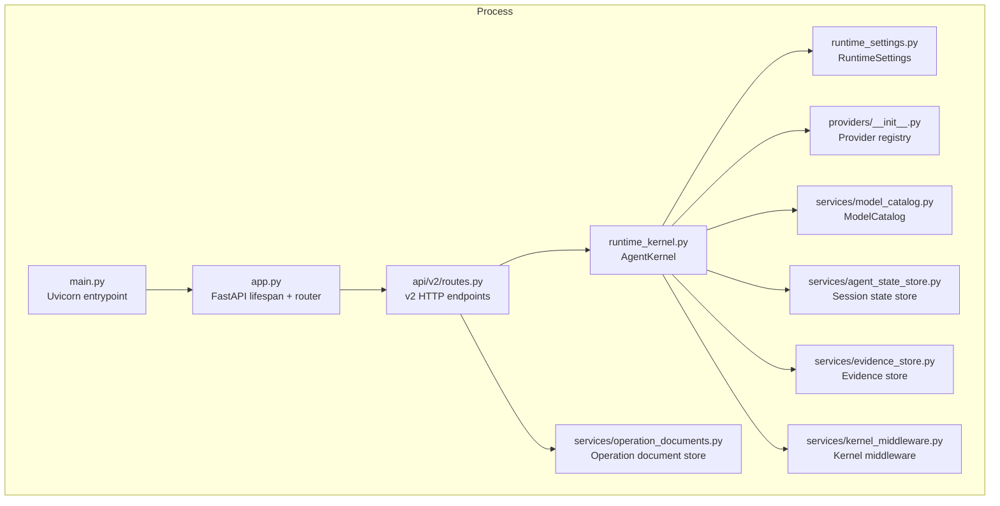
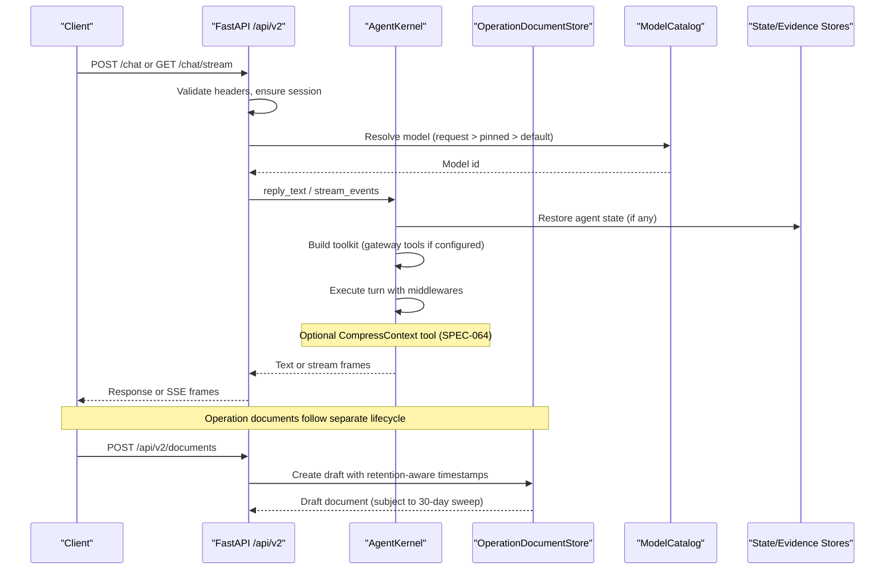
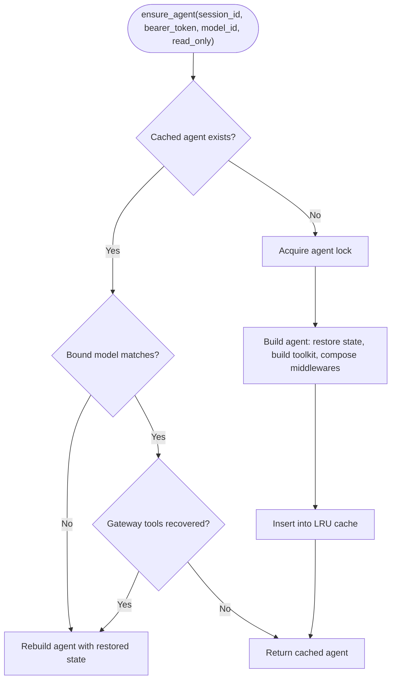
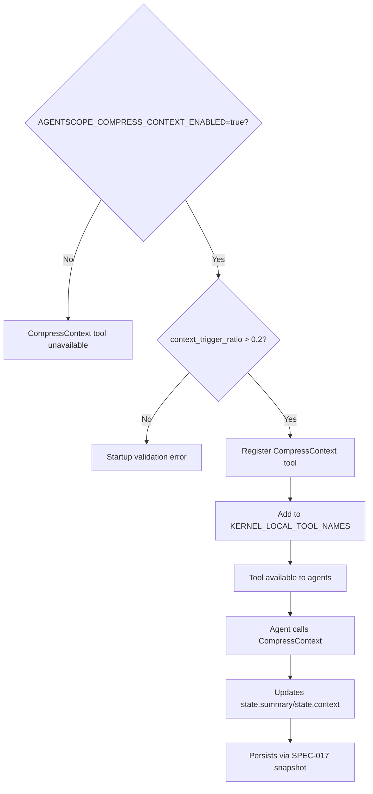
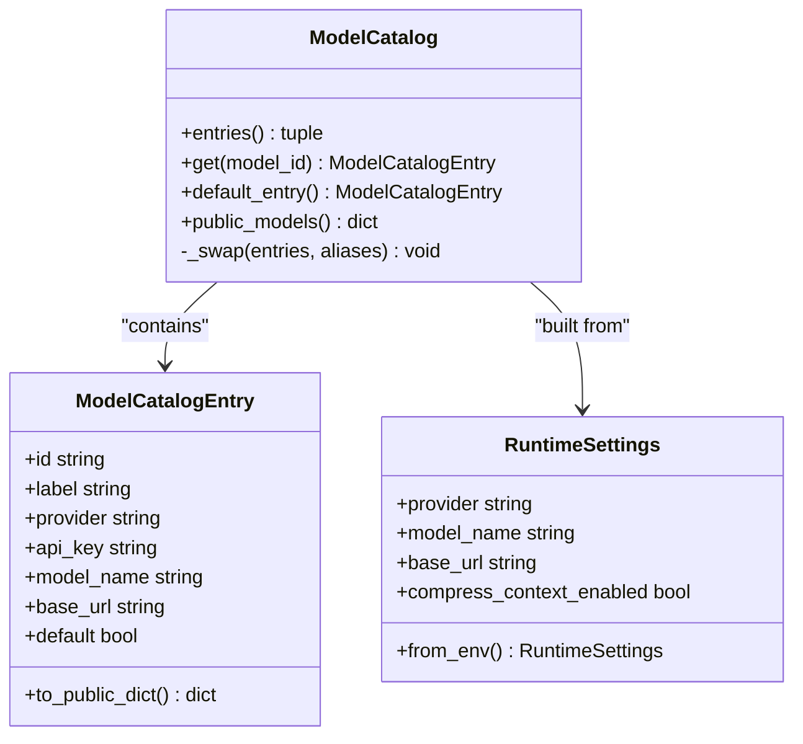
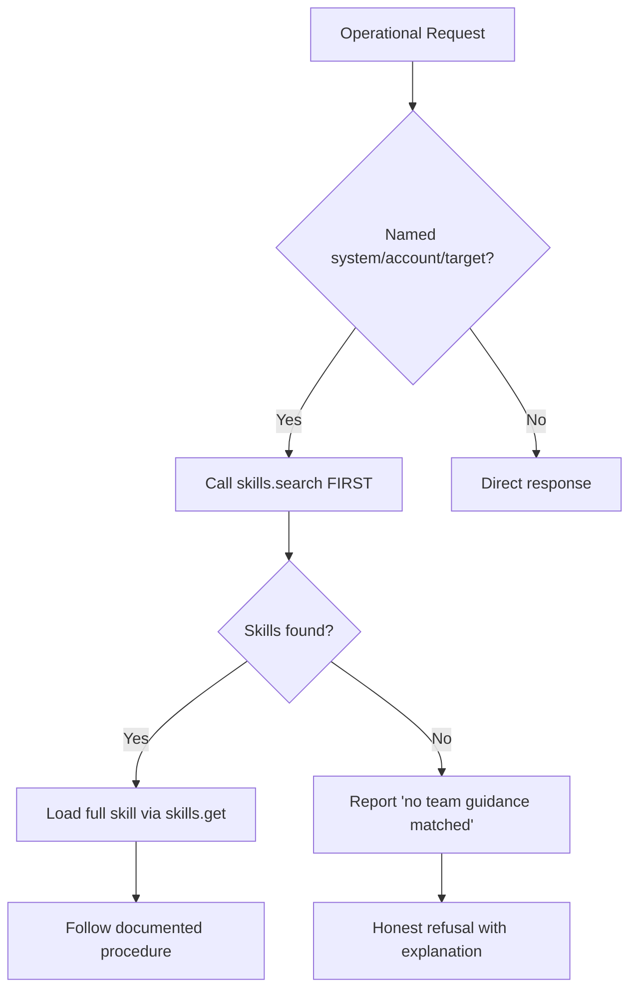
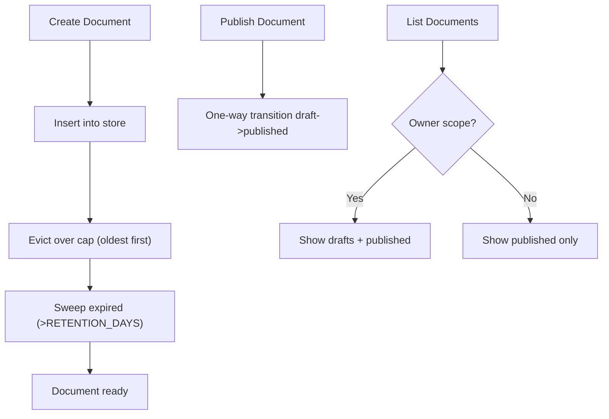
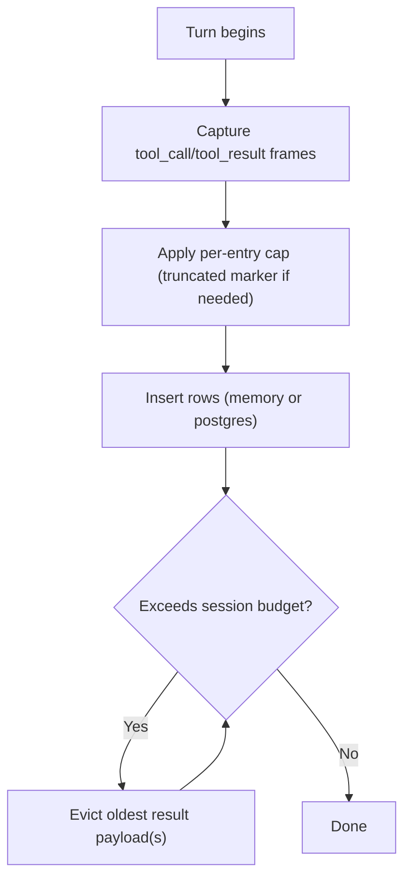
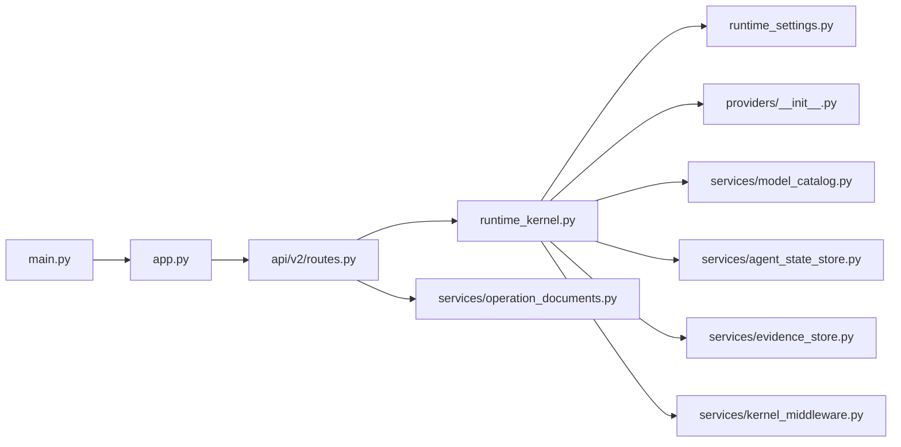

# Agent Platform

<cite>
**Referenced Files in This Document**
- [main.py](file://products/agent-platform/src/agent_service/main.py)
- [app.py](file://products/agent-platform/src/agent_service/app.py)
- [runtime_kernel.py](file://products/agent-platform/src/agent_service/runtime_kernel.py)
- [runtime_settings.py](file://products/agent-platform/src/agent_service/runtime_settings.py)
- [kernel_middleware.py](file://products/agent-platform/src/agent_service/services/kernel_middleware.py)
- [providers/__init__.py](file://products/agent-platform/src/agent_service/providers/__init__.py)
- [services/model_catalog.py](file://products/agent-platform/src/agent_service/services/model_catalog.py)
- [services/agent_state_store.py](file://products/agent-platform/src/agent_service/services/agent_state_store.py)
- [services/evidence_store.py](file://products/agent-platform/src/agent_service/services/evidence_store.py)
- [services/operation_documents.py](file://products/agent-platform/src/agent_service/services/operation_documents.py)
- [api/v2/routes.py](file://products/agent-platform/src/agent_service/api/v2/routes.py)
- [tests/test_operation_documents.py](file://products/agent-platform/tests/test_operation_documents.py)
- [tests/test_documents.py](file://products/agent-platform/tests/test_documents.py)
- [tests/test_runtime_settings.py](file://products/agent-platform/tests/test_runtime_settings.py)
- [tests/test_runtime_kernel.py](file://products/agent-platform/tests/test_runtime_kernel.py)
- [tests/test_kernel_middleware.py](file://products/agent-platform/tests/test_kernel_middleware.py)
</cite>

## Update Summary
**Changes Made**
- Added new section documenting the optional context compression feature through CompressContext tool (SPEC-064)
- Updated Runtime Settings section to include AGENTSCOPE_COMPRESS_CONTEXT_ENABLED configuration
- Enhanced Kernel Configuration section with compression tool integration details
- Updated Troubleshooting Guide with compression-related guidance
- Added references to SPEC-064 implementation and testing patterns

## Table of Contents
1. Introduction
2. Project Structure
3. Core Components
4. Architecture Overview
5. Detailed Component Analysis
6. Dependency Analysis
7. Performance Considerations
8. Troubleshooting Guide
9. Conclusion

## Introduction
The Agent Platform is the orchestration engine of the Luban AIOps platform. It owns agent sessions, coordinates LLM model switching at runtime, drives tool execution via the Tool Gateway, and persists evidence for replay and audit. It exposes a FastAPI-based v2 contract that streams chat events, manages human-in-the-loop approvals, and integrates with session persistence backends (in-memory or PostgreSQL). The service also supports live model discovery and a credential-gated multi-model catalog so operators can switch models mid-conversation without losing conversation history.

**Updated** The platform now includes an optional context compression feature through the CompressContext tool (SPEC-064), which allows agents to proactively compress their working context between tasks while maintaining backward compatibility when disabled.

## Project Structure
The Agent Platform service lives under products/agent-platform/src/agent_service and is organized into:
- Entrypoints and application bootstrap
- API routes implementing the v2 contract
- Runtime kernel that orchestrates AgentScope agents, tools, middleware, and streaming
- Provider registry and multi-model catalog
- Session state and evidence stores with pluggable backends
- Operation document repository with retention policies
- Configuration and environment-driven settings



**Diagram sources**
- [main.py:1-22](file://products/agent-platform/src/agent_service/main.py#L1-L22)
- [app.py:19-79](file://products/agent-platform/src/agent_service/app.py#L19-L79)
- [api/v2/routes.py:276-365](file://products/agent-platform/src/agent_service/api/v2/routes.py#L276-L365)
- [runtime_kernel.py:212-774](file://products/agent-platform/src/agent_service/runtime_kernel.py#L212-L774)
- [runtime_settings.py:137-527](file://products/agent-platform/src/agent_service/runtime_settings.py#L137-L527)
- [providers/__init__.py:1-10](file://products/agent-platform/src/agent_service/providers/__init__.py#L1-L10)
- [services/model_catalog.py:236-331](file://products/agent-platform/src/agent_service/services/model_catalog.py#L236-L331)
- [services/agent_state_store.py:276-324](file://products/agent-platform/src/agent_service/services/agent_state_store.py#L276-L324)
- [services/evidence_store.py:504-551](file://products/agent-platform/src/agent_service/services/evidence_store.py#L504-L551)
- [services/operation_documents.py:530-572](file://products/agent-platform/src/agent_service/services/operation_documents.py#L530-L572)
- [kernel_middleware.py:105-117](file://products/agent-platform/src/agent_service/services/kernel_middleware.py#L105-L117)

**Section sources**
- [main.py:1-22](file://products/agent-platform/src/agent_service/main.py#L1-L22)
- [app.py:19-79](file://products/agent-platform/src/agent_service/app.py#L19-L79)

## Core Components
- Runtime kernel: Builds and caches per-session AgentScope agents, resolves models, composes middlewares, handles HITL parks/resumes, and persists evidence.
- Multi-model provider registry: Resolves providers and builds model instances from a credential-gated catalog; supports OpenAI, DashScope, DeepSeek, and Luban.
- Model catalog: Startup-curated series plus live discovery refresh; safe swap without invalidating references used by routes/kernel.
- Session state store: Persists AgentState snapshots to memory or PostgreSQL; restores on agent creation.
- Evidence store: Captures tool_call/tool_result frames per turn with size caps and budget eviction; persisted to memory or PostgreSQL.
- Operation document repository: Manages typed operational documents (shift summaries, incident reports) with owner-scoped visibility, one-way publish lifecycle, and 30-day retention sweep.
- Kernel middleware: Permission gates, evidence capture, and local tool management including the optional CompressContext tool.
- API v2 routes: Chat, streaming chat, confirmation bridge, session management, model catalog exposure, evidence retrieval, and operation document CRUD.

**Section sources**
- [runtime_kernel.py:212-774](file://products/agent-platform/src/agent_service/runtime_kernel.py#L212-L774)
- [services/model_catalog.py:1-331](file://products/agent-platform/src/agent_service/services/model_catalog.py#L1-L331)
- [services/agent_state_store.py:1-324](file://products/agent-platform/src/agent_service/services/agent_state_store.py#L1-L324)
- [services/evidence_store.py:1-551](file://products/agent-platform/src/agent_service/services/evidence_store.py#L1-L551)
- [services/operation_documents.py:1-573](file://products/agent-platform/src/agent_service/services/operation_documents.py#L1-L573)
- [kernel_middleware.py:105-117](file://products/agent-platform/src/agent_service/services/kernel_middleware.py#L105-L117)
- [api/v2/routes.py:276-800](file://products/agent-platform/src/agent_service/api/v2/routes.py#L276-L800)

## Architecture Overview
The request flow starts at the Uvicorn entrypoint, which boots the FastAPI app. The app configures logging, metrics, telemetry, and includes the v2 router. Routes validate identity headers, resolve sessions and models, then delegate to the runtime kernel. The kernel constructs or reuses an AgentScope agent bound to a session, optionally restoring persisted state, and executes turns with middleware for permissions, evidence capture, tracing, and token budgets. Streaming responses are normalized to the shared v2 schema and emitted as Server-Sent Events. Operation documents follow a separate lifecycle through the operation document repository with owner-scoped visibility and retention policies.

**Updated** The kernel now supports optional context compression through the CompressContext tool, which can be enabled via the AGENTSCOPE_COMPRESS_CONTEXT_ENABLED environment variable. When enabled, agents can proactively compress their working context between tasks using the same underlying mechanism as threshold-based compression.



**Diagram sources**
- [app.py:19-79](file://products/agent-platform/src/agent_service/app.py#L19-L79)
- [api/v2/routes.py:276-365](file://products/agent-platform/src/agent_service/api/v2/routes.py#L276-L365)
- [runtime_kernel.py:662-774](file://products/agent-platform/src/agent_service/runtime_kernel.py#L662-L774)
- [services/model_catalog.py:236-331](file://products/agent-platform/src/agent_service/services/model_catalog.py#L236-L331)
- [services/agent_state_store.py:276-324](file://products/agent-platform/src/agent_service/services/agent_state_store.py#L276-L324)
- [services/evidence_store.py:504-551](file://products/agent-platform/src/agent_service/services/evidence_store.py#L504-L551)
- [services/operation_documents.py:139-142](file://products/agent-platform/src/agent_service/services/operation_documents.py#L139-L142)

## Detailed Component Analysis

### Runtime Kernel
The kernel is the central coordinator:
- Ensures one agent per session with LRU caching and per-token toolkit caching.
- Restores persisted AgentState on first use and snapshots after each completed turn.
- Switches models mid-conversation by rebuilding the agent while preserving memory through state restore.
- Composes middleware stack: gateway permission checks, tool evidence capture, optional tracing, and reply token budget control.
- Integrates with Tool Gateway by discovering tools per bearer token and filtering mutating tools when HITL bridging is disabled.
- Streams prose redaction safely, flushing held-back tails before terminal events.
- Persists evidence best-effort with size caps and session budgets.

**Updated** The kernel now supports optional context compression through ContextConfig.compression_tool_enabled, which is controlled by the AGENTSCOPE_COMPRESS_CONTEXT_ENABLED setting. When enabled, the CompressContext tool becomes available to agents for proactive context compression between tasks.



**Diagram sources**
- [runtime_kernel.py:699-774](file://products/agent-platform/src/agent_service/runtime_kernel.py#L699-L774)
- [runtime_kernel.py:539-582](file://products/agent-platform/src/agent_service/runtime_kernel.py#L539-L582)
- [runtime_kernel.py:340-450](file://products/agent-platform/src/agent_service/runtime_kernel.py#L340-L450)
- [runtime_kernel.py:462-496](file://products/agent-platform/src/agent_service/runtime_kernel.py#L462-L496)
- [runtime_kernel.py:627-661](file://products/agent-platform/src/agent_service/runtime_kernel.py#L627-L661)

**Section sources**
- [runtime_kernel.py:212-774](file://products/agent-platform/src/agent_service/runtime_kernel.py#L212-L774)

### Optional Context Compression (SPEC-064)
**New** The Agent Platform now supports optional agent-driven context compression through the CompressContext tool, implemented according to SPEC-064. This feature allows agents to proactively compress their working context between tasks while maintaining full backward compatibility when disabled.

Key features include:
- **Opt-in Configuration**: Enabled via `AGENTSCOPE_COMPRESS_CONTEXT_ENABLED` environment variable (default: false)
- **Kernel-local Tool**: CompressContext is registered as a KERNEL_LOCAL_TOOL_NAME, bypassing the permission gate since it only manipulates internal agent state
- **State-only Operations**: Compression operates exclusively on `state.summary` and `state.context`, never touching external systems or network resources
- **Durability Preservation**: Compression state survives session persistence through the existing SPEC-017 snapshot/restore mechanism
- **Coexistence with Threshold Compression**: Works alongside existing `ContextConfig(trigger_ratio, tool_result_limit)` hard compression without conflicts
- **Startup Validation**: Requires `AGENTSCOPE_CONTEXT_TRIGGER_RATIO > 0.2` (agentscope's context_buffer_ratio) to prevent configuration conflicts



**Diagram sources**
- [runtime_settings.py:177-185](file://products/agent-platform/src/agent_service/runtime_settings.py#L177-L185)
- [runtime_settings.py:319-328](file://products/agent-platform/src/agent_service/runtime_settings.py#L319-L328)
- [runtime_kernel.py:597-610](file://products/agent-platform/src/agent_service/runtime_kernel.py#L597-L610)
- [kernel_middleware.py:105-117](file://products/agent-platform/src/agent_service/services/kernel_middleware.py#L105-L117)

**Section sources**
- [runtime_settings.py:177-185](file://products/agent-platform/src/agent_service/runtime_settings.py#L177-L185)
- [runtime_settings.py:319-328](file://products/agent-platform/src/agent_service/runtime_settings.py#L319-L328)
- [runtime_kernel.py:597-610](file://products/agent-platform/src/agent_service/runtime_kernel.py#L597-L610)
- [kernel_middleware.py:105-117](file://products/agent-platform/src/agent_service/services/kernel_middleware.py#L105-L117)

### Multi-Model Provider Registry and Catalog
- Providers: The registry returns a provider adapter based on the active profile or catalog entry. Supported providers include dashscope, deepseek, openai, and luban.
- Catalog: Built at startup from environment variables per provider; supports overriding curated series and aliasing bare provider names to defaults. Live discovery periodically refreshes entries behind a fail-soft ladder and swaps contents atomically.
- Model switching: Routes resolve model ids using request > pinned > default; unknown ids fail closed. The kernel rebuilds the agent on model change while restoring state to preserve conversation history.



**Diagram sources**
- [services/model_catalog.py:49-68](file://products/agent-platform/src/agent_service/services/model_catalog.py#L49-L68)
- [services/model_catalog.py:236-331](file://products/agent-platform/src/agent_service/services/model_catalog.py#L236-L331)
- [runtime_settings.py:137-527](file://products/agent-platform/src/agent_service/runtime_settings.py#L137-L527)
- [providers/__init__.py:1-10](file://products/agent-platform/src/agent_service/providers/__init__.py#L1-L10)

**Section sources**
- [services/model_catalog.py:1-331](file://products/agent-platform/src/agent_service/services/model_catalog.py#L1-L331)
- [runtime_settings.py:137-527](file://products/agent-platform/src/agent_service/runtime_settings.py#L137-L527)
- [providers/__init__.py:1-10](file://products/agent-platform/src/agent_service/providers/__init__.py#L1-L10)

### System Prompt and Skill Search Discipline
**Updated** Enhanced DEFAULT_SYSTEM_PROMPT now proactively triggers skill-search for operational requests involving named systems, accounts, or targets. The prompt reframes absence of offhand grounding as a reason to search rather than refuse, ensuring skills.search is called FIRST before any conclusion about missing information.

Key enhancements include:
- **Operational Request Trigger**: Any request to act on a named system, account, or target (resetting passwords, locking accounts, restarting workloads) automatically triggers skill-search
- **Proactive Discovery**: The prompt instructs the model to consult skills.search FIRST for team-owned runbooks before refusing requests due to lack of grounding
- **Grounded Refusal**: Only after skills.search returns no match should the model report "no team guidance matched" rather than inventing steps
- **Skill Citation**: Required citation of skills by title (skill_id acceptable) ensures transparency in skill usage



**Diagram sources**
- [runtime_settings.py:8-58](file://products/agent-platform/src/agent_service/runtime_settings.py#L8-L58)

**Section sources**
- [runtime_settings.py:8-58](file://products/agent-platform/src/agent_service/runtime_settings.py#L8-L58)

### Operation Document Repository
**Updated** The operation document repository manages typed operational documents (shift summaries, incident reports) with owner-scoped visibility, one-way publish lifecycle, and automatic retention policies. Documents are subject to a 30-day retention sweep that removes expired records on every write operation.

Key features include:
- **Retention Policy**: Automatic sweep of documents older than RETENTION_DAYS (30 days) on create operations
- **Owner Scoping**: Drafts visible only to owners; published documents visible to all with `documents:read` capability
- **One-way Lifecycle**: Documents transition from draft to published state (owner-only action)
- **Per-owner Caps**: Maximum PER_OWNER_CAP (20) documents per owner with oldest-first eviction
- **Clock-Relative Timestamps**: Test fixtures must use relative timestamps to avoid aging out during retention sweeps



**Diagram sources**
- [services/operation_documents.py:139-142](file://products/agent-platform/src/agent_service/services/operation_documents.py#L139-L142)
- [services/operation_documents.py:188-209](file://products/agent-platform/src/agent_service/services/operation_documents.py#L188-L209)
- [services/operation_documents.py:425-459](file://products/agent-platform/src/agent_service/services/operation_documents.py#L425-L459)

**Section sources**
- [services/operation_documents.py:1-573](file://products/agent-platform/src/agent_service/services/operation_documents.py#L1-L573)

### Clock-Relative Timestamp Pattern for Test Stability
**New** Tests involving operation documents must use clock-relative timestamps instead of hardcoded dates to maintain stability across the 30-day retention window. Hardcoded dates like `2026-08-27` will age out once the wall clock passes the retention horizon, causing tests to fail unpredictably.

The recommended pattern uses `datetime.now(timezone.utc)` minus a small offset to ensure test data stays within the retention window:

```python
def _iso(days_ago: int) -> str:
    stamp = datetime.now(timezone.utc) - timedelta(days=days_ago)
    return stamp.strftime("%Y-%m-%dT%H:%M:%SZ")

# Usage in tests:
store.create(_doc("doc-1", created_at=_iso(2)))  # 2 days ago
store.create(_doc("doc-2", created_at=_iso(1)))  # 1 day ago (newer)
```

This pattern preserves intended ordering while staying well inside the retention window, mirroring the approach already established in existing stable tests.

**Section sources**
- [tests/test_operation_documents.py:53-55](file://products/agent-platform/tests/test_operation_documents.py#L53-L55)
- [tests/test_operation_documents.py:98-122](file://products/agent-platform/tests/test_operation_documents.py#L98-L122)
- [tests/test_documents.py:278-300](file://products/agent-platform/tests/test_documents.py#L278-L300)

### Session Persistence and Evidence
- Agent state: Persisted per session as JSON snapshots; restored on agent creation. Backends: in-memory (dev/CI) and PostgreSQL (deployed). TTL-aware reads keep rows alive during active sessions; opportunistic sweep reclaims expired rows.
- Evidence: Captures tool_call and tool_result frames per turn with per-entry char caps and per-session byte budgets. Eviction nulls oldest result payloads while preserving metadata. Backends mirror the state store selection via AGENT_STATE_STORE_BACKEND and share AGENT_STATE_DB_URL.



**Diagram sources**
- [services/evidence_store.py:46-70](file://products/agent-platform/src/agent_service/services/evidence_store.py#L46-L70)
- [services/evidence_store.py:118-164](file://products/agent-platform/src/agent_service/services/evidence_store.py#L118-L164)
- [services/agent_state_store.py:152-260](file://products/agent-platform/src/agent_service/services/agent_state_store.py#L152-L260)

**Section sources**
- [services/agent_state_store.py:1-324](file://products/agent-platform/src/agent_service/services/agent_state_store.py#L1-L324)
- [services/evidence_store.py:1-551](file://products/agent-platform/src/agent_service/services/evidence_store.py#L1-L551)

### Human-in-the-Loop Approvals and Park/Resume
- Parking: When a tool call requires approval, the kernel emits a confirmation_request event with pending_calls and halts until resolved.
- Bridge: The confirm endpoint claims the parked confirmation, persists outcome at claim time, and resumes the turn with the decision. Expired parks are interrupted to avoid wedging sessions.
- Read-only mode: Automated diagnostic turns restrict toolkits to read-level tools to prevent accidental mutations.

```mermaid
sequenceDiagram
participant Client as "Client"
participant API as "v2 routes"
participant Kernel as "AgentKernel"
participant Reg as "Confirmation Registry"
Client->>API : GET /chat/stream
API->>Kernel : stream_events(...)
Kernel-->>API : ... tool_call ...
Kernel-->>API : confirmation_request {pending_calls}
Note over Kernel,API : Turn parked awaiting decision
Client->>API : POST /chat/confirm {decision}
API->>Reg : claim(confirm_id, ttl)
Reg-->>API : PendingConfirmation
API->>Kernel : resume_confirmation(pending, decision)
Kernel-->>API : Stream resumes with tool_result
API-->>Client : SSE frames continue
```



**Diagram sources**
- [api/v2/routes.py:368-464](file://products/agent-platform/src/agent_service/api/v2/routes.py#L368-L464)
- [api/v2/routes.py:202-243](file://products/agent-platform/src/agent_service/api/v2/routes.py#L202-L243)
- [runtime_kernel.py:340-450](file://products/agent-platform/src/agent_service/runtime_kernel.py#L340-L450)

**Section sources**
- [api/v2/routes.py:202-464](file://products/agent-platform/src/agent_service/api/v2/routes.py#L202-L464)
- [runtime_kernel.py:340-450](file://products/agent-platform/src/agent_service/runtime_kernel.py#L340-L450)

### Tool Gateway Integration
- Discovery: On toolkit build, the kernel discovers available tools from the Tool Gateway using the delegated bearer token. Results are filtered for mutating tools when HITL bridging is disabled and restricted to read-only for automated diagnostic turns.
- No-tools guard: If no operational tools are reachable, a deterministic system notice is injected to prevent fabrication.
- Toolkit caching: Per bearer token to avoid repeated discovery; empty results are not cached so subsequent turns retry discovery.

**Section sources**
- [runtime_kernel.py:340-450](file://products/agent-platform/src/agent_service/runtime_kernel.py#L340-L450)
- [runtime_kernel.py:498-510](file://products/agent-platform/src/agent_service/runtime_kernel.py#L498-L510)

### Streaming Chat Responses
- Normalization: Kernel stream chunks are translated into the v2 schema, preserving tool_call/tool_result frames for evidence panels and ensuring only known event types pass through.
- Prose redaction: Streaming text is redacted for credentials; terminal events flush any held-back tail to avoid missing content in the UI.
- SSE: The streaming endpoint yields data lines with normalized events.

**Section sources**
- [api/v2/routes.py:559-663](file://products/agent-platform/src/agent_service/api/v2/routes.py#L559-L663)
- [runtime_kernel.py:182-209](file://products/agent-platform/src/agent_service/runtime_kernel.py#L182-L209)

## Dependency Analysis
- Application lifecycle: Uvicorn runs the FastAPI app created in app.py, which sets up logging, metrics, telemetry, and includes the v2 router.
- Kernel dependencies: Uses provider registry, model catalog, runtime settings, state/evidence stores, and middleware services.
- Route dependencies: Depends on runtime kernel, session services, model catalog, stores, and schemas.
- Operation document dependencies: Routes depend on the operation document store singleton for document lifecycle management.



**Diagram sources**
- [main.py:1-22](file://products/agent-platform/src/agent_service/main.py#L1-L22)
- [app.py:19-79](file://products/agent-platform/src/agent_service/app.py#L19-L79)
- [api/v2/routes.py:276-365](file://products/agent-platform/src/agent_service/api/v2/routes.py#L276-L365)
- [runtime_kernel.py:212-774](file://products/agent-platform/src/agent_service/runtime_kernel.py#L212-L774)
- [runtime_settings.py:137-527](file://products/agent-platform/src/agent_service/runtime_settings.py#L137-L527)
- [providers/__init__.py:1-10](file://products/agent-platform/src/agent_service/providers/__init__.py#L1-L10)
- [services/model_catalog.py:236-331](file://products/agent-platform/src/agent_service/services/model_catalog.py#L236-L331)
- [services/agent_state_store.py:276-324](file://products/agent-platform/src/agent_service/services/agent_state_store.py#L276-L324)
- [services/evidence_store.py:504-551](file://products/agent-platform/src/agent_service/services/evidence_store.py#L504-L551)
- [services/operation_documents.py:530-572](file://products/agent-platform/src/agent_service/services/operation_documents.py#L530-L572)
- [kernel_middleware.py:105-117](file://products/agent-platform/src/agent_service/services/kernel_middleware.py#L105-L117)

**Section sources**
- [app.py:19-79](file://products/agent-platform/src/agent_service/app.py#L19-L79)
- [api/v2/routes.py:276-365](file://products/agent-platform/src/agent_service/api/v2/routes.py#L276-L365)
- [runtime_kernel.py:212-774](file://products/agent-platform/src/agent_service/runtime_kernel.py#L212-L774)

## Performance Considerations
- Agent and toolkit caching: Per-session agent cache with LRU eviction and per-token toolkit cache reduce rebuild overhead and discovery calls.
- Middleware opt-ins: Tracing and reply token budget are configurable to balance observability and latency.
- Evidence sizing: Per-entry and per-session caps prevent unbounded storage growth; evictions preserve metadata for accurate cards.
- Model discovery: Periodic refresh with timeouts avoids blocking startup; failures degrade gracefully.
- **Enhanced Skill Search**: The proactive skill-search triggering adds minimal overhead but significantly improves operational request handling efficiency by preventing unnecessary refusals and guiding models toward appropriate skill discovery.
- **Retention Policy Sweeps**: Operation document retention sweeps run opportunistically on writes with bounded limits (100 rows per sweep) to minimize performance impact while maintaining storage hygiene.
- **Context Compression**: When enabled, CompressContext provides proactive context management that can improve long-running session performance by reducing context size before reaching threshold limits.

## Troubleshooting Guide
- Unknown model id: Requests specifying an unrecognized model id fail closed with 422; verify the model exists in the catalog or remove the field to use pinned/default.
- Confirmation pending: New turns are rejected while a park is unresolved; answer or expire the parked confirmation before sending new messages.
- Evidence store unreadable: Evidence retrieval degrades to transcript_available=false without 500 errors; check backend configuration and connectivity.
- State store fallback: If Postgres is unavailable, agent state falls back to in-memory; monitor metrics for fallback counts.
- No tools available: When no operational tools are discovered, the kernel injects a system notice to prevent hallucinated infrastructure data.
- **Operational Request Refusals**: If operational requests are still being refused despite having relevant skills, verify that skills.search is being triggered by checking for "named system, account, or target" patterns in the prompt. The enhanced prompt should proactively search skills before refusing requests lacking offhand grounding.
- **Operation Document Retention Issues**: If operation documents disappear unexpectedly, check if they've aged beyond the 30-day retention window. Test fixtures should use clock-relative timestamps (`datetime.now(timezone.utc) - timedelta(...)`) instead of hardcoded dates to avoid this issue.
- **Test Failures with Hardcoded Dates**: Tests using hardcoded dates like `2026-08-27` may fail due to retention policy sweeps. Replace with relative timestamps using the `_iso()` helper pattern to ensure test stability.
- **Context Compression Startup Errors**: If enabling AGENTSCOPE_COMPRESS_CONTEXT_ENABLED causes startup failures, verify that AGENTSCOPE_CONTEXT_TRIGGER_RATIO is set above 0.2 (the agentscope context_buffer_ratio default). The error message will indicate the required relationship between these settings.
- **Compression Tool Not Available**: If CompressContext doesn't appear in the toolkit despite being enabled, verify that the environment variable is properly set and that the kernel is built with the correct configuration. The tool is only registered when ContextConfig.compression_tool_enabled is true.

**Section sources**
- [api/v2/routes.py:202-243](file://products/agent-platform/src/agent_service/api/v2/routes.py#L202-L243)
- [api/v2/routes.py:246-270](file://products/agent-platform/src/agent_service/api/v2/routes.py#L246-L270)
- [api/v2/routes.py:733-748](file://products/agent-platform/src/agent_service/api/v2/routes.py#L733-L748)
- [services/agent_state_store.py:276-324](file://products/agent-platform/src/agent_service/services/agent_state_store.py#L276-L324)
- [runtime_kernel.py:94-119](file://products/agent-platform/src/agent_service/runtime_kernel.py#L94-L119)
- [services/operation_documents.py:196-209](file://products/agent-platform/src/agent_service/services/operation_documents.py#L196-L209)
- [tests/test_operation_documents.py:53-55](file://products/agent-platform/tests/test_operation_documents.py#L53-L55)
- [runtime_settings.py:319-328](file://products/agent-platform/src/agent_service/runtime_settings.py#L319-L328)
- [tests/test_runtime_settings.py:655-668](file://products/agent-platform/tests/test_runtime_settings.py#L655-L668)

## Conclusion
The Agent Platform provides a robust, observable, and durable orchestration layer for AIOPS workflows. It centralizes session lifecycle, supports dynamic model switching across multiple providers, enforces safety through HITL approvals and read-only modes, and captures rich evidence for transparency and replay. With pluggable persistence, streaming responses, and careful error handling, it scales to concurrent sessions while maintaining reliability and auditability. 

**Updated** The addition of optional context compression through the CompressContext tool (SPEC-064) enhances the platform's ability to manage long-running sessions efficiently while maintaining full backward compatibility. The enhanced system prompt now ensures that operational requests are handled more intelligently by proactively searching for relevant skills before refusing requests due to lack of immediate knowledge, improving both user experience and operational efficiency. The addition of the operation document repository with retention policies provides durable operational documentation with automatic cleanup, while the clock-relative timestamp pattern ensures test stability across different deployment timelines. The optional compression feature represents a significant advancement in agent autonomy while preserving the platform's security and governance principles.