# Human-in-the-Loop Approvals

<cite>
**Referenced Files in This Document**
- [flow_approvals.py](file://products/agent-platform/src/agent_service/services/flow_approvals.py)
- [hitl_confirmations.py](file://products/agent-platform/src/agent_service/services/hitl_confirmations.py)
- [confirmation_records.py](file://products/agent-platform/src/agent_service/services/confirmation_records.py)
- [policy_engine.py](file://products/platform-gateway/src/platform_gateway/services/policy_engine.py)
- [secret_params.py](file://products/agent-platform/src/agent_service/services/secret_params.py)
- [http_connector.py](file://products/tool-gateway/src/tool_gateway/tools/http_connector.py)
- [kernel_middleware.py](file://products/agent-platform/src/agent_service/services/kernel_middleware.py)
- [runtime_kernel.py](file://products/agent-platform/src/agent_service/runtime_kernel.py)
- [browser_connector.py](file://products/tool-gateway/src/tool_gateway/tools/browser_connector.py)
- [execution_request.schema.json](file://products/agent-platform/src/agent_service/contracts/execution-request.schema.json)
- [agent-stream-event.schema.json](file://shared/shared-contracts/schemas/agent-stream-event.schema.json)
- [chat-confirm.schema.json](file://shared/shared-contracts/schemas/chat-confirm.schema.json)
- [policy-decision.schema.json](file://shared/shared-contracts/schemas/policy-decision.schema.json)
- [policy-default.yaml](file://shared/shared-contracts/policies/policy-default.yaml)
- [approval-and-hitl.md](file://docs/guides/approval-and-hitl.md)
- [SPEC-049-browser-web-check-tools/spec.md](file://docs/specs/SPEC-049-browser-web-check-tools/spec.md)
- [SPEC-051-browser-flow-hitl-gate-enforcement/spec.md](file://docs/specs/SPEC-051-browser-flow-hitl-gate-enforcement/spec.md)
- [SPEC-054-action-approval-and-change-request-card/spec.md](file://docs/specs/SPEC-054-action-approval-and-change-request-card/spec.md)
</cite>

## Update Summary
**Changes Made**
- Enhanced HITL model integration with flow binding and deviation guards for browser tools
- Improved confirmation workflow with structured change request cards and element mapping
- Added comprehensive deviation guard enforcement with flow-killing error codes
- Updated browser tool integration with snapshot-based element descriptions
- Enhanced approval kind discriminator for flow vs action approvals
- Strengthened security posture with authority provenance validation

## Table of Contents
1. Introduction
2. Project Structure
3. Core Components
4. Architecture Overview
5. Detailed Component Analysis
6. Dependency Analysis
7. Performance Considerations
8. Troubleshooting Guide
9. Conclusion
10. Appendices

## Introduction
This document explains how the Agent Platform implements human-in-the-loop (HITL) approval workflows for risky operations. It covers:
- Approval gates that park mutating tool calls until an operator decides
- Confirmation card generation and display hints for browser tools
- Decision synchronization between agents, operators, and the policy engine
- Flow approvals for multi-step browser flows with identity-scoped auto-signing
- **Enhanced HITL model integration with flow binding and deviation guards for browser tools**
- Risk tier classification, tool categorization (read vs write), and escalation paths
- Configuration examples, custom flow considerations, and auditing
- Race condition handling, timeout management, and user experience considerations

**Updated** The platform now implements sophisticated HITL model integration where browser flows are bound at skill authoring time with deviation guards ensuring that interactions stay within declared boundaries. The system provides enhanced confirmation workflows with structured change request cards, element mapping from browser snapshots, and comprehensive deviation guard enforcement.

## Project Structure
The HITL system spans several services and shared contracts:
- Agent platform runtime kernel bridges kernel ASK decisions to a confirmation registry and durable records
- Platform gateway enforces policy outcomes including require_approval tiers on the confirm path
- Shared schemas define request/response contracts for confirmations and policy decisions
- Default policy bundle defines roles, actions, and approval tiers
- **Enhanced flow binding system with deviation guards and authority provenance validation**

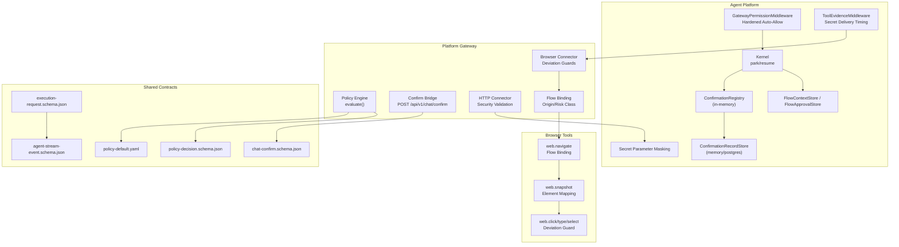

**Diagram sources**
- [flow_approvals.py:1-34](file://products/agent-platform/src/agent_service/services/flow_approvals.py#L1-L34)
- [runtime_kernel.py:1450-1650](file://products/agent-platform/src/agent_service/runtime_kernel.py#L1450-L1650)
- [browser_connector.py:793-889](file://products/tool-gateway/src/tool_gateway/tools/browser_connector.py#L793-L889)
- [execution_request.schema.json:71-71](file://products/agent-platform/src/agent_service/contracts/execution-request.schema.json#L71-L71)

**Section sources**
- [approval-and-hitl.md:7-90](file://docs/guides/approval-and-hitl.md#L7-L90)

## Core Components
- ConfirmationRegistry: per-process registry of parked confirmations with single-flight claim, TTL expiry, and resolution
- ConfirmationRecordStore: durable persistence of parked and resolved confirmations (memory or Postgres)
- FlowApprovals: session-scoped flow context and approval stores enabling auto-signing within a bounded flow identity and TTL
- PolicyEngine: evaluates role/action against the policy bundle; supports allow/deny/require_approval with tiers
- SecretParameterMasking: fail-closed posture with KNOWN_SAFE_FIELDS allow-list and shape-preserving rendering
- ToolEvidenceMiddleware: manages secret delivery timing controls with reveal-on-commit semantics and integration with approval workflows
- GatewayPermissionMiddleware: hardened auto-allow list excluding http.get from built-in defaults due to egress risk
- BrowserConnector: implements deviation guards, flow binding, and element mapping for browser tools
- HTTP Connector: structured body validation, credential set support, and comprehensive security enforcement
- Schemas: chat-confirm schema for operator decisions; policy-decision schema for evaluation results; agent-stream-event schema for confirmation frames; execution-request schema for authority provenance

Key behaviors:
- Mutating tool calls are parked and surfaced as confirmation cards
- Browser flows are bound at skill authoring time with deviation guards ensuring interactions stay within declared boundaries
- **Enhanced flow binding with deviation guards: browser interactions execute only inside declared, approved flows with strict origin/risk class validation**
- **Structured change request cards provide decision-relevant parameter projections with masked secrets**
- **Authority provenance validation ensures flow vs action approval kinds cannot be spoofed**
- **Snapshot-based element mapping shows human-readable element descriptions instead of raw refs**
- The confirm bridge enforces policy tiers before resuming
- Flow approvals scope auto-signed writes to a specific skill/origin binding while alive
- Records survive restarts and support inbox/history views
- HTTP operations include comprehensive security validation and approval requirements

**Section sources**
- [hitl_confirmations.py:47-181](file://products/agent-platform/src/agent_service/services/hitl_confirmations.py#L47-L181)
- [confirmation_records.py:52-92](file://products/agent-platform/src/agent_service/services/confirmation_records.py#L52-L92)
- [flow_approvals.py:78-122](file://products/agent-platform/src/agent_service/services/flow_approvals.py#L78-L122)
- [policy_engine.py:142-210](file://products/platform-gateway/src/platform_gateway/services/policy_engine.py#L142-L210)
- [browser_connector.py:793-889](file://products/tool-gateway/src/tool_gateway/tools/browser_connector.py#L793-L889)

## Architecture Overview
End-to-end flow from agent parking to operator decision and execution, with enhanced flow binding and deviation guards:

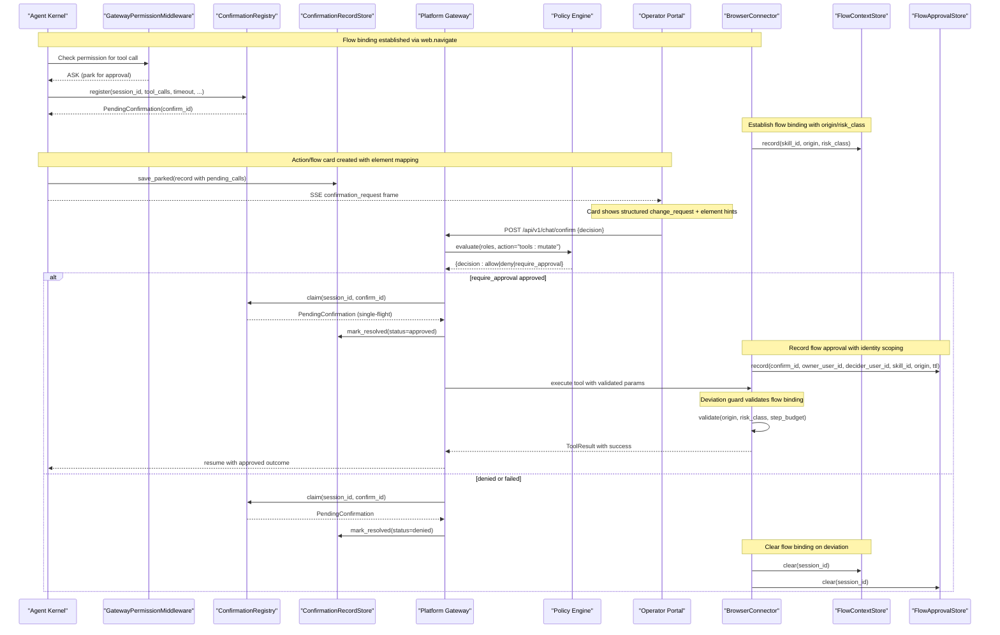

**Diagram sources**
- [runtime_kernel.py:1450-1650](file://products/agent-platform/src/agent_service/runtime_kernel.py#L1450-L1650)
- [flow_approvals.py:124-274](file://products/agent-platform/src/agent_service/services/flow_approvals.py#L124-L274)
- [browser_connector.py:793-889](file://products/tool-gateway/src/tool_gateway/tools/browser_connector.py#L793-L889)

## Detailed Component Analysis

### Enhanced Flow Binding and Deviation Guards
**Updated** The platform now implements sophisticated flow binding with deviation guards that ensure browser interactions execute only within declared, approved flows.

- **Flow binding establishment**: `web.navigate` establishes a flow binding with skill_id, origin, and risk_class, recorded in FlowContextStore
- **Deviation guard enforcement**: Every browser interaction is validated against the bound flow's origin allowlist, risk_class, and step budget
- **Flow-killing error codes**: Specific errors (BROWSER_REDIRECT_NOT_ALLOWED, BROWSER_FLOW_DENIED, BROWSER_FLOW_ORIGIN_DEVIATED, BROWSER_FLOW_AUTHORITY_STALE) trigger clearing of both FlowContext and FlowApproval stores
- **Identity scoping**: Flow approvals are scoped to the exact skill_id+origin combination, preventing cross-flow authority reuse
- **Step budget enforcement**: Maximum steps (default 20) prevent unbounded browser automation
- **Read vs write classification**: Read-class flows run under tools:invoke without extra gate; write-class flows park one confirmation card through the existing bridge

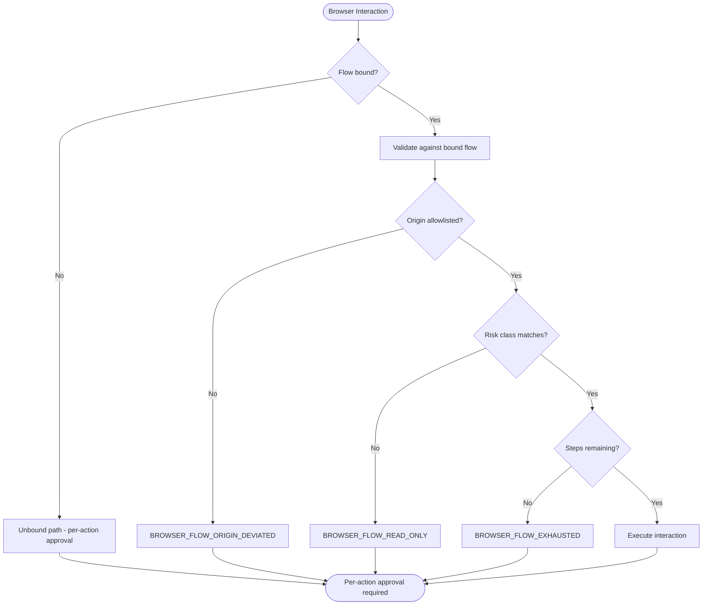

**Diagram sources**
- [flow_approvals.py:41-75](file://products/agent-platform/src/agent_service/services/flow_approvals.py#L41-L75)
- [flow_approvals.py:124-165](file://products/agent-platform/src/agent_service/services/flow_approvals.py#L124-L165)
- [SPEC-049-browser-web-check-tools/spec.md:151-172](file://docs/specs/SPEC-049-browser-web-check-tools/spec.md#L151-L172)

**Section sources**
- [flow_approvals.py:41-75](file://products/agent-platform/src/agent_service/services/flow_approvals.py#L41-L75)
- [flow_approvals.py:124-165](file://products/agent-platform/src/agent_service/services/flow_approvals.py#L124-L165)
- [SPEC-049-browser-web-check-tools/spec.md:151-172](file://docs/specs/SPEC-049-browser-web-check-tools/spec.md#L151-L172)

### Enhanced Confirmation Workflow with Structured Change Requests
**Updated** The confirmation workflow now provides structured change request cards with element mapping and improved readability.

- **Structured change requests**: Every action card includes a `{summary, fields[]}` projection that displays decision-relevant parameters with masked secrets
- **Curated formatters**: Specialized formatters for critical tools (k8s.delete_pod, web.click, web.type, etc.) provide human-readable effect sentences
- **Generic fallback**: Uncurated tools get a generic "Confirm <tool>" summary with label->value field projections
- **Element mapping**: Browser tools show human-readable element descriptions extracted from web.snapshot results instead of raw ref numbers
- **Secret masking**: Fail-closed masking using KNOWN_SAFE_FIELDS allow-list ensures sensitive values are never exposed in change requests
- **Approval kind discriminator**: Explicit `approval_kind: flow | action` prevents ambiguity between flow-level and action-level approvals

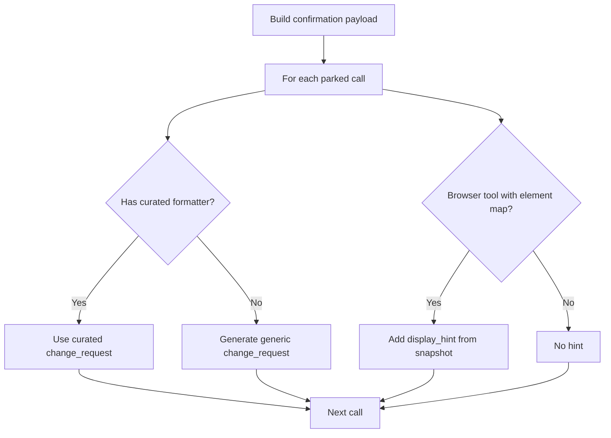

**Diagram sources**
- [hitl_confirmations.py:223-478](file://products/agent-platform/src/agent_service/services/hitl_confirmations.py#L223-L478)
- [hitl_confirmations.py:531-568](file://products/agent-platform/src/agent_service/services/hitl_confirmations.py#L531-L568)

**Section sources**
- [hitl_confirmations.py:223-478](file://products/agent-platform/src/agent_service/services/hitl_confirmations.py#L223-L478)
- [hitl_confirmations.py:531-568](file://products/agent-platform/src/agent_service/services/hitl_confirmations.py#L531-L568)

### Authority Provenance and Security Validation
**Updated** Enhanced security validation ensures that approval kinds cannot be spoofed and flow authorities remain valid.

- **Authority provenance**: Execution envelopes declare their authority provenance (`flow` or `action`) which is covered by HMAC signing
- **One-directional enforcement**: A `flow`-provenance envelope presented when no flow is bound is refused with `BROWSER_FLOW_AUTHORITY_STALE` rather than reinterpreted as per-action approval
- **Stale authority detection**: New `BROWSER_FLOW_AUTHORITY_STALE` error code indicates when a claimed flow authority is no longer valid
- **Flow-killing error handling**: Gateway refusal codes trigger clearing of both FlowContext and FlowApproval stores to prevent stale authority usage
- **Identity mismatch protection**: Flow approvals are invalidated when the bound flow identity changes, requiring re-approval

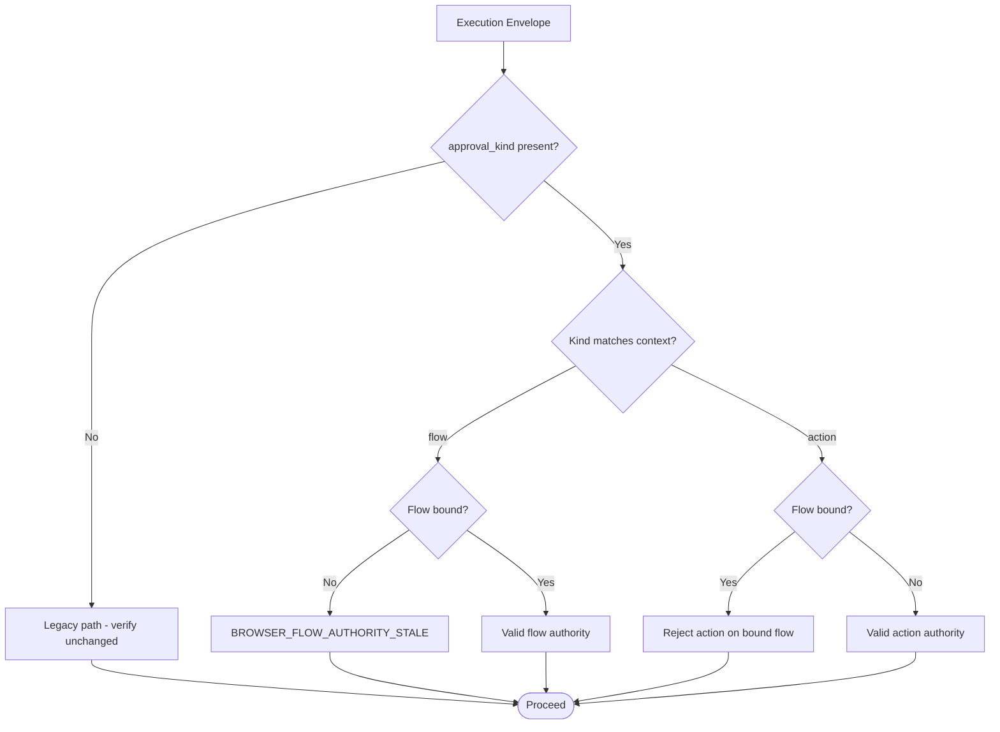

**Diagram sources**
- [execution_request.schema.json:71-71](file://products/agent-platform/src/agent_service/contracts/execution-request.schema.json#L71-L71)
- [flow_approvals.py:70-75](file://products/agent-platform/src/agent_service/services/flow_approvals.py#L70-L75)

**Section sources**
- [execution_request.schema.json:71-71](file://products/agent-platform/src/agent_service/contracts/execution-request.schema.json#L71-L71)
- [flow_approvals.py:70-75](file://products/agent-platform/src/agent_service/services/flow_approvals.py#L70-L75)

### Browser Tool Integration with Snapshot-Based Element Mapping
**Updated** Browser tools now provide enhanced element mapping and improved user experience through snapshot-based descriptions.

- **Snapshot element extraction**: The last `web.snapshot` result is parsed to extract element descriptions for use in confirmation cards
- **Human-readable elements**: Instead of showing raw ref numbers, cards display element descriptions like `<button type="submit">"Submit"</button>`
- **Interactive element enumeration**: Browser connector enumerates interactive elements with tags, types, roles, and labels
- **Credential masking**: Filled credential values and password fields are automatically masked in snapshot results
- **Frame-aware snapshots**: Snapshots capture elements from the active frame, not just the main page
- **Element reference resolution**: Web interaction tools resolve element references to their actual DOM elements

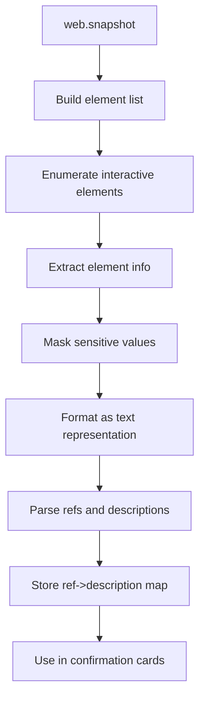

**Diagram sources**
- [browser_connector.py:857-889](file://products/tool-gateway/src/tool_gateway/tools/browser_connector.py#L857-L889)
- [runtime_kernel.py:1602-1629](file://products/agent-platform/src/agent_service/runtime_kernel.py#L1602-L1629)

**Section sources**
- [browser_connector.py:857-889](file://products/tool-gateway/src/tool_gateway/tools/browser_connector.py#L857-L889)
- [runtime_kernel.py:1602-1629](file://products/agent-platform/src/agent_service/runtime_kernel.py#L1602-L1629)

### Flow Context and Approval Management
- FlowContext reflects the gateway-bound browser flow identity (skill_id, origin) and metadata used for card headlines and intent
- FlowApproval scopes auto-signing authority to the approved flow identity with a TTL; subsequent writes in the same flow are admitted while identity matches and TTL holds
- Write-tier tools include web.click, web.type, web.select, web.press_key, web.upload_file, web.evaluate, and http.post
- Flow-killing error codes drop both context and approval to prevent stale authority
- **Enhanced identity scoping**: Flow approvals are strictly bound to the exact skill_id+origin combination

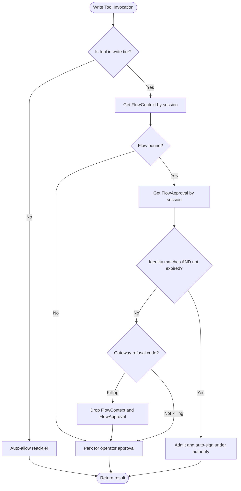

**Diagram sources**
- [flow_approvals.py:41-75](file://products/agent-platform/src/agent_service/services/flow_approvals.py#L41-L75)
- [flow_approvals.py:78-122](file://products/agent-platform/src/agent_service/services/flow_approvals.py#L78-L122)
- [flow_approvals.py:167-259](file://products/agent-platform/src/agent_service/services/flow_approvals.py#L167-L259)

**Section sources**
- [flow_approvals.py:41-75](file://products/agent-platform/src/agent_service/services/flow_approvals.py#L41-L75)
- [flow_approvals.py:78-122](file://products/agent-platform/src/agent_service/services/flow_approvals.py#L78-L122)
- [flow_approvals.py:167-259](file://products/agent-platform/src/agent_service/services/flow_approvals.py#L167-L259)

### Policy Engine and Approval Tiers
- Actions include chat, tools:invoke, tools:mutate, chat:confirm, approvals:list, and others
- Outcomes: allow, deny, require_approval; precedence is deny > require_approval > allow
- require_approval carries an approval block with tier (tier_1 or tier_2), decided_by_roles, and optional allow_self_approval
- Only bridged actions (currently tools:mutate) may use require_approval in this slice
- Default bundle enforces tier_2 for mutating execution with designated approvers distinct from requester

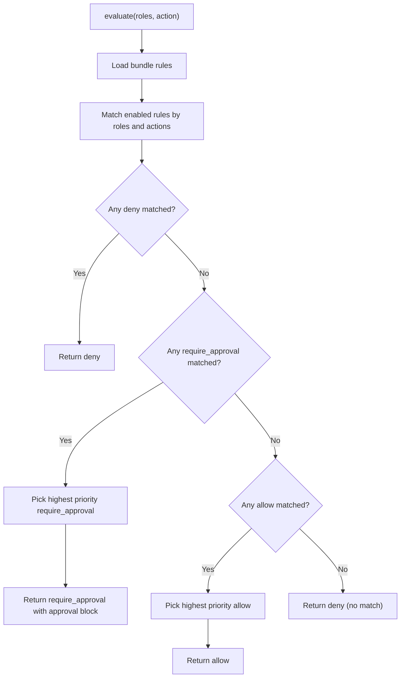

**Diagram sources**
- [policy_engine.py:390-444](file://products/platform-gateway/src/platform_gateway/services/policy_engine.py#L390-L444)
- [policy-default.yaml:129-152](file://shared/shared-contracts/policies/policy-default.yaml#L129-L152)

**Section sources**
- [policy_engine.py:119-127](file://products/platform-gateway/src/platform_gateway/services/policy_engine.py#L119-L127)
- [policy_engine.py:142-210](file://products/platform-gateway/src/platform_gateway/services/policy_engine.py#L142-L210)
- [policy_engine.py:390-444](file://products/platform-gateway/src/platform_gateway/services/policy_engine.py#L390-L444)
- [policy-default.yaml:129-152](file://shared/shared-contracts/policies/policy-default.yaml#L129-L152)

### Enhanced HTTP Tools with Security Validation
- Hardened security posture: `http.get` removed from built-in auto-allow list due to outbound egress risk
- URL validation: Refuses secret-bearing query parameters with HTTP_URL_SECRET_NOT_ALLOWED
- Body validation: Enforces depth limits, key count limits, and byte size caps before transport
- Credential set support: Requires explicit credential set configuration for authenticated requests
- Structured rendering: Preserves JSON structure while masking secret-bearing keys
- Fail-closed masking: Uses KNOWN_SAFE_FIELDS allow-list where only explicitly whitelisted fields render verbatim
- Defense in depth: Multiple layers of protection including connector-level validation and approval-card masking

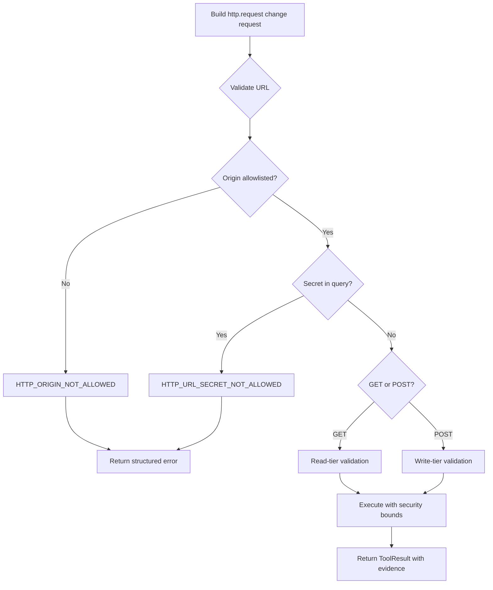

**Diagram sources**
- [http_connector.py:100-180](file://products/tool-gateway/src/tool_gateway/tools/http_connector.py#L100-L180)
- [http_connector.py:183-219](file://products/tool-gateway/src/tool_gateway/tools/http_connector.py#L183-L219)
- [http_connector.py:556-592](file://products/tool-gateway/src/tool_gateway/tools/http_connector.py#L556-592)
- [http_connector.py:654-699](file://products/tool-gateway/src/tool_gateway/tools/http_connector.py#L654-699)

**Section sources**
- [http_connector.py:100-180](file://products/tool-gateway/src/tool_gateway/tools/http_connector.py#L100-L180)
- [http_connector.py:183-219](file://products/tool-gateway/src/tool_gateway/tools/http_connector.py#L183-L219)
- [http_connector.py:556-592](file://products/tool-gateway/src/tool_gateway/tools/http_connector.py#L556-592)
- [http_connector.py:654-699](file://products/tool-gateway/src/tool_gateway/tools/http_connector.py#L654-699)
- [secret_params.py:136-153](file://products/agent-platform/src/agent_service/services/secret_params.py#L136-L153)

### Confirmation Cards, Change Requests, and Browser Element Hints
- Action cards project decision-relevant parameters into a change_request sibling of parameters so signed digests remain unchanged
- Curated formatters produce effect sentences for critical mutating tools; generic fallback provides masked label/value fields
- Browser tools referencing snapshot elements can show human-readable element descriptions instead of raw refs
- Secrets are masked consistently using secret parameter masking rules
- HTTP tools provide structured field listings with appropriate masking based on field names and content type

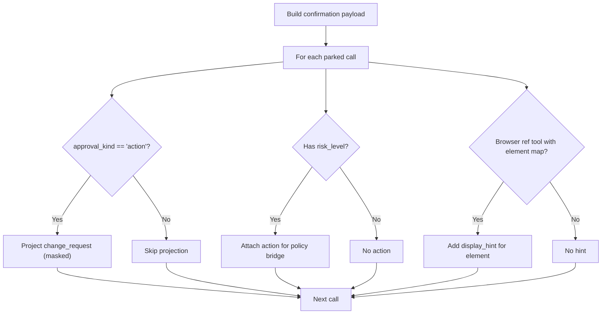

**Diagram sources**
- [hitl_confirmations.py:98-181](file://products/agent-platform/src/agent_service/services/hitl_confirmations.py#L98-L181)
- [hitl_confirmations.py:195-359](file://products/agent-platform/src/agent_service/services/hitl_confirmations.py#L195-L359)
- [hitl_confirmations.py:379-409](file://products/agent-platform/src/agent_service/services/hitl_confirmations.py#L379-L409)

**Section sources**
- [hitl_confirmations.py:98-181](file://products/agent-platform/src/agent_service/services/hitl_confirmations.py#L98-L181)
- [hitl_confirmations.py:195-359](file://products/agent-platform/src/agent_service/services/hitl_confirmations.py#L195-L359)
- [hitl_confirmations.py:379-409](file://products/agent-platform/src/agent_service/services/hitl_confirmations.py#L379-L409)

## Dependency Analysis
- ConfirmationRegistry depends on PendingConfirmation data and exposes single-flight claim/resolve semantics
- ConfirmationRecordStore abstracts memory/postgres backends; Postgres backend includes migration and startup sweep
- FlowApprovals maintains per-session FlowContext and FlowApproval with TTL checks and identity guards
- PolicyEngine consumes the default policy bundle and returns structured decisions including approval blocks
- SecretParameterMasking provides fail-closed posture with KNOWN_SAFE_FIELDS allow-list for secure parameter handling
- ToolEvidenceMiddleware coordinates secret delivery timing with approval workflow state
- GatewayPermissionMiddleware enforces hardened auto-allow list with outbound egress restrictions
- BrowserConnector implements deviation guards, flow binding, and element mapping for browser tools
- HTTP Connector implements comprehensive security validation and approval requirements
- Schemas enforce request shapes and decision structures across components

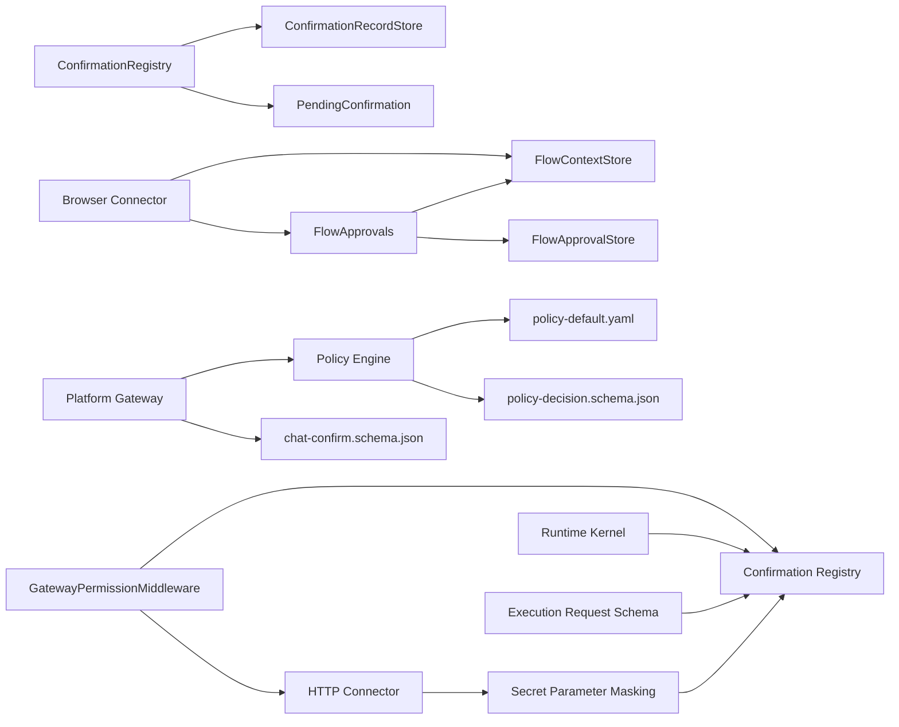

**Diagram sources**
- [hitl_confirmations.py:452-595](file://products/agent-platform/src/agent_service/services/hitl_confirmations.py#L452-L595)
- [confirmation_records.py:141-245](file://products/agent-platform/src/agent_service/services/confirmation_records.py#L141-L245)
- [flow_approvals.py:124-274](file://products/agent-platform/src/agent_service/services/flow_approvals.py#L124-L274)
- [policy_engine.py:390-444](file://products/platform-gateway/src/platform_gateway/services/policy_engine.py#L390-L444)
- [browser_connector.py:793-889](file://products/tool-gateway/src/tool_gateway/tools/browser_connector.py#L793-L889)

**Section sources**
- [hitl_confirmations.py:452-595](file://products/agent-platform/src/agent_service/services/hitl_confirmations.py#L452-L595)
- [confirmation_records.py:141-245](file://products/agent-platform/src/agent_service/services/confirmation_records.py#L141-L245)
- [flow_approvals.py:124-274](file://products/agent-platform/src/agent_service/services/flow_approvals.py#L124-L274)
- [policy_engine.py:390-444](file://products/platform-gateway/src/platform_gateway/services/policy_engine.py#L390-L444)

## Performance Considerations
- In-memory registries provide low-latency single-flight control; durable records add persistence overhead but ensure resilience
- Postgres queries are bounded by limits and history windows; opportunistic sweeps reclaim old resolved rows
- Flow approvals are per-process and TTL-bounded to avoid long-lived authority; clearing on flow-killing errors prevents stale unlocks
- Card payload construction avoids modifying signed parameters; projections are siblings to preserve digests
- Hold TTL management balances approval window duration with resource constraints
- Reveal-on-commit timing minimizes exposure surface by withholding sensitive data until commit point
- HTTP tool validation occurs before transport calls to prevent unnecessary network overhead
- Hardened auto-allow list reduces unnecessary approval cards for vetted in-cluster operations
- Shape-preserving masking operates efficiently on nested structures without deep copying entire payloads
- Snapshot-based element mapping adds minimal overhead during confirmation card generation
- Deviation guard validation is lightweight string comparisons and set lookups

## Troubleshooting Guide
Common issues and resolutions:
- Double confirm attempts: ConfirmationRegistry.claim ensures single-flight; duplicate confirms raise NotFound after claim
- Expired parks: ConfirmationExpired indicates TTL breach; cleanup via expire_confirmation resumes interruption
- Stale flow authority: Flow-killing error codes drop both FlowContext and FlowApproval; next write re-parks
- Missing signing key or worker unavailability: Approved resumes fail closed and audit rejection events; no unsigned fallback
- Inbox pagination and history: Use limit/offset for history; pending queue is always complete and sorted newest first
- Approval workflow delays: Monitor confirmation registry for stuck entries; verify policy engine performance
- HTTP tool approval issues: Verify URL doesn't contain secret query parameters; check credential set configuration; validate body structure and size limits; ensure origin is allowlisted
- **Flow binding issues**: Verify web.navigate was called successfully; check that flow context exists for the session; ensure origin is allowlisted
- **Deviation guard failures**: Check if the interaction is within the bound flow's origin allowlist; verify risk_class matches; ensure step budget hasn't been exceeded
- **Authority provenance errors**: Ensure approval_kind matches the actual authority type; verify flow binding exists for flow-provenance envelopes
- **Element mapping problems**: Verify web.snapshot was called before interaction tools; check that element refs are still valid

Operational tips:
- Verify policy bundle SHA-256 on readiness endpoints to confirm enforced configuration
- Confirm AGENT_HITL_CONFIRM_TIMEOUT aligns with expected operator response time
- Ensure approver roles have chat:confirm and approvals:list grants per policy bundle
- Monitor flow binding lifecycle and deviation guard violations
- Track element mapping effectiveness and snapshot quality
- Review browser tool usage patterns and flow binding adoption rates

**Section sources**
- [hitl_confirmations.py:496-558](file://products/agent-platform/src/agent_service/services/hitl_confirmations.py#L496-L558)
- [confirmation_records.py:521-542](file://products/agent-platform/src/agent_service/services/confirmation_records.py#L521-L542)
- [flow_approvals.py:56-75](file://products/agent-platform/src/agent_service/services/flow_approvals.py#L56-L75)
- [approval-and-hitl.md:229-288](file://docs/guides/approval-and-hitl.md#L229-L288)

## Conclusion
The Agent Platform's HITL approval system combines layered enforcement with enhanced security posture:
- Policy engine decisions gate who can decide and at what tier
- Confirmation registry manages parking, single-flight decisions, and TTL
- Durable records persist decisions and support inbox/history surfaces
- Flow approvals enable safe auto-signing within bounded browser flows
- **Enhanced flow binding with deviation guards ensures browser interactions stay within declared boundaries**
- **Structured change request cards provide decision-relevant information with masked secrets**
- **Authority provenance validation prevents spoofing of approval kinds**
- **Snapshot-based element mapping improves user experience with human-readable element descriptions**
- **Comprehensive deviation guard enforcement protects against unauthorized browser automation**
- Schemas and bundles standardize behavior across components

Together, these mechanisms ensure risky operations execute only with explicit, auditable, and policy-compliant human approval, including sophisticated flow binding with deviation guards and enhanced confirmation workflows for browser tools.

## Appendices

### Enhanced Flow Binding and Deviation Guards
**Updated** The platform implements sophisticated flow binding with deviation guards that ensure browser interactions execute only within declared, approved flows.

- **Flow binding establishment**: `web.navigate` establishes a flow binding with skill_id, origin, and risk_class
- **Deviation guard enforcement**: Every browser interaction is validated against the bound flow's origin allowlist, risk_class, and step budget
- **Flow-killing error codes**: Specific errors trigger clearing of both FlowContext and FlowApproval stores
- **Identity scoping**: Flow approvals are scoped to the exact skill_id+origin combination
- **Step budget enforcement**: Maximum steps (default 20) prevent unbounded browser automation
- **Read vs write classification**: Read-class flows run under tools:invoke without extra gate; write-class flows park one confirmation card

**Section sources**
- [flow_approvals.py:41-75](file://products/agent-platform/src/agent_service/services/flow_approvals.py#L41-L75)
- [flow_approvals.py:124-165](file://products/agent-platform/src/agent_service/services/flow_approvals.py#L124-L165)
- [SPEC-049-browser-web-check-tools/spec.md:151-172](file://docs/specs/SPEC-049-browser-web-check-tools/spec.md#L151-L172)

### Enhanced Confirmation Workflow with Structured Change Requests
**Updated** The confirmation workflow provides structured change request cards with element mapping and improved readability.

- **Structured change requests**: Every action card includes a `{summary, fields[]}` projection with masked secrets
- **Curated formatters**: Specialized formatters for critical tools provide human-readable effect sentences
- **Generic fallback**: Uncurated tools get a generic "Confirm <tool>" summary with label->value field projections
- **Element mapping**: Browser tools show human-readable element descriptions from web.snapshot results
- **Secret masking**: Fail-closed masking using KNOWN_SAFE_FIELDS allow-list ensures sensitive values are never exposed
- **Approval kind discriminator**: Explicit `approval_kind: flow | action` prevents ambiguity between approval types

**Section sources**
- [hitl_confirmations.py:223-478](file://products/agent-platform/src/agent_service/services/hitl_confirmations.py#L223-L478)
- [hitl_confirmations.py:531-568](file://products/agent-platform/src/agent_service/services/hitl_confirmations.py#L531-L568)

### Authority Provenance and Security Validation
**Updated** Enhanced security validation ensures that approval kinds cannot be spoofed and flow authorities remain valid.

- **Authority provenance**: Execution envelopes declare their authority provenance (`flow` or `action`) covered by HMAC signing
- **One-directional enforcement**: A `flow`-provenance envelope presented when no flow is bound is refused with `BROWSER_FLOW_AUTHORITY_STALE`
- **Stale authority detection**: New `BROWSER_FLOW_AUTHORITY_STALE` error code indicates invalid flow authorities
- **Flow-killing error handling**: Gateway refusal codes trigger clearing of both FlowContext and FlowApproval stores
- **Identity mismatch protection**: Flow approvals are invalidated when the bound flow identity changes

**Section sources**
- [execution_request.schema.json:71-71](file://products/agent-platform/src/agent_service/contracts/execution-request.schema.json#L71-L71)
- [flow_approvals.py:70-75](file://products/agent-platform/src/agent_service/services/flow_approvals.py#L70-L75)

### Browser Tool Integration with Snapshot-Based Element Mapping
**Updated** Browser tools provide enhanced element mapping and improved user experience through snapshot-based descriptions.

- **Snapshot element extraction**: The last `web.snapshot` result is parsed to extract element descriptions for confirmation cards
- **Human-readable elements**: Cards display element descriptions like `<button type="submit">"Submit"</button>` instead of raw ref numbers
- **Interactive element enumeration**: Browser connector enumerates interactive elements with tags, types, roles, and labels
- **Credential masking**: Filled credential values and password fields are automatically masked in snapshot results
- **Frame-aware snapshots**: Snapshots capture elements from the active frame, not just the main page
- **Element reference resolution**: Web interaction tools resolve element references to their actual DOM elements

**Section sources**
- [browser_connector.py:857-889](file://products/tool-gateway/src/tool_gateway/tools/browser_connector.py#L857-L889)
- [runtime_kernel.py:1602-1629](file://products/agent-platform/src/agent_service/runtime_kernel.py#L1602-L1629)

### Risk Tier Classification and Tool Categorization
- Read-tier tools auto-allow where configured; they never reach flow-unlock
- Write-tier tools include web.click, web.type, web.select, web.press_key, web.upload_file, web.evaluate, and http.post
- web.fill_credential is read-tier and does not park a card; it names its credential set
- web.evaluate takes only expression and no element ref; it is not a ref-taking tool
- **http.get is now read-tier but requires explicit approval by default due to outbound egress risk**
- **http.post requires tools:mutate permission and follows the same approval workflow as other write-tier tools**

**Section sources**
- [hitl_confirmations.py:101-104](file://products/agent-platform/src/agent_service/services/hitl_confirmations.py#L101-L104)
- [flow_approvals.py:41-54](file://products/agent-platform/src/agent_service/services/flow_approvals.py#L41-L54)
- [kernel_middleware.py:242-370](file://products/agent-platform/src/agent_service/services/kernel_middleware.py#L242-L370)

### Approval Escalation Paths
- tier_1: operator self-approval (default when no require_approval rule)
- tier_2: designated approver distinct from requester; self-approval blocked by default
- Shipped bundle requires tier_2 for tools:mutate with designated_by_roles approver and platform-admin
- **http.get and http.post inherit the same escalation paths as other tools, with http.get requiring explicit approval by default**

**Section sources**
- [policy-default.yaml:129-152](file://shared/shared-contracts/policies/policy-default.yaml#L129-L152)
- [approval-and-hitl.md:189-227](file://docs/guides/approval-and-hitl.md#L189-L227)

### Configuring Approval Policies
- Edit shared/shared-contracts/policies/policy-default.yaml and bump version
- Sync consumer copies and validate with make verify
- Deploy ConfigMap; confirm bundle SHA-256 on readiness endpoints
- Adjust AGENT_GATEWAY_TOOL_AUTO_ALLOW for read-only auto-approval lists
- Set AGENT_HITL_CONFIRM_TIMEOUT to control park lifetime
- Configure AGENT_GATEWAY_TOOL_AUTO_ALLOW_EXTRA=http.get to restore previous http.get auto-approval behavior
- Configure browser flow settings including step budgets and origin allowlists

**Section sources**
- [approval-and-hitl.md:118-188](file://docs/guides/approval-and-hitl.md#L118-L188)

### Handling Approval Decisions and Auditing
- Operator submits POST /api/v1/chat/confirm with session_id, confirm_id, decision
- Platform gateway evaluates policy and enforces tier constraints
- Durable records capture status, decider, decision, and timestamps
- Audit trail correlates confirmation_decided with execution_requested/completed/rejected
- **Authority provenance events are logged with approval_kind and flow binding information**
- **Deviation guard violations are tracked for security monitoring**
- **Element mapping effectiveness is monitored for user experience optimization**

**Section sources**
- [chat-confirm.schema.json:1-27](file://shared/shared-contracts/schemas/chat-confirm.schema.json#L1-L27)
- [policy-decision.schema.json:1-60](file://shared/shared-contracts/schemas/policy-decision.schema.json#L1-L60)
- [agent-stream-event.schema.json:5](file://shared/shared-contracts/schemas/agent-stream-event.schema.json#L5)
- [approval-and-hitl.md:290-333](file://docs/guides/approval-and-hitl.md#L290-L333)

### Implementing Custom Approval Flows
- Extend change_request formatters for new tools to improve card readability
- Add browser element parsing for new snapshot formats if needed
- Ensure new tools declare correct risk_level and integrate with auto-allow lists
- For browser flows, rely on FlowContext/FlowApproval to scope auto-signing safely
- Follow the http tool pattern for implementing custom HTTP tools with structured validation and security enforcement
- **Implement deviation guards for new browser tools following the established pattern**
- **Integrate element mapping for improved user experience with snapshot-based descriptions**

**Section sources**
- [hitl_confirmations.py:195-359](file://products/agent-platform/src/agent_service/services/hitl_confirmations.py#L195-L359)
- [hitl_confirmations.py:412-449](file://products/agent-platform/src/agent_service/services/hitl_confirmations.py#L412-L449)
- [flow_approvals.py:78-122](file://products/agent-platform/src/agent_service/services/flow_approvals.py#L78-L122)

### Race Conditions and Timeouts
- Single-flight claim prevents double-resume; take_for_expiry claims for cleanup without interrupting in-flight decisions
- TTL-based expiry closes parked calls; startup sweep expires stale pending rows in Postgres
- Flow approvals expire based on captured TTL; zero disables flow-unlock entirely
- Hold TTL management prevents resource exhaustion while supporting extended approval windows
- Reveal-on-commit timing eliminates race conditions between approval decisions and secret delivery
- **Flow-killing error codes ensure both FlowContext and FlowApproval are cleared atomically**
- **Authority provenance validation prevents race conditions between flow binding and approval states**

**Section sources**
- [hitl_confirmations.py:520-558](file://products/agent-platform/src/agent_service/services/hitl_confirmations.py#L520-558)
- [confirmation_records.py:521-542](file://products/agent-platform/src/agent_service/services/confirmation_records.py#L521-L542)
- [flow_approvals.py:189-199](file://products/agent-platform/src/agent_service/services/flow_approvals.py#L189-L199)

### User Experience Considerations
- Action cards present concise effect sentences and masked fields for clarity and safety
- Browser tools show human-readable element descriptions when available
- Owner transcript cards anchor under the parking exchange and poll for live updates
- Approver inbox splits pending and history with pagination and counts
- Copy-password controls appear only after gated mutations succeed, providing clear feedback about approval status
- HTTP tool approval cards provide structured field listings with clear indication of which fields contain sensitive data
- Outbound egress operations now clearly indicate the security rationale for requiring approval
- **Structured change request cards provide better decision context for operators**
- **Element mapping improves browser tool usability with human-readable descriptions**
- **Flow binding provides clear context about which skill and target origin is being automated**

**Section sources**
- [hitl_confirmations.py:98-181](file://products/agent-platform/src/agent_service/services/hitl_confirmations.py#L98-L181)
- [approval-and-hitl.md:229-288](file://docs/guides/approval-and-hitl.md#L229-L288)

### HTTP Tool Security and Validation
- Hardened security posture: `http.get` removed from built-in auto-allow list due to outbound egress risk
- URL validation: Refuses secret-bearing query parameters with HTTP_URL_SECRET_NOT_ALLOWED
- Body validation: Enforces depth limits, key count limits, and byte size caps before transport
- Credential set support: Requires explicit credential set configuration for authenticated requests
- Structured rendering: Preserves JSON structure while masking secret-bearing keys
- Fail-closed masking: Uses KNOWN_SAFE_FIELDS allow-list where only explicitly whitelisted fields render verbatim
- Defense in depth: Multiple layers of protection including connector-level validation and approval-card masking

**Section sources**
- [http_connector.py:100-180](file://products/tool-gateway/src/tool_gateway/tools/http_connector.py#L100-L180)
- [http_connector.py:183-219](file://products/tool-gateway/src/tool_gateway/tools/http_connector.py#L183-L219)
- [http_connector.py:556-592](file://products/tool-gateway/src/tool_gateway/tools/http_connector.py#L556-592)
- [http_connector.py:654-699](file://products/tool-gateway/src/tool_gateway/tools/http_connector.py#L654-699)
- [secret_params.py:136-153](file://products/agent-platform/src/agent_service/services/secret_params.py#L136-L153)