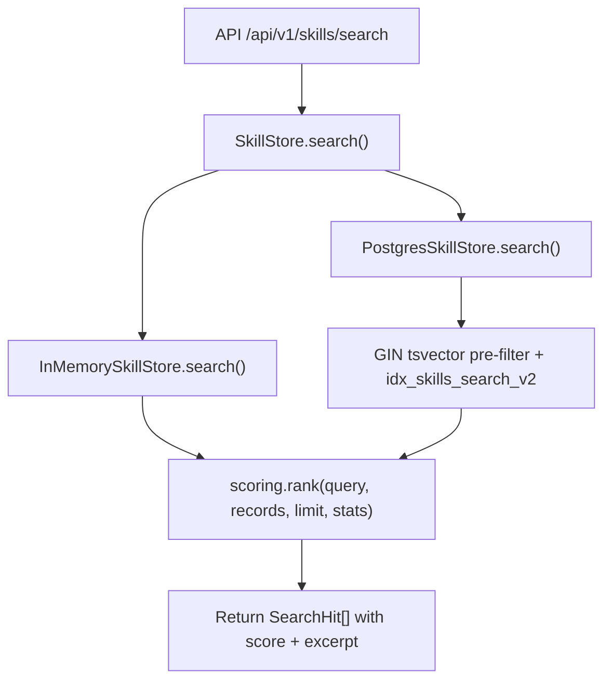
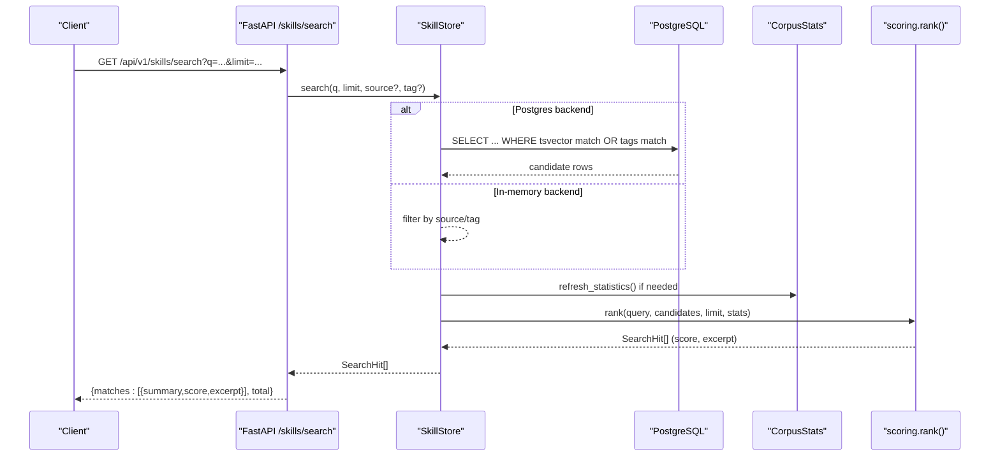
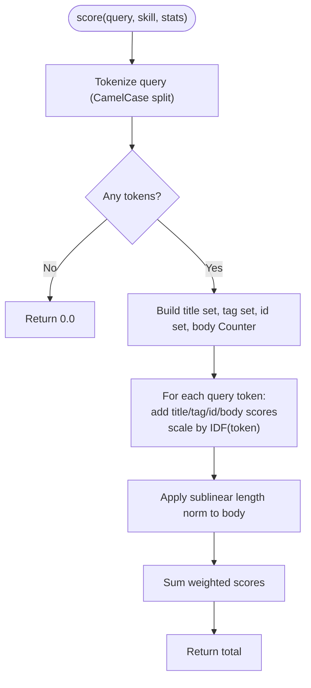
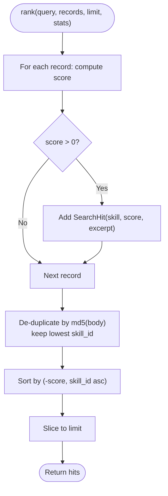
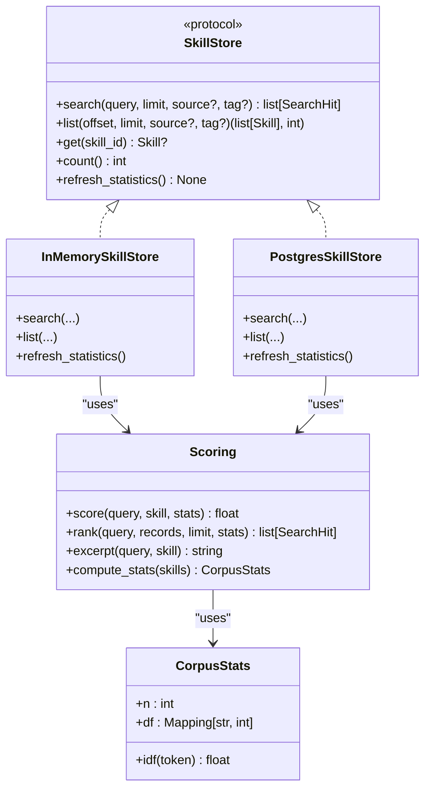
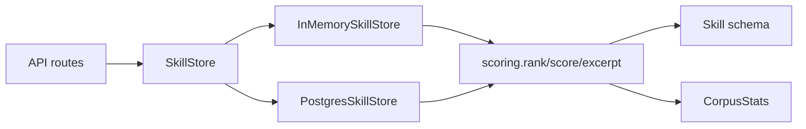

# Scoring and Ranking

<cite>
**Referenced Files in This Document**
- [scoring.py](file://products/skills-hub/src/skills_hub/services/scoring.py)
- [test_scoring.py](file://products/skills-hub/tests/test_scoring.py)
- [skill_store.py](file://products/skills-hub/src/skills_hub/services/skill_store.py)
- [skills.py](file://products/skills-hub/src/skills_hub/api/routes/skills.py)
- [skill.schema.json](file://shared/shared-contracts/schemas/skill.schema.json)
- [skill-format.md](file://shared/shared-contracts/skill-format.md)
- [README.md](file://products/skills-hub/README.md)
- [skills-guide.md](file://docs/guides/skills-guide.md)
- [SPEC-066 release notes](file://docs/agentic-aiops-platform/release-notes/2026-10-03-spec-066-skill-retrieval-ranking-fidelity.md)
</cite>

## Update Summary
**Changes Made**
- Updated scoring algorithm description to reflect SPEC-066 enhancements
- Added corpus-derived IDF weighting explanation
- Documented sublinear body-length normalization
- Added query-side CamelCase splitting details
- Included skill_id slug scoring at tag weight
- Added content de-duplication via md5(body) before sorting
- Updated PostgreSQL index information to include idx_skills_search_v2
- Enhanced performance considerations for large catalogs

## Table of Contents
1. [Introduction](#introduction)
2. [Project Structure](#project-structure)
3. [Core Components](#core-components)
4. [Architecture Overview](#architecture-overview)
5. [Detailed Component Analysis](#detailed-component-analysis)
6. [Dependency Analysis](#dependency-analysis)
7. [Performance Considerations](#performance-considerations)
8. [Troubleshooting Guide](#troubleshooting-guide)
9. [Conclusion](#conclusion)

## Introduction
This document explains the Skills Hub scoring and ranking algorithms that power deterministic, explainable skill search. The system has been enhanced with SPEC-066 to provide improved relevance through corpus-derived IDF weighting, sublinear body-length normalization, query-side CamelCase splitting, and skill_id slug scoring. It covers how relevance is computed from title, tags, skill_id slug, and body; how ties are broken; how results are limited; and how the algorithm integrates with both in-memory and PostgreSQL backends. It also documents configuration knobs, customizability boundaries, integration points with external quality signals, examples of score calculations and ranking scenarios, troubleshooting guidance for poor rankings, and performance considerations for large catalogs.

## Project Structure
The scoring and ranking logic lives in a small, focused module and is reused by both store backends to guarantee identical ordering across environments. The API routes expose search endpoints that delegate to the store, which applies pre-filtering (PostgreSQL full-text) and then re-ranks using the shared scorer.

**Diagram sources**
- [skills.py:99-146](file://products/skills-hub/src/skills_hub/api/routes/skills.py#L99-L146)
- [skill_store.py:137-144](file://products/skills-hub/src/skills_hub/services/skill_store.py#L137-L144)
- [skill_store.py:417-443](file://products/skills-hub/src/skills_hub/services/skill_store.py#L417-L443)
- [scoring.py:302-336](file://products/skills-hub/src/skills_hub/services/scoring.py#L302-L336)

**Section sources**
- [README.md:1-74](file://products/skills-hub/README.md#L1-L74)
- [skills-guide.md:12-35](file://docs/guides/skills-guide.md#L12-L35)

## Core Components
- **Enhanced deterministic keyword scorer**: computes a non-negative float per skill based on query tokens matched in title, tags, skill_id slug, and body, with corpus-derived IDF weighting, fixed weights, and sublinear body occurrence cap.
- **Corpus statistics**: maintains inverse document frequency (IDF) data computed over the entire catalog at sync time for weighted scoring.
- **Excerpt generator**: returns a bounded snippet around the first matching body region or falls back to the description when matches are only in title/tags/slug.
- **Ranker**: filters zero-score skills, applies content de-duplication via md5(body), sorts by descending score then ascending skill_id, and caps results to the requested limit.
- **Store backends**:
  - In-memory: scans all records and delegates ranking to the shared scorer.
  - PostgreSQL: uses a GIN index over title+body+skill_id plus tag fallback to pre-filter candidates, then re-ranks with the shared scorer for byte-identical ordering.

Key constants and behaviors:
- Title weight (3.0) > Tag weight (2.0) = Skill_id weight (2.0) > Body weight (1.0).
- Body occurrences saturate at a configurable cap to prevent long bodies from dominating.
- Zero-score records are excluded.
- Ties break by skill_id ascending for determinism.
- Content de-duplication collapses duplicate bodies before sorting.

**Section sources**
- [scoring.py:1-336](file://products/skills-hub/src/skills_hub/services/scoring.py#L1-L336)
- [test_scoring.py:1-469](file://products/skills-hub/tests/test_scoring.py#L1-L469)
- [skill_store.py:137-144](file://products/skills-hub/src/skills_hub/services/skill_store.py#L137-L144)
- [skill_store.py:417-443](file://products/skills-hub/src/skills_hub/services/skill_store.py#L417-L443)

## Architecture Overview
Search requests flow through FastAPI routes into the SkillStore abstraction. Depending on the configured backend, candidate selection differs, but ranking is always performed by the shared scorer to ensure consistency. The system now includes corpus-derived IDF weighting and enhanced pre-filtering capabilities.

**Diagram sources**
- [skills.py:99-146](file://products/skills-hub/src/skills_hub/api/routes/skills.py#L99-L146)
- [skill_store.py:417-443](file://products/skills-hub/src/skills_hub/services/skill_store.py#L417-L443)
- [scoring.py:302-336](file://products/skills-hub/src/skills_hub/services/scoring.py#L302-L336)

## Detailed Component Analysis

### Enhanced Scorer: tokenization, weighting, saturation, and IDF
- **Tokenization**: lowercases and extracts alphanumeric tokens. Query-side supports CamelCase splitting while document-side remains unsplit for parity.
- **Corpus-derived IDF weighting**: each token contribution is scaled by `ln((1+N)/(1+df))+1`, where N is corpus size and df is document frequency.
- **Weights**:
  - Title match: fixed high weight (3.0).
  - Tag match: medium weight (2.0).
  - Skill_id slug match: medium weight (2.0) - new fourth scored field.
  - Body match: low weight (1.0) per occurrence, capped to avoid long-body dominance.
- **Sublinear length normalization**: body contributions are dampened by `1/log2(2+len(body)/1000)` to prevent long documents from dominating.
- **Output**: a single float; 0.0 indicates no match.

**Diagram sources**
- [scoring.py:207-257](file://products/skills-hub/src/skills_hub/services/scoring.py#L207-L257)

**Section sources**
- [scoring.py:20-336](file://products/skills-hub/src/skills_hub/services/scoring.py#L20-L336)

### Enhanced Ranker: filtering, de-duplication, sorting, and limiting
- Filters out zero-score skills.
- Applies content de-duplication via md5(body) before sorting to collapse duplicate bodies.
- Sorts by (-score, skill_id ascending).
- Caps results to the requested limit.

**Diagram sources**
- [scoring.py:302-336](file://products/skills-hub/src/skills_hub/services/scoring.py#L302-L336)

**Section sources**
- [scoring.py:302-336](file://products/skills-hub/src/skills_hub/services/scoring.py#L302-L336)

### Excerpt generation
- Finds the earliest matching token position in the body.
- Returns a bounded window around that position, truncating with an ellipsis if needed.
- Falls back to the skill description when there is no body match.

**Section sources**
- [scoring.py:260-280](file://products/skills-hub/src/skills_hub/services/scoring.py#L260-L280)

### Corpus Statistics and IDF Weighting
- **CorpusStats**: immutable dataclass holding corpus-wide document frequencies for IDF weighting.
- **compute_stats**: full-catalog pass computing document frequencies across all four scored fields (title, tags, body, skill_id).
- **idf(token)**: smoothed inverse document frequency formula `ln((1+N)/(1+df)) + 1` with no stoplist.
- **EMPTY_STATS**: neutral statistics providing idf=1.0 for graceful degradation.

**Section sources**
- [scoring.py:135-192](file://products/skills-hub/src/skills_hub/services/scoring.py#L135-L192)

### Store backends and integration
- **In-memory store**:
  - Applies optional source and tag filters.
  - Delegates ranking to the shared scorer.
  - Maintains corpus statistics for IDF weighting.
- **PostgreSQL store**:
  - Uses a GIN index on title+body+skill_id text vectors and a tag fallback to pre-filter candidates.
  - Re-ranks candidates with the shared scorer to maintain identical ordering semantics.
  - Ensures tag-only matches remain discoverable even though tags cannot be part of the immutable index expression.
  - Supports the new `idx_skills_search_v2` index for enhanced querying.

**Diagram sources**
- [skill_store.py:30-66](file://products/skills-hub/src/skills_hub/services/skill_store.py#L30-L66)
- [skill_store.py:137-144](file://products/skills-hub/src/skills_hub/services/skill_store.py#L137-L144)
- [skill_store.py:417-443](file://products/skills-hub/src/skills_hub/services/skill_store.py#L417-L443)
- [scoring.py:207-336](file://products/skills-hub/src/skills_hub/services/scoring.py#L207-L336)

**Section sources**
- [skill_store.py:156-200](file://products/skills-hub/src/skills_hub/services/skill_store.py#L156-L200)
- [skill_store.py:417-443](file://products/skills-hub/src/skills_hub/services/skill_store.py#L417-L443)

### API exposure and usage audit
- Search endpoint validates parameters, authenticates callers, calls the store, emits usage audit events, and returns matches with score and excerpt.
- List endpoint supports pagination and optional source/tag filters without scoring.

**Section sources**
- [skills.py:68-96](file://products/skills-hub/src/skills_hub/api/routes/skills.py#L68-L96)
- [skills.py:99-146](file://products/skills-hub/src/skills_hub/api/routes/skills.py#L99-L146)

### Data model and frontmatter contract
- Skill schema defines required and optional fields, including title, description, tags, version, source_url, web_target, risk_class, flow_intent, kind, steps, updated_at, and body.
- Skill format documentation describes ingestion rules, size caps, identity rules, and validation expectations.

**Section sources**
- [skill.schema.json:1-125](file://shared/shared-contracts/schemas/skill.schema.json#L1-L125)
- [skill-format.md:1-203](file://shared/shared-contracts/skill-format.md#L1-L203)

## Dependency Analysis
- API routes depend on SkillStore abstraction and authentication/metrics utilities.
- Both store implementations depend on the shared scorer for ranking.
- PostgreSQL path depends on database indexes and full-text functions; in-memory path depends on Python data structures.
- Tests assert deterministic behavior, tie-breaking, scoring weights, and SPEC-066 enhancements.

**Diagram sources**
- [skills.py:99-146](file://products/skills-hub/src/skills_hub/api/routes/skills.py#L99-L146)
- [skill_store.py:137-144](file://products/skills-hub/src/skills_hub/services/skill_store.py#L137-L144)
- [skill_store.py:417-443](file://products/skills-hub/src/skills_hub/services/skill_store.py#L417-L443)
- [scoring.py:207-336](file://products/skills-hub/src/skills_hub/services/scoring.py#L207-L336)

**Section sources**
- [test_scoring.py:33-102](file://products/skills-hub/tests/test_scoring.py#L33-L102)

## Performance Considerations
- Deterministic O(n) scoring per candidate after pre-filtering.
- PostgreSQL path reduces n via GIN full-text index and tag fallback; still re-ranks in-process for identical semantics.
- Body occurrence cap prevents long documents from inflating scores and keeps scoring fast.
- Limit parameter bounds output size and downstream processing.
- In-memory store is suitable for dev/testing; production should use PostgreSQL for durability and scalability.
- Corpus statistics computation is O(n) but runs at sync time, not per-request.

**Enhanced Performance Features:**
- **Corpus-derived IDF weighting**: reduces impact of common terms without requiring stoplists.
- **Sublinear length normalization**: prevents long documents from dominating rankings.
- **Query-side CamelCase splitting**: improves recall for technical identifiers without breaking parity.
- **Content de-duplication**: prevents duplicate bodies from consuming result slots.
- **idx_skills_search_v2**: enhanced GIN index supporting skill_id queries and prefix matching.

Optimization opportunities:
- Cache frequent queries at the API layer with short TTLs keyed by normalized query, source, and tag filters.
- Precompute and cache excerpts for top-k results per query shape if repeated searches occur.
- Tune BODY_OCCURRENCE_CAP and weights only if you accept changes to deterministic semantics and must coordinate across backends.
- Monitor corpus statistics freshness to ensure IDF weighting reflects current catalog state.

## Troubleshooting Guide
Common issues and remedies:
- **No search results**:
  - Query words do not co-occur anywhere; try broader terms or rely on tags.
  - Source may not have synced yet; check status endpoint and wait for next interval.
  - Corpus statistics may not be refreshed; trigger `refresh_statistics()` if needed.
- **Unexpected ranking order**:
  - Remember title > tags = skill_id > body weights and saturation; verify presence of keywords in those fields.
  - Ties break by skill_id ascending; confirm skill_id values.
  - IDF weighting may affect relative importance of rare vs common terms.
- **Poor relevance due to long bodies**:
  - Sublinear length normalization helps, but consider increasing emphasis on title/tags or splitting long guides into smaller skills.
- **Missing new content**:
  - Ensure ConfigMap wiring for local sources or correct Git ref/path for git sources; restart deployment if necessary.
  - Check that corpus statistics have been refreshed to include new content.
- **CamelCase identifier queries not working**:
  - Query-side CamelCase splitting should handle technical identifiers like `KubePodNotReady`.
  - Verify that the query contains the exact identifier or its constituent parts.

Operational checks:
- Use the status endpoint to inspect sync outcomes and errors per source.
- Validate documents locally before publishing using the same code path as the service.
- Monitor corpus statistics table (`skills_corpus_stats`) for proper IDF computation.
- Verify both `idx_skills_search` and `idx_skills_search_v2` indexes exist in PostgreSQL.

**Section sources**
- [skills-guide.md:338-374](file://docs/guides/skills-guide.md#L338-L374)
- [README.md:35-63](file://products/skills-hub/README.md#L35-L63)

## Conclusion
The Skills Hub uses an enhanced, deterministic keyword-based scoring model with corpus-derived IDF weighting, sublinear body-length normalization, query-side CamelCase splitting, and skill_id slug scoring. The system produces stable, explainable rankings with improved relevance through SPEC-066 enhancements. Both in-memory and PostgreSQL backends share the same scorer so results are byte-identical across deployments. For large catalogs, leverage PostgreSQL full-text pre-filtering with the enhanced `idx_skills_search_v2` index and consider application-level caching for hot queries. Authoring best practices—clear titles, precise tags, well-chosen skill_ids, concise descriptions, and well-structured bodies—directly improve ranking outcomes. The content de-duplication guardrail ensures that duplicate bodies don't consume result slots, maintaining optimal result diversity.