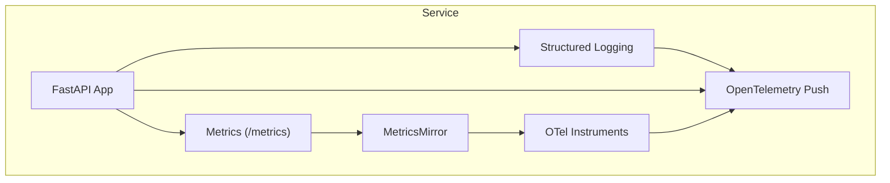
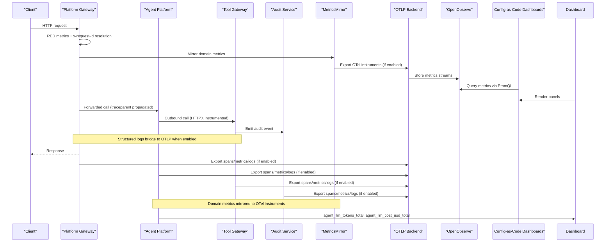
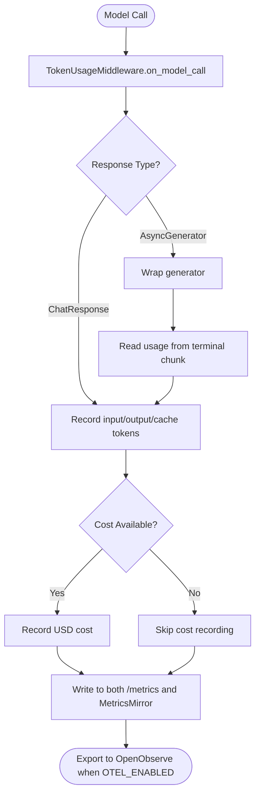
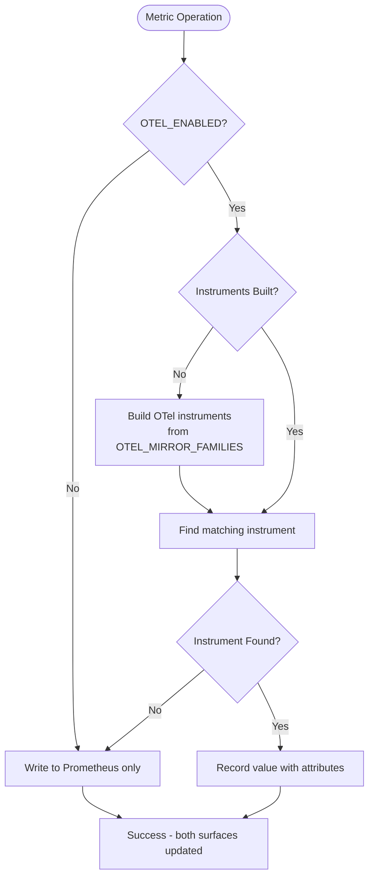
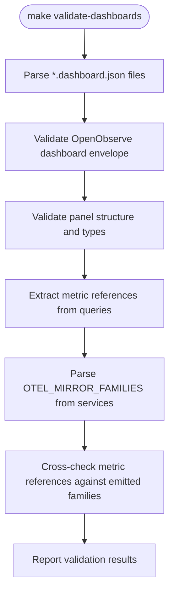
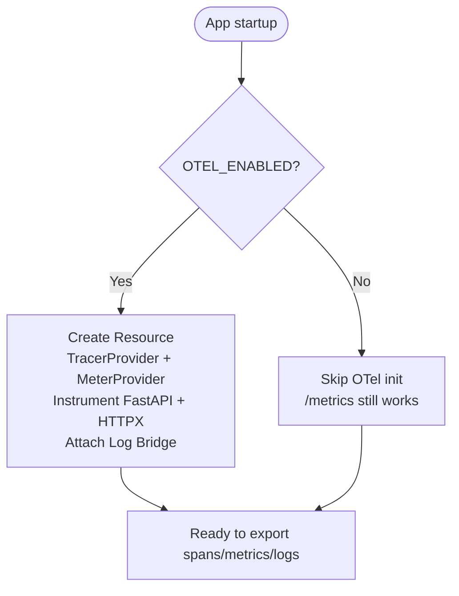
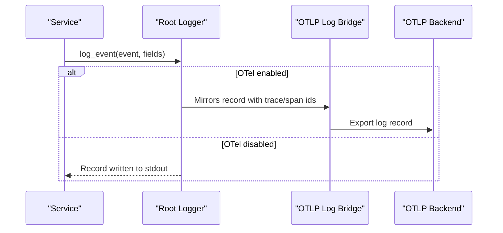
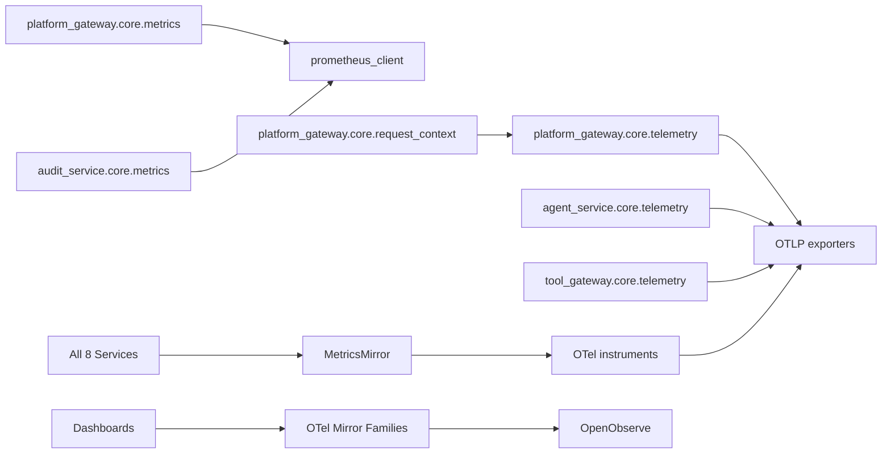

# Monitoring and Observability

<cite>
**Referenced Files in This Document**
- [observability-conventions.md](file://shared/shared-contracts/observability-conventions.md)
- [telemetry.py (platform-gateway)](file://products/platform-gateway/src/platform_gateway/core/telemetry.py)
- [observability.py (platform-gateway)](file://products/platform-gateway/src/platform_gateway/core/observability.py)
- [metrics.py (platform-gateway)](file://products/platform-gateway/src/platform_gateway/core/metrics.py)
- [request_context.py (platform-gateway)](file://products/platform-gateway/src/platform_gateway/core/request_context.py)
- [telemetry.py (agent-platform)](file://products/agent-platform/src/agent_service/core/telemetry.py)
- [observability.py (agent-platform)](file://products/agent-platform/src/agent_service/core/observability.py)
- [metrics.py (audit-service)](file://products/audit-service/src/audit_service/core/metrics.py)
- [telemetry.py (tool-gateway)](file://products/tool-gateway/src/tool_gateway/core/telemetry.py)
- [ADR-0014: Domain Metrics Via OTel Push](file://docs/adr/0014-domain-metrics-via-otel-push.md)
- [SPEC-065: R5 Observability Token/Cost Dashboards](file://docs/specs/SPEC-065-r5-observability-token-cost-dashboards/spec.md)
- [metrics.py (agent-platform)](file://products/agent-platform/src/agent_service/core/metrics.py)
- [metrics.py (execution-runtime)](file://products/execution-runtime/src/execution_runtime/core/metrics.py)
- [metrics.py (identity-broker)](file://products/identity-broker/src/identity_service/core/metrics.py)
- [metrics.py (incident-service)](file://products/incident-service/src/incident_service/core/metrics.py)
- [metrics.py (skills-hub)](file://products/skills-hub/src/skills_hub/core/metrics.py)
- [metrics.py (tool-gateway)](file://products/tool-gateway/src/tool_gateway/core/metrics.py)
- [apply-dashboards.sh](file://shared/platform-ops/dashboards/apply-dashboards.sh)
- [validate_dashboards.py](file://shared/platform-ops/dashboards/validate_dashboards.py)
- [README.md (dashboards)](file://shared/platform-ops/dashboards/README.md)
- [luban-aiops-service-health.dashboard.json](file://shared/platform-ops/dashboards/luban-aiops-service-health.dashboard.json)
- [luban-aiops-llm-tokens.dashboard.json](file://shared/platform-ops/dashboards/luban-aiops-llm-tokens.dashboard.json)
- [luban-aiops-governance.dashboard.json](file://shared/platform-ops/dashboards/luban-aiops-governance.dashboard.json)
- [observability-dashboards.md](file://docs/guides/observability-dashboards.md)
- [observability-livecheck.sh](file://shared/platform-ops/e2e/observability-livecheck.sh)
- [test_observability_livecheck.py](file://products/agent-platform/tests/test_observability_livecheck.py)
</cite>

## Update Summary
**Changes Made**
- Added comprehensive coverage of three new OpenObserve dashboards (Service Health/RED, LLM Token Consumption, Governance & Decision Chain) comprising 36 panels total
- Enhanced live check documentation to cover cold-start scenario handling where HTTP 400 errors are tolerated during metric stream initialization
- Updated dashboard panel counts and detailed breakdown of each dashboard's functionality
- Added operational procedures for dashboard deployment via apply-dashboards.sh
- Enhanced troubleshooting section with dashboard-specific debugging steps and validation procedures

## Table of Contents
1. [Introduction](#introduction)
2. [Project Structure](#project-structure)
3. [Core Components](#core-components)
4. [Architecture Overview](#architecture-overview)
5. [Domain Metrics Architecture](#domain-metrics-architecture)
6. [MetricsMirror Implementation](#metricsmirror-implementation)
7. [Config-as-Code Dashboard System](#config-as-code-dashboard-system)
8. [Service-Specific Metric Families](#service-specific-metric-families)
9. [Detailed Component Analysis](#detailed-component-analysis)
10. [Dependency Analysis](#dependency-analysis)
11. [Performance Considerations](#performance-considerations)
12. [Troubleshooting Guide](#troubleshooting-guide)
13. [Conclusion](#conclusion)
14. [Appendices](#appendices)

## Introduction
This document describes the monitoring and observability model for the Luban AIOPS platform. It explains how OpenTelemetry is integrated across services, how metrics are exposed via a local Prometheus endpoint, how distributed tracing and structured logging are implemented consistently, and how to operate dashboards and alerting on top of these signals. It also documents conventions for metric naming, trace context propagation, log correlation, and health checks.

The platform follows a two-surface design enhanced by SPEC-065's domain metrics architecture:
- A pull-based /metrics endpoint that is always enabled and collector-independent.
- An opt-in OpenTelemetry push pipeline that exports traces, metrics, and mirrored logs over OTLP HTTP/protobuf to a configured backend.
- **New**: Domain metrics are additionally pushed as OTel instruments when OTEL_ENABLED=true through a service-agnostic MetricsMirror component, making them dashboard-visible in OpenObserve without requiring a Prometheus scraper.
- **New**: Config-as-code dashboards provide reproducible, versioned visualization of platform metrics through OpenObserve JSON definitions.

These surfaces are independent; disabling OTel push does not affect /metrics. Domain metrics follow the same decoupling principle — they exist on both surfaces but are only dashboard-visible when OTel push is active.

**Section sources**
- [observability-conventions.md:9-16](file://shared/shared-contracts/observability-conventions.md#L9-L16)
- [ADR-0014: Domain Metrics Via OTel Push:22-40](file://docs/adr/0014-domain-metrics-via-otel-push.md#L22-L40)

## Project Structure
Each service exposes a consistent observability surface through three modules:
- telemetry: optional OpenTelemetry initialization and bridge
- observability: structured logging configuration and helper
- metrics: always-on Prometheus RED metrics and /metrics endpoint



[No sources needed since this diagram shows conceptual workflow, not actual code structure]

## Core Components
- Telemetry module: initializes TracerProvider, MeterProvider, FastAPI instrumentation, HTTP client instrumentation, and an OTLP log bridge when OTEL_ENABLED is true. It fails open if setup errors occur.
- Observability module: configures root logger level to INFO by default so structured audit events are emitted, and provides a structured log_event helper.
- Metrics module: registers a RED middleware and GET /metrics endpoint using prometheus_client with bounded labels.
- **New**: MetricsMirror: service-agnostic component that mirrors Prometheus domain metrics as OpenTelemetry instruments when OTEL_ENABLED=true, providing lazy initialization, fail-open behavior, and byte-identical implementation across all 8 services.

Key environment variables:
- OTEL_ENABLED: master switch for OTel push
- OTEL_EXPORTER_OTLP_ENDPOINT: OTLP HTTP base URL
- OTEL_EXPORTER_OTLP_HEADERS: authentication headers for the backend
- OTEL_SERVICE_NAME: resource service name
- LOG_LEVEL: overrides root logger level

**Section sources**
- [telemetry.py (platform-gateway):1-133](file://products/platform-gateway/src/platform_gateway/core/telemetry.py#L1-L133)
- [observability.py (platform-gateway):9-24](file://products/platform-gateway/src/platform_gateway/core/observability.py#L9-L24)
- [metrics.py (platform-gateway):1-117](file://products/platform-gateway/src/platform_gateway/core/metrics.py#L1-L117)
- [observability-conventions.md:47-69](file://shared/shared-contracts/observability-conventions.md#L47-L69)

## Architecture Overview
The platform standardizes how each service emits signals and correlates them across boundaries. With SPEC-065, domain metrics now reach dashboards via OTel-instrument push rather than requiring a Prometheus scraper through the unified MetricsMirror component. The config-as-code dashboard system provides reproducible visualization through OpenObserve JSON definitions.



**Diagram sources**
- [telemetry.py (platform-gateway):69-117](file://products/platform-gateway/src/platform_gateway/core/telemetry.py#L69-L117)
- [telemetry.py (agent-platform):69-117](file://products/agent-platform/src/agent_service/core/telemetry.py#L69-L117)
- [telemetry.py (tool-gateway):69-117](file://products/tool-gateway/src/tool_gateway/core/telemetry.py#L69-L117)
- [metrics.py (platform-gateway):74-95](file://products/platform-gateway/src/platform_gateway/core/metrics.py#L74-L95)
- [metrics.py (audit-service):85-106](file://products/audit-service/src/audit_service/core/metrics.py#L85-L106)
- [SPEC-065: R5 Observability Token/Cost Dashboards:146-183](file://docs/specs/SPEC-065-r5-observability-token-cost-dashboards/spec.md#L146-L183)

## Domain Metrics Architecture

### New Domain Metric Surfaces
With SPEC-065 and ADR-0014, the platform introduces a dual-surface approach for domain metrics:

1. **Pull Surface (Always On)**: `/metrics` endpoint serves domain metrics via `prometheus_client` regardless of OTel configuration
2. **Push Surface (Opt-in)**: When `OTEL_ENABLED=true`, domain metrics are additionally emitted as OTel instruments through the MetricsMirror component that pushes over the existing OTLP pipeline to OpenObserve

This architecture eliminates the need for a Prometheus scraper while maintaining the always-on debug surface.

### Token and Cost Emission Pattern
The agent-platform service implements SPEC-065 R-1 with an always-on `TokenUsageMiddleware` that captures provider-reported usage:

- **Token Counter**: `agent_llm_tokens_total{provider,model,direction}` where direction ∈ {input, output, cache_input, cache_creation}
- **Cost Counter**: `agent_llm_cost_usd_total{provider,model}` (when provider reports cost)
- **Streaming Support**: Middleware wraps AsyncGenerator responses to capture usage from terminal chunks
- **Bounded Labels**: Model names are coerced to catalog values or "unknown" sentinel to prevent cardinality explosion



**Diagram sources**
- [SPEC-065: R5 Observability Token/Cost Dashboards:100-144](file://docs/specs/SPEC-065-r5-observability-token-cost-dashboards/spec.md#L100-L144)
- [ADR-0014: Domain Metrics Via OTel Push:47-65](file://docs/adr/0014-domain-metrics-via-otel-push.md#L47-L65)

### Mirrored Family Enumeration
The following domain metric families are mirrored to OTel instruments across all 8 services:

**Common families across all services:**
- HTTP metrics: `http_requests_total`, `http_request_duration_seconds`
- Audit emissions: `audit_emits_total`

**Service-specific families:**
- **Platform Gateway**: policy decisions, token verification, delegation exchange/cache
- **Agent Platform**: sessions, chat requests, evidence store, model discovery, LLM tokens
- **Execution Runtime**: handoffs, completions, conflicts, admission state
- **Identity Broker**: token issuance, exchanges
- **Incident Service**: intakes, triages, connector dispatches, open incidents
- **Skills Hub**: syncs, searches, ingestion rejections, store size
- **Tool Gateway**: policy decisions, token verification, redacted spans
- **Audit Service**: ingestion, queries, exports, evictions, store state

**Section sources**
- [SPEC-065: R5 Observability Token/Cost Dashboards:111-120](file://docs/specs/SPEC-065-r5-observability-token-cost-dashboards/plan.md#L111-L120)
- [ADR-0014: Domain Metrics Via OTel Push:98-107](file://docs/adr/0014-domain-metrics-via-otel-push.md#L98-L107)

## MetricsMirror Implementation

### Core Design Principles
The MetricsMirror component implements four key constraints that ensure reliability and consistency across all services:

1. **Lazy Initialization**: Instruments are built on first record, never at import time, because `setup_metrics` runs before `setup_telemetry` sets the `MeterProvider`. The meter_provider may be injected (tests); production passes `None` and uses the global provider.

2. **No-op When Disabled**: With `OTEL_ENABLED` false no instrument is created and `/metrics` is untouched (SPEC-005 always-on guarantee).

3. **Fail-Open Behavior**: Any OTel error is logged and swallowed; it never propagates into the request path.

4. **Service-Agnostic Design**: Byte-identical across all eight services, so it references no service-specific metric name: the caller supplies `(name, kind, labels)`.

### Implementation Details
The MetricsMirror class provides three core methods that mirror Prometheus operations:

- `count(name, amount, labels=None)`: Mirrors counter increments beside the prometheus `.inc()`
- `observe(name, value, labels=None)`: Mirrors histogram observations beside the prometheus `.observe()`
- `set_gauge(name, value, labels=None)`: Mirrors gauge sets beside the prometheus `.set()`

The component maintains internal state for lazy instrument creation and handles attribute filtering to exclude None values.



**Diagram sources**
- [telemetry.py (agent-platform):142-250](file://products/agent-platform/src/agent_service/core/telemetry.py#L142-L250)
- [telemetry.py (platform-gateway):142-250](file://products/platform-gateway/src/platform_gateway/core/telemetry.py#L142-L250)

**Section sources**
- [telemetry.py (agent-platform):142-250](file://products/agent-platform/src/agent_service/core/telemetry.py#L142-L250)
- [telemetry.py (platform-gateway):142-250](file://products/platform-gateway/src/platform_gateway/core/telemetry.py#L142-L250)
- [telemetry.py (audit-service):142-250](file://products/audit-service/src/audit_service/core/telemetry.py#L142-L250)

## Config-as-Code Dashboard System

### Overview
The platform ships three OpenObserve dashboards as config-as-code JSON definitions under `shared/platform-ops/dashboards/`. These dashboards are reviewed, versioned, and validated in git rather than click-built in the cluster, ensuring reproducibility and preventing silent rot between deploys.

### Shipped Dashboards

#### Service Health (RED) - 11 Panels
- **File**: `luban-aiops-service-health.dashboard.json`
- **Purpose**: Cross-service Rate/Errors/Duration monitoring
- **Key Signals**: Request rate and 5xx error rate per service; p50/p95 request latency; top handlers; requests by status
- **Data Source**: `http_requests_total` and `http_request_duration_seconds` families mirrored to OpenTelemetry
- **Panels Include**: 
  - Markdown header panel
  - Request rate (req/s)
  - Error rate (5xx/s)
  - p95 latency (s)
  - p50 latency (s)
  - Requests by service (req/s)
  - Errors by service (5xx/s)
  - p95 latency by service (s)
  - p50 latency by service (s)
  - Top handlers by request rate
  - Requests by status

#### LLM Token Consumption - 10 Panels
- **File**: `luban-aiops-llm-tokens.dashboard.json`
- **Purpose**: Token spend visibility by model
- **Key Signals**: `agent_llm_tokens_total` by `{provider, model, direction}` over time; top models; input vs output vs cache tokens
- **Data Source**: SPEC-065 R-1 token middleware, pushed as OTel instrument by R-2
- **Note**: Tokens only — no cost panel (the dollar metric is deferred; agentscope reports no provider-derived cost)
- **Panels Include**:
  - Markdown header panel
  - Token rate (tokens/s)
  - Input tokens (cumulative)
  - Output tokens (cumulative)
  - Cache-input tokens (cumulative)
  - Tokens over time by direction
  - Tokens over time by model
  - Tokens by provider / model / direction
  - Top models by tokens
  - Tokens by provider

#### Governance & Decision Chain - 15 Panels
- **File**: `luban-aiops-governance.dashboard.json`
- **Purpose**: The decision path as metrics
- **Key Signals**: Policy decisions by `decision`/`action`, token verification, execution handoffs/completions/rejections, evidence writes/truncations, audit emits by `result`, incident triage, delegation exchanges
- **Data Source**: Already-emitted domain/audit signals mirrored to OTel by SPEC-065 R-2
- **Panels Include**:
  - Markdown header panel
  - Policy decisions (rate)
  - Audit emits (rate)
  - Token verifications (rate)
  - Execution handoffs (rate)
  - Policy decisions by decision
  - Audit emits by result
  - Token verification by result
  - Evidence writes by result
  - Execution handoff rejections by reason
  - Execution completions by status
  - Additional governance-related panels

### Dashboard Validation Process
The `validate_dashboards.py` script provides offline validation that runs as part of `make verify`:



**Diagram sources**
- [validate_dashboards.py:184-295](file://shared/platform-ops/dashboards/validate_dashboards.py#L184-L295)
- [validate_dashboards.py:297-355](file://shared/platform-ops/dashboards/validate_dashboards.py#L297-L355)

### Operational Procedures

#### Applying Dashboards
The `apply-dashboards.sh` script idempotently imports dashboards into OpenObserve:

```sh
# Prerequisites
kubectl port-forward -n openobserve svc/openobserve-router 5080:5080

# Apply dashboards with credentials
OO_ROOT_USER_EMAIL=... OO_ROOT_USER_PASSWORD=... \
  sh shared/platform-ops/dashboards/apply-dashboards.sh
```

The script:
- Matches dashboards by stable `dashboardId`
- Updates existing dashboards (PUT) or creates new ones (POST)
- Never duplicates dashboards on re-run
- Fails loudly on the first rejected dashboard
- Requires Basic auth credentials (same as OTLP ingest)

#### Configuration
Environment variables for dashboard application:
- `OO_ENDPOINT`: OpenObserve base URL (default: http://localhost:5080)
- `OO_ORG`: Organization (default: default)
- `OO_FOLDER`: Dashboard folder (default: default)
- `OO_ROOT_USER_EMAIL`: Root user email for Basic auth
- `OO_ROOT_USER_PASSWORD`: Root user password for Basic auth

**Section sources**
- [apply-dashboards.sh:1-138](file://shared/platform-ops/dashboards/apply-dashboards.sh#L1-L138)
- [validate_dashboards.py:1-355](file://shared/platform-ops/dashboards/validate_dashboards.py#L1-L355)
- [README.md (dashboards):1-86](file://shared/platform-ops/dashboards/README.md#L1-L86)

## Service-Specific Metric Families

### Platform Gateway
The platform gateway mirrors HTTP metrics, policy enforcement, token verification, delegation handling, and audit emissions:

```python
OTEL_MIRROR_FAMILIES = (
    ("http_requests_total", "counter", ("method", "handler", "status")),
    ("http_request_duration_seconds", "histogram", ("method", "handler")),
    ("gateway_policy_decisions_total", "counter", ("action", "decision")),
    ("gateway_token_verification_total", "counter", ("result",)),
    ("delegation_exchange_total", "counter", ("result",)),
    ("delegation_cache_total", "counter", ("result",)),
    ("audit_emits_total", "counter", ("result",)),
)
```

**Section sources**
- [metrics.py (platform-gateway):32-40](file://products/platform-gateway/src/platform_gateway/core/metrics.py#L32-L40)

### Agent Platform
The agent platform mirrors the most extensive set of domain metrics including session management, evidence storage, model discovery, and LLM token usage:

```python
OTEL_MIRROR_FAMILIES = (
    ("http_requests_total", "counter", ("method", "handler", "status")),
    ("http_request_duration_seconds", "histogram", ("method", "handler")),
    ("agent_sessions_created_total", "counter", ()),
    ("agent_chat_requests_total", "counter", ()),
    ("session_store_backend", "gauge", ("backend",)),
    ("session_store_errors_total", "counter", ("operation",)),
    ("session_store_fallbacks_total", "counter", ()),
    ("agent_state_backend", "gauge", ("backend",)),
    ("agent_state_errors_total", "counter", ("operation",)),
    ("agent_state_fallbacks_total", "counter", ()),
    ("evidence_store_writes_total", "counter", ("result",)),
    ("evidence_frames_persisted_total", "counter", ()),
    ("evidence_frames_truncated_total", "counter", ("reason",)),
    ("audit_emits_total", "counter", ("result",)),
    ("agent_model_discovery_refreshes_total", "counter", ("provider", "result")),
    ("agent_model_discovery_models", "gauge", ("provider",)),
    ("agent_llm_tokens_total", "counter", ("provider", "model", "direction")),
)
```

**Section sources**
- [metrics.py (agent-platform):31-49](file://products/agent-platform/src/agent_service/core/metrics.py#L31-L49)

### Execution Runtime
The execution runtime mirrors execution lifecycle metrics, conflict detection, and operational state:

```python
OTEL_MIRROR_FAMILIES = (
    ("http_requests_total", "counter", ("method", "handler", "status")),
    ("http_request_duration_seconds", "histogram", ("method", "handler")),
    ("execution_handoffs_total", "counter", ()),
    ("execution_handoff_rejections_total", "counter", ("reason",)),
    ("execution_completions_total", "counter", ("status",)),
    ("execution_late_completions_total", "counter", ()),
    ("audit_emits_total", "counter", ("result",)),
    ("execution_duplicate_claims_total", "counter", ()),
    ("execution_conflicts_total", "counter", ("kind",)),
    ("execution_store_write_failures_total", "counter", ()),
    ("execution_admission_available", "gauge", ()),
    ("execution_unresolved_count", "gauge", ()),
    ("execution_unresolved_oldest_age_seconds", "gauge", ()),
    ("execution_drain_state", "gauge", ()),
)
```

**Section sources**
- [metrics.py (execution-runtime):30-45](file://products/execution-runtime/src/execution_runtime/core/metrics.py#L30-L45)

### Identity Broker
The identity broker mirrors authentication and authorization metrics:

```python
OTEL_MIRROR_FAMILIES = (
    ("http_requests_total", "counter", ("method", "handler", "status")),
    ("http_request_duration_seconds", "histogram", ("method", "handler")),
    ("identity_tokens_issued_total", "counter", ()),
    ("token_exchange_total", "counter", ("result",)),
    ("audit_emits_total", "counter", ("result",)),
)
```

**Section sources**
- [metrics.py (identity-broker):29-35](file://products/identity-broker/src/identity_service/core/metrics.py#L29-L35)

### Incident Service
The incident service mirrors incident lifecycle and integration metrics:

```python
OTEL_MIRROR_FAMILIES = (
    ("http_requests_total", "counter", ("method", "handler", "status")),
    ("http_request_duration_seconds", "histogram", ("method", "handler")),
    ("incident_intakes_total", "counter", ("source", "result")),
    ("incident_triages_total", "counter", ("result",)),
    ("incident_connector_dispatches_total", "counter", ("connector", "result")),
    ("incidents_open", "gauge", ()),
)
```

**Section sources**
- [metrics.py (incident-service):30-37](file://products/incident-service/src/incident_service/core/metrics.py#L30-L37)

### Skills Hub
The skills hub mirrors skill management and content synchronization metrics:

```python
OTEL_MIRROR_FAMILIES = (
    ("http_requests_total", "counter", ("method", "handler", "status")),
    ("http_request_duration_seconds", "histogram", ("method", "handler")),
    ("skills_syncs_total", "counter", ("source", "result")),
    ("skills_searches_total", "counter", ()),
    ("skills_ingest_rejected_total", "counter", ("reason",)),
    ("skills_store_skills", "gauge", ("source",)),
    ("audit_emits_total", "counter", ("result",)),
)
```

**Section sources**
- [metrics.py (skills-hub):30-38](file://products/skills-hub/src/skills_hub/core/metrics.py#L30-L38)

### Tool Gateway
The tool gateway mirrors policy enforcement, security, and audit metrics:

```python
OTEL_MIRROR_FAMILIES = (
    ("http_requests_total", "counter", ("method", "handler", "status")),
    ("http_request_duration_seconds", "histogram", ("method", "handler")),
    ("gateway_policy_decisions_total", "counter", ("action", "decision")),
    ("gateway_token_verification_total", "counter", ("result",)),
    ("gateway_tool_redacted_spans_total", "counter", ("tool",)),
    ("audit_emits_total", "counter", ("result",)),
)
```

**Section sources**
- [metrics.py (tool-gateway):32-39](file://products/tool-gateway/src/tool_gateway/core/metrics.py#L32-L39)

### Audit Service
The audit service mirrors ingestion, query, export, and storage metrics:

```python
OTEL_MIRROR_FAMILIES = (
    ("http_requests_total", "counter", ("method", "handler", "status")),
    ("http_request_duration_seconds", "histogram", ("method", "handler")),
    ("audit_events_ingested_total", "counter", ("service", "event_type")),
    ("audit_ingest_rejected_total", "counter", ("reason",)),
    ("audit_query_total", "counter", ()),
    ("audit_summary_query_total", "counter", ()),
    ("audit_exports_total", "counter", ()),
    ("audit_evicted_total", "counter", ()),
    ("audit_store_errors_total", "counter", ("operation",)),
    ("audit_store_events", "gauge", ()),
)
```

**Section sources**
- [metrics.py (audit-service):30-41](file://products/audit-service/src/audit_service/core/metrics.py#L30-L41)

## Detailed Component Analysis

### OpenTelemetry Integration Pattern
All services implement the same opt-in OTel pipeline:
- Gated by OTEL_ENABLED; disabled means zero overhead and no providers initialized.
- Initializes TracerProvider and MeterProvider once per process with Resource containing service.name.
- Instruments FastAPI and HTTPX clients automatically.
- Attaches an OTLP log bridge to mirror structured logs to the backend while keeping stdout JSON as source of truth.
- current_trace_id() returns the active span's W3C trace_id when tracing is active.



**Diagram sources**
- [telemetry.py (platform-gateway):28-35](file://products/platform-gateway/src/platform_gateway/core/telemetry.py#L28-L35)
- [telemetry.py (platform-gateway):69-117](file://products/platform-gateway/src/platform_gateway/core/telemetry.py#L69-L117)
- [telemetry.py (agent-platform):69-117](file://products/agent-platform/src/agent_service/core/telemetry.py#L69-L117)
- [telemetry.py (tool-gateway):69-117](file://products/tool-gateway/src/tool_gateway/core/telemetry.py#L69-L117)

**Section sources**
- [telemetry.py (platform-gateway):1-133](file://products/platform-gateway/src/platform_gateway/core/telemetry.py#L1-L133)
- [telemetry.py (agent-platform):1-133](file://products/agent-platform/src/agent_service/core/telemetry.py#L1-L133)
- [telemetry.py (tool-gateway):1-133](file://products/tool-gateway/src/tool_gateway/core/telemetry.py#L1-L133)

### Structured Logging and Log Correlation
- configure_logging sets root logger to INFO by default so audit events are never silently dropped; can be overridden via LOG_LEVEL.
- log_event emits single-line JSON records at INFO level.
- When OTel is enabled, a LoggingHandler bridges these records to OTLP logs, associating them with active spans via trace_id/span_id.
- Request correlation: x-request-id is resolved from inbound header, bridged to active trace_id when tracing is active, or generated as req-uuid4 otherwise.



**Diagram sources**
- [observability.py (platform-gateway):9-24](file://products/platform-gateway/src/platform_gateway/core/observability.py#L9-L24)
- [telemetry.py (platform-gateway):37-66](file://products/platform-gateway/src/platform_gateway/core/telemetry.py#L37-L66)
- [observability-conventions.md:58-69](file://shared/shared-contracts/observability-conventions.md#L58-L69)

**Section sources**
- [observability.py (platform-gateway):9-24](file://products/platform-gateway/src/platform_gateway/core/observability.py#L9-L24)
- [observability.py (agent-platform):9-24](file://products/agent-platform/src/agent_service/core/observability.py#L9-L24)
- [observability-conventions.md:58-76](file://shared/shared-contracts/observability-conventions.md#L58-L76)
- [request_context.py (platform-gateway):8-19](file://products/platform-gateway/src/platform_gateway/core/request_context.py#L8-L19)

### Prometheus Metrics Surface
Every service implements a minimal RED middleware and exposes GET /metrics:
- Counters: http_requests_total with method, handler, status labels
- Histograms: http_request_duration_seconds with method, handler labels
- Domain-specific counters/gauges per service (e.g., policy decisions, token verification, audit ingestion)

Cardinality rules:
- Use templated route path for handler label, never raw URLs
- Use bounded enum labels only (no user/session IDs)

Example service metrics:
- Platform gateway: policy decisions, token verification, delegation exchange/cache, audit emit outcomes
- Audit service: ingest accepted/rejected, queries, summaries, exports, evictions, store errors, store size gauge

**Section sources**
- [metrics.py (platform-gateway):25-65](file://products/platform-gateway/src/platform_gateway/core/metrics.py#L25-L65)
- [metrics.py (platform-gateway):74-117](file://products/platform-gateway/src/platform_gateway/core/metrics.py#L74-L117)
- [metrics.py (audit-service):23-76](file://products/audit-service/src/audit_service/core/metrics.py#L23-L76)
- [metrics.py (audit-service):85-147](file://products/audit-service/src/audit_service/core/metrics.py#L85-L147)
- [observability-conventions.md:18-45](file://shared/shared-contracts/observability-conventions.md#L18-L45)

### Trace Context Propagation and Health Checks
- traceparent (W3C Trace Context) is managed automatically by OpenTelemetry instrumentation across service hops.
- x-request-id is the log- and portal-facing correlation key; bridged to active trace_id when tracing is active, otherwise generated.
- Health endpoints are part of the application surface; /metrics is always available for basic health and debugging.

**Section sources**
- [observability-conventions.md:71-76](file://shared/shared-contracts/observability-conventions.md#L71-L76)
- [request_context.py (platform-gateway):8-19](file://products/platform-gateway/src/platform_gateway/core/request_context.py#L8-L19)
- [metrics.py (platform-gateway):93-95](file://products/platform-gateway/src/platform_gateway/core/metrics.py#L93-L95)

## Dependency Analysis
Services depend on shared conventions and standardized modules:
- All services import their own core/telemetry, core/observability, and core/metrics modules.
- The platform gateway uses its request_context to resolve x-request-id and bridge to trace_id.
- HTTP client calls are instrumented via HTTPX instrumentation to propagate trace context outbound.
- **New**: All 8 services use the identical MetricsMirror implementation from their respective core/telemetry modules.
- **New**: Dashboards depend on the OTel mirror families declared in each service's metrics module.



**Diagram sources**
- [telemetry.py (platform-gateway):69-117](file://products/platform-gateway/src/platform_gateway/core/telemetry.py#L69-L117)
- [telemetry.py (agent-platform):69-117](file://products/agent-platform/src/agent_service/core/telemetry.py#L69-L117)
- [telemetry.py (tool-gateway):69-117](file://products/tool-gateway/src/tool_gateway/core/telemetry.py#L69-L117)
- [metrics.py (platform-gateway):1-23](file://products/platform-gateway/src/platform_gateway/core/metrics.py#L1-L23)
- [metrics.py (audit-service):1-21](file://products/audit-service/src/audit_service/core/metrics.py#L1-L21)
- [request_context.py (platform-gateway):1-19](file://products/platform-gateway/src/platform_gateway/core/request_context.py#L1-L19)

**Section sources**
- [observability-conventions.md:47-69](file://shared/shared-contracts/observability-conventions.md#L47-L69)
- [telemetry.py (platform-gateway):69-117](file://products/platform-gateway/src/platform_gateway/core/telemetry.py#L69-L117)
- [metrics.py (platform-gateway):74-95](file://products/platform-gateway/src/platform_gateway/core/metrics.py#L74-L95)

## Performance Considerations
- OTel push is off by default; enabling it adds batched export overhead but remains fail-open.
- RED metrics use bounded labels to avoid cardinality explosion.
- Log bridge attaches once per process and detaches OTel internal loggers to prevent recursion.
- Avoid labeling on unbounded values such as raw URLs, user IDs, session IDs, or request IDs.
- **New**: MetricsMirror writes twice (once to prometheus_client registry, once to OTel instruments) but this is a small, bounded CPU/alloc cost on observation paths. The lazy initialization ensures no overhead when OTEL_ENABLED is false.
- **New**: Dashboard validation runs offline and doesn't impact runtime performance; it only validates JSON structure and metric references during CI/CD.

## Troubleshooting Guide
Common issues and resolutions:
- OTel push disabled: verify OTEL_ENABLED is set to a truthy value; check OTEL_EXPORTER_OTLP_ENDPOINT and headers; confirm backend availability.
- Missing correlation: ensure x-request-id is present or tracing is active so it bridges to trace_id; confirm HTTPX instrumentation is enabled for outbound calls.
- No metrics: confirm /metrics endpoint is reachable and not filtered by middleware; validate prometheus scraping configuration.
- High cardinality alerts: review custom metrics for unbounded labels; replace with bounded enums or templated handlers.
- **New**: MetricsMirror not working: verify OTEL_ENABLED=true and that the specific metric family is included in the OTEL_MIRROR_FAMILIES tuple; check that the backend is receiving OTLP metrics; examine service logs for "otel metrics mirror setup failed" messages.
- **New**: Metrics drift between surfaces: run the MetricsMirrorTests to verify that OTEL_MIRROR_FAMILIES matches the actual prometheus objects declared in the metrics module.
- **New**: Dashboard validation failures: run `make validate-dashboards` to identify JSON parsing errors, missing envelope fields, malformed panels, or unknown metric references.
- **New**: Dashboard application failures: check OpenObserve connectivity, verify Basic auth credentials, and examine the HTTP response from the OpenObserve API.
- **New**: Live check cold-start issues: HTTP 400 errors during metric stream initialization are now tolerated and retried automatically. The live check script treats early 400 responses as "stream not ready yet" and retries up to 60 times with 2-second intervals.

Operational checks:
- Confirm root logger level is INFO unless explicitly overridden by LOG_LEVEL.
- Validate that services log "otel telemetry enabled" with service_name and endpoint when OTel is active.
- **New**: Verify domain metric families appear on both /metrics and in OpenObserve when OTEL_ENABLED=true.
- **New**: Test MetricsMirror functionality by checking that OTel instruments are created lazily on first metric operation.
- **New**: Validate dashboard JSON structure using `python3 shared/platform-ops/dashboards/validate_dashboards.py` before applying.
- **New**: Confirm dashboards are applied by checking OpenObserve UI → Dashboards → folder "default".
- **New**: For live check failures, examine the cold-start scenario handling where the first metrics search may return HTTP 400 due to stream not being ingested yet.

**Section sources**
- [observability-conventions.md:47-69](file://shared/shared-contracts/observability-conventions.md#L47-L69)
- [telemetry.py (platform-gateway):109-117](file://products/platform-gateway/src/platform_gateway/core/telemetry.py#L109-L117)
- [observability.py (platform-gateway):9-19](file://products/platform-gateway/src/platform_gateway/core/observability.py#L9-L19)
- [ADR-0014: Domain Metrics Via OTel Push:103-107](file://docs/adr/0014-domain-metrics-via-otel-push.md#L103-L107)
- [observability-livecheck.sh:181-222](file://shared/platform-ops/e2e/observability-livecheck.sh#L181-L222)
- [test_observability_livecheck.py:107-118](file://products/agent-platform/tests/test_observability_livecheck.py#L107-L118)

## Conclusion
The Luban AIOPS platform standardizes observability across all services with a consistent, opt-in OpenTelemetry push pipeline and an always-on Prometheus /metrics surface. With SPEC-065, domain metrics now reach dashboards via the unified MetricsMirror component without requiring a Prometheus scraper. The service-agnostic MetricsMirror implementation ensures consistent behavior across all 8 services with lazy initialization, fail-open behavior, and byte-identical code. The config-as-code dashboard system provides reproducible, versioned visualization through OpenObserve JSON definitions with comprehensive validation and operational procedures. Structured logging is unified and correlated via x-request-id and W3C trace context. By following the documented conventions for metric naming, labels, and correlation, operators can build reliable dashboards and alerting for platform health, performance, business events, error rates, and LLM token/cost consumption.

## Appendices

### Configuration Reference
- OTEL_ENABLED: enable/disable OTel push
- OTEL_EXPORTER_OTLP_ENDPOINT: OTLP HTTP base URL
- OTEL_EXPORTER_OTLP_HEADERS: authentication headers for backend
- OTEL_SERVICE_NAME: resource service name
- LOG_LEVEL: root logger level override

**Section sources**
- [observability-conventions.md:47-55](file://shared/shared-contracts/observability-conventions.md#L47-L55)

### Example Queries and Alert Rules
- HTTP error rate: increase in http_requests_total with status >= 500 grouped by method and handler
- Latency SLO: p95/http_request_duration_seconds by handler exceeds threshold
- Policy enforcement: spike in gateway_policy_decisions_total with decision=deny
- Token verification failures: increase in gateway_token_verification_total{result="invalid"}
- Audit ingestion backlog: audit_events_ingested_total vs audit_query_total growth mismatch
- Store pressure: audit_store_errors_total increases or audit_evicted_total spikes
- **New**: LLM token consumption: agent_llm_tokens_total by provider/model/direction for cost tracking
- **New**: Cost anomalies: agent_llm_cost_usd_total spikes indicating unusual pricing or model usage patterns
- **New**: Execution health: execution_admission_available should remain at 1, execution_drain_state should be 0 during normal operation

### MetricsMirror Validation
- Run MetricsMirrorTests to verify OTEL_MIRROR_FAMILIES matches prometheus objects
- Check that all metric families appear in both /metrics and OpenObserve when OTEL_ENABLED=true
- Verify lazy initialization by confirming _instruments is None until first metric operation
- Test fail-open behavior by simulating OTel backend failures

### Dashboard Operations
- **Validation**: `make validate-dashboards` or `python3 shared/platform-ops/dashboards/validate_dashboards.py`
- **Application**: `OO_ROOT_USER_EMAIL=... OO_ROOT_USER_PASSWORD=... sh shared/platform-ops/dashboards/apply-dashboards.sh`
- **Verification**: Check OpenObserve UI → Dashboards → folder "default" for the three shipped dashboards
- **Troubleshooting**: Review dashboard JSON structure, verify metric references match OTEL_MIRROR_FAMILIES, check OpenObserve connectivity

### Live Check Cold-Start Handling
The observability live check now includes robust cold-start scenario handling:
- **HTTP 400 Tolerance**: Early metrics stream queries may return HTTP 400 ("stream not found") when the token stream hasn't been ingested yet
- **Automatic Retry**: The live check script retries failed metrics queries up to 60 times with 2-second intervals
- **Graceful Degradation**: Non-400 HTTP errors are treated as genuine failures and surfaced immediately
- **Test Coverage**: Comprehensive test scenarios validate the cold-start behavior including success cases and failure modes

**Section sources**
- [SPEC-065: R5 Observability Token/Cost Dashboards:197-207](file://docs/specs/SPEC-065-r5-observability-token-cost-dashboards/spec.md#L197-L207)
- [test_telemetry.py (agent-platform):66-217](file://products/agent-platform/tests/test_telemetry.py#L66-L217)
- [apply-dashboards.sh:1-138](file://shared/platform-ops/dashboards/apply-dashboards.sh#L1-L138)
- [validate_dashboards.py:1-355](file://shared/platform-ops/dashboards/validate_dashboards.py#L1-L355)
- [README.md (dashboards):1-86](file://shared/platform-ops/dashboards/README.md#L1-L86)
- [observability-livecheck.sh:181-222](file://shared/platform-ops/e2e/observability-livecheck.sh#L181-L222)
- [test_observability_livecheck.py:107-118](file://products/agent-platform/tests/test_observability_livecheck.py#L107-L118)