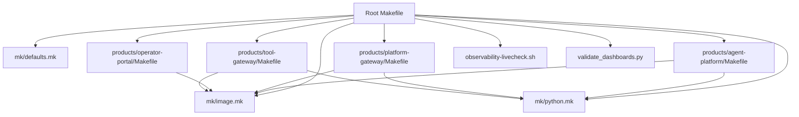
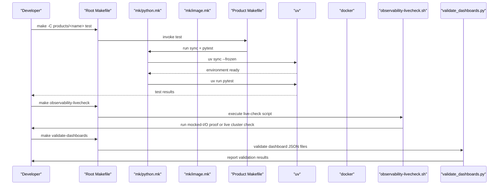
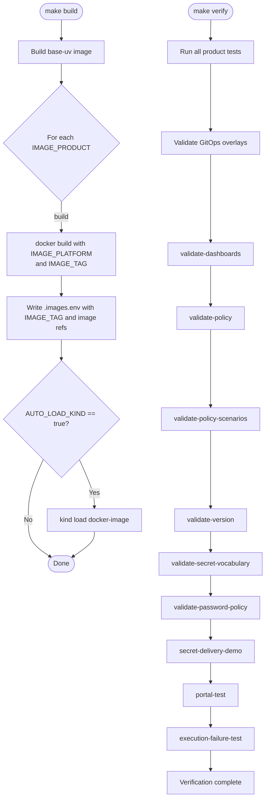
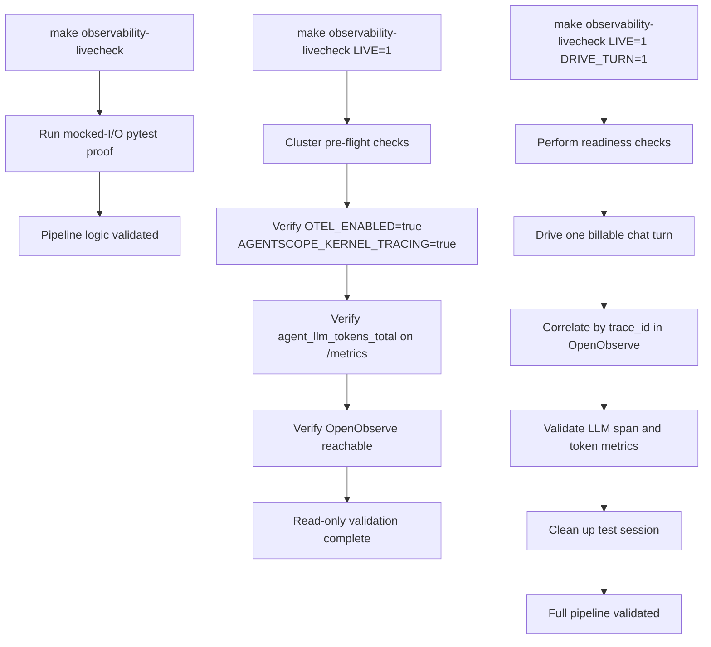
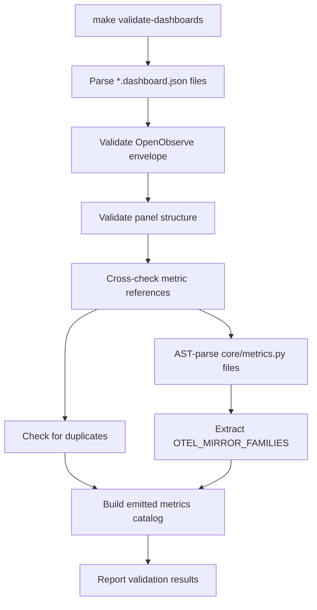
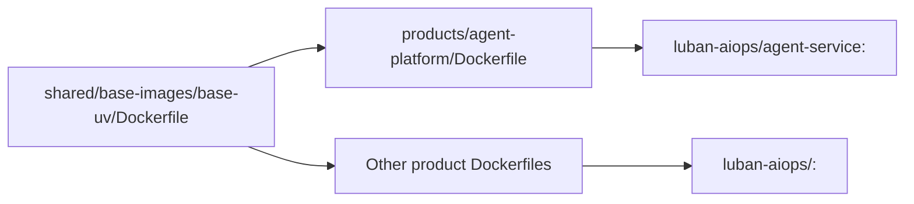
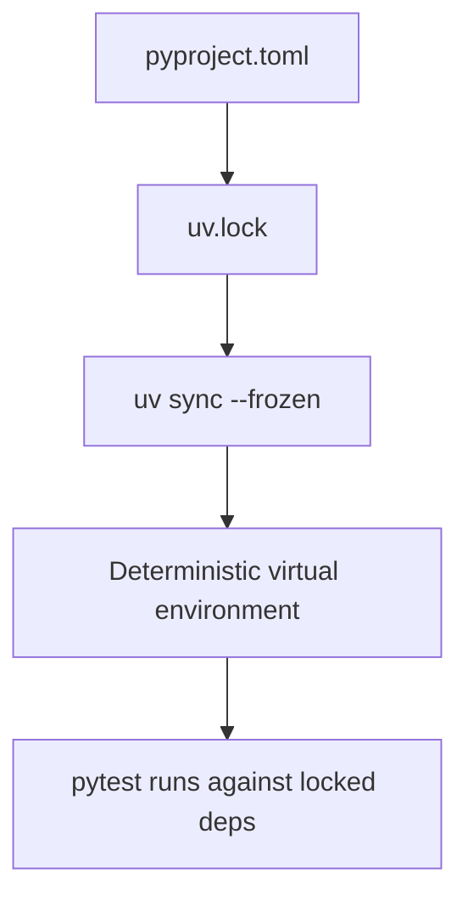
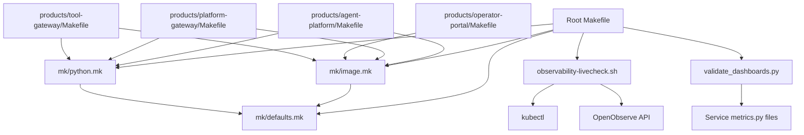

Based on my analysis of the codebase, I can now update the documentation to reflect the new make targets for observability-livecheck and validate-dashboards. Here's the updated documentation:

<cite>
**Referenced Files in This Document**
- [Makefile](file://Makefile)
- [defaults.mk](file://mk/defaults.mk)
- [python.mk](file://mk/python.mk)
- [image.mk](file://mk/image.mk)
- [agent-platform Makefile](file://products/agent-platform/Makefile)
- [platform-gateway Makefile](file://products/platform-gateway/Makefile)
- [operator-portal Makefile](file://products/operator-portal/Makefile)
- [tool-gateway Makefile](file://products/tool-gateway/Makefile)
- [agent-platform Dockerfile](file://products/agent-platform/Dockerfile)
- [base-uv Dockerfile](file://shared/base-images/base-uv/Dockerfile)
- [agent-platform pyproject.toml](file://products/agent-platform/pyproject.toml)
- [README.md](file://README.md)
- [observability-livecheck.sh](file://shared/platform-ops/e2e/observability-livecheck.sh)
- [test_observability_livecheck.py](file://products/agent-platform/tests/test_observability_livecheck.py)
- [validate_dashboards.py](file://shared/platform-ops/dashboards/validate_dashboards.py)
- [luban-aiops-service-health.dashboard.json](file://shared/platform-ops/dashboards/luban-aiops-service-health.dashboard.json)
</cite>

## Update Summary
**Changes Made**
- Added documentation for the new `observability-livecheck` make target (SPEC-065 R-4)
- Added documentation for the new `validate-dashboards` make target (SPEC-065 R-3)
- Updated the verify target section to include both new validation gates
- Enhanced the e2e test suite documentation to include observability livecheck
- Added detailed sections explaining the observability pipeline validation and dashboard configuration-as-code validation

## Table of Contents
1. Introduction
2. Project Structure
3. Core Components
4. Architecture Overview
5. Detailed Component Analysis
6. Dependency Analysis
7. Performance Considerations
8. Troubleshooting Guide
9. Conclusion
10. Appendices

## Introduction
This document explains the build system and Makefile orchestration for the repository. It covers how the root Makefile coordinates builds across all products, how the modular mk/ fragments standardize Python and container image builds, and how each product Makefile exposes consistent targets (build, test, lint, clean). It also documents dependency management with uv, lock-file usage for reproducible builds, caching strategies, parallel execution options, environment variable configuration, common workflows, custom target creation, troubleshooting, and the relationship between Make targets and CI/CD pipeline stages.

The build system now includes comprehensive observability validation through two new make targets: `observability-livecheck` for end-to-end observability pipeline verification and `validate-dashboards` for offline dashboard configuration validation.

## Project Structure
The workspace is organized around a root Makefile that delegates to per-product Makefiles under products/. Shared build logic lives in mk/, including defaults for configuration, Python tooling, and Docker image building. Each product typically includes both mk/image.mk and mk/python.mk, setting IMAGE_NAME to define its container image name. The operator-portal is a non-Python SPA served by nginx and only uses mk/image.mk with a wider build context.

**Diagram sources**
- [Makefile:1-281](file://Makefile#L1-L281)
- [defaults.mk:1-53](file://mk/defaults.mk#L1-L53)
- [image.mk:1-58](file://mk/image.mk#L1-L58)
- [python.mk:1-20](file://mk/python.mk#L1-L20)
- [agent-platform Makefile:1-10](file://products/agent-platform/Makefile#L1-L10)
- [platform-gateway Makefile:1-10](file://products/platform-gateway/Makefile#L1-L10)
- [operator-portal Makefile:1-14](file://products/operator-portal/Makefile#L1-L14)
- [tool-gateway Makefile:1-10](file://products/tool-gateway/Makefile#L1-L10)
- [observability-livecheck.sh:1-224](file://shared/platform-ops/e2e/observability-livecheck.sh#L1-L224)
- [validate_dashboards.py:1-355](file://shared/platform-ops/dashboards/validate_dashboards.py#L1-L355)

**Section sources**
- [Makefile:1-281](file://Makefile#L1-L281)
- [README.md:15-65](file://README.md#L15-L65)

## Core Components
- Root Makefile: Orchestrates cross-cutting tasks (sync, test, lint, base-images, build, push, overlays, verify, deploy), computes coordinated image tags, writes build state for deployment, and delegates per-product work. Now includes observability validation targets.
- mk/defaults.mk: Single source of truth for overridable build settings such as IMAGE_PLATFORM, IMAGE_TAG_PREFIX, REGISTRY, AUTO_LOAD_KIND, KIND_CLUSTER_NAME, and base image versions.
- mk/python.mk: Provides sync and test targets using uv with frozen lock files and disables telemetry exporters during tests to keep output clean.
- mk/image.mk: Provides help, build, push, and lint targets for Docker images; resolves IMAGE_REF based on REGISTRY; supports custom contexts and Dockerfiles.
- Product Makefiles: Minimal files that set IMAGE_NAME and include shared fragments. Operator-portal overrides IMAGE_CONTEXT and IMAGE_DOCKERFILE due to a multi-stage build requiring repo-wide assets.

Key responsibilities:
- Reproducible Python environments via uv sync --frozen against per-product uv.lock.
- Coordinated image tagging and optional kind loading.
- Policy validation and overlay rendering as part of verification.
- **New**: Observability pipeline validation through `observability-livecheck` target.
- **New**: Dashboard configuration-as-code validation through `validate-dashboards` target.

**Section sources**
- [Makefile:14-46](file://Makefile#L14-L46)
- [Makefile:77-124](file://Makefile#L77-L124)
- [Makefile:194-209](file://Makefile#L194-L209)
- [defaults.mk:15-52](file://mk/defaults.mk#L15-L52)
- [python.mk:7-19](file://mk/python.mk#L7-L19)
- [image.mk:18-58](file://mk/image.mk#L18-L58)
- [agent-platform Makefile:1-10](file://products/agent-platform/Makefile#L1-L10)
- [platform-gateway Makefile:1-10](file://products/platform-gateway/Makefile#L1-L10)
- [operator-portal Makefile:1-14](file://products/operator-portal/Makefile#L1-L14)
- [tool-gateway Makefile:1-10](file://products/tool-gateway/Makefile#L1-L10)

## Architecture Overview
The build architecture separates concerns into three layers:
- Orchestration layer (root Makefile): Defines global variables, computes tags, and dispatches per-product tasks.
- Shared fragment layer (mk/): Encapsulates reusable targets for Python and Docker images.
- Product layer (products/*/Makefile): Declares product-specific metadata (IMAGE_NAME) and optionally overrides context or Dockerfile path.

**Diagram sources**
- [Makefile:77-99](file://Makefile#L77-L99)
- [Makefile:194-209](file://Makefile#L194-L209)
- [python.mk:11-19](file://mk/python.mk#L11-L19)
- [image.mk:38-48](file://mk/image.mk#L38-L48)
- [agent-platform Makefile:1-10](file://products/agent-platform/Makefile#L1-L10)
- [observability-livecheck.sh:33-43](file://shared/platform-ops/e2e/observability-livecheck.sh#L33-L43)
- [validate_dashboards.py:27-31](file://shared/platform-ops/dashboards/validate_dashboards.py#L27-L31)

## Detailed Component Analysis

### Root Makefile
Responsibilities:
- Enumerates Python and image products.
- Computes a coordinated IMAGE_TAG from VERSION, prefix, profile, git SHA, and dirty status.
- Delegates sync, test, lint to per-product Makefiles.
- Builds shared base image and then all product images with coordinated tag.
- Writes .images.env for downstream deploy scripts.
- Optionally loads images into a local kind cluster.
- Validates GitOps overlays, policy bundles, scenarios, version lockstep, and secret vocabulary.
- **New**: Validates OpenObserve dashboards through `validate-dashboards` target.
- **New**: Runs observability live-check through `observability-livecheck` target.
- Provides deploy, deploy-samples, undeploy-samples, e2e, and clean.

**Diagram sources**
- [Makefile:89-124](file://Makefile#L89-L124)
- [Makefile:194-233](file://Makefile#L194-L233)

**Section sources**
- [Makefile:14-46](file://Makefile#L14-L46)
- [Makefile:48-64](file://Makefile#L48-L64)
- [Makefile:77-124](file://Makefile#L77-L124)
- [Makefile:130-168](file://Makefile#L130-L168)
- [Makefile:171-211](file://Makefile#L171-L211)
- [Makefile:194-209](file://Makefile#L194-L209)
- [Makefile:232-233](file://Makefile#L232-L233)

### mk/defaults.mk
Defines overridable defaults used by root and fragments:
- IMAGE_PLATFORM: Target platform for docker build.
- IMAGE_TAG_PREFIX and IMAGE_TAG_PROFILE: Used to compose coordinated tags.
- REGISTRY: Optional registry re-tag/push target.
- AUTO_LOAD_KIND and KIND_CLUSTER_NAME: Local kind integration flags.
- BASE_UV_IMAGE, BASE_UV_TAG, BASE_UV_UV_VERSION, BASE_UV_PYTHON_VERSION: Pinned base image parameters.

These use ?= so command-line overrides always win.

**Section sources**
- [defaults.mk:1-52](file://mk/defaults.mk#L1-L52)

### mk/python.mk
Provides:
- sync: Install dependencies using uv sync --frozen against the product's uv.lock.
- test: Ensure environment is synced, then run pytest with OTLP exporters disabled to avoid noisy logs while keeping tracing SDK active.

This ensures deterministic, reproducible environments per product.

**Section sources**
- [python.mk:1-19](file://mk/python.mk#L1-L19)

### mk/image.mk
Provides:
- help: Lists available targets for the product.
- build: Runs docker build with IMAGE_PLATFORM, IMAGE_DOCKERFILE, and IMAGE_CONTEXT; tags as luban-aiops/<IMAGE_NAME>:<IMAGE_TAG>. If REGISTRY is set, also creates a tagged reference to REGISTRY/luban-aiops/<IMAGE_NAME>:<IMAGE_TAG>.
- push: Pushes the image (with optional re-tag if REGISTRY is set).
- lint: Lints Dockerfile using hadolint if available; otherwise runs hadolint via docker; otherwise skips.

Resolves IMAGE_REF based on whether REGISTRY is set.

**Section sources**
- [image.mk:18-58](file://mk/image.mk#L18-L58)

### Product Makefiles
Each product Makefile is intentionally minimal:
- agent-platform, platform-gateway, tool-gateway: Set IMAGE_NAME and include both mk/image.mk and mk/python.mk.
- operator-portal: Sets IMAGE_NAME, IMAGE_CONTEXT to the repo root, and IMAGE_DOCKERFILE to the root Dockerfile because it needs repo-wide assets (VERSION file and web-ui/app).

This pattern keeps product Makefiles declarative and reusable.

**Section sources**
- [agent-platform Makefile:1-10](file://products/agent-platform/Makefile#L1-L10)
- [platform-gateway Makefile:1-10](file://products/platform-gateway/Makefile#L1-L10)
- [tool-gateway Makefile:1-10](file://products/tool-gateway/Makefile#L1-L10)
- [operator-portal Makefile:1-14](file://products/operator-portal/Makefile#L1-L14)

### Observability Live-Check Target (SPEC-065 R-4)
**New** The `observability-livecheck` target provides comprehensive observability pipeline validation with multiple modes:

- **Default mode (--local)**: Runs mocked-I/O pytest proof of the pipeline logic without cluster, network, or paid calls. This is integrated into the ordinary test suite and cannot be skipped silently.
- **Read-only mode (--live)**: Performs read-only cluster pre-flight checks, verifying that the agent pod runs OTEL_ENABLED=true and AGENTSCOPE_KERNEL_TRACING=true, that agent_llm_tokens_total is registered on /metrics, and that OpenObserve is reachable. No model calls are made.
- **Gated billable mode (--live with LUBAN_OBS_DRIVE_PAID_TURN=1)**: Drives one read-only chat turn against an external provider, correlates it in OpenObserve by trace_id, and validates the complete observability pipeline.

The implementation consists of:
- A shell script (`observability-livecheck.sh`) that orchestrates the validation flow
- A comprehensive Python test suite (`test_observability_livecheck.py`) that mocks all external dependencies
- Integration with the e2e test suite for automated validation

**Diagram sources**
- [Makefile:202-209](file://Makefile#L202-L209)
- [observability-livecheck.sh:3-43](file://shared/platform-ops/e2e/observability-livecheck.sh#L3-L43)
- [test_observability_livecheck.py:1-160](file://products/agent-platform/tests/test_observability_livecheck.py#L1-L160)

**Section sources**
- [Makefile:202-209](file://Makefile#L202-L209)
- [observability-livecheck.sh:1-224](file://shared/platform-ops/e2e/observability-livecheck.sh#L1-L224)
- [test_observability_livecheck.py:1-160](file://products/agent-platform/tests/test_observability_livecheck.py#L1-L160)

### Dashboard Validation Target (SPEC-065 R-3)
**New** The `validate-dashboards` target provides offline validation for OpenObserve dashboard configuration-as-code. This is the config-as-code analog of kustomize build for GitOps overlays and never touches a cluster or network.

The validation script (`validate_dashboards.py`) performs comprehensive checks:
- **JSON Schema Validation**: Ensures dashboard files parse as valid JSON and contain required OpenObserve envelope fields (version, dashboardId, title, tabs[], variables, defaultDatetimeDuration)
- **Panel Validation**: Validates panel structure, types, queries, and layout configurations
- **Metric Reference Validation**: Cross-checks all metric references against actual OTel-mirror families emitted by services, preventing silent rot when metrics are renamed
- **Uniqueness Validation**: Ensures no duplicate dashboardId or title values across dashboard files

The validation processes three main dashboard categories:
- Service Health dashboards (RED metrics)
- Governance dashboards  
- LLM Token cost dashboards

**Diagram sources**
- [Makefile:194-200](file://Makefile#L194-L200)
- [validate_dashboards.py:1-355](file://shared/platform-ops/dashboards/validate_dashboards.py#L1-L355)

**Section sources**
- [Makefile:194-200](file://Makefile#L194-L200)
- [validate_dashboards.py:1-355](file://shared/platform-ops/dashboards/validate_dashboards.py#L1-L355)

### Docker Images and Base Image Strategy
- Products depend on a shared base image built from shared/base-images/base-uv/Dockerfile.
- The base image installs a pinned uv version, sets up a non-root app user, and configures uv environment variables for deterministic interpreter resolution and linking behavior.
- Product Dockerfiles copy project metadata and source, then run uv sync --frozen --no-dev to install runtime dependencies deterministically.

**Diagram sources**
- [base-uv Dockerfile:1-40](file://shared/base-images/base-uv/Dockerfile#L1-L40)
- [agent-platform Dockerfile:1-13](file://products/agent-platform/Dockerfile#L1-L13)

**Section sources**
- [base-uv Dockerfile:1-40](file://shared/base-images/base-uv/Dockerfile#L1-L40)
- [agent-platform Dockerfile:1-13](file://products/agent-platform/Dockerfile#L1-L13)

### Python Dependencies and Lock Files
- Each Python product has a pyproject.toml and a uv.lock.
- The root README states that backend services standardize on uv for environment and package management and pin interpreter versions via .python-version.
- mk/python.mk enforces frozen installs and tests against the locked environment.

**Diagram sources**
- [agent-platform pyproject.toml:1-38](file://products/agent-platform/pyproject.toml#L1-L38)
- [python.mk:11-19](file://mk/python.mk#L11-L19)

**Section sources**
- [README.md:76-82](file://README.md#L76-L82)
- [agent-platform pyproject.toml:1-38](file://products/agent-platform/pyproject.toml#L1-L38)
- [python.mk:11-19](file://mk/python.mk#L11-L19)

## Dependency Analysis
- Coupling:
  - Root Makefile depends on mk/defaults.mk and enumerates products to delegate tasks.
  - Product Makefiles depend on mk/image.mk and mk/python.mk.
  - Dockerfiles depend on the shared base image.
  - **New**: Observability livecheck depends on kubectl, OpenObserve API, and service endpoints.
  - **New**: Dashboard validation depends on Python AST parsing and service metrics definitions.
- Cohesion:
  - mk/ modules encapsulate language- and tool-specific logic, improving reuse and reducing duplication.
- External dependencies:
  - docker, uv, kustomize, kind (optional), hadolint (optional).
  - **New**: kubectl, OpenObserve API access for live checks.

**Diagram sources**
- [Makefile:14-46](file://Makefile#L14-L46)
- [Makefile:194-209](file://Makefile#L194-L209)
- [defaults.mk:15-52](file://mk/defaults.mk#L15-L52)
- [python.mk:1-19](file://mk/python.mk#L1-L19)
- [image.mk:18-58](file://mk/image.mk#L18-L58)
- [agent-platform Makefile:1-10](file://products/agent-platform/Makefile#L1-L10)
- [platform-gateway Makefile:1-10](file://products/platform-gateway/Makefile#L1-L10)
- [operator-portal Makefile:1-14](file://products/operator-portal/Makefile#L1-L14)
- [tool-gateway Makefile:1-10](file://products/tool-gateway/Makefile#L1-L10)
- [observability-livecheck.sh:88-94](file://shared/platform-ops/e2e/observability-livecheck.sh#L88-L94)
- [validate_dashboards.py:149-181](file://shared/platform-ops/dashboards/validate_dashboards.py#L149-L181)

**Section sources**
- [Makefile:14-46](file://Makefile#L14-L46)
- [Makefile:194-209](file://Makefile#L194-L209)
- [image.mk:18-58](file://mk/image.mk#L18-L58)
- [python.mk:1-19](file://mk/python.mk#L1-L19)

## Performance Considerations
- Parallelism:
  - GNU make supports parallel execution via -j. Use make -j$(nproc) at the root level to run independent product tasks concurrently where supported by the underlying commands.
- Caching:
  - Docker layer caching accelerates repeated builds when inputs change minimally.
  - uv sync --frozen caches resolved packages in the uv cache directory; ensure the cache is preserved across CI jobs for faster cold starts.
  - **New**: Dashboard validation is fast since it operates on local files without network calls.
  - **New**: Observability livecheck in --local mode is fast with mocked dependencies.
- Determinism:
  - Frozen installs and pinned base image versions reduce variability and rebuilds caused by upstream drift.
- I/O-bound steps:
  - Tests and Docker builds are often I/O bound; consider dedicated runners with fast disks and network access to improve throughput.
  - **New**: Live observability checks may be slow due to network latency and OpenObserve query performance.

## Troubleshooting Guide
Common issues and resolutions:
- Missing tools:
  - hadolint not installed: image.mk falls back to running hadolint via docker; if docker is unavailable, lint is skipped.
  - kustomize missing: overlays target will fail; install kustomize to render GitOps overlays.
  - kind missing or misconfigured: AUTO_LOAD_KIND requires KIND_CLUSTER_NAME to be set; otherwise build exits with an error.
  - **New**: kubectl missing or misconfigured: observability-livecheck requires kubectl access to the cluster.
- Registry authentication:
  - When REGISTRY is set, push may require login to the target registry.
- Version mismatches:
  - validate-version and validate-secret-vocabulary enforce lockstep across products; failures indicate drift between VERSION, product metadata, and contracts.
- Test noise:
  - If you see OTLP exporter retries in test output, ensure OTEL_*_EXPORTER=none is set; mk/python.mk already sets these for tests.
- **New**: Observability livecheck failures:
  - Ensure OTEL_ENABLED=true and AGENTSCOPE_KERNEL_TRACING=true are set on the agent deployment.
  - Verify OpenObserve credentials (OO_ROOT_USER_EMAIL, OO_ROOT_USER_PASSWORD) are properly configured.
  - Check that port-forwards are established for OpenObserve (5080), platform-gateway (18083), and identity-service (18081).
- **New**: Dashboard validation failures:
  - Ensure dashboard JSON files have valid OpenObserve envelope structure.
  - Verify all metric references correspond to actual OTEL_MIRROR_FAMILIES defined in service metrics.py files.
  - Check for duplicate dashboardId or title values across dashboard files.

**Section sources**
- [image.mk:50-58](file://mk/image.mk#L50-L58)
- [Makefile:110-124](file://Makefile#L110-L124)
- [Makefile:171-176](file://Makefile#L171-L176)
- [Makefile:161-168](file://Makefile#L161-L168)
- [python.mk:14-19](file://mk/python.mk#L14-L19)
- [observability-livecheck.sh:19-29](file://shared/platform-ops/e2e/observability-livecheck.sh#L19-L29)
- [validate_dashboards.py:7-31](file://shared/platform-ops/dashboards/validate_dashboards.py#L7-L31)

## Conclusion
The build system centers on a root Makefile that orchestrates consistent, reproducible builds across multiple products using shared mk/ fragments. Python environments are managed with uv and frozen lock files, while Docker images are built with a shared base image and coordinated tagging. Cross-cutting validations (overlays, policies, versions, vocabulary) are integrated into the verification gate, enabling reliable local development and CI pipelines.

**Enhanced** with comprehensive observability validation through two new make targets: `observability-livecheck` provides end-to-end pipeline verification with multiple operational modes, while `validate-dashboards` ensures dashboard configuration-as-code integrity through offline validation. These additions strengthen the quality assurance pipeline by catching observability issues early and preventing dashboard configuration drift.

## Appendices

### Environment Variables Reference
- IMAGE_PLATFORM: Target platform for docker build (default linux/amd64).
- IMAGE_TAG_PREFIX / IMAGE_TAG_PROFILE: Compose coordinated image tags.
- REGISTRY: Optional registry prefix for re-tagging and pushing images.
- AUTO_LOAD_KIND / KIND_CLUSTER_NAME: Enable automatic loading of built images into a local kind cluster.
- BASE_UV_IMAGE / BASE_UV_TAG / BASE_UV_UV_VERSION / BASE_UV_PYTHON_VERSION: Configure the shared base image.
- NAMESPACE: Namespace used by sample deployment helpers.
- **New**: LUBAN_OBS_DRIVE_PAID_TURN: Gate the billable observability live-check leg.
- **New**: OO_ROOT_USER_EMAIL / OO_ROOT_USER_PASSWORD: OpenObserve API credentials for live checks.
- **New**: GATEWAY_URL / IDENTITY_URL / OO_ENDPOINT: Service endpoints for observability live-check.

**Section sources**
- [defaults.mk:20-52](file://mk/defaults.mk#L20-L52)
- [Makefile:29-46](file://Makefile#L29-L46)
- [observability-livecheck.sh:67-73](file://shared/platform-ops/e2e/observability-livecheck.sh#L67-L73)

### Common Workflows
- Sync dependencies for all Python products:
  - make sync
- Run all product tests:
  - make test
- Lint all product Dockerfiles:
  - make lint
- Build shared base image and all product images with coordinated tag:
  - make build
- Push images to a registry:
  - make push REGISTRY=<your-registry>
- **New**: Validate OpenObserve dashboards:
  - make validate-dashboards
- **New**: Run observability live-check (mocked):
  - make observability-livecheck
- **New**: Run observability live-check (read-only cluster):
  - make observability-livecheck LIVE=1
- **New**: Run observability live-check (gated billable turn):
  - make observability-livecheck LIVE=1 DRIVE_TURN=1
- Verify everything (tests, overlays, policies, scenarios, versions, vocabulary, dashboards):
  - make verify
- Deploy dev-k8s overlay:
  - make deploy
- Run end-to-end demos (includes observability livecheck):
  - make e2e

**Section sources**
- [Makefile:77-124](file://Makefile#L77-L124)
- [Makefile:194-209](file://Makefile#L194-L209)
- [Makefile:232-233](file://Makefile#L232-L233)
- [Makefile:261-274](file://Makefile#L261-L274)

### Custom Target Creation
To add a new per-product target:
- Define the target in the product Makefile or extend mk/python.mk/mk/image.mk if it applies broadly.
- Add a corresponding entry in the root Makefile if you want it aggregated at the workspace level.
- Use the existing patterns: set variables early, include shared fragments, and rely on defaults.mk for configuration.

**New**: For observability-related targets:
- Follow the pattern established by `observability-livecheck` with clear mode differentiation (--local vs --live).
- Include comprehensive testing with mocked dependencies for reliability.
- Integrate with the e2e test suite for automated validation.

[No sources needed since this section provides general guidance]

### Relationship Between Make Targets and CI/CD Stages
Typical CI stages map to Make targets:
- Setup: Install tools (docker, uv, kustomize, hadolint, kubectl).
- Lint: make lint (Dockerfile linting).
- Test: make test (product test suites).
- **New**: Dashboard Validation: make validate-dashboards (offline dashboard validation).
- **New**: Observability Validation: make observability-livecheck (mocked pipeline validation).
- Verify: make verify (full pre-commit/pre-push gate including all new validations).
- Build: make build (coordinated image builds and optional kind load).
- Push: make push (publish images to registry).
- Deploy: make deploy (apply dev-k8s overlay).
- E2E: make e2e (run demo scripts including observability livecheck against deployed cluster).

**Section sources**
- [Makefile:77-124](file://Makefile#L77-L124)
- [Makefile:194-209](file://Makefile#L194-L209)
- [Makefile:232-233](file://Makefile#L232-L233)
- [Makefile:261-274](file://Makefile#L261-L274)
- [README.md:89-92](file://README.md#L89-L92)