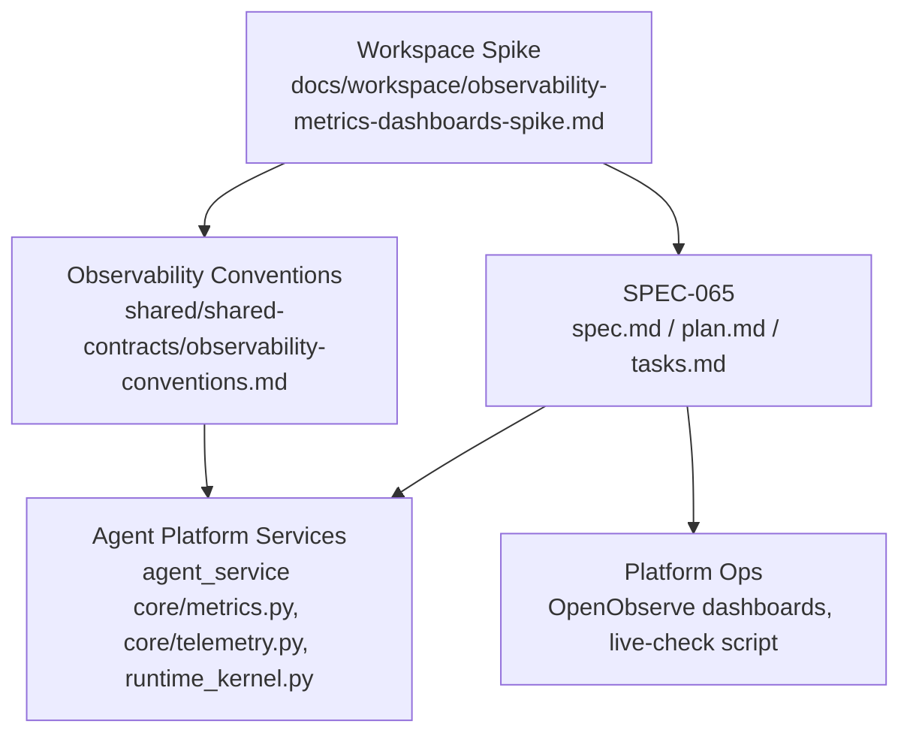
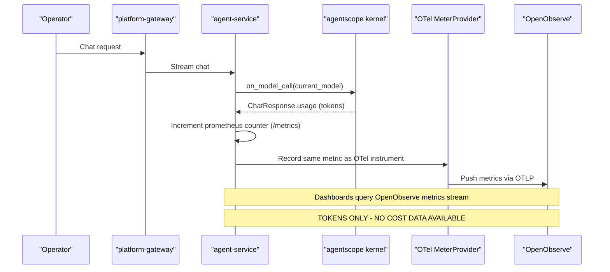
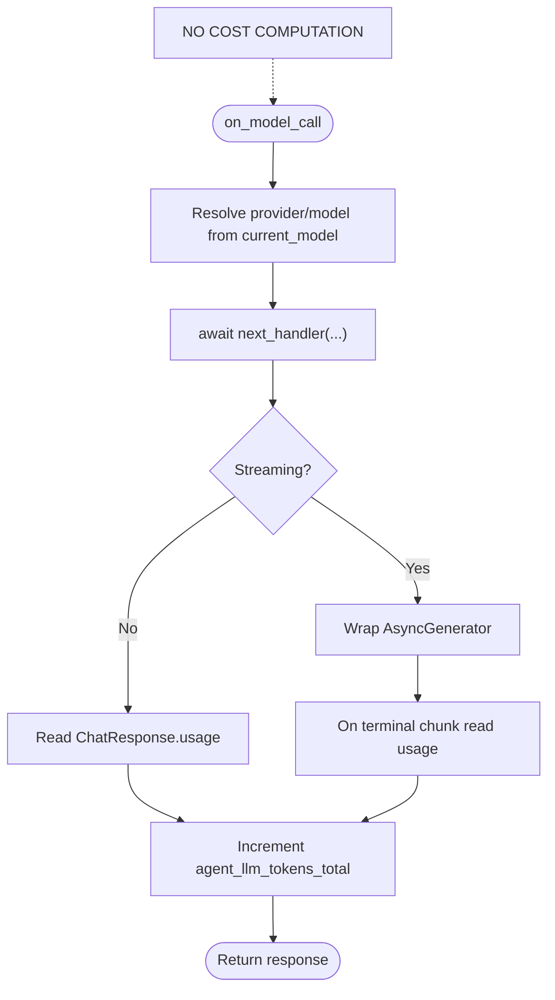
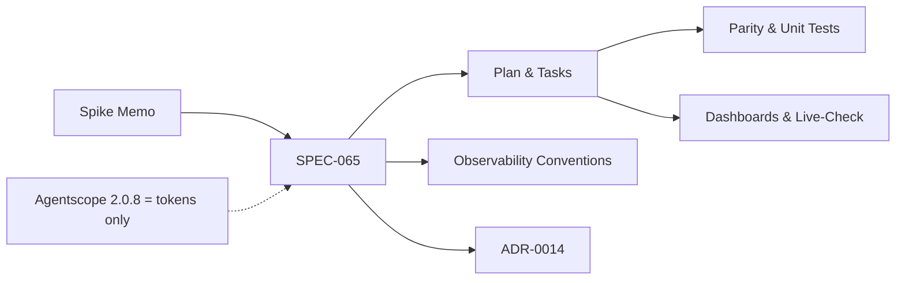

# Observability Metrics and Dashboards Spike Assessment

<cite>
**Referenced Files in This Document**
- [observability-metrics-dashboards-spike.md](file://docs/workspace/observability-metrics-dashboards-spike.md)
- [observability-conventions.md](file://shared/shared-contracts/observability-conventions.md)
- [SPEC-065 spec.md](file://docs/specs/SPEC-065-r5-observability-token-cost-dashboards/spec.md)
- [SPEC-065 plan.md](file://docs/specs/SPEC-065-r5-observability-token-cost-dashboards/plan.md)
- [SPEC-065 tasks.md](file://docs/specs/SPEC-065-r5-observability-token-cost-dashboards/tasks.md)
- [ADR-0014](file://docs/adr/0014-domain-metrics-via-otel-push.md)
- [README.md](file://README.md)
</cite>

## Update Summary
**Changes Made**
- Added prominent correction banner at document start flagging all superseded cost-related claims
- Updated Introduction section to emphasize tokens-only scope with cost deferred
- Revised Core Components section to remove any implication of cost data availability
- Updated Architecture Overview to clarify token-only metric emission
- Enhanced Detailed Component Analysis sections with correction markers for cost references
- Updated Dependency Analysis to reflect the corrected understanding of agentscope 2.0.8 capabilities
- Modified Performance Considerations to focus on token-only metrics
- Updated Troubleshooting Guide to address token-only expectations
- Revised Conclusion to emphasize the corrected scope
- Updated Appendices to clearly separate token findings from deferred cost work

## Table of Contents
1. [Introduction](#introduction)
2. [Project Structure](#project-structure)
3. [Core Components](#core-components)
4. [Architecture Overview](#architecture-overview)
5. [Detailed Component Analysis](#detailed-component-analysis)
6. [Dependency Analysis](#dependency-analysis)
7. [Performance Considerations](#performance-considerations)
8. [Troubleshooting Guide](#troubleshooting-guide)
9. [Conclusion](#conclusion)
10. [Appendices](#appendices)

## Introduction

> **⚠️ CRITICAL CORRECTION (2026-09-27):** All cost-related claims in this assessment are **superseded**. Agentscope 2.0.8 **does not expose provider-derived dollar cost data** (`gen_ai.usage.cost*` attributes do not exist). R-1 ships **tokens-only** (`agent_llm_tokens_total{provider,model,direction}`); dollar-cost metrics are **deferred** to a follow-up that would add an explicit, reviewed price table. Any reference to cost computation, dollar values, or cost dashboards in this document is incorrect and must be treated as such.

This document assesses the observability metrics and dashboards spike for the Agentic AIOps platform, focusing on whether **token consumption by model** is observable (not cost), what gaps remain between metric emission and dashboard visibility, and how to close them without breaking existing contracts. The assessment is grounded in a live inspection of the running dev cluster, the repository's observability conventions, and the resulting SPEC-065 that formalizes the R5 observability deliverable.

Key takeaways:
- OpenObserve OTLP ingestion is already live and working across all seven Python services; no re-plumbing is needed.
- **Token-by-model usage** reaches OpenObserve as per-span GenAI attributes but is not aggregated into a dashboard-visible metric.
- Domain metrics exist on `/metrics` but have no scraper or dashboard; the spike recommends additionally emitting domain metrics as OTel instruments so they push over the existing OTLP pipeline.
- SPEC-065 scopes the work into emission (**tokens-only**), push (OTel mirror), dashboards (config-as-code), a gated live-check, and living-doc updates.
- **Cost data is NOT available** in agentscope 2.0.8; dollar-cost metrics are deferred.

**Section sources**
- [observability-metrics-dashboards-spike.md:1-36](file://docs/workspace/observability-metrics-dashboards-spike.md#L1-L36)
- [observability-conventions.md:9-17](file://shared/shared-contracts/observability-conventions.md#L9-L17)
- [SPEC-065 spec.md:40-101](file://docs/specs/SPEC-065-r5-observability-token-cost-dashboards/spec.md#L40-L101)

## Project Structure
The observability slice touches documentation, shared contracts, and product code paths:
- Workspace spike memo defines the problem, evidence, and operator decisions (with cost corrections).
- Shared observability conventions define the two-surface contract (`/metrics` pull + OTLP push).
- SPEC-065 documents requirements, plan, tasks, and delivery gates (tokens-only scope).
- Product code paths referenced by the plan include agent-platform middleware registration, metrics modules, and telemetry setup.



**Diagram sources**
- [observability-metrics-dashboards-spike.md:1-36](file://docs/workspace/observability-metrics-dashboards-spike.md#L1-L36)
- [observability-conventions.md:9-17](file://shared/shared-contracts/observability-conventions.md#L9-L17)
- [SPEC-065 plan.md:9-31](file://docs/specs/SPEC-065-r5-observability-token-cost-dashboards/plan.md#L9-L31)

**Section sources**
- [README.md:15-54](file://README.md#L15-L54)
- [observability-metrics-dashboards-spike.md:63-108](file://docs/workspace/observability-metrics-dashboards-spike.md#L63-L108)

## Core Components
- Token usage capture point: `MiddlewareBase.on_model_call` in agentscope kernel, used by tracing and intended for a new `TokenUsageMiddleware`.
- Metric surfaces:
  - Pull surface: `prometheus_client` `/metrics` with RED and domain counters; currently no token family.
  - Push surface: OTLP HTTP to OpenObserve; auto-instrumentation HTTP metrics are present; domain counters are not pushed yet.
- Consumer gap: No Prometheus/Grafana scraper; dashboards do not exist; domain counters are curl-only today.
- Decision: Emit domain metrics as OTel instruments to reuse the proven OTLP pipeline (ADR-0014).
- **Scope limitation:** Only **tokens** are emitted; **no cost data** is available from agentscope 2.0.8.

**Section sources**
- [observability-metrics-dashboards-spike.md:110-174](file://docs/workspace/observability-metrics-dashboards-spike.md#L110-L174)
- [ADR-0014:22-65](file://docs/adr/0014-domain-metrics-via-otel-push.md#L22-L65)
- [SPEC-065 spec.md:108-197](file://docs/specs/SPEC-065-r5-observability-token-cost-dashboards/spec.md#L108-L197)

## Architecture Overview
The spike confirms an end-to-end OTLP push path from services to OpenObserve. The gap is that domain metrics (including the future token counter) are not pushed as OTel instruments and therefore do not appear in dashboards.



**Diagram sources**
- [SPEC-065 plan.md:33-78](file://docs/specs/SPEC-065-r5-observability-token-cost-dashboards/plan.md#L33-L78)
- [ADR-0014:45-65](file://docs/adr/0014-domain-metrics-via-otel-push.md#L45-L65)

## Detailed Component Analysis

### Token Usage Middleware (Slice A)
- Capture hook: `on_model_call`, reading `current_model` and `result.usage`.
- Streaming awareness: wrap `AsyncGenerator` to read terminal chunk usage; otherwise non-streaming responses increment immediately.
- Labels: bounded `{provider,model,direction}`; no high-cardinality labels like session/user/request IDs.
- Registration: always-on in `runtime_kernel._build_middlewares()` beside existing middlewares.
- Counter name: `agent_llm_tokens_total{provider,model,direction}` per naming conventions.
- **Scope:** Tokens only - no cost computation.



**Diagram sources**
- [SPEC-065 plan.md:33-53](file://docs/specs/SPEC-065-r5-observability-token-cost-dashboards/plan.md#L33-L53)
- [SPEC-065 tasks.md:35-63](file://docs/specs/SPEC-065-r5-observability-token-cost-dashboards/tasks.md#L35-L63)

**Section sources**
- [observability-metrics-dashboards-spike.md:176-226](file://docs/workspace/observability-metrics-dashboards-spike.md#L176-L226)
- [SPEC-065 spec.md:108-158](file://docs/specs/SPEC-065-r5-observability-token-cost-dashboards/spec.md#L108-L158)

### Domain Metrics Push (Slice B)
- Mirror helper in canonical `core/telemetry.py`, replicated byte-identically across eight services under parity guard.
- When `OTEL_ENABLED=true`, creates OTel instruments matching the `prometheus_client` families and records into both surfaces from existing call sites.
- Fail-open: exporter errors never raise into the request path; when `OTEL_ENABLED=false`, no instrument is created and `/metrics` remains unchanged.
- Mirrored families include the new token/cost family plus selected domain counters and RED metrics.
- **Important:** Only token family is mirrored; cost family is deferred.

```mermaid
classDiagram
class TelemetryHelper {
+create_instruments(families)
+record(name, value, labels)
}
class MetricsModule {
+prometheus_counter
+record_*()
}
class MeterProvider {
+PeriodicExportingMetricReader
+OTLPMetricExporter
}
MetricsModule --> TelemetryHelper : "calls when OTEL_ENABLED"
TelemetryHelper --> MeterProvider : "uses existing provider"
Note[Only token family mirrored] -.-> MetricsModule
```

**Diagram sources**
- [SPEC-065 plan.md:54-78](file://docs/specs/SPEC-065-r5-observability-token-cost-dashboards/plan.md#L54-L78)
- [SPEC-065 tasks.md:64-82](file://docs/specs/SPEC-065-r5-observability-token-cost-dashboards/tasks.md#L64-L82)

**Section sources**
- [ADR-0014:45-107](file://docs/adr/0014-domain-metrics-via-otel-push.md#L45-L107)
- [SPEC-065 spec.md:160-197](file://docs/specs/SPEC-065-r5-observability-token-cost-dashboards/spec.md#L160-L197)

### Dashboards and Live-Check
- Dashboards as config-as-code under platform-ops, querying OpenObserve metrics stream.
- Gated live-check reproduces the spike procedure, including one authorized paid chat turn against external deepseek, asserting metrics and traces correlated by trace_id.
- **Dashboard scope:** Token consumption panels only; cost panels deferred.

```mermaid
sequenceDiagram
participant Dev as "Developer"
participant Script as "Live-check script"
participant Cluster as "Dev cluster"
participant Observe as "OpenObserve"
Dev->>Script : Run gated live-check
Script->>Cluster : Assert OTEL_ENABLED, AGENTSCOPE_KERNEL_TRACING
Script->>Cluster : Drive one read-only chat turn
Script->>Cluster : Inspect /metrics for token counter
Script->>Observe : Port-forward and query metrics/traces by trace_id
Script-->>Dev : Pass/Fail report
Note[Token-only verification] -.-> Script
```

**Diagram sources**
- [SPEC-065 plan.md:182-193](file://docs/specs/SPEC-065-r5-observability-token-cost-dashboards/plan.md#L182-L193)
- [SPEC-065 tasks.md:95-108](file://docs/specs/SPEC-065-r5-observability-token-cost-dashboards/tasks.md#L95-L108)

**Section sources**
- [SPEC-065 spec.md:199-248](file://docs/specs/SPEC-065-r5-observability-token-cost-dashboards/spec.md#L199-L248)

## Dependency Analysis
- Spike memo depends on live cluster inspection and agentscope source reads to establish the state of **token** data in traces vs metrics.
- SPEC-065 depends on:
  - Observability conventions for two-surface contract and naming rules.
  - ADR-0014 for the decision to use OTel-instrument push instead of a Prometheus scraper.
  - Agent platform middleware hooks established by prior specs (SPEC-018) and tracing middleware precedent.
- Implementation tasks depend on parity-guarded telemetry module replication and test suites ensuring no drift.
- **Critical dependency:** Understanding that agentscope 2.0.8 provides **no cost data**, only token counts.



**Diagram sources**
- [observability-metrics-dashboards-spike.md:1-36](file://docs/workspace/observability-metrics-dashboards-spike.md#L1-L36)
- [SPEC-065 spec.md:19-26](file://docs/specs/SPEC-065-r5-observability-token-cost-dashboards/spec.md#L19-L26)
- [ADR-0014:22-65](file://docs/adr/0014-domain-metrics-via-otel-push.md#L22-L65)

**Section sources**
- [SPEC-065 plan.md:204-215](file://docs/specs/SPEC-065-r5-observability-token-cost-dashboards/plan.md#L204-L215)
- [SPEC-065 tasks.md:123-150](file://docs/specs/SPEC-065-r5-observability-token-cost-dashboards/tasks.md#L123-L150)

## Performance Considerations
- Double emission (Prometheus counter + OTel instrument) is accepted as a small overhead on an observation path; it preserves the always-on pull surface while enabling dashboard visibility through push.
- Streaming-aware recording avoids zero-count artifacts; terminal-chunk usage ensures accurate counts for streaming chat.
- Label cardinality is strictly bounded to catalog models and predefined direction enums; no per-session or per-user labels to prevent storage/query explosion.
- **Performance impact:** Only token counting adds overhead; no cost computation since cost data is unavailable.

## Troubleshooting Guide
Common issues and checks:
- If token metrics do not appear on `/metrics`, verify the middleware is registered unconditionally and that usage is present on responses; absence of usage should record nothing.
- If dashboards show no data, confirm `OTEL_ENABLED=true`, that the OTLP endpoint is reachable, and that the mirrored families are enumerated and called from each service's metrics module.
- If parity tests fail after edits, ensure the canonical `core/telemetry.py` helper is replicated byte-identically across services and that each service calls it with its own family list.
- For live-check failures, validate cluster configuration, port-forwards, and that the single read-only chat turn produces a trace_id correlating metrics and traces in OpenObserve.
- **Cost troubleshooting:** If expecting cost data, remember it is **not available** in agentscope 2.0.8; only token counts are provided.

**Section sources**
- [SPEC-065 tasks.md:64-82](file://docs/specs/SPEC-065-r5-observability-token-cost-dashboards/tasks.md#L64-L82)
- [SPEC-065 tasks.md:95-108](file://docs/specs/SPEC-065-r5-observability-token-cost-dashboards/tasks.md#L95-L108)

## Conclusion
The spike demonstrates that **token-by-model usage** already flows into OpenObserve as trace-span attributes, but there is no aggregated metric or dashboard to make it operator-answerable. SPEC-065 closes this gap by adding a bounded **token counter** via a supported middleware hook, mirroring domain metrics as OTel instruments, shipping OpenObserve dashboards as config-as-code, and gating verification with a repeatable live-check. 

**Critical correction:** The approach respects the two-surface contract, avoids new infrastructure, keeps label cardinality bounded, and operates within the confirmed scope of **tokens-only** — no cost data is fabricated or assumed. Dollar-cost metrics are deferred to a follow-up that would add an explicit, reviewed price table.

## Appendices

### Evidence Baseline and Live Verification
- Live inspection confirmed OTLP push is active across services and that logs, traces, and auto-instrumentation HTTP metrics land in OpenObserve.
- One authorized live chat turn produced a full distributed trace with GenAI span attributes, confirming **token** data availability at the span level.
- **Correction:** No cost data was found in the live verification; only token counts were present.

**Section sources**
- [observability-metrics-dashboards-spike.md:63-108](file://docs/workspace/observability-metrics-dashboards-spike.md#L63-L108)
- [observability-metrics-dashboards-spike.md:263-309](file://docs/workspace/observability-metrics-dashboards-spike.md#L263-L309)

### Operator Decisions and Scope
- Consumer path: OTel-instrument push, no scraper.
- First-spec scope: full R5 observability theme planned as separate tasks.
- Live leg: external deepseek provider for a paid call.
- **Cost correction:** tokens-only in this slice; cost deferred pending price table or provenance clarification.
- Middleware: always-on, pure observation.
- **Agentscope 2.0.8 capability:** Provides token counts only; no provider-derived cost data.

**Section sources**
- [observability-metrics-dashboards-spike.md:311-328](file://docs/workspace/observability-metrics-dashboards-spike.md#L311-L328)
- [SPEC-065 spec.md:320-338](file://docs/specs/SPEC-065-r5-observability-token-cost-dashboards/spec.md#L320-L338)