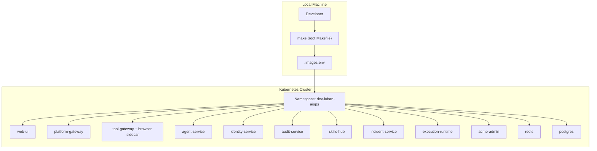
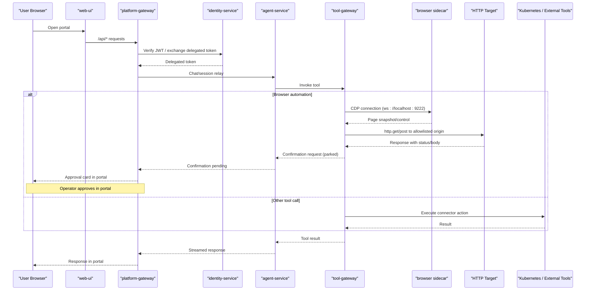

# Getting Started

<cite>
**Referenced Files in This Document**
- [README.md](file://README.md)
- [Makefile](file://Makefile)
- [VERSION](file://VERSION)
- [mk/image.mk](file://mk/image.mk)
- [getting-started.md](file://docs/guides/getting-started.md)
- [configuration-reference.md](file://docs/guides/configuration-reference.md)
- [troubleshooting.md](file://docs/guides/troubleshooting.md)
- [dev-k8s README.md](file://shared/platform-ops/gitops/dev-k8s/README.md)
- [deploy.sh](file://shared/platform-ops/gitops/dev-k8s/deploy.sh)
- [kustomization.yaml](file://shared/platform-ops/gitops/dev-k8s/kustomization.yaml)
- [tool-gateway-browser-sidecar.yaml](file://shared/platform-ops/gitops/runtime-profiles/browser-dev/tool-gateway-browser-sidecar.yaml)
- [sync-execution-signing-secret.sh](file://shared/platform-ops/gitops/sync-execution-signing-secret.sh)
- [sync-execution-handoff-secret.sh](file://shared/platform-ops/gitops/sync-execution-handoff-secret.sh)
- [sync-browser-credentials.sh](file://shared/platform-ops/gitops/sync-browser-credentials.sh)
- [sync-otel-secrets.sh](file://shared/platform-ops/gitops/sync-otel-secrets.sh)
- [audit-service runtime-secrets.example.env](file://shared/platform-ops/gitops/dev-k8s/base/audit-service/runtime-secrets.example.env)
- [identity-broker runtime-secrets.example.env](file://shared/platform-ops/gitops/dev-k8s/base/identity-broker/runtime-secrets.example.env)
- [pyproject.toml](file://products/agent-platform/pyproject.toml)
- [http_connector.py](file://products/tool-gateway/src/tool_gateway/tools/http_connector.py)
- [kernel_middleware.py](file://products/agent-platform/src/agent_service/services/kernel_middleware.py)
- [runtime-config.env](file://shared/platform-ops/gitops/dev-k8s/base/agent-platform/runtime-config.env)
- [egress-hardening release notes](file://docs/agentic-aiops-platform/release-notes/2026-09-20-post-web-checks-egress-hardening.md)
- [acme-admin README.md](file://samples/acme-admin/README.md)
- [acme-admin deploy.sh](file://samples/acme-admin/deploy.sh)
- [api.py](file://samples/acme-admin/app/src/acme_admin/api.py)
- [pages.py](file://samples/acme-admin/app/src/acme_admin/pages.py)
- [CheckServiceHealth.md](file://samples/acme-admin/health-check/skill/CheckServiceHealth.md)
- [CheckUserStatus.md](file://samples/acme-admin/user-status/skill/CheckUserStatus.md)
- [LockUnlockUser.md](file://samples/acme-admin/lock-unlock-user/skill/LockUnlockUser.md)
- [ResetAcmePassword.md](file://samples/acme-admin/password-reset/skill/ResetAcmePassword.md)
- [http-check-demo.sh](file://shared/platform-ops/e2e/http-check-demo.sh)
- [SPEC-058 spec.md](file://docs/specs/SPEC-058-http-service-check-tools/spec.md)
- [SPEC-059 spec.md](file://docs/specs/SPEC-059-acme-admin-sample-app-and-skill-suite/spec.md)
</cite>

## Update Summary
**Changes Made**
- Updated coordinated image tagging system documentation to reflect the 0.46.0-dev-k8s-<gitsha> format and .images.env state file
- Expanded secret provisioning section to include execution signing/handoff secrets, browser credentials, and seven OTel push secrets
- Added tool-gateway chromium headless-shell sidecar documentation showing 2/2 pod configuration
- Updated deployment workflow to document eleven platform workloads and their coordinated rollout
- Enhanced troubleshooting guidance for new secret provisioning failures and browser sidecar issues
- Updated Makefile command documentation to reflect the complete build and deploy pipeline

## Table of Contents
1. Introduction
2. Project Structure
3. Core Components
4. Architecture Overview
5. Coordinated Image Tagging System
6. Secret Provisioning and Security
7. Tool-Gateway Browser Sidecar
8. HTTP Service-Check Tools
9. ACME Admin Sample Application
10. Detailed Component Analysis
11. Dependency Analysis
12. Performance Considerations
13. Troubleshooting Guide
14. Conclusion
15. Appendices

## Introduction
This guide helps you set up the Luban AIOps platform locally and deploy it to a Kubernetes cluster using the dev-k8s overlay. It covers prerequisites, environment setup, building images with coordinated tagging, deploying with Make targets, first-time configuration (OIDC identity provider, operator accounts), and verifying service health. The platform includes HTTP service-check tools (`http.get`, `http.post`) with enhanced security controls and an ACME Admin sample application for quick platform exploration and skill demonstrations.

**Updated** The platform now uses a coordinated image tagging system with the format `0.46.0-dev-k8s-<gitsha>` and provisions comprehensive secrets including execution signing/handoff tokens, browser credentials, and OTel push authentication for all eleven platform workloads.

## Project Structure
The repository is organized into product-oriented services under products/, shared contracts and operations under shared/, samples under samples/, and documentation under docs/. The dev-k8s overlay in shared/platform-ops/gitops/dev-k8s defines the development deployment for all platform services and dependencies.



**Diagram sources**
- [dev-k8s README.md:5-29](file://shared/platform-ops/gitops/dev-k8s/README.md#L5-L29)
- [Makefile:40-113](file://Makefile#L40-L113)
- [acme-admin deploy.sh:46-58](file://samples/acme-admin/deploy.sh#L46-L58)

**Section sources**
- [README.md:15-54](file://README.md#L15-L54)
- [dev-k8s README.md:5-29](file://shared/platform-ops/gitops/dev-k8s/README.md#L5-L29)

## Core Components
- Operator portal (web UI): operator-portal/web-ui
- Agent runtime and orchestration: agent-platform
- Identity broker (SSO, OIDC, role mapping): identity-broker
- Platform gateway (portal-facing edge, token verification, proxying): platform-gateway
- Tool gateway (normalized tool access, connectors, browser automation): tool-gateway
- Audit service (durable audit trail): audit-service
- Skills hub (skill ingestion and retrieval): skills-hub
- Incident service (intake, triage, collaboration): incident-service
- Execution runtime (isolated worker for bounded actions): execution-runtime
- ACME Admin sample application (sample admin console for skill demonstrations): samples/acme-admin
- In-cluster dependencies: redis, postgres

These components are deployed together by the dev-k8s overlay and coordinated via the root Makefile with unified image tagging.

**Section sources**
- [README.md:24-45](file://README.md#L24-L45)
- [dev-k8s README.md:5-29](file://shared/platform-ops/gitops/dev-k8s/README.md#L5-L29)
- [acme-admin README.md:1-16](file://samples/acme-admin/README.md#L1-L16)

## Architecture Overview
The typical request flow starts at the portal web UI, which proxies API calls to the platform gateway. The gateway authenticates users via the identity broker, then relays chat and session requests to the agent service. For tool execution, the agent service calls the tool gateway, which may invoke Kubernetes or other connectors. The tool-gateway runs as a 2/2 pod with a chromium headless-shell sidecar for browser automation. The HTTP tools implement enhanced security controls requiring operator confirmation by default, while the ACME Admin sample provides a real target for demonstrating skill workflows.



**Diagram sources**
- [dev-k8s README.md:151-166](file://shared/platform-ops/gitops/dev-k8s/README.md#L151-L166)
- [configuration-reference.md:33-88](file://docs/guides/configuration-reference.md#L33-L88)
- [tool-gateway-browser-sidecar.yaml:1-67](file://shared/platform-ops/gitops/runtime-profiles/browser-dev/tool-gateway-browser-sidecar.yaml#L1-L67)

## Coordinated Image Tagging System

### Overview
The platform uses a coordinated image tagging system that ensures all eleven workloads run the same version simultaneously. The tag format follows the pattern `0.46.0-dev-k8s-<gitsha>` where:
- `0.46.0` comes from the VERSION file
- `dev-k8s` is the standard prefix for development deployments
- `<gitsha>` is the short git commit hash
- Dirty builds append `-dirty-<timestamp>` for uncommitted changes

### Build Process
The coordinated build process creates a single IMAGE_TAG used across all products:

```bash
# Build all images with coordinated tag
make build

# The IMAGE_TAG is computed as:
# <semver>-<prefix>[-<profile>]-<gitsha>
# Example: 0.46.0-dev-k8s-a1b2c3d
```

### State Management
The build process writes `.images.env` containing all image references:
```bash
IMAGE_TAG=0.46.0-dev-k8s-a1b2c3d
AGENT_SERVICE_IMAGE=luban-aiops/agent-service:0.46.0-dev-k8s-a1b2c3d
PLATFORM_GATEWAY_IMAGE=luban-aiops/platform-gateway:0.46.0-dev-k8s-a1b2c3d
TOOL_GATEWAY_IMAGE=luban-aiops/tool-gateway:0.46.0-dev-k8s-a1b2c3d
IDENTITY_SERVICE_IMAGE=luban-aiops/identity-service:0.46.0-dev-k8s-a1b2c3d
AUDIT_SERVICE_IMAGE=luban-aiops/audit-service:0.46.0-dev-k8s-a1b2c3d
SKILLS_HUB_IMAGE=luban-aiops/skills-hub:0.46.0-dev-k8s-a1b2c3d
INCIDENT_SERVICE_IMAGE=luban-aiops/incident-service:0.46.0-dev-k8s-a1b2c3d
EXECUTION_RUNTIME_IMAGE=luban-aiops/execution-runtime:0.46.0-dev-k8s-a1b2c3d
WEB_UI_IMAGE=luban-aiops/web-ui:0.46.0-dev-k8s-a1b2c3d
```

### Kind Integration
For local development with kind clusters, images can be automatically loaded:
```bash
AUTO_LOAD_KIND=true KIND_CLUSTER_NAME=my-kind make build
```

**Section sources**
- [Makefile:40-128](file://Makefile#L40-L128)
- [mk/image.mk:24-48](file://mk/image.mk#L24-L48)
- [VERSION:1-2](file://VERSION#L1-L2)

## Secret Provisioning and Security

### Comprehensive Secret Management
The deployment process provisions multiple categories of secrets for security and functionality:

#### Token Delegation Secrets (SPEC-008)
- `platform-gateway-runtime-secrets`: Contains `PLATFORM_GATEWAY_SERVICE_CLIENT_SECRET`
- Enables secure service-to-service communication between platform-gateway and identity-service

#### Durable Audit Trail Secrets (SPEC-013)
- `audit-service-runtime-secrets`: Contains `AUDIT_INGEST_CLIENTS` registry
- `identity-broker-runtime-secrets`: Contains `IDENTITY_AUDIT_CLIENT_SECRET`
- Enables authenticated audit event ingestion from all services

#### Execution Security Secrets (SPEC-037 & SPEC-038)
- `execution-signing-secret`: Contains `AGENT_EXECUTION_SIGNING_KEY` for HMAC signing
- `execution-handoff-secret`: Contains `EXECUTION_HANDOFF_TOKEN` for internal handoff authentication
- Ensures approved mutating executions are cryptographically signed and authenticated

#### Browser Credentials (SPEC-049)
- `tool-gateway-browser-credentials`: Contains credential sets for browser automation
- Generated with random passwords for development, supports custom credential files
- Mounted as read-only volume in tool-gateway pods

#### OTel Push Secrets (SPEC-005)
- Seven runtime secrets receive `OTEL_EXPORTER_OTLP_HEADERS` for OpenObserve authentication
- Applied to: agent-platform, audit-service, execution-runtime, identity-service, incident-service, platform-gateway, skills-hub, tool-gateway
- Fail-open design: anonymous push attempts don't affect service operation

### Secret Provisioning Flow
```bash
# Complete deployment with all secrets
make deploy

# Individual secret provisioning
shared/platform-ops/gitops/sync-delegation-secrets.sh
shared/platform-ops/gitops/sync-audit-secrets.sh
shared/platform-ops/gitops/sync-execution-signing-secret.sh
shared/platform-ops/gitops/sync-execution-handoff-secret.sh
shared/platform-ops/gitops/sync-skills-secrets.sh
shared/platform-ops/gitops/sync-incident-secrets.sh
shared/platform-ops/gitops/sync-browser-credentials.sh
shared/platform-ops/gitops/sync-otel-secrets.sh
```

**Section sources**
- [deploy.sh:11-52](file://shared/platform-ops/gitops/dev-k8s/deploy.sh#L11-L52)
- [sync-execution-signing-secret.sh:1-37](file://shared/platform-ops/gitops/sync-execution-signing-secret.sh#L1-L37)
- [sync-execution-handoff-secret.sh:1-74](file://shared/platform-ops/gitops/sync-execution-handoff-secret.sh#L1-L74)
- [sync-browser-credentials.sh:26-49](file://shared/platform-ops/gitops/sync-browser-credentials.sh#L26-L49)
- [sync-otel-secrets.sh:92-163](file://shared/platform-ops/gitops/sync-otel-secrets.sh#L92-L163)
- [configuration-reference.md:704-724](file://docs/guides/configuration-reference.md#L704-L724)

## Tool-Gateway Browser Sidecar

### Architecture
The tool-gateway runs as a 2/2 pod with a chromium headless-shell sidecar for browser automation capabilities:

- **Main container**: `luban-aiops/tool-gateway` - Handles tool execution, policy enforcement, and API endpoints
- **Sidecar container**: `chromedp/headless-shell:stable` - Provides headless Chrome browser accessible via CDP

### Security Design
The sidecar architecture implements several security measures:
- CDP endpoint bound to loopback only (`127.0.0.1:9222`) preventing off-pod access
- Credential sets mounted as read-only volumes
- Network isolation ensuring browser automation flows through the gateway's policy engine
- Resource limits applied to prevent browser resource exhaustion

### Configuration
```yaml
# tool-gateway-browser-sidecar.yaml
containers:
  - name: tool-gateway
    volumeMounts:
      - name: browser-credentials
        mountPath: /etc/luban/browser-credentials
        readOnly: true
  - name: browser
    image: chromedp/headless-shell:stable
    command: ["/headless-shell/headless-shell"]
    args:
      - --no-sandbox
      - --use-gl=angle
      - --use-angle=swiftshader
      - --remote-debugging-address=127.0.0.1
      - --remote-debugging-port=9222
```

### Browser Automation Features
- Web-based tool execution with screenshot capture
- Form filling with credential masking
- Multi-step browser workflows for complex operations
- Origin allowlist enforcement for security

**Section sources**
- [tool-gateway-browser-sidecar.yaml:1-67](file://shared/platform-ops/gitops/runtime-profiles/browser-dev/tool-gateway-browser-sidecar.yaml#L1-L67)
- [kustomization.yaml:17-22](file://shared/platform-ops/gitops/dev-k8s/kustomization.yaml#L17-L22)

## HTTP Service-Check Tools

### Overview
The platform includes two HTTP service-check tools that allow agents to interact with external HTTP services through a secure, bounded interface:

- **`http.get`**: Read-tier tool for fetching URLs, checking service health, and retrieving JSON/text responses
- **`http.post`**: Write-tier tool for sending bounded JSON objects to external APIs with approval requirements

### Security Model
Both tools implement strict security controls with enhanced hardening:
- **Allowlist enforcement**: Only pre-approved origins can be accessed
- **Credential management**: Authentication uses named credential sets, never inline secrets
- **Request bounds**: POST bodies limited to 32 keys, depth 2, and configurable byte limits
- **Redirect handling**: GET follows up to 3 validated redirects; POST refuses redirects
- **Scheme validation**: Only HTTP/HTTPS schemes allowed; loopback/link-local/multicast addresses blocked
- **Operator confirmation**: Both tools require operator approval by default for enhanced security

### New Security Posture (v0.39.1+)
Starting with v0.39.1, the platform implements a hardened security posture for HTTP tools:

- **Default deny-by-default**: `http.get` is no longer automatically approved and requires operator confirmation
- **Defense-in-depth**: Even read-tier operations now park confirmation cards for audit and control
- **Opt-in for development**: Development environments can opt back into card-free behavior using environment variables

### Configuration Options

#### Production Hardened Default
By default, both `http.get` and `http.post` require operator confirmation:
```bash
# No additional configuration needed - confirmation required by default
export GATEWAY_HTTP_ENABLED=true
export GATEWAY_HTTP_ALLOW_ORIGINS="http://acme-admin:8080,https://api.example.com"
export GATEWAY_MUTATING_TOOLS_ENABLED=true  # Required for http.post
```

#### Development Environment (Card-Free http.get)
To maintain card-free behavior for `http.get` in development environments:
```bash
# Opt back into card-free http.get behavior (additive)
export AGENT_GATEWAY_TOOL_AUTO_ALLOW_EXTRA=http.get
export GATEWAY_HTTP_ENABLED=true
export GATEWAY_HTTP_ALLOW_ORIGINS="http://acme-admin:8080,https://api.example.com"
export GATEWAY_MUTATING_TOOLS_ENABLED=true
```

### Usage Examples
```python
# Health check example (read-only, parks confirmation card by default)
http.get(url="http://acme-admin:8080/healthz")

# User lock operation (write with approval)
http.post(
    url="http://acme-admin:8080/api/users/alice/lock",
    body={"locked": True},
    credential_set="acme-admin"
)
```

### Migration Notes
For clusters upgrading from v0.39.0 that want agent-initiated `http.get` to stay card-free:
- Set `AGENT_GATEWAY_TOOL_AUTO_ALLOW_EXTRA=http.get` in your runtime configuration
- Or include `http.get` in `AGENT_GATEWAY_TOOL_AUTO_ALLOW` to replace the default list
- Without this configuration, `http.get` will park a confirmation card (the intended hardened default)

**Section sources**
- [http_connector.py:1-25](file://products/tool-gateway/src/tool_gateway/tools/http_connector.py#L1-L25)
- [http_connector.py:322-359](file://products/tool-gateway/src/tool_gateway/tools/http_connector.py#L322-L359)
- [http_connector.py:497-592](file://products/tool-gateway/src/tool_gateway/tools/http_connector.py#L497-L592)
- [http_connector.py:595-699](file://products/tool-gateway/src/tool_gateway/tools/http_connector.py#L595-L699)
- [kernel_middleware.py:100-139](file://products/agent-platform/src/agent_service/services/kernel_middleware.py#L100-L139)
- [runtime-config.env:23-30](file://shared/platform-ops/gitops/dev-k8s/base/agent-platform/runtime-config.env#L23-L30)
- [egress-hardening release notes:59-116](file://docs/agentic-aiops-platform/release-notes/2026-09-20-post-web-checks-egress-hardening.md#L59-L116)
- [http-check-demo.sh:10-34](file://shared/platform-ops/e2e/http-check-demo.sh#L10-L34)

## ACME Admin Sample Application

### Purpose
The ACME Admin sample application is a standalone FastAPI-based user administration console designed specifically for demonstrating platform capabilities and skill workflows. Unlike previous static browser targets, this application maintains state, validates authentication, and provides both JSON API and HTML surfaces for comprehensive testing.

### Features
- **In-memory store**: Deterministic seed data with four test users (alice, bob, carol, dave)
- **Authentication**: Basic auth for API endpoints, session-based auth for HTML interface
- **Mutations**: Lock/unlock users, password resets with proper approval flows
- **Health monitoring**: Comprehensive health endpoint with service status information
- **NetworkPolicy**: Enforced network isolation for security demonstration

### Deployment
Deploy the sample application after platform deployment:
```bash
# Deploy the sample application
make deploy-sample-app

# Install skill documents that demonstrate the application
make deploy-samples

# Expose the admin interface for walkthroughs
kubectl -n dev-luban-aiops port-forward svc/acme-admin 8080:8080
open http://localhost:8080/admin/
```

### Available Endpoints

#### JSON API Surface (`/api/*`)
| Method | Path | Description | Authentication |
|--------|------|-------------|----------------|
| GET | `/healthz` | Service health check with eight keys: status, service, version, hostname, uptime_seconds, started_at, users_seeded, store_revision | No auth required |
| GET | `/api/hello?name=` | Echo endpoint for testing with bounded name parameter | No auth required |
| GET | `/api/users` | List all users with store revision | Admin (Basic Auth) |
| GET | `/api/users/{identifier}` | Get single user by username or email | Admin (Basic Auth) |
| POST | `/api/users/{identifier}/lock` | Lock user account | Admin (Basic Auth) |
| POST | `/api/users/{identifier}/unlock` | Unlock user account | Admin (Basic Auth) |
| POST | `/api/users/{identifier}/password` | Reset user password with password body | Admin (Basic Auth) |
| POST | `/internal/reset-demo` | Reset demo state (header-gated) | Header: X-Luban-Demo-Reset |

#### HTML Interface Surface
| Path | Description | Authentication |
|------|-------------|----------------|
| `/` | Public landing page with staff sign-in form | None |
| `/status` | Service status page showing api, database, queue status | None |
| `/admin/` | Operator login form with auto-submit functionality | None (redirects if already logged in) |
| `POST /admin/login` | Login endpoint that issues session cookie | None |
| `/admin/users/` | User management console with table display | Session cookie |
| `POST /admin/users/reset/` | Password reset submission | Session cookie |
| `/admin/users/reset/done/` | Confirmation page rendered from store | Session cookie |

### Skill Demonstrations
The sample includes a progressive four-rung ladder plus two additional approval model demonstrations:

#### Four-Rung Ladder
| # | Sample | Surface | Effect | Cards | Approval Kind |
|---|---|---|---|---|---|
| 1 | Health Check | `http.get` | Read | 1 (by default) | — |
| 2 | User Status | Bound browser flow | Read | 0 | — |
| 3 | Lock/Unlock User | `http.post` | Write | 1 | `action` |
| 4 | Password Reset | Bound browser flow | Write | 1 | `flow` |

**Updated** Under the default hardened configuration, the health check now parks a confirmation card for `http.get`. To maintain the previous card-free behavior, set `AGENT_GATEWAY_TOOL_AUTO_ALLOW_EXTRA=http.get`.

#### Additional Approval Models
| Sample | Skill | Approval Shape |
|---|---|---|
| Adhoc Password Reset | Hand-written runbook, no `web_target` | N `action` cards for N writes |
| Skill Graduation | None — the skill is the artifact the demo produces | N `action` cards to author, then 1 `flow` card to replay |

Each skill demonstrates different aspects of the platform's approval workflow, from completely read-only operations to complex multi-step browser flows requiring operator approval.

**Section sources**
- [acme-admin README.md:1-16](file://samples/acme-admin/README.md#L1-L16)
- [acme-admin README.md:18-36](file://samples/acme-admin/README.md#L18-L36)
- [acme-admin README.md:38-77](file://samples/acme-admin/README.md#L38-L77)
- [acme-admin README.md:94-144](file://samples/acme-admin/README.md#L94-L144)
- [acme-admin deploy.sh:107-163](file://samples/acme-admin/deploy.sh#L107-L163)
- [api.py:88-196](file://samples/acme-admin/app/src/acme_admin/api.py#L88-L196)
- [pages.py:422-601](file://samples/acme-admin/app/src/acme_admin/pages.py#L422-L601)

## Detailed Component Analysis

### Prerequisites and Local Environment
- Python: Services require Python 3.11+ (enforced by project metadata).
- Kubernetes: 1.28+ cluster with kubectl access.
- Tools: GNU make 4.x, Docker/Podman 24+, kustomize 5.x, uv 0.8+.
- External dependencies:
  - Redis: used for AgentScope coordination (in-cluster redis deployment).
  - PostgreSQL: used for durable audit trail, skills store, incidents store, sessions, and agent state.
  - Elasticsearch: optional; enable via tool-gateway settings if needed.
  - OIDC Identity Provider: Keycloak realm configured by the overlay scripts.

Recommended local cluster: kind, with optional auto-loading of images via make build.

**Section sources**
- [pyproject.toml:5](file://products/agent-platform/pyproject.toml#L5)
- [getting-started.md:6-18](file://docs/guides/getting-started.md#L6-L18)
- [dev-k8s README.md:20-29](file://shared/platform-ops/gitops/dev-k8s/README.md#L20-L29)
- [configuration-reference.md:22-27](file://docs/guides/configuration-reference.md#L22-L27)

### Step-by-Step Setup Using the dev-k8s Overlay
1. Clone the repository and sync Python dependencies:
   - Run make sync to install per-product dependencies from lockfiles.
2. Select an LLM runtime profile:
   - Use select-runtime-profile.sh default to activate the default profile ConfigMap.
3. Provision the LLM API key:
   - Copy the example secrets file, fill in your real key, and sync it into the cluster.
4. Build images with coordinated tagging:
   - Run make build to create coordinated images and write .images.env
   - For kind clusters, set AUTO_LOAD_KIND=true and KIND_CLUSTER_NAME to load images automatically
5. Deploy with comprehensive secret provisioning:
   - Run make deploy to apply the overlay, patch image tags, wait for rollout, provision secrets, and reconcile the Keycloak client
6. Configure HTTP tools (optional):
   - For card-free http.get in development, set `AGENT_GATEWAY_TOOL_AUTO_ALLOW_EXTRA=http.get`
   - Enable HTTP connector and add allowlisted origins
7. Deploy sample application (optional):
   - Run make deploy-sample-app to deploy the ACME Admin sample for skill demonstrations
8. Install sample skills (optional):
   - Run make deploy-samples to install skill documents that demonstrate HTTP tools and browser flows
9. Verify pods and services:
   - Check that all eleven platform workloads are Running and Ready

**Section sources**
- [getting-started.md:20-91](file://docs/guides/getting-started.md#L20-L91)
- [dev-k8s README.md:311-338](file://shared/platform-ops/gitops/dev-k8s/README.md#L311-L338)
- [deploy.sh:1-62](file://shared/platform-ops/gitops/dev-k8s/deploy.sh#L1-L62)
- [acme-admin README.md:38-47](file://samples/acme-admin/README.md#L38-L47)

### First-Time Configuration: OIDC Identity Provider and Operator Accounts
- The overlay provisions a self-contained Keycloak realm named luban-aiops with role groups and test users.
- During make deploy, the script reconciles the browser client settings (redirect URIs, scopes, PKCE) against the committed OIDC configuration.
- After deployment, log in via the portal's canonical hostname to complete the OIDC callback.

Key behaviors:
- The primary callback URI is fixed; extra redirect URIs are registered for reachability only.
- Test users map to platform roles (e.g., ops-admins → platform-admin).

**Section sources**
- [dev-k8s README.md:74-131](file://shared/platform-ops/gitops/dev-k8s/README.md#L74-L131)
- [reconcile-portal-oidc-client.sh:274-316](file://shared/platform-ops/gitops/dev-k8s/reconcile-portal-oidc-client.sh#L274-L316)
- [getting-started.md:123-155](file://docs/guides/getting-started.md#L123-L155)

### Verifying Service Health
- Check pod status and services:
  - kubectl -n dev-luban-aiops get pods,svc
- Port-forward web-ui to inspect assets and proxied /api/:
  - kubectl -n dev-luban-aiops port-forward service/web-ui 18080:8080
- Verify agent-service runtime metadata:
  - Port-forward agent-service and call /api/v2/runtime and /api/v2/health.
- Confirm delegation metrics:
  - Check platform-gateway metrics for successful token exchanges.
- Verify ACME Admin sample (if deployed):
  - kubectl -n dev-luban-aiops exec deployment/acme-admin -- curl http://localhost:8080/healthz
- Check tool-gateway browser sidecar:
  - kubectl -n dev-luban-aiops get pods -l app=tool-gateway (should show 2/2 READY)

**Section sources**
- [dev-k8s README.md:728-761](file://shared/platform-ops/gitops/dev-k8s/README.md#L728-L761)
- [getting-started.md:103-178](file://docs/guides/getting-started.md#L103-L178)
- [acme-admin deploy.sh:256-265](file://samples/acme-admin/deploy.sh#L256-L265)

### Development Workflow With the Root Makefile
- make verify: Runs tests, overlays validation, policy checks, scenario validations, version lockstep, and secret vocabulary checks.
- make test: Executes every product test suite.
- make build: Builds all images with a coordinated tag and writes .images.env; optionally loads images into kind.
- make deploy: Applies the dev-k8s overlay, patches image tags, waits for rollout, provisions secrets, and reconciles the Keycloak client.
- make deploy-sample-app: Builds and deploys the ACME Admin sample application with health assertions.
- make deploy-samples: Installs tutorial sample skills including HTTP tool demonstrations.

Additional useful targets:
- make lint: Lints Dockerfiles.
- make push: Pushes images.
- make e2e: Runs end-to-end demo scripts against a deployed cluster, including HTTP tool demos.

**Section sources**
- [Makefile:77-183](file://Makefile#L77-L183)
- [Makefile:185-205](file://Makefile#L185-L205)
- [Makefile:207-220](file://Makefile#L207-L220)

### Initial Configuration References
- Runtime profiles and provider selection:
  - Use select-runtime-profile.sh to switch active profiles.
  - Verify overlays render correctly with verify-runtime-profile.sh.
- Secrets provisioning:
  - Token delegation, audit, skills, incidents, execution signing/handoff, browser credentials, and OTel headers are provisioned during make deploy or via dedicated sync scripts.
- Policy bundle management:
  - Edit the canonical policy file, validate, sync, and redeploy to enforce changes.
- HTTP tool configuration:
  - Configure GATEWAY_HTTP_ENABLED, GATEWAY_HTTP_ALLOW_ORIGINS, and GATEWAY_MUTATING_TOOLS_ENABLED for HTTP tool functionality.
  - For card-free http.get in development, set AGENT_GATEWAY_TOOL_AUTO_ALLOW_EXTRA=http.get

**Section sources**
- [dev-k8s README.md:243-259](file://shared/platform-ops/gitops/dev-k8s/README.md#L243-L259)
- [dev-k8s README.md:340-414](file://shared/platform-ops/gitops/dev-k8s/README.md#L340-L414)
- [configuration-reference.md:282-327](file://docs/guides/configuration-reference.md#L282-L327)
- [http_connector.py:204-233](file://products/tool-gateway/src/tool_gateway/core/config.py#L204-L233)

## Dependency Analysis
The platform relies on several cross-service dependency chains:
- Token delegation chain between platform-gateway and identity-service.
- Tool relay chain from agent-service to tool-gateway.
- Durable audit trail ingestion from multiple emitters to audit-service.
- Skills and incidents retrieval chains with their own credential registries.
- HTTP tool chain from tool-gateway to allowlisted external services with enhanced security controls.
- Browser automation chain from tool-gateway to chromium headless-shell sidecar.

```mermaid
graph LR
PGW["platform-gateway"] --> |Delegated token| IDB["identity-service"]
AGS["agent-service"] --> |Tool invocation| TGW["tool-gateway"]
TGW --> |Connectors| EXT["External systems / Kubernetes"]
TGW --> |HTTP tools (confirmation required)| HTTP["HTTP Targets (allowlisted)"]
TGW --> |CDP connection| BR["chromium headless-shell"]
PGW --> |Audit events| AUD["audit-service"]
TGW --> |Audit events| AUD
IDB --> |Audit events| AUD
AGS --> |Skills query| SKH["skills-hub"]
PGW --> |Incidents query| INC["incident-service"]
TGW --> |Sample app| ACM["acme-admin"]
```

**Diagram sources**
- [configuration-reference.md:33-88](file://docs/guides/configuration-reference.md#L33-L88)
- [configuration-reference.md:128-157](file://docs/guides/configuration-reference.md#L128-L157)
- [configuration-reference.md:170-212](file://docs/guides/configuration-reference.md#L170-L212)
- [configuration-reference.md:214-280](file://docs/guides/configuration-reference.md#L214-L280)
- [http_connector.py:389-491](file://products/tool-gateway/src/tool_gateway/tools/http_connector.py#L389-L491)
- [tool-gateway-browser-sidecar.yaml:1-67](file://shared/platform-ops/gitops/runtime-profiles/browser-dev/tool-gateway-browser-sidecar.yaml#L1-L67)

**Section sources**
- [configuration-reference.md:33-88](file://docs/guides/configuration-reference.md#L33-88)
- [configuration-reference.md:128-157](file://docs/guides/configuration-reference.md#L128-L157)
- [configuration-reference.md:170-212](file://docs/guides/configuration-reference.md#L170-L212)
- [configuration-reference.md:214-280](file://docs/guides/configuration-reference.md#L214-L280)

## Performance Considerations
- Prefer using make build with AUTO_LOAD_KIND for kind to avoid stale image tags and reduce rollout delays.
- Keep policy bundles synchronized across consumers to prevent reload issues; changes take effect on restart.
- Monitor metrics endpoints for delegation, audit emit counters, and readiness states to detect bottlenecks early.
- Avoid raw kubectl apply -k for deployments; always use make deploy to ensure correct image tags and post-deploy steps.
- HTTP tool performance: Configure appropriate timeout values and response size limits based on expected workloads.
- ACME Admin sample: Single replica deployment with in-memory storage; restarts reset state for demo purposes.
- **Confirmation overhead**: The new confirmation requirement adds latency for HTTP tool calls; consider using AGENT_GATEWAY_TOOL_AUTO_ALLOW_EXTRA for high-volume development scenarios.
- **Browser sidecar resources**: The chromium headless-shell sidecar consumes additional CPU and memory; monitor resource usage and adjust limits as needed.
- **Coordinated rollouts**: All eleven workloads roll out together with the coordinated image tag, ensuring version consistency across the platform.

## Troubleshooting Guide
Common symptoms and resolutions:
- "Access not granted" or "no tools available":
  - Likely missing or mismatched token delegation secrets. Re-provision delegation secrets and restart affected deployments.
- Portal login fails:
  - Check OIDC configuration and Keycloak reachability; reconcile the portal client if redirect URIs mismatch.
- Stream never completes or empty response:
  - Ensure agent-service has a valid LLM provider and API key; check runtime metadata and health endpoints.
- Tool returns "denied by policy":
  - Verify user roles and policy bundle; re-sync and redeploy if drifted.
- Pods fail with ErrImagePull:
  - Do not use raw kubectl apply -k; run make deploy to patch image tags.
- Audit view empty or recent events missing:
  - Check emitter URLs, audit-service readiness, and ingest credentials; re-run sync-audit-secrets.sh if needed.
- Skills searches return nothing:
  - Check skills-hub sync status, connector registration URL, and query secret halves; re-run sync-skills-secrets.sh.
- Alertmanager alerts never create incidents:
  - Verify INCIDENT_WEBHOOK_TOKEN and re-run sync-incident-secrets.sh.
- HTTP tools not available:
  - Ensure GATEWAY_HTTP_ENABLED=true and origins are allowlisted; check GATEWAY_MUTATING_TOOLS_ENABLED for http.post.
- HTTP tool calls denied:
  - Verify origin is in GATEWAY_HTTP_ALLOW_ORIGINS; check NetworkPolicy enforcement; ensure credential sets are properly synced.
- **HTTP tool confirmation cards appearing unexpectedly**:
  - This is the new hardened default behavior starting with v0.39.1
  - To restore card-free http.get behavior, set `AGENT_GATEWAY_TOOL_AUTO_ALLOW_EXTRA=http.get`
  - For production environments, keep the confirmation requirement for security
- ACME Admin sample not reachable:
  - Run make deploy-sample-app; verify secret synchronization with sync-browser-credentials.sh; check NetworkPolicy compliance.
- ACME Admin endpoints return 401:
  - Ensure admin credentials are properly synced; check that ACME_ADMIN_PASSWORD secret exists and matches the browser credential set.
- Browser flows fail to authenticate:
  - Verify GATEWAY_BROWSER_ALLOW_ORIGINS includes http://acme-admin:8080; check that credential sets are mounted in tool-gateway.
- Demo state appears corrupted:
  - Use the header-gated reset endpoint: curl -X POST -H 'X-Luban-Demo-Reset: 1' http://localhost:8080/internal/reset-demo
- **Tool-gateway shows 1/2 READY**:
  - Check browser sidecar logs: kubectl -n dev-luban-aiops logs deployment/tool-gateway -c browser
  - Verify chromium-headless-shell image pulls successfully
  - Check CDP endpoint connectivity: kubectl -n dev-luban-aiops exec deployment/tool-gateway -c tool-gateway -- curl http://localhost:9222/json/version
- **Execution signing/handoff failures**:
  - Verify execution-signing-secret and execution-handoff-secret exist: kubectl -n dev-luban-aiops get secret execution-signing-secret execution-handoff-secret
  - Re-run sync-execution-signing-secret.sh and sync-execution-handoff-secret.sh if secrets are missing
- **OTel push not working**:
  - Check OTEL_EXPORTER_OTLP_HEADERS in runtime secrets: kubectl -n dev-luban-aiops get secret -o jsonpath='{range .items[*]}{.metadata.name}{"\t"}{.data.OTEL_EXPORTER_OTLP_HEADERS}{"\n"}{end}'
  - Re-run sync-otel-secrets.sh with proper OpenObserve credentials

**Updated** The most common issue after upgrading to v0.39.1+ is unexpected confirmation cards for http.get calls. This is intentional security hardening. Review the migration notes above to configure your environment appropriately. Additionally, ensure all eleven platform workloads have the coordinated image tag and that browser sidecar resources are adequate for your workload.

**Section sources**
- [troubleshooting.md:32-67](file://docs/guides/troubleshooting.md#L32-L67)
- [troubleshooting.md:102-135](file://docs/guides/troubleshooting.md#L102-L135)
- [troubleshooting.md:138-168](file://docs/guides/troubleshooting.md#L138-L168)
- [troubleshooting.md:171-207](file://docs/guides/troubleshooting.md#L171-L207)
- [troubleshooting.md:235-258](file://docs/guides/troubleshooting.md#L235-L258)
- [troubleshooting.md:314-381](file://docs/guides/troubleshooting.md#L314-L381)
- [troubleshooting.md:413-448](file://docs/guides/troubleshooting.md#L413-L448)
- [troubleshooting.md:450-484](file://docs/guides/troubleshooting.md#L450-L484)
- [http-check-demo.sh:151-178](file://shared/platform-ops/e2e/http-check-demo.sh#L151-L178)
- [acme-admin deploy.sh:135-163](file://samples/acme-admin/deploy.sh#L135-L163)

## Conclusion
You now have the essentials to set up the Luban AIOps platform locally, deploy it using the dev-k8s overlay, configure OIDC identity, create operator accounts, and verify service health. The platform includes powerful HTTP service-check tools with enhanced security controls requiring operator confirmation by default, an ACME Admin sample application with comprehensive endpoints and skill demonstrations, and a coordinated image tagging system ensuring version consistency across all eleven workloads. The tool-gateway's chromium headless-shell sidecar enables sophisticated browser automation capabilities, while comprehensive secret provisioning ensures secure operation of all platform components. Use the root Makefile targets to streamline your development workflow, and refer to the configuration reference and troubleshooting guide for deeper insights and issue resolution.

**Updated** The coordinated image tagging system (0.46.0-dev-k8s-<gitsha>) ensures all platform workloads run consistently, while expanded secret provisioning covers execution signing/handoff security, browser credentials, and OTel push authentication. The tool-gateway's 2/2 pod architecture with chromium headless-shell sidecar provides robust browser automation capabilities for complex operational workflows.

## Appendices

### Quick Commands Reference
- Sync dependencies: make sync
- Select runtime profile: shared/platform-ops/gitops/select-runtime-profile.sh default
- Provision LLM API key: copy example env, edit, then sync-runtime-secret.sh default
- Build images: make build
- Deploy platform: make deploy
- Deploy sample app: make deploy-sample-app
- Install sample skills: make deploy-samples
- Verify overlays: shared/platform-ops/gitops/verify-runtime-profile.sh
- Access portal: kubectl -n dev-luban-aiops port-forward service/web-ui 18080:8080
- Access ACME Admin: kubectl -n dev-luban-aiops port-forward svc/acme-admin 8080:8080
- Check coordinated images: cat shared/platform-ops/gitops/dev-k8s/.images.env

**Section sources**
- [getting-started.md:20-91](file://docs/guides/getting-started.md#L20-L91)
- [dev-k8s README.md:243-259](file://shared/platform-ops/gitops/dev-k8s/README.md#L243-L259)
- [dev-k8s README.md:728-761](file://shared/platform-ops/gitops/dev-k8s/README.md#L728-L761)
- [acme-admin README.md:79-92](file://samples/acme-admin/README.md#L79-L92)

### HTTP Tools Configuration Reference
- Enable HTTP connector: GATEWAY_HTTP_ENABLED=true
- Allowlist origins: GATEWAY_HTTP_ALLOW_ORIGINS="http://example.com,https://api.service.com"
- Enable mutating tools: GATEWAY_MUTATING_TOOLS_ENABLED=true (required for http.post)
- Configure timeouts: GATEWAY_HTTP_TIMEOUT_MS=10000
- Set response limits: GATEWAY_HTTP_MAX_RESPONSE_BYTES=65536
- Set request limits: GATEWAY_HTTP_MAX_REQUEST_BYTES=4096
- Credential sets: GATEWAY_HTTP_CREDENTIAL_SETS=/path/to/credential-sets.json
- **Card-free http.get (development only)**: AGENT_GATEWAY_TOOL_AUTO_ALLOW_EXTRA=http.get

**Section sources**
- [http_connector.py:204-233](file://products/tool-gateway/src/tool_gateway/core/config.py#L204-L233)
- [http-check-demo.sh:136-145](file://shared/platform-ops/e2e/http-check-demo.sh#L136-L145)
- [runtime-config.env:23-30](file://shared/platform-ops/gitops/dev-k8s/base/agent-platform/runtime-config.env#L23-L30)

### ACME Admin Sample Commands
- Deploy sample: make deploy-sample-app
- Undeploy sample: make undeploy-sample-app
- Access admin interface: kubectl -n dev-luban-aiops port-forward svc/acme-admin 8080:8080
- Check health: kubectl -n dev-luban-aiops exec deployment/acme-admin -- curl http://localhost:8080/healthz
- Reset demo data: kubectl -n dev-luban-aiops exec deployment/acme-admin -- curl -X POST -H 'X-Luban-Demo-Reset: 1' http://localhost:8080/internal/reset-demo

**Section sources**
- [acme-admin README.md:38-77](file://samples/acme-admin/README.md#L38-L77)
- [acme-admin README.md:169-181](file://samples/acme-admin/README.md#L169-L181)
- [Makefile:198-205](file://Makefile#L198-L205)

### Migration Guide for v0.39.1+
If you're upgrading from v0.39.0 and want to maintain existing behavior:

**For Development Environments:**
```bash
# Add to your runtime configuration
AGENT_GATEWAY_TOOL_AUTO_ALLOW_EXTRA=http.get
```

**For Production Environments:**
- Keep the hardened default (confirmation required) for security
- Review and approve HTTP tool usage through the operator portal
- Monitor confirmation cards for audit and compliance

**Migration Steps:**
1. Update to v0.39.1+
2. Review HTTP tool usage patterns in your environment
3. Configure AGENT_GATEWAY_TOOL_AUTO_ALLOW_EXTRA for development if needed
4. Train operators on the new confirmation workflow
5. Monitor confirmation cards and adjust policies as needed

**Section sources**
- [egress-hardening release notes:108-116](file://docs/agentic-aiops-platform/release-notes/2026-09-20-post-web-checks-egress-hardening.md#L108-L116)
- [runtime-config.env:23-30](file://shared/platform-ops/gitops/dev-k8s/base/agent-platform/runtime-config.env#L23-L30)

### Coordinated Image Tagging Reference
- **Tag format**: `<semver>-<prefix>[-<profile>]-<gitsha>`
- **Example**: `0.46.0-dev-k8s-a1b2c3d`
- **Dirty builds**: Append `-dirty-<timestamp>` for uncommitted changes
- **State file**: `shared/platform-ops/gitops/dev-k8s/.images.env`
- **Kind integration**: `AUTO_LOAD_KIND=true KIND_CLUSTER_NAME=<cluster-name> make build`

**Section sources**
- [Makefile:40-128](file://Makefile#L40-L128)
- [mk/image.mk:24-48](file://mk/image.mk#L24-L48)

### Secret Provisioning Reference
- **Token delegation**: `sync-delegation-secrets.sh`
- **Audit trail**: `sync-audit-secrets.sh`
- **Execution signing**: `sync-execution-signing-secret.sh`
- **Execution handoff**: `sync-execution-handoff-secret.sh`
- **Skills query**: `sync-skills-secrets.sh`
- **Incidents**: `sync-incident-secrets.sh`
- **Browser credentials**: `sync-browser-credentials.sh`
- **OTel push**: `sync-otel-secrets.sh`

**Section sources**
- [deploy.sh:11-52](file://shared/platform-ops/gitops/dev-k8s/deploy.sh#L11-L52)
- [configuration-reference.md:704-724](file://docs/guides/configuration-reference.md#L704-L724)