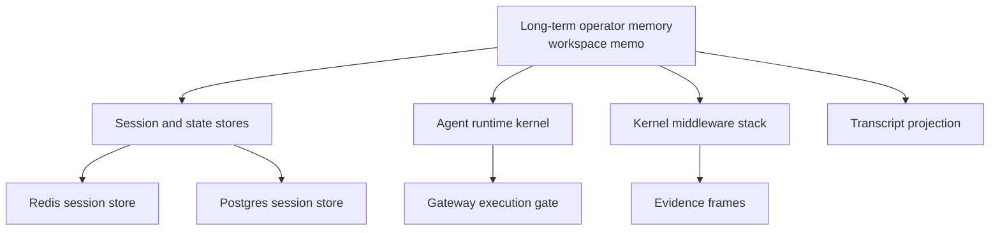
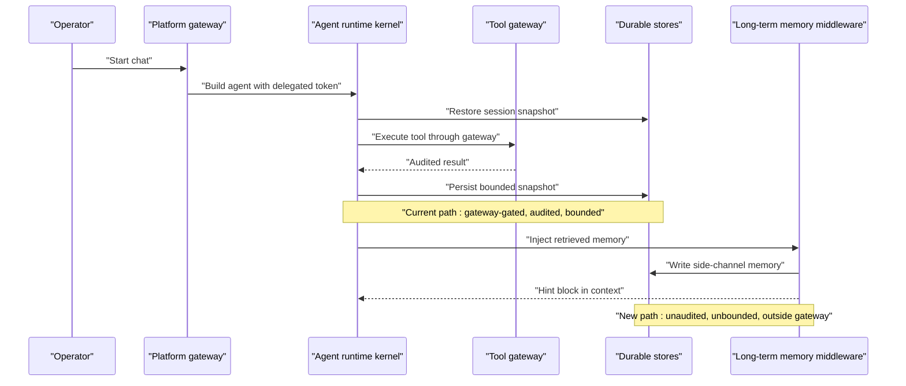
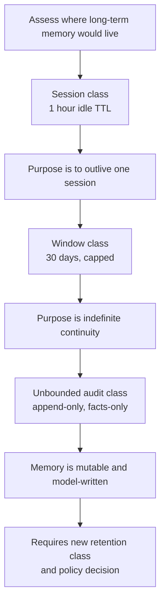
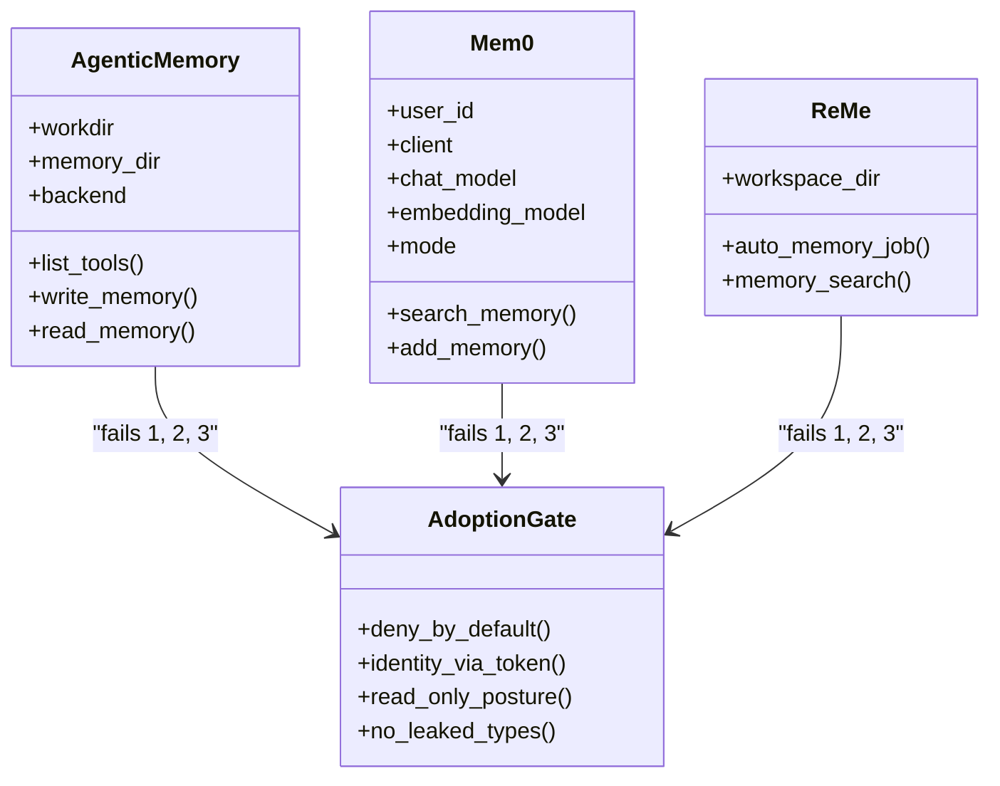
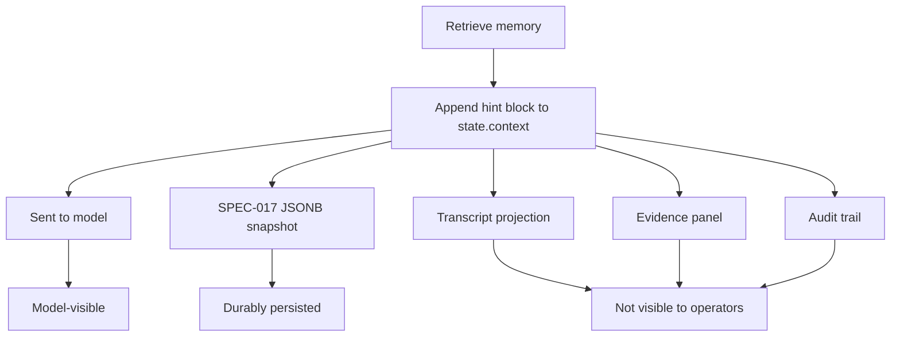
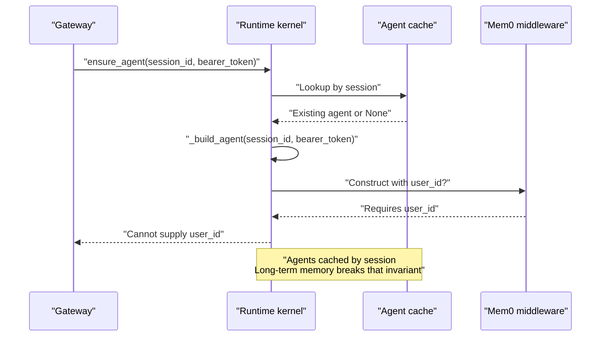
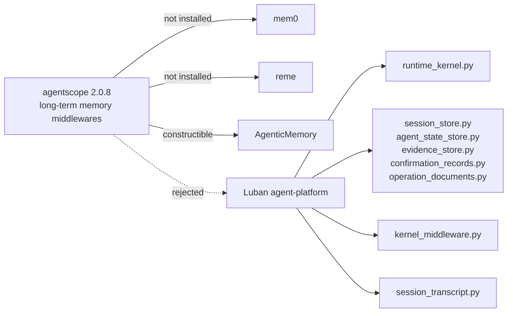

# Long-Term Operator Memory Spike Assessment

<cite>
**Referenced Files in This Document**   
- [long-term-operator-memory-spike.md](file://docs/workspace/long-term-operator-memory-spike.md)
- [delivery-roadmap.md](file://docs/agentic-aiops-platform/delivery-roadmap.md)
- [session_store.py](file://products/agent-platform/src/agent_service/services/session_store.py)
- [agent_state_store.py](file://products/agent-platform/src/agent_service/services/agent_state_store.py)
- [evidence_store.py](file://products/agent-platform/src/agent_service/services/evidence_store.py)
- [confirmation_records.py](file://products/agent-platform/src/agent_service/services/confirmation_records.py)
- [operation_documents.py](file://products/agent-platform/src/agent_service/services/operation_documents.py)
- [runtime_kernel.py](file://products/agent-platform/src/agent_service/runtime_kernel.py)
- [kernel_middleware.py](file://products/agent-platform/src/agent_service/services/kernel_middleware.py)
- [session_transcript.py](file://products/agent-platform/src/agent_service/services/session_transcript.py)
- [test_redis_session_store.py](file://products/agent-platform/tests/test_redis_session_store.py)
- [test_postgres_session_store.py](file://products/agent-platform/tests/test_postgres_session_store.py)
</cite>

## Update Summary
**Changes Made**   
- Updated conclusion section to reflect formal closure by operator on 2026-10-01
- Added governance decision section documenting the final disposition
- Updated reopen conditions to emphasize the acceptance of Option D
- Enhanced documentation of SPEC-039/044/045 paths as sufficient for cross-session knowledge sharing
- Clarified that no implementation was authorized or performed by the acceptance

## Table of Contents
1. [Introduction](#introduction)
2. [Project Structure](#project-structure)
3. [Core Components](#core-components)
4. [Architecture Overview](#architecture-overview)
5. [Detailed Component Analysis](#detailed-component-analysis)
6. [Dependency Analysis](#dependency-analysis)
7. [Performance Considerations](#performance-considerations)
8. [Governance Decision](#governance-decision)
9. [Troubleshooting Guide](#troubleshooting-guide)
10. [Conclusion](#conclusion)
11. [Appendices](#appendices)

## Introduction
This document consolidates the long-term operator memory spike assessment for the Luban AI Ops platform. It answers whether agentscope's long-term-memory middlewares (mem0, ReME, AgenticMemory) add real triage continuity across sessions, and if not, what would be required to build that capability safely. The assessment is based on a static read of the pinned agentscope 2.0.8 middleware surface, the agent-platform kernel and store implementations, and read-only queries against the live dev cluster's audit, sessions, and incidents databases. No dependency was installed, no middleware was wired, and no schema or deployment change was made as part of this assessment.

The central finding is that the observed continuity need is unrecorded, all three middlewares fail the platform's four-point adoption gate, and the platform already ships governed cross-session knowledge mechanisms — operation documents and skill drafting/graduation — that are audited, role-gated, and human-reviewed. **On 2026-10-01, the operator formally accepted Option D (close backlog row), closing the exploration without authorizing any implementation.**

## Project Structure
The assessment spans one workspace memo and several platform components:

- Workspace memo: `docs/workspace/long-term-operator-memory-spike.md`
- Agent-platform session and state stores: `products/agent-platform/src/agent-service/src/agent_service/services/session_store.py`, `agent_state_store.py`, `evidence_store.py`, `confirmation_records.py`, `operation_documents.py`
- Kernel and middleware wiring: `runtime_kernel.py`, `kernel_middleware.py`
- Transcript projection: `session_transcript.py`
- Store tests: `products/agent-platform/tests/test_redis_session_store.py`, `test_postgres_session_store.py`

**Diagram sources**
- [long-term-operator-memory-spike.md:1-7](file://docs/workspace/long-term-operator-memory-spike.md#L1-L7)
- [session_store.py:30-30](file://products/agent-platform/src/agent_service/services/session_store.py#L30-L30)
- [runtime_kernel.py:409-472](file://products/agent-platform/src/agent_service/runtime_kernel.py#L409-L472)
- [kernel_middleware.py:119-149](file://products/agent-platform/src/agent_service/services/kernel_middleware.py#L119-L149)

**Section sources**
- [long-term-operator-memory-spike.md:1-7](file://docs/workspace/long-term-operator-memory-spike.md#L1-L7)

## Core Components
The assessment evaluates three agentscope middlewares against the platform's existing durability substrate and adoption gates.

| Component | Responsibility | Relevance to long-term memory |
|---|---|---|
| `AgenticMemoryMiddleware` | Filesystem-backed Markdown memory with optional topic files and hint injection | Requires filesystem tools and shell access; pod-local state lost on reschedule |
| `Mem0Middleware` | Vendor-backed async memory client with auto retrieval and optional write-back | Needs mem0, an embedding model, and either Qdrant or a hosted SaaS |
| `ReMeMiddleware` | In-process file-based memory toolkit that writes after every reply | Always writes, has no per-user isolation, and races retrieval with replies |
| Session store | Per-session durable state with idle TTL sweep | Defines the 1-hour transient retention class that long-term memory would contradict |
| Operation documents | Owner-scoped, capped, 30-day audited artifacts | Existing governed path for cross-session knowledge |
| Skill draft/graduate flow | Draft skills reviewed by approvers before graduation | Existing governed path for reusable operational knowledge |

**Section sources**
- [long-term-operator-memory-spike.md:231-382](file://docs/workspace/long-term-operator-memory-spike.md#L231-L382)
- [operation_documents.py:1-40](file://products/agent-platform/src/agent_service/services/operation_documents.py#L1-L40)

## Architecture Overview
The platform's current architecture separates short-lived conversation state from longer-lived, governed artifacts. Long-term memory would introduce a fourth channel that bypasses both the gateway execution gate and the existing artifact governance.

**Diagram sources**
- [runtime_kernel.py:409-472](file://products/agent-platform/src/agent_service/runtime_kernel.py#L409-L472)
- [runtime_kernel.py:653-670](file://products/agent-platform/src/agent_service/runtime_kernel.py#L653-L670)
- [kernel_middleware.py:119-149](file://products/agent-platform/src/agent_service/services/kernel_middleware.py#L119-L149)

## Detailed Component Analysis

### Retention Classes and Durable Substrate
The platform currently maintains three retention classes:

| Retention class | Scope | Lifetime | Examples |
|---|---|---|---|
| Session class | Per session | Idle TTL 3600 seconds | Sessions, agent-state snapshots, session evidence |
| Window class | Per owner or per session | 30 days | Confirmation records, operation documents |
| Unbounded class | Platform-wide | Append-only, no TTL | Audit events |

A per-operator long-term memory would be the first unbounded, mutable, LLM-written, per-user store. It does not fit the session class because it must outlive one hour, nor the window class because its purpose is indefinite continuity, nor the audit class because it is rewritten and deleted by a model rather than appended by a service.

**Diagram sources**
- [session_store.py:30-30](file://products/agent-platform/src/agent_service/services/session_store.py#L30-L30)
- [agent_state_store.py:280-318](file://products/agent-platform/src/agent_service/services/agent_state_store.py#L280-L318)
- [evidence_store.py:509-520](file://products/agent-platform/src/agent_service/services/evidence_store.py#L509-L520)
- [confirmation_records.py:41-42](file://products/agent-platform/src/agent_service/services/confirmation_records.py#L41-L42)
- [operation_documents.py:39-39](file://products/agent-platform/src/agent_service/services/operation_documents.py#L39-L39)

**Section sources**
- [long-term-operator-memory-spike.md:65-97](file://docs/workspace/long-term-operator-memory-spike.md#L65-L97)
- [session_store.py:30-30](file://products/agent-platform/src/agent_service/services/session_store.py#L30-L30)
- [confirmation_records.py:41-42](file://products/agent-platform/src/agent_service/services/confirmation_records.py#L41-L42)
- [operation_documents.py:39-39](file://products/agent-platform/src/agent_service/services/operation_documents.py#L39-L39)

### Agentscope Middlewares Against the Adoption Gate
The platform applies a four-point adoption gate to every agentscope surface: deny-by-default policy with audit preserved, identity only via the gateway-forwarded delegated token, read-only operational posture, and no agentscope types leaking through the platform-owned v2 contract. All three middlewares fail at least three points as shipped.

| Gate | AgenticMemory | Mem0 | ReME |
|---|---|---|---|
| Deny-by-default + gateway-only execution | Fails — requires filesystem and shell tools not registered through the gateway | Fails — non-gateway tools execute against an external store | Fails — in-process app performs file and embedding work |
| Identity only via delegated token | Fails — no identity model | Fails — constructor argument, not supplied by kernel | Fails — scopes on an identifier the platform never sets |
| Read-only operational posture | Fails — writes pod-local files | Fails — writes external store after each reply | Fails — always writes after each reply |
| No agentscope types leak through v2 contract | Passes | Passes with caveat | Passes with caveat |

**Diagram sources**
- [long-term-operator-memory-spike.md:383-419](file://docs/workspace/long-term-operator-memory-spike.md#L383-L419)
- [runtime_kernel.py:409-472](file://products/agent-platform/src/agent_service/runtime_kernel.py#L409-L472)
- [kernel_middleware.py:119-149](file://products/agent-platform/src/agent_service/services/kernel_middleware.py#L119-L149)

**Section sources**
- [long-term-operator-memory-spike.md:231-419](file://docs/workspace/long-term-operator-memory-spike.md#L231-L419)

### The Defect No Configuration Fixes: Invisible Memory
When mem0 retrieves memories, it appends assistant messages containing hint blocks into `agent.state.context`. That content reaches the model and survives in the SPEC-017 JSONB snapshot, but it does not appear in the reconstructed transcript, evidence panel, audit trail, or any operator-facing projection. Write failures are logged but otherwise swallowed.

**Diagram sources**
- [long-term-operator-memory-spike.md:421-463](file://docs/workspace/long-term-operator-memory-spike.md#L421-L463)
- [runtime_kernel.py:653-670](file://products/agent-platform/src/agent_service/runtime_kernel.py#L653-L670)
- [session_transcript.py:34,75-92:34-92](file://products/agent-platform/src/agent_service/services/session_transcript.py#L34-L92)
- [kernel_middleware.py:458-463](file://products/agent-platform/src/agent_service/services/kernel_middleware.py#L458-L463)

**Section sources**
- [long-term-operator-memory-spike.md:421-463](file://docs/workspace/long-term-operator-memory-spike.md#L421-L463)
- [session_transcript.py:34,75-92:34-92](file://products/agent-platform/src/agent_service/services/session_transcript.py#L34-L92)

### Identity and Cache Invariants
Mem0 requires `user_id` at construction, but the kernel builds agents without a user parameter. Identity at the tool boundary is carried only by the delegated token in a context variable. The kernel also caches agents keyed by session so conversation memory does not cross sessions; long-term operator memory is defined by breaking that invariant. A shared middleware instance could leak one operator's memories into another's context, while a per-session instance would require threading identity through multiple kernel methods and deciding how it interacts with the LRU agent cache.

**Diagram sources**
- [long-term-operator-memory-spike.md:465-501](file://docs/workspace/long-term-operator-memory-spike.md#L465-L501)
- [runtime_kernel.py:531-570](file://products/agent-platform/src/agent_service/runtime_kernel.py#L531-L570)
- [runtime_kernel.py:773-808](file://products/agent-platform/src/agent_service/runtime_kernel.py#L773-L808)
- [runtime_kernel.py:817-827](file://products/agent-platform/src/agent_service/runtime_kernel.py#L817-L827)

**Section sources**
- [long-term-operator-memory-spike.md:465-501](file://docs/workspace/long-term-operator-memory-spike.md#L465-L501)
- [runtime_kernel.py:531-570](file://products/agent-platform/src/agent_service/runtime_kernel.py#L531-L570)
- [runtime_kernel.py:773-808](file://products/agent-platform/src/agent_service/runtime_kernel.py#L773-L808)
- [runtime_kernel.py:817-827](file://products/agent-platform/src/agent_service/runtime_kernel.py#L817-L827)

### Where State Would Have to Live
Four candidates were evaluated, none free:

| Candidate | Shape | Objection |
|---|---|---|
| Pod filesystem | What AgenticMemory and ReME do by default | Lost on reschedule; invisible to other replicas |
| New vector server | Qdrant or similar | New server, backup story, network policy, and image changes |
| New Postgres table | Honest answer if the platform built its own | First unbounded, mutable, per-user, LLM-written table; needs retention, cap, sweeper, deletion path, ownership model |
| Hosted SaaS | mem0 hosted client | Egress of operator triage transcripts and secrets |

The assessment concludes that none of these should be adopted now. If a requirement arrives, the only shape consistent with the adoption gate is a gateway-fronted memory connector, not one of the three middlewares.

**Section sources**
- [long-term-operator-memory-spike.md:503-517](file://docs/workspace/long-term-operator-memory-spike.md#L503-L517)

### Options Considered
The memo records four options:

| Option | Disposition | Summary |
|---|---|---|
| A — adopt a middleware as shipped | Rejected | Fails three of four gates, introduces unbounded retention, produces invisible memory, requires identity plumbing |
| B — gateway-fronted memory connector | Recorded as the only viable shape | `memory.search` / `memory.record` as gateway tools, delegated-token identity, redaction before write, evidence frames, explicit retention class |
| C — extend governed artifact path | Recommended if anything is done | Use operation documents, skill drafting/graduation, and the retrieval alias map |
| D — close the row | **Accepted 2026-10-01** | No observed continuity need, middlewares fail the gate, governed alternatives exist |

**Section sources**
- [long-term-operator-memory-spike.md:519-586](file://docs/workspace/long-term-operator-memory-spike.md#L519-L586)

## Dependency Analysis
The assessment establishes clear boundaries between the agentscope middlewares and the platform's owned code.

**Diagram sources**
- [long-term-operator-memory-spike.md:238-249](file://docs/workspace/long-term-operator-memory-spike.md#L238-L249)
- [long-term-operator-memory-spike.md:383-419](file://docs/workspace/long-term-operator-memory-spike.md#L383-L419)

**Section sources**
- [long-term-operator-memory-spike.md:231-249](file://docs/workspace/long-term-operator-memory-spike.md#L231-L249)

## Performance Considerations
The assessment identifies several performance and reliability concerns tied to long-term memory integration:

- **Unbounded snapshot growth:** mem0 appends one memory note per turn into `state.context`; long sessions accumulate notes without bound, increasing JSONB snapshot size even though the session retention class is one hour.
- **Pod-local state loss:** AgenticMemory and ReME default to filesystem storage under `AGENTSCOPE_WORKSPACE_DIR`, which is an `emptyDir` volume. Rescheduling loses the memory while authoritative rows may survive in Postgres.
- **Non-deterministic retrieval:** ReME runs retrieval concurrently with the reply, so a single-shot reply may finish before the injected memory lands. Given that 107 of 124 observed sessions are single-turn, this affects the dominant session shape.
- **Silent write failures:** mem0 wraps write calls in exception handlers that log warnings but do not emit audit events, metrics, or operator surfaces.
- **TTL sweep pressure:** Adding a new mutable, per-user store would require a sweeper aligned with the platform's existing opportunistic sweep pattern used by session, agent-state, evidence, confirmation-record, and operation-document stores.

These are not reasons to optimize away the problem; they are reasons to avoid introducing a side-channel store without a bounded retention class, failure visibility, and deterministic delivery.

**Section sources**
- [long-term-operator-memory-spike.md:316-316](file://docs/workspace/long-term-operator-memory-spike.md#L316-L316)
- [long-term-operator-memory-spike.md:315-315](file://docs/workspace/long-term-operator-memory-spike.md#L315-L315)
- [long-term-operator-memory-spike.md:360-365](file://docs/workspace/long-term-operator-memory-spike.md#L360-L365)
- [long-term-operator-memory-spike.md:285-293](file://docs/workspace/long-term-operator-memory-spike.md#L285-L293)

## Governance Decision
**Formal Closure: 2026-10-01**

On 2026-10-01, the operator formally accepted Option D (close backlog row) and passed §11 gate 5. This governance decision carries the following implications:

### Final Disposition
- **Status**: Closed — no further action required
- **Authorization**: No implementation, dependency install, middleware wiring, storage table, ADR, or spec is authorized
- **Backlog Row**: Recorded as closed in the Exploration Backlog
- **Reopening Conditions**: Require §9 conditions 1, 3, and 5 — a stated operator continuity need, a written retention-class decision, and evidence that the governed Option C path is insufficient

### Governance Principles Applied
1. **Null results are publishable outcomes** — the absence of evidence for a continuity need is itself a valid finding
2. **Governance precedes technology** — the existing SPEC-039/044/045 paths provide sufficient cross-session knowledge sharing
3. **Adoption gates are binding** — all three middlewares failed three of four gate points as shipped
4. **Retention decisions require explicit policy** — "long-term" is a new retention class requiring governance approval

### Existing Paths Confirmed Sufficient
The governance decision confirms that the platform's existing mechanisms adequately address cross-session knowledge sharing:

- **SPEC-039 Operation Documents**: Immutable, typed snapshots with provenance anchoring, 30-day retention, and role-based access
- **SPEC-044/045 Skill Authoring Export and Incident-Skill Drafts**: Governed workflow from triaged sessions to approved, replayable skills
- **Retrieval Alias Map**: Deterministic vocabulary improvement addressing the observed repetition patterns

These paths maintain the critical properties that a private memory store would remove: human review, auditability, role-based visibility, and bounded retention.

**Section sources**
- [long-term-operator-memory-spike.md:580-594](file://docs/workspace/long-term-operator-memory-spike.md#L580-L594)
- [long-term-operator-memory-spike.md:745-752](file://docs/workspace/long-term-operator-memory-spike.md#L745-L752)

## Troubleshooting Guide
If a future proposal revisits long-term operator memory, use these checks before proceeding:

| Symptom | Likely cause | Required check |
|---|---|---|
| Memory appears in model output but not in transcript | Hint blocks are excluded from transcript extraction | Inspect `_TRANSCRIPT_ROLES` and `_extract_text` |
| Memory write fails silently | Exception handler logs warning but swallows error | Add audit event, metric, and operator surface |
| Multi-operator sessions share memory | Middleware constructed once and shared across sessions | Verify per-user isolation and cache keying |
| Memory disappears after pod restart | Pod-local filesystem storage | Move to durable store with explicit retention |
| Approval card parks on every memory call | Memory tool not in allow-list and not gateway-fronted | Route through gateway with HITL semantics |
| Session store falls back to in-memory backend | Redis or Postgres unreachable | Check `SESSION_STORE_BACKEND`, connection health, and fallback metrics |

For session-store failures specifically, the test suites assert:

- Redis backend selection, CRUD, user listing, title bookkeeping, TTL expiry, health checks, and factory behavior.
- Postgres backend selection, DDL initialization, create/get/list/touch/delete, TTL sweep, error counting, fallback to in-memory, and unknown-backend startup failure.

**Section sources**
- [long-term-operator-memory-spike.md:421-463](file://docs/workspace/long-term-operator-memory-spike.md#L421-L463)
- [test_redis_session_store.py:35-194](file://products/agent-platform/tests/test_redis_session_store.py#L35-L194)
- [test_redis_session_store.py:228-274](file://products/agent-platform/tests/test_redis_session_store.py#L228-L274)
- [test_postgres_session_store.py:81-287](file://products/agent-platform/tests/test_postgres_session_store.py#L81-L287)
- [test_postgres_session_store.py:295-347](file://products/agent-platform/tests/test_postgres_session_store.py#L295-L347)

## Conclusion
**The long-term operator memory spike assessment was formally closed by the operator on 2026-10-01, accepting Option D (close backlog row).** The continuity need is not evidenced in the platform's own record, all three agentscope middlewares fail the adoption gate, and the platform already ships governed mechanisms for carrying knowledge across sessions.

The governance decision confirms that:
- **No implementation was authorized** by the acceptance
- **The existing SPEC-039/044/045 paths are sufficient** for cross-session knowledge sharing
- **Reopening requires strict conditions**: a stated operator continuity need, a written retention-class decision, and evidence that the governed artifact path is insufficient
- **Any future implementation must follow Option B**: a gateway-fronted memory connector with delegated-token identity, redaction before write, evidence frames, audited events, and an explicit retention class

The null result is a publishable outcome that demonstrates the platform's commitment to governance-first development and evidence-based decision making.

## Appendices

### Reopen Conditions
The assessment records five conditions that must be true before reopening the row:

1. A stated operator need from operations, not from a library feature list.
2. A measurement the platform can actually make, including a decision about recording enough signal to detect cross-session repetition.
3. An explicit retention-class decision covering lifetime, deletion, rectification, and cross-operator visibility.
4. An embedder decision if semantic retrieval is chosen.
5. Evidence that the governed artifact path — operation documents, skill drafting/graduation, and the retrieval alias map — is insufficient.

**Section sources**
- [long-term-operator-memory-spike.md:592-620](file://docs/workspace/long-term-operator-memory-spike.md#L592-L620)

### Go / No-Go Gates
The assessment defines five gates:

1. Accept the evidence finding: if operations cannot state a concrete continuity need, the row closes.
2. Accept the gate scoring: any adoption proposal must identify which gate point it clears and what changed.
3. Decide the retention class before technology: no storage decision is approved without a written retention-class answer.
4. If anything is built, it is Option B: a connector spec is promotable; middleware wiring is not.
5. Otherwise close the row: a null result closes the backlog row, and reopening needs the product and governance conditions above.

**Section sources**
- [long-term-operator-memory-spike.md:645-665](file://docs/workspace/long-term-operator-memory-spike.md#L645-L665)

### Changelog
The workspace memo includes detailed changelog entries documenting the progression from initial assessment through formal closure:

- **2026-10-01 Initial Assessment**: Complete evaluation of all three middlewares, evidence gathering, and recommendation to close the row
- **2026-10-01 Documentation Updates**: Applied recommended documentation changes to utilization audit and roadmap
- **2026-10-01 Formal Closure**: Operator accepted Option D, passing §11 gate 5 and closing the backlog row

**Section sources**
- [long-term-operator-memory-spike.md:694-752](file://docs/workspace/long-term-operator-memory-spike.md#L694-L752)