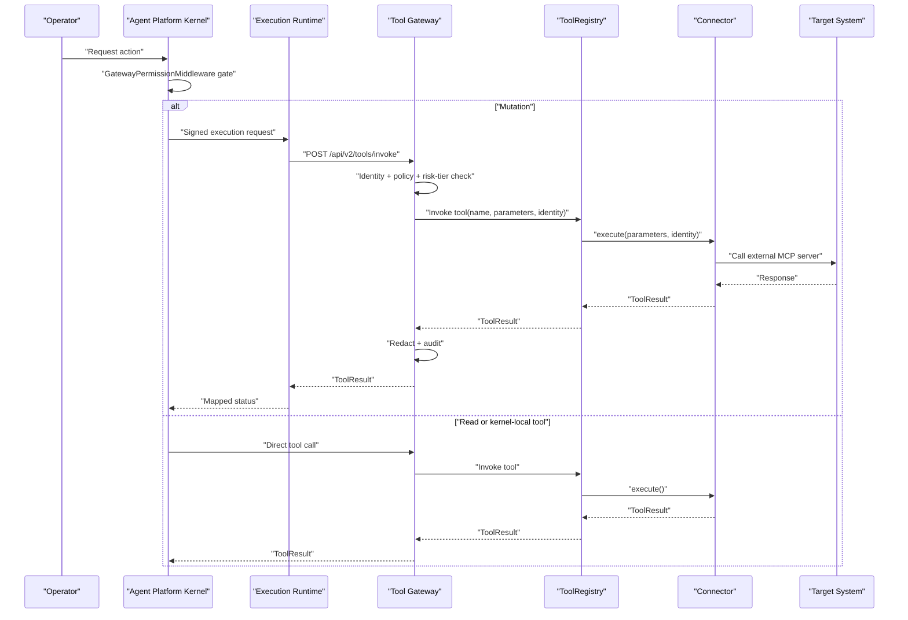
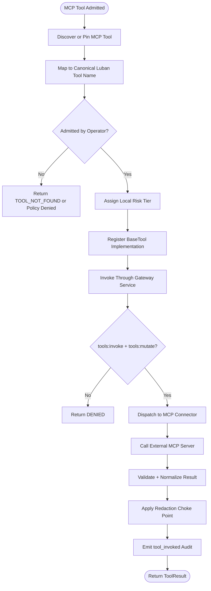
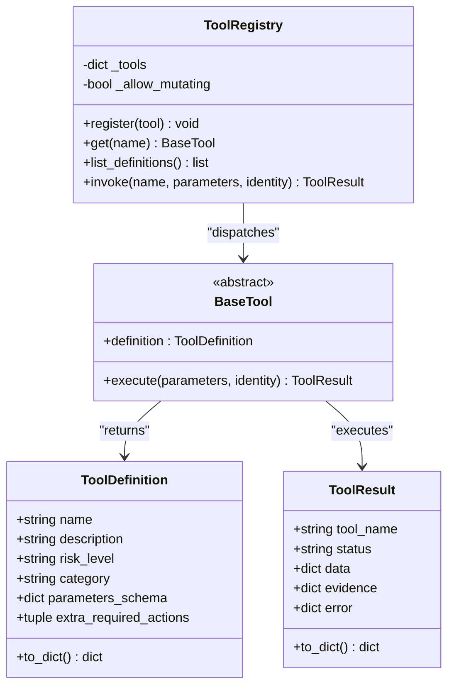
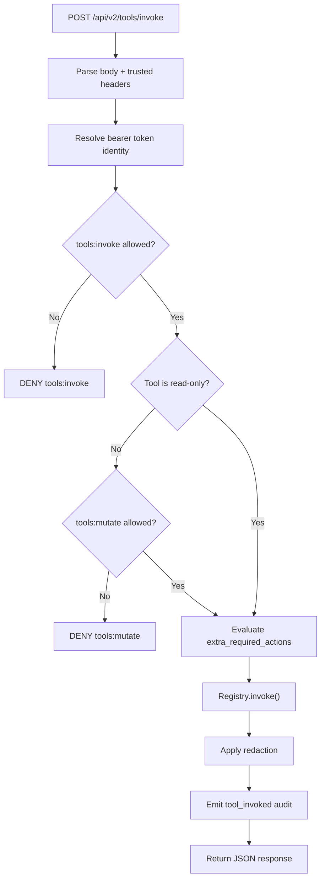
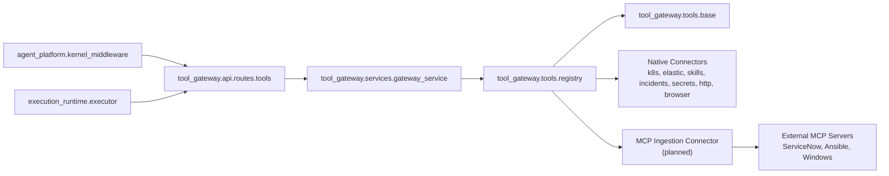

# MCP Ingestion Strategy

<cite>
**Referenced Files in This Document**
- [mcp-ingestion-spike.md](file://docs/workspace/mcp-ingestion-spike.md)
- [mcp-exposure-spike.md](file://docs/workspace/mcp-exposure-spike.md)
- [base.py](file://products/tool-gateway/src/tool_gateway/tools/base.py)
- [registry.py](file://products/tool-gateway/src/tool_gateway/tools/registry.py)
- [tools.py](file://products/tool-gateway/src/tool_gateway/api/routes/tools.py)
- [gateway_service.py](file://products/tool-gateway/src/tool_gateway/services/gateway_service.py)
- [kernel_middleware.py](file://products/agent-platform/src/agent_service/services/kernel_middleware.py)
- [executor.py](file://products/execution-runtime/src/execution_runtime/services/executor.py)
- [SPEC-066-skill-retrieval-ranking-fidelity/spec.md](file://docs/specs/SPEC-066-skill-retrieval-ranking-fidelity/spec.md)
</cite>

## Update Summary
**Changes Made**
- Updated references to SPEC-066 to reflect that the number was taken by skill retrieval ranking fidelity spec
- Clarified that the stable API productization row remains de-numbered and will get its number at drafting time
- Maintained all existing architectural and implementation details unchanged

## Table of Contents
1. [Introduction](#introduction)
2. [Project Structure](#project-structure)
3. [Core Components](#core-components)
4. [Architecture Overview](#architecture-overview)
5. [Detailed Component Analysis](#detailed-component-analysis)
6. [Dependency Analysis](#dependency-analysis)
7. [Performance Considerations](#performance-considerations)
8. [Troubleshooting Guide](#troubleshooting-guide)
9. [Conclusion](#conclusion)

## Introduction
This document describes the planned **MCP ingestion strategy** for consuming external Model Context Protocol (MCP) servers beneath `tool-gateway`. It is based on two design assessments:

- The original assessment (`mcp-exposure-spike.md`) established that no MCP client exists today, identified the existing extension seam, and recommended retaining native connectors until a concrete trigger justifies a separately approved pilot.
- The follow-up assessment (`mcp-ingestion-spike.md`) accepts three named operational targets — ServiceNow, Ansible, Windows — and recommends building one generic MCP-ingestion connector under `tool-gateway`, then admitting targets one at a time in risk order.

The strategy is an **assessment**, not an implementation. No MCP server has been installed, tested, or deployed as part of this codebase.

## Project Structure
At present, the repository contains:

- Two workspace assessments describing MCP exposure and ingestion.
- A tool execution framework in `tool-gateway` with base abstractions, a registry, HTTP routes, policy enforcement, redaction, and audit emission.
- Kernel middleware in `agent-platform` that gates headless AgentScope tool calls.
- An isolated execution runtime that calls `tool-gateway` after approval.

```mermaid
graph TB
subgraph "Agent Platform"
Kernel["Kernel Middleware<br/>GatewayPermissionMiddleware"]
end
subgraph "Execution Runtime"
Executor["Executor<br/>execute_tool()"]
end
subgraph "Tool Gateway"
Routes["Tools API<br/>/api/v2/tools"]
Service["Gateway Service<br/>invoke_tool()"]
Registry["ToolRegistry"]
Base["BaseTool / ToolDefinition / ToolResult"]
end
subgraph "Planned MCP Connector"
MCPConn["MCP-Ingestion Connector<br/>(not implemented yet)")
end
subgraph "External Systems"
SNOW["ServiceNow"]
ANSIBLE["Ansible"]
WIN["Windows UI"]
end
Kernel --> Routes
Executor --> Routes
Routes --> Service
Service --> Registry
Registry --> Base
Registry --> MCPConn
MCPConn --> SNOW
MCPConn --> ANSIBLE
MCPConn --> WIN
```

**Diagram sources**
- [kernel_middleware.py:271-420](file://products/agent-platform/src/agent_service/services/kernel_middleware.py#L271-L420)
- [executor.py:17-61](file://products/execution-runtime/src/execution_runtime/services/executor.py#L17-L61)
- [tools.py:24-50](file://products/tool-gateway/src/tool_gateway/api/routes/tools.py#L24-L50)
- [gateway_service.py:159-434](file://products/tool-gateway/src/tool_gateway/services/gateway_service.py#L159-L434)
- [registry.py:18-88](file://products/tool-gateway/src/tool_gateway/tools/registry.py#L18-L88)
- [base.py:15-133](file://products/tool-gateway/src/tool_gateway/tools/base.py#L15-L133)
- [mcp-ingestion-spike.md:55-80](file://docs/workspace/mcp-ingestion-spike.md#L55-L80)

**Section sources**
- [mcp-ingestion-spike.md:1-22](file://docs/workspace/mcp-ingestion-spike.md#L1-L22)
- [mcp-exposure-spike.md:1-34](file://docs/workspace/mcp-exposure-spike.md#L1-L34)

## Core Components
The ingestion strategy depends on four existing components that must remain unchanged unless explicitly promoted through a spec:

| Component | Responsibility | Relevance to MCP ingestion |
|---|---|---|
| `BaseTool` / `ToolDefinition` / `ToolResult` | Abstract tool interface, metadata, result envelope, evidence helpers, error/denied builders. | An MCP-backed tool is another `BaseTool` implementation returning a standard `ToolResult`. |
| `ToolRegistry` | In-process lookup, dispatch, and structured error handling. | The MCP connector registers tools by name; unknown names return `TOOL_NOT_FOUND`. |
| Tools API routes | Expose `/api/v2/tools` and `/api/v2/tools/invoke`. | MCP tool discovery and invocation use the same surface as native connectors. |
| `gateway_service.invoke_tool` | Identity resolution, policy checks, risk-tier gating, extra-action admission, dispatch, redaction, audit emission. | All MCP tool calls pass through this choke point before reaching the connector. |

Key invariants from the source:

- Risk tiers are `read`, `write`, and `admin`; mutating tools additionally require `tools:mutate`.
- Every tool call requires `tools:invoke`; non-read tools require `tools:mutate`.
- A tool may declare additional required actions via `extra_required_actions`.
- Results are redacted at a single choke point before response and audit emission.
- Audit emission is fire-and-forget with log fallback, not transactional durability.

**Section sources**
- [base.py:9-133](file://products/tool-gateway/src/tool_gateway/tools/base.py#L9-L133)
- [registry.py:18-88](file://products/tool-gateway/src/tool_gateway/tools/registry.py#L18-L88)
- [tools.py:24-50](file://products/tool-gateway/src/tool_gateway/api/routes/tools.py#L24-L50)
- [gateway_service.py:159-434](file://products/tool-gateway/src/tool_gateway/services/gateway_service.py#L159-L434)

## Architecture Overview
The ingestion strategy preserves Luban's trust boundary:

```text
operator -> agent-platform policy / HITL
         -> signed execution + execution-runtime (mutations)
         -> tool-gateway: admission, dispatch, redaction, audit
              -> native connector -> target
              -> MCP-ingestion connector -> external MCP server -> target   <-- new
```

The MCP adapter sits beneath `tool-gateway`. The gateway becomes the MCP client. The kernel must never become an independent MCP client. Mutations still traverse the existing governed path:

1. Operator-driven agent flow reaches the kernel.
2. Headless tool calls are gated by `GatewayPermissionMiddleware`.
3. Approved mutations go through signed execution and the isolated execution runtime.
4. The executor calls `tool-gateway` once, without retries.
5. `tool-gateway` enforces identity, policy, risk tier, optional extra actions, redaction, and audit.
6. The registry dispatches to either a native connector or the future MCP ingestion connector.



**Diagram sources**
- [kernel_middleware.py:271-420](file://products/agent-platform/src/agent_service/services/kernel_middleware.py#L271-L420)
- [executor.py:17-61](file://products/execution-runtime/src/execution_runtime/services/executor.py#L17-L61)
- [gateway_service.py:159-434](file://products/tool-gateway/src/tool_gateway/services/gateway_service.py#L159-L434)
- [registry.py:65-88](file://products/tool-gateway/src/tool_gateway/tools/registry.py#L65-L88)
- [mcp-ingestion-spike.md:55-80](file://docs/workspace/mcp-ingestion-spike.md#L55-L80)

**Section sources**
- [mcp-ingestion-spike.md:55-80](file://docs/workspace/mcp-ingestion-spike.md#L55-L80)
- [mcp-exposure-spike.md:50-78](file://docs/workspace/mcp-exposure-spike.md#L50-L78)

## Detailed Component Analysis

### MCP Ingestion Design Constraints
The ingestion spike defines the capability-substrate direction:

- One generic MCP-ingestion connector beneath `tool-gateway`.
- Targets admitted one at a time: ServiceNow → Ansible → Windows.
- Each pilot admits only the operations its use case needs.
- Luban retains local risk classification, approval, evidence, and audit.
- Remote discovery does not silently add capabilities or replace canonical implementations.
- Endpoint URLs, executable paths, and credential sources are operator configuration, never model-selected arguments.

These constraints map directly onto the existing tool framework:

| Requirement | Existing mechanism |
|---|---|
| Explicit tool admission | `ToolRegistry.register()` and operator-owned allowlist |
| Local static risk tiers | `ToolDefinition.risk_level` in `{read, write, admin}` |
| Canonical name/schema mapping | New connector maps MCP tool names to Luban tool names |
| Response normalization | Connector returns `ToolResult` envelopes |
| Credential boundary | Per-target credentials; no passthrough of `aud=tool-gateway` token |
| Untrusted results | Validate types and size before normalization |
| Uncertain outcomes | No blind retry; prefer idempotency keys where supported |
| Attribution | Retain verified user/service attribution; add remote-execution correlation |
| Deployment topology | Prefer sidecar/bound endpoint; remote endpoints need TLS, caller auth, NetworkPolicy |



**Diagram sources**
- [mcp-ingestion-spike.md:82-120](file://docs/workspace/mcp-ingestion-spike.md#L82-L120)
- [base.py:15-133](file://products/tool-gateway/src/tool_gateway/tools/base.py#L15-L133)
- [registry.py:31-55](file://products/tool-gateway/src/tool_gateway/tools/registry.py#L31-L55)
- [gateway_service.py:200-434](file://products/tool-gateway/src/tool_gateway/services/gateway_service.py#L200-L434)

**Section sources**
- [mcp-ingestion-spike.md:82-120](file://docs/workspace/mcp-ingestion-spike.md#L82-L120)

### Tool Execution Framework
The existing framework models a tool as:

- A `BaseTool` subclass.
- A `ToolDefinition` declaring name, description, risk level, category, parameter schema, and optional extra required actions.
- An async `execute(parameters, identity)` method returning a `ToolResult`.
- A registry that validates risk levels, optionally blocks mutating tools, and dispatches invocations.



**Diagram sources**
- [base.py:15-133](file://products/tool-gateway/src/tool_gateway/tools/base.py#L15-L133)
- [registry.py:18-88](file://products/tool-gateway/src/tool_gateway/tools/registry.py#L18-L88)

**Section sources**
- [base.py:15-133](file://products/tool-gateway/src/tool_gateway/tools/base.py#L15-L133)
- [registry.py:18-88](file://products/tool-gateway/src/tool_gateway/tools/registry.py#L18-L88)

### Gateway Invocation Flow
The gateway service orchestrates the full invocation lifecycle:

1. Parse request body.
2. Resolve correlation and trusted internal fields (`session_id`, `approval_kind`).
3. Resolve identity from bearer token.
4. Enforce `tools:invoke`.
5. For non-read tools, enforce `tools:mutate`.
6. Evaluate per-tool `extra_required_actions`.
7. Dispatch through the registry.
8. Apply redaction.
9. Emit audit event.
10. Return JSON response with appropriate status code.



**Diagram sources**
- [gateway_service.py:159-434](file://products/tool-gateway/src/tool_gateway/services/gateway_service.py#L159-L434)

**Section sources**
- [gateway_service.py:159-434](file://products/tool-gateway/src/tool_gateway/services/gateway_service.py#L159-L434)

### Kernel Permission Gate
The kernel middleware owns the AgentScope permission gate for headless runs:

- Vetted read-only gateway tools are auto-approved.
- Kernel-local task tools always run.
- Every other tool receives an explicit ASK and parks for operator confirmation.
- Admission and policy remain enforced by `tool-gateway` on every invocation.
- There is a narrow exception for approved browser flows allowing specific mutating web tools behind a single gate.

This means an MCP-backed tool cannot bypass the platform allow-list simply because it is read-only; it must be vetted and listed.

**Section sources**
- [kernel_middleware.py:124-171](file://products/agent-platform/src/agent_service/services/kernel_middleware.py#L124-L171)
- [kernel_middleware.py:271-420](file://products/agent-platform/src/agent_service/services/kernel_middleware.py#L271-L420)

### Execution Runtime Boundary
The execution runtime makes exactly one non-retrying call to `tool-gateway`:

- It sets `Authorization: Bearer <delegated_token>` and forwards `x-request-id`.
- It forwards `x-execution-id` when available.
- It rejects redirects and validates the returned tool-result schema.
- Transport errors, timeouts, malformed responses, and mismatched request IDs raise `GatewayUncertain`.
- Valid tool reports are mapped to `succeeded`, `timeout`, or `failed`.

This is critical for MCP ingestion: uncertainty after dispatch does not mean the mutation did not occur, so the connector must not blindly retry or automatically fall back to a native implementation.

**Section sources**
- [executor.py:1-71](file://products/execution-runtime/src/execution_runtime/services/executor.py#L1-L71)

## Dependency Analysis
The ingestion strategy introduces a new dependency between `tool-gateway` and external MCP servers while preserving existing dependencies:



**Diagram sources**
- [kernel_middleware.py:271-420](file://products/agent-platform/src/agent_service/services/kernel_middleware.py#L271-L420)
- [tools.py:24-50](file://products/tool-gateway/src/tool_gateway/api/routes/tools.py#L24-L50)
- [gateway_service.py:159-434](file://products/tool-gateway/src/tool_gateway/services/gateway_service.py#L159-L434)
- [registry.py:18-88](file://products/tool-gateway/src/tool_gateway/tools/registry.py#L18-L88)
- [executor.py:17-61](file://products/execution-runtime/src/execution_runtime/services/executor.py#L17-L61)
- [mcp-ingestion-spike.md:55-80](file://docs/workspace/mcp-ingestion-spike.md#L55-L80)

Coupling and cohesion observations:

- The MCP connector should depend only on `BaseTool`, `ToolDefinition`, `ToolResult`, and the registry contract.
- It must not import kernel policy, approval state, or session state.
- It must not forward the gateway's delegated token upstream.
- It must preserve the existing redaction and audit choke points.
- It must treat MCP tool metadata as untrusted input, not authority.

**Section sources**
- [mcp-ingestion-spike.md:82-120](file://docs/workspace/mcp-ingestion-spike.md#L82-L120)
- [mcp-exposure-spike.md:169-211](file://docs/workspace/mcp-exposure-spike.md#L169-L211)

## Performance Considerations
The ingestion strategy adds a network boundary between `tool-gateway` and external MCP servers. Relevant characteristics include:

- The executor uses a bounded timeout and no retries.
- The gateway emits audit events asynchronously with log fallback.
- Redaction scans result structures and can withhold output if overflow thresholds are exceeded.
- Kernel evidence frames buffer and summarize tool payloads.
- MCP latency is additive to native connector latency.

Recommendations grounded in the current code:

- Do not assume MCP responses are fast or reliable.
- Preserve the executor's no-retry semantics.
- Keep MCP tool schemas small and bounded.
- Avoid automatic resource fetching from MCP results.
- Measure latency and error rates against native baselines before promoting pilots.
- Treat transport errors as uncertain outcomes rather than failures.

[No sources needed since this section provides general guidance]

## Troubleshooting Guide
Common failure modes for a future MCP ingestion connector:

| Symptom | Likely Cause | Expected Behavior |
|---|---|---|
| Tool not found | MCP tool not admitted or not registered | `TOOL_NOT_FOUND` from registry |
| Policy denied | Missing `tools:invoke`, `tools:mutate`, or extra action | `POLICY_DENIED` with reason |
| Unauthorized | Invalid or expired bearer token | 401 from gateway identity resolution |
| Forbidden | Policy denies requested action | 403 from gateway policy enforcement |
| Redaction overflow | Too much sensitive content in result | Error result with `REDACTION_OVERFLOW` |
| Timeout | MCP server slow or unreachable | `GatewayUncertain("transport_error")` |
| Redirect | Unexpected redirect from MCP endpoint | `GatewayUncertain("response_invalid")` |
| Malformed response | Invalid tool-result schema | `GatewayUncertain("response_invalid")` |
| Unknown outcome | Disconnect after possible dispatch | Surface uncertainty; do not retry blindly |

Operational checks:

1. Verify the tool is registered in the gateway registry.
2. Confirm the operator admit list includes the MCP tool.
3. Confirm the local risk tier is declared.
4. Confirm the caller has `tools:invoke` and, for writes/admin, `tools:mutate`.
5. Confirm any `extra_required_actions` are granted.
6. Confirm MCP endpoint reachability and TLS configuration.
7. Confirm per-target credentials are configured and valid.
8. Inspect gateway logs for `policy_decision` and `tool_invoked` events.
9. Inspect audit service delivery separately from gateway logs.
10. Do not infer success from HTTP 2xx alone; validate the tool-result envelope.

**Section sources**
- [gateway_service.py:62-157](file://products/tool-gateway/src/tool_gateway/services/gateway_service.py#L62-L157)
- [gateway_service.py:159-434](file://products/tool-gateway/src/tool_gateway/services/gateway_service.py#L159-L434)
- [executor.py:17-71](file://products/execution-runtime/src/execution_runtime/services/executor.py#L17-L71)
- [registry.py:57-88](file://products/tool-gateway/src/tool_gateway/tools/registry.py#L57-L88)

## Conclusion
The MCP ingestion strategy proposes one generic connector beneath `tool-gateway` that consumes external MCP servers as governed tools. It deliberately preserves Luban's existing trust boundary, policy enforcement, approval path, redaction choke point, and audit trail.

The current codebase does not implement MCP ingestion. The authoritative design is captured in:

- `docs/workspace/mcp-exposure-spike.md`, which establishes the extension seam and retention-of-native-connectors posture.
- `docs/workspace/mcp-ingestion-spike.md`, which records the staged ServiceNow → Ansible → Windows sequencing and the non-negotiable architecture.

Before implementation, the assessments require:

1. Approval of the capability-substrate direction.
2. Selection of ServiceNow as the first pilot.
3. A per-target pilot spec with pinned artifacts, explicit allowlists, contract tests, and proven operator workflow/evidence/replay behavior.
4. Resolution of the machine-consumer credential gap.
5. Framing of R6 as a release theme if approved.

Until those gates are met, the correct state is: assess, retain native connectors, and do not promote an implementation, pilot, ADR, or spec from these memos.

**Updated** The stable API productization backlog row referenced in the ingestion strategy remains de-numbered, as the previously earmarked SPEC-066 number was taken by the skill retrieval ranking fidelity spec (SPEC-066). The stable API productization row will receive its number at drafting time, maintaining consistency with the project's spec numbering discipline.

**Section sources**
- [mcp-ingestion-spike.md:176-204](file://docs/workspace/mcp-ingestion-spike.md#L176-L204)
- [mcp-exposure-spike.md:267-311](file://docs/workspace/mcp-exposure-spike.md#L267-L311)
- [SPEC-066-skill-retrieval-ranking-fidelity/spec.md:581-585](file://docs/specs/SPEC-066-skill-retrieval-ranking-fidelity/spec.md#L581-L585)