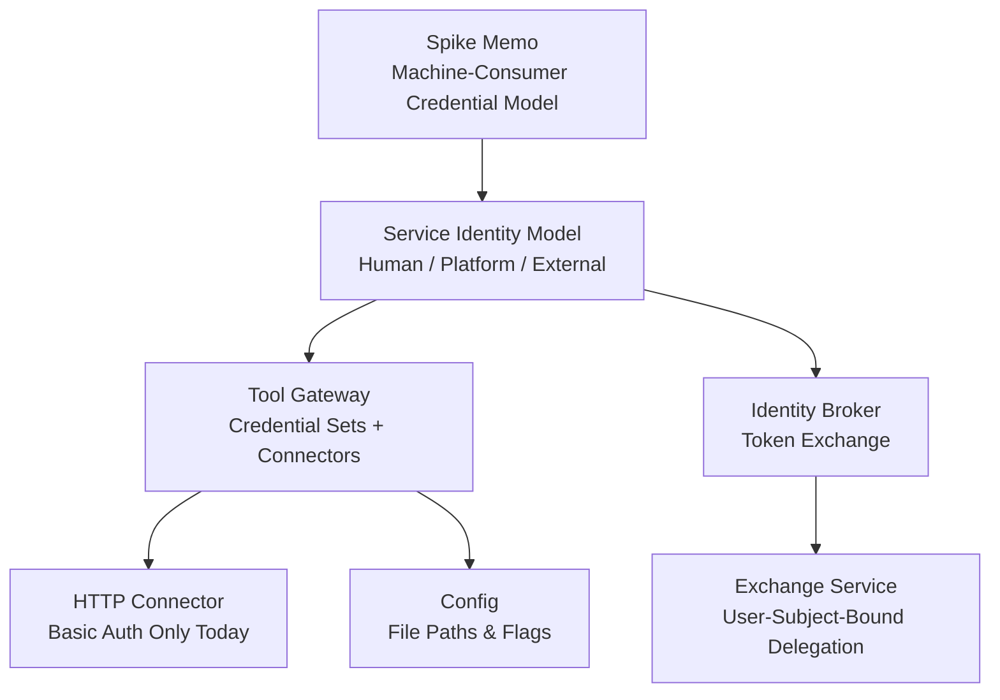
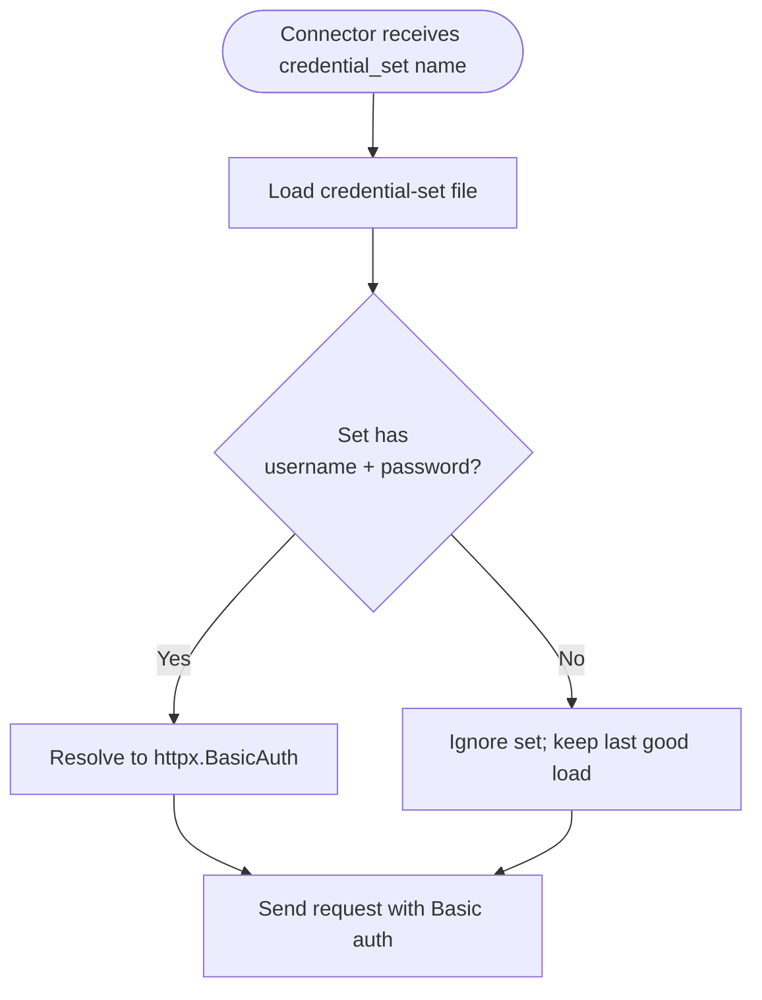
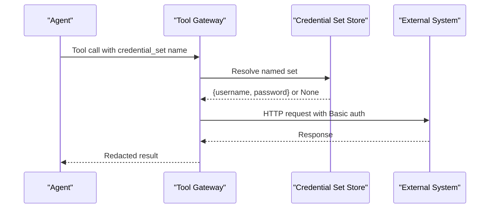
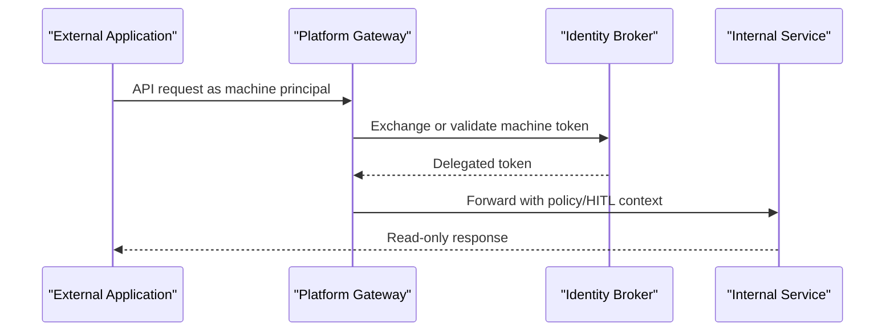
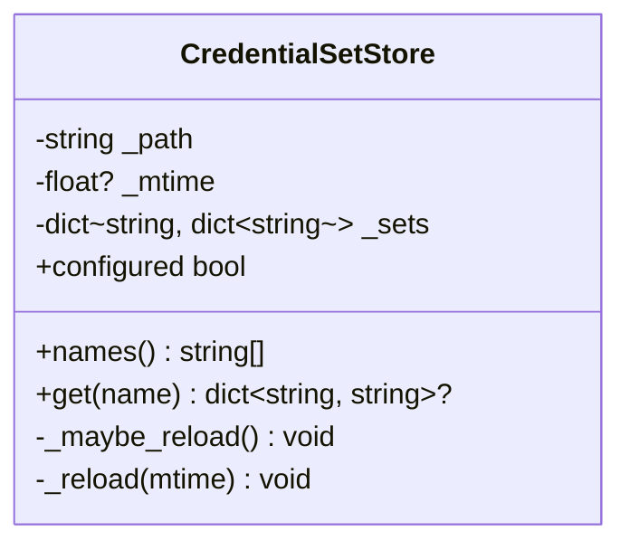
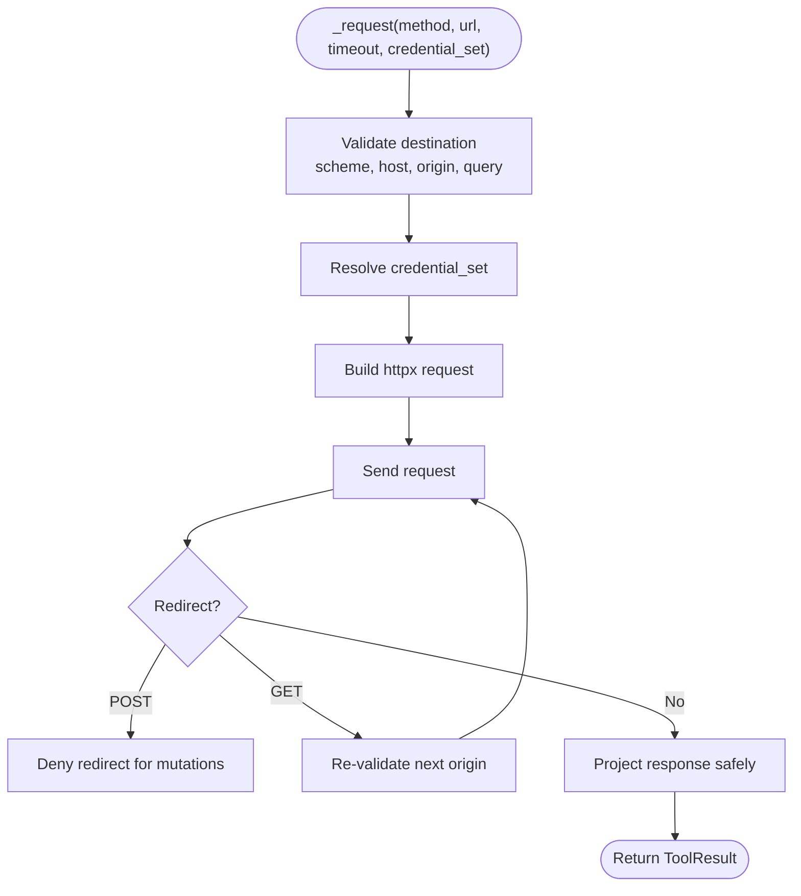
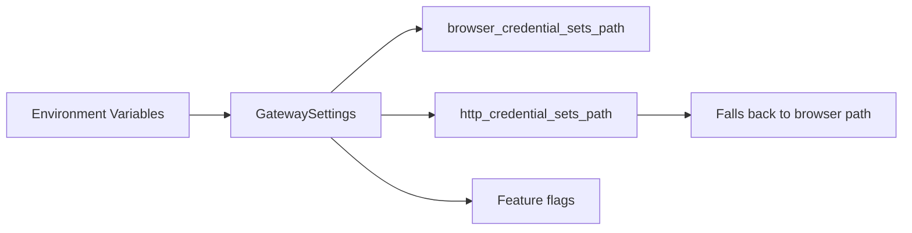
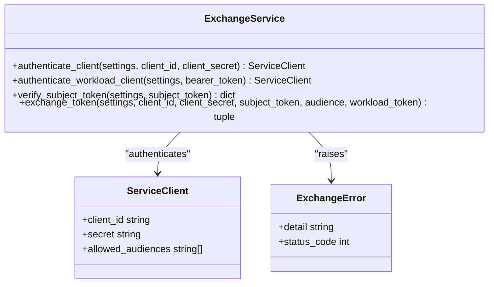
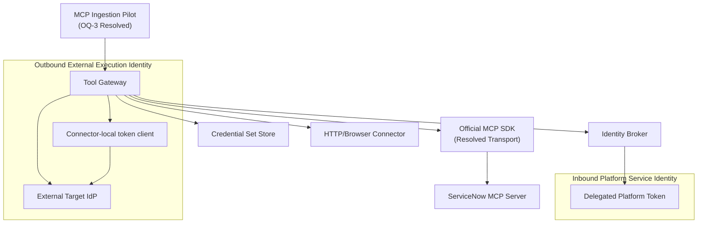
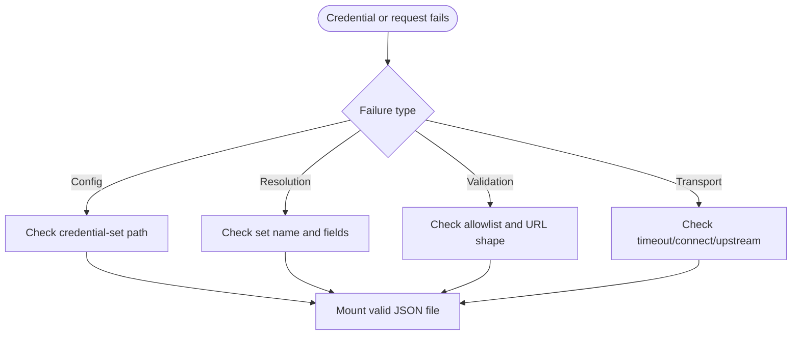

# Machine Consumer Credential Model Spike

<cite>
**Referenced Files in This Document**   
- [machine-consumer-credential-model-spike.md](file://docs/workspace/machine-consumer-credential-model-spike.md)
- [identity-and-authorization-design.md](file://docs/agentic-aiops-platform/identity-and-authorization-design.md)
- [credential_sets.py](file://products/tool-gateway/src/tool_gateway/tools/credential_sets.py)
- [http_connector.py](file://products/tool-gateway/src/tool_gateway/tools/http_connector.py)
- [config.py](file://products/tool-gateway/src/tool_gateway/core/config.py)
- [exchange_service.py](file://products/identity-broker/src/identity_service/services/exchange_service.py)
- [SPEC-067 spec.md](file://docs/specs/SPEC-067-servicenow-mcp-ingestion-pilot/spec.md)
- [SPEC-067 plan.md](file://docs/specs/SPEC-067-servicenow-mcp-ingestion-pilot/plan.md)
</cite>

## Update Summary
**Changes Made**   
- Updated transport decision section to reflect resolved OQ-3 decision for SPEC-067
- Added reference to the official `mcp` Python SDK adoption as the ingestion transport
- Clarified the relationship between the credential model extension and MCP ingestion strategy
- Updated dependency analysis to reflect the resolved transport architecture

## Table of Contents
1. [Introduction](#introduction)
2. [Project Structure](#project-structure)
3. [Core Components](#core-components)
4. [Architecture Overview](#architecture-overview)
5. [Detailed Component Analysis](#detailed-component-analysis)
6. [Dependency Analysis](#dependency-analysis)
7. [Performance Considerations](#performance-considerations)
8. [Troubleshooting Guide](#troubleshooting-guide)
9. [Conclusion](#conclusion)

## Introduction
This document summarizes the machine-consumer credential model spike and grounds its conclusions in the shipped codebase. The spike's central finding is that the roadmap label "machine-consumer credential gap (`client_credentials`)" conflates two different problems:

- **Outbound External Execution Identity**: tool-gateway authenticating to an external system (the real R6 prerequisite).
- **Inbound approved machine consumer**: an external application authenticating to Luban as itself (parked, trust-model-blocked).

The memo concludes that R6 does not require adding `client_credentials` to identity-broker. Instead, it needs a bounded extension of the existing outbound `credential_set` mechanism so tool-gateway connectors can present non-Basic credentials — such as a static bearer token or an OAuth client-credentials flow against the *external* target's identity provider.

**Updated** The transport decision for SPEC-067 has been resolved, confirming that the credential extension will support the official `mcp` Python SDK ingestion transport against ServiceNow's own MCP server.

## Project Structure
The relevant implementation spans two products:

| Area | Product package | Responsibility |
|---|---|---|
| Outbound credentials | `tool_gateway` | Stores named credential sets and projects them into connector authentication. |
| Inbound delegation | `identity_service` | Authenticates platform services and mints short-lived delegated tokens bound to a human subject. |
| Design contract | `agentic-aiops-platform` | Defines the three-plane Service Identity Model used by this spike. |
| Spike memo | `docs/workspace` | Scopes the gap and recommends the first-pilot direction. |

**Diagram sources**
- [machine-consumer-credential-model-spike.md:25-33](file://docs/workspace/machine-consumer-credential-model-spike.md#L25-L33)
- [identity-and-authorization-design.md:333-369](file://docs/agentic-aiops-platform/identity-and-authorization-design.md#L333-L369)
- [credential_sets.py:1-103](file://products/tool-gateway/src/tool_gateway/tools/credential_sets.py#L1-L103)
- [http_connector.py:322-387](file://products/tool-gateway/src/tool_gateway/tools/http_connector.py#L322-L387)
- [config.py:73-158](file://products/tool-gateway/src/tool_gateway/core/config.py#L73-L158)
- [exchange_service.py:148-194](file://products/identity-broker/src/identity_service/services/exchange_service.py#L148-L194)

**Section sources**
- [machine-consumer-credential-model-spike.md:10-23](file://docs/workspace/machine-consumer-credential-model-spike.md#L10-L23)
- [identity-and-authorization-design.md:333-369](file://docs/agentic-aiops-platform/identity-and-authorization-design.md#L333-L369)

## Core Components
The spike identifies three identity planes and maps each to shipped behavior:

| Plane | Meaning | Current state | Relevance to R6 |
|---|---|---|---|
| Human Identity | Operator → Luban | OIDC authorization code + refresh token via Keycloak. | Not the missing piece. |
| Platform Service Identity | Luban service → Luban service | Broker-mediated delegation with `sub`=user, `act`=service, `aud`=target audience. | Constrains any new machine-subject design. |
| External Execution Identity | Luban → external system | Per-target `credential_set`, but only HTTP Basic username/password. | **R6's actual prerequisite.** |

The current outbound credential store validates exactly two required fields: `username` and `password`. It reloads from a mounted JSON file on modification time, ignores malformed sets, never logs values, and exposes only set names. The HTTP connector resolves a configured set into `httpx.BasicAuth`; no other scheme is projected. There is no outbound OAuth/token-acquisition code anywhere under `products/`.

**Diagram sources**
- [credential_sets.py:67-102](file://products/tool-gateway/src/tool_gateway/tools/credential_sets.py#L67-L102)
- [http_connector.py:361-387](file://products/tool-gateway/src/tool_gateway/tools/http_connector.py#L361-L387)

**Section sources**
- [machine-consumer-credential-model-spike.md:40-50](file://docs/workspace/machine-consumer-credential-model-spike.md#L40-L50)
- [credential_sets.py:1-103](file://products/tool-gateway/src/tool_gateway/tools/credential_sets.py#L1-L103)
- [http_connector.py:322-387](file://products/tool-gateway/src/tool_gateway/tools/http_connector.py#L322-L387)

## Architecture Overview
The spike separates the problem into two independent flows.

### Outbound External Execution Identity (R6 prerequisite)

**Diagram sources**
- [http_connector.py:389-491](file://products/tool-gateway/src/tool_gateway/tools/http_connector.py#L389-L491)
- [credential_sets.py:42-50](file://products/tool-gateway/src/tool_gateway/tools/credential_sets.py#L42-L50)

### Inbound Approved Machine Consumer (parked)

**Diagram sources**
- [exchange_service.py:148-194](file://products/identity-broker/src/identity_service/services/exchange_service.py#L148-L194)
- [identity-and-authorization-design.md:333-369](file://docs/agentic-aiops-platform/identity-and-authorization-design.md#L333-L369)

The inbound flow is parked because today the broker exchange copies the human subject verbatim and never creates a token whose principal is the machine itself. Building inbound machine attribution would also collide with the platform's HITL and ownership model, which requires a human owner and approver.

**Section sources**
- [machine-consumer-credential-model-spike.md:52-81](file://docs/workspace/machine-consumer-credential-model-spike.md#L52-L81)
- [exchange_service.py:148-194](file://products/identity-broker/src/identity_service/services/exchange_service.py#L148-L194)

## Detailed Component Analysis

### Credential Set Store
The credential set store is the foundation for extending outbound authentication. Its current contract is intentionally narrow:

- File path is operator configuration.
- Sets are loaded lazily and refreshed on modification time.
- Unknown or unreadable files produce warnings without exposing secrets.
- Each set must contain non-empty `username` and `password` strings.
- Unknown set names return `None` rather than crashing.
- Only set names are safe to surface; values never reach results or logs.

**Diagram sources**
- [credential_sets.py:27-102](file://products/tool-gateway/src/tool_gateway/tools/credential_sets.py#L27-L102)

**Section sources**
- [credential_sets.py:1-103](file://products/tool-gateway/src/tool_gateway/tools/credential_sets.py#L1-L103)

### HTTP Connector Authentication
The HTTP connector owns the single transport call site for `http.get` and `http.post`. Its `_resolve_auth` method currently returns either `httpx.BasicAuth` or a structured refusal when the credential set is missing or unconfigured. The connector rejects URL userinfo, enforces an origin allowlist, limits redirects, caps bodies, and projects only a fixed header set.

**Diagram sources**
- [http_connector.py:100-180](file://products/tool-gateway/src/tool_gateway/tools/http_connector.py#L100-L180)
- [http_connector.py:361-491](file://products/tool-gateway/src/tool_gateway/tools/http_connector.py#L361-L491)

**Section sources**
- [http_connector.py:1-25](file://products/tool-gateway/src/tool_gateway/tools/http_connector.py#L1-L25)
- [http_connector.py:100-180](file://products/tool-gateway/src/tool_gateway/tools/http_connector.py#L100-L180)
- [http_connector.py:322-491](file://products/tool-gateway/src/tool_gateway/tools/http_connector.py#L322-L491)

### Configuration Surface
Gateway settings expose the knobs that control outbound credential loading:

- `browser_credential_sets_path`: path to browser credential sets.
- `http_credential_sets_path`: path to HTTP credential sets, falling back to the browser path when unset.
- Feature flags such as `browser_enabled`, `http_enabled`, and `mutating_tools_enabled`.
- Secret delivery, email, audit, skills, and incident integration settings.

The HTTP credential-set path defaults to empty, preserving deny-by-default behavior until operators explicitly mount a secret file.

**Diagram sources**
- [config.py:73-158](file://products/tool-gateway/src/tool_gateway/core/config.py#L73-L158)
- [config.py:303-347](file://products/tool-gateway/src/tool_gateway/core/config.py#L303-L347)

**Section sources**
- [config.py:73-158](file://products/tool-gateway/src/tool_gateway/core/config.py#L73-L158)
- [config.py:206-425](file://products/tool-gateway/src/tool_gateway/core/config.py#L206-L425)

### Identity Broker Token Exchange
The identity broker's exchange service authenticates a calling service through either a static client registry or a Kubernetes workload token, verifies the presented subject token, and mints a delegated token. Critically, the delegated token copies `sub` from the subject token; it does not make the service the principal. Roles are copied verbatim and are never elevated.

**Diagram sources**
- [exchange_service.py:33-57](file://products/identity-broker/src/identity_service/services/exchange_service.py#L33-L57)
- [exchange_service.py:83-120](file://products/identity-broker/src/identity_service/services/exchange_service.py#L83-L120)
- [exchange_service.py:148-194](file://products/identity-broker/src/identity_service/services/exchange_service.py#L148-L194)

**Section sources**
- [exchange_service.py:1-13](file://products/identity-broker/src/identity_service/services/exchange_service.py#L1-L13)
- [exchange_service.py:148-194](file://products/identity-broker/src/identity_service/services/exchange_service.py#L148-L194)

## Dependency Analysis
The spike's recommendation is to extend the outbound seam rather than expand the identity broker. The dependency implications are:

| Extension option | New dependency | Blast radius |
|---|---|---|
| Connector-local OAuth client | Tool-gateway connector acquires/caches target token | Inside `tool_gateway`; no broker change. |
| Identity broker as outbound token broker | Broker gains outbound exchange logic | Expands broker charter and adds hot-path dependency. |
| Sidecar/in-cluster credential broker | External secret system | Strongest rotation story; heaviest operational lift. |

**Updated** The transport decision for SPEC-067 has been resolved to adopt the official `mcp` Python SDK as the ingestion transport against ServiceNow's own MCP server. This confirms that the credential extension will support bearer/OAuth2 schemes needed for the MCP session authentication, while keeping governance decisions tool-gateway-side.

**Diagram sources**
- [machine-consumer-credential-model-spike.md:63-71](file://docs/workspace/machine-consumer-credential-model-spike.md#L63-L71)
- [credential_sets.py:30-50](file://products/tool-gateway/src/tool_gateway/tools/credential_sets.py#L30-L50)
- [exchange_service.py:148-194](file://products/identity-broker/src/identity_service/services/exchange_service.py#L148-L194)
- [SPEC-067 spec.md:261-271](file://docs/specs/SPEC-067-servicenow-mcp-ingestion-pilot/spec.md#L261-L271)

**Section sources**
- [machine-consumer-credential-model-spike.md:63-71](file://docs/workspace/machine-consumer-credential-model-spike.md#L63-L71)
- [SPEC-067 spec.md:261-271](file://docs/specs/SPEC-067-servicenow-mcp-ingestion-pilot/spec.md#L261-L271)

## Performance Considerations
The spike recommends keeping token acquisition and caching connector-local and in-process for the first pilot. This mirrors existing precedents such as browser session management and secret-delivery buffering. The trade-off is that each connector may re-implement a bounded token client unless a shared helper is introduced.

Key performance-related constraints already present in the codebase include:

- Credential-set file reload is lazy and guarded by modification time.
- HTTP requests use timeouts and redirect limits.
- Response bodies are capped and selectively projected.
- The identity broker caches JWKS clients per workload issuer.

These patterns suggest that a connector-local token cache should be bounded by lifetime, size, and failure behavior rather than growing indefinitely.

**Updated** The resolved transport decision confirms that the official `mcp` Python SDK will be used, which provides built-in connection pooling and session management. The credential extension will need to handle bearer/OAuth2 token caching similar to the existing patterns.

**Section sources**
- [credential_sets.py:30-50](file://products/tool-gateway/src/tool_gateway/tools/credential_sets.py#L30-L50)
- [http_connector.py:54-59](file://products/tool-gateway/src/tool_gateway/tools/http_connector.py#L54-L59)
- [http_connector.py:255-302](file://products/tool-gateway/src/tool_gateway/tools/http_connector.py#L255-L302)
- [exchange_service.py:60-75](file://products/identity-broker/src/identity_service/services/exchange_service.py#L60-L75)
- [machine-consumer-credential-model-spike.md:56-58](file://docs/workspace/machine-consumer-credential-model-spike.md#L56-L58)

## Troubleshooting Guide
When diagnosing outbound credential failures, distinguish between configuration errors, resolution errors, and transport errors.

| Symptom | Likely cause | Evidence in code |
|---|---|---|
| No credential sets available | `GATEWAY_HTTP_CREDENTIAL_SETS` or fallback path is empty | Config defaults to empty; connector reports store not configured. |
| Named set not found | Set name exists in config but not in mounted file | Connector returns `CREDENTIAL_SET_NOT_FOUND`. |
| Set ignored silently | Missing or empty `username`/`password` | Store warns and skips the set. |
| Request denied before network | Origin not allowed, loopback/link-local/multicast, or URL userinfo | Destination validation refuses early. |
| POST redirected | Mutation follows a redirect | Connector denies redirects for write verbs. |
| Upstream error | Network, timeout, or HTTP-level failure | Transport exceptions mapped to structured codes. |

**Diagram sources**
- [credential_sets.py:67-102](file://products/tool-gateway/src/tool_gateway/tools/credential_sets.py#L67-L102)
- [http_connector.py:100-180](file://products/tool-gateway/src/tool_gateway/tools/http_connector.py#L100-L180)
- [http_connector.py:361-491](file://products/tool-gateway/src/tool_gateway/tools/http_connector.py#L361-L491)

**Section sources**
- [credential_sets.py:67-102](file://products/tool-gateway/src/tool_gateway/tools/credential_sets.py#L67-L102)
- [http_connector.py:100-180](file://products/tool-gateway/src/tool_gateway/tools/http_connector.py#L100-L180)
- [http_connector.py:361-491](file://products/tool-gateway/src/tool_gateway/tools/http_connector.py#L361-L491)

## Conclusion
The spike corrects a misleading roadmap label and narrows R6 to a concrete, bounded extension of the outbound credential model. The immediate prerequisite is not `client_credentials` in identity-broker, but a way for tool-gateway connectors to present an authenticated credential to an external system.

**Updated** With the resolved transport decision in SPEC-067 (OQ-3), the architecture is now confirmed to use the official `mcp` Python SDK as the ingestion transport against ServiceNow's own MCP server. This validates the approach of extending the credential model to support bearer/OAuth2 schemes needed for MCP session authentication.

Recommended next steps are:

1. Accept the two-plane split and update backlog language to name the outbound External Execution Identity as the R6 prerequisite.
2. Frame R6 around external system integration via MCP ingestion, with the additive `credential_set` scheme extension as the first slice.
3. Pin the first pilot target's actual authentication mechanism before designing the credential shape.
4. Prefer Option A: connector-local OAuth client if needed, keeping the blast radius inside tool-gateway.
5. Leave inbound approved-machine-consumer authentication parked until a named second consumer commits to a concrete workflow.
6. Record an ADR only if the pilot chooses a new trust root or broker charter change beyond Option A.

**Section sources**
- [machine-consumer-credential-model-spike.md:83-93](file://docs/workspace/machine-consumer-credential-model-spike.md#L83-L93)
- [identity-and-authorization-design.md:333-369](file://docs/agentic-aiops-platform/identity-and-authorization-design.md#L333-L369)
- [SPEC-067 spec.md:261-271](file://docs/specs/SPEC-067-servicenow-mcp-ingestion-pilot/spec.md#L261-L271)