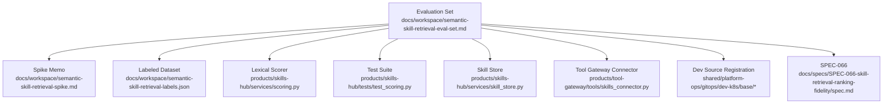
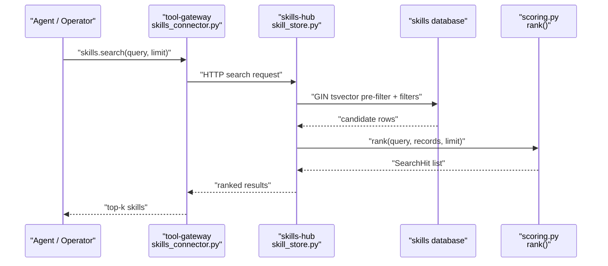
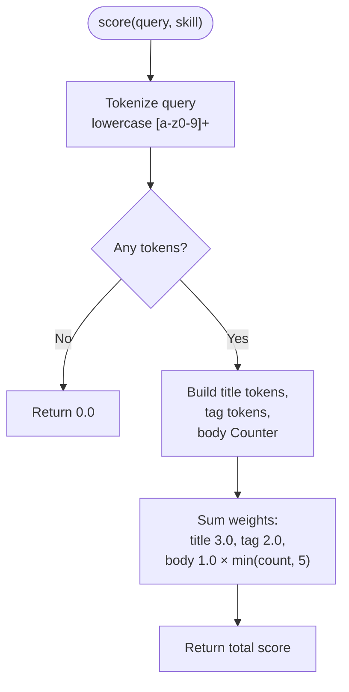
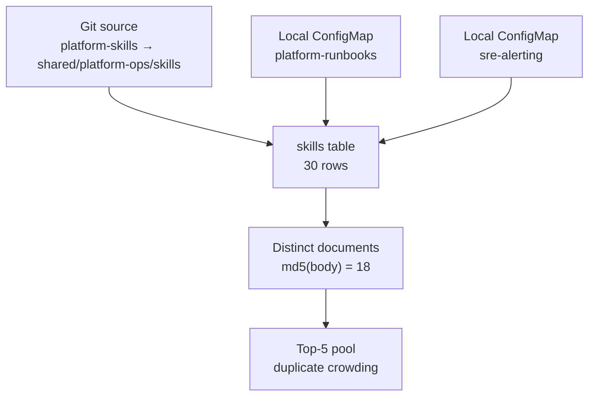
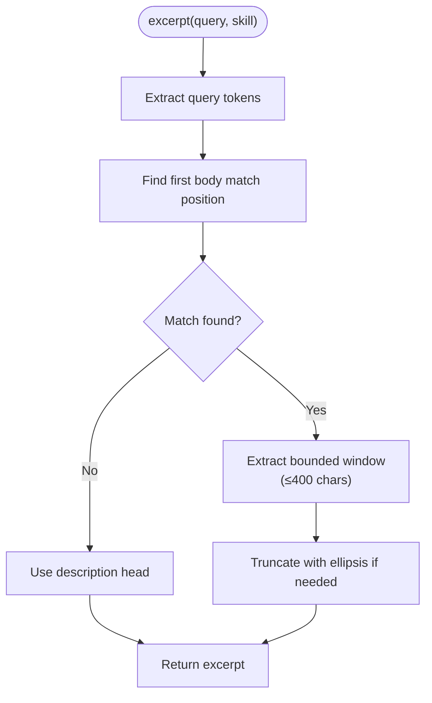
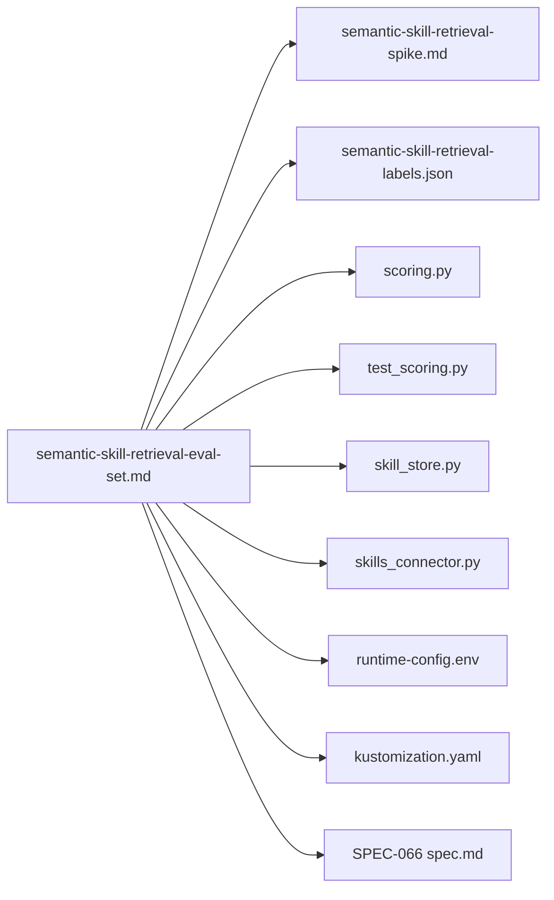

# Semantic Skill Retrieval Evaluation Set

<cite>
**Referenced Files in This Document**   
- [README.md](file://README.md)
- [semantic-skill-retrieval-spike.md](file://docs/workspace/semantic-skill-retrieval-spike.md)
- [semantic-skill-retrieval-eval-set.md](file://docs/workspace/semantic-skill-retrieval-eval-set.md)
- [semantic-skill-retrieval-labels.json](file://docs/workspace/semantic-skill-retrieval-labels.json)
- [scoring.py](file://products/skills-hub/src/skills_hub/services/scoring.py)
- [test_scoring.py](file://products/skills-hub/tests/test_scoring.py)
- [skill_store.py](file://products/skills-hub/src/skills_hub/services/skill_store.py)
- [skills_connector.py](file://products/tool-gateway/src/tool_gateway/tools/skills_connector.py)
- [runtime-config.env](file://shared/platform-ops/gitops/dev-k8s/base/skills-hub/runtime-config.env)
- [kustomization.yaml](file://shared/platform-ops/gitops/dev-k8s/base/kustomization.yaml)
- [SPEC-066 spec.md](file://docs/specs/SPEC-066-skill-retrieval-ranking-fidelity/spec.md)
</cite>

## Update Summary
**Changes Made**   
- Updated to reflect SPEC-066 promotion as successor while maintaining evidence base role
- Added clarifications about measurement license implications (memory path vs deployed environment)
- Enhanced parse_sources validation limitation documentation
- Updated conclusion section with SPEC-066 relationship and closure status

## Table of Contents
1. [Introduction](#introduction)
2. [Project Structure](#project-structure)
3. [Core Components](#core-components)
4. [Architecture Overview](#architecture-overview)
5. [Detailed Component Analysis](#detailed-component-analysis)
6. [Enhanced Test Coverage](#enhanced-test-coverage)
7. [Evaluation Methodology Improvements](#evaluation-methodology-improvements)
8. [Gate 1 Completion Results](#gate-1-completion-results)
9. [SPEC-066 Relationship](#spec-066-relationship)
10. [Dependency Analysis](#dependency-analysis)
11. [Performance Considerations](#performance-considerations)
12. [Troubleshooting Guide](#troubleshooting-guide)
13. [Conclusion](#conclusion)

## Introduction
This document describes the **Semantic Skill Retrieval Evaluation Set**, which has completed Gate 1 with comprehensive evaluation results and has been promoted to reference [SPEC-066 skill retrieval ranking fidelity](file://docs/specs/SPEC-066-skill-retrieval-ranking-fidelity/spec.md) as its successor specification. The evaluation set pins the current lexical skill-retrieval baseline for the platform's skills catalog and was used to determine whether semantic retrieval is worth building.

The workspace is organized as a modular platform with product-oriented projects (`products/`), shared contracts and operations assets (`shared/`), and design/specification documentation (`docs/`). The evaluation set lives under `docs/workspace/`, while the code it measures lives under `products/skills-hub/` and integrates with `products/tool-gateway/`.

**Section sources**
- [README.md:15-45](file://README.md#L15-L45)

## Project Structure
At a high level, the evaluation set connects three layers:

**Diagram sources**
- [semantic-skill-retrieval-eval-set.md:1-27](file://docs/workspace/semantic-skill-retrieval-eval-set.md#L1-L27)
- [semantic-skill-retrieval-spike.md:1-8](file://docs/workspace/semantic-skill-retrieval-spike.md#L1-L8)
- [semantic-skill-retrieval-labels.json:1-20](file://docs/workspace/semantic-skill-retrieval-labels.json#L1-L20)
- [scoring.py:1-10](file://products/skills-hub/src/skills_hub/services/scoring.py#L1-L10)
- [test_scoring.py:1-6](file://products/skills-hub/tests/test_scoring.py#L1-L6)
- [skill_store.py:437-463](file://products/skills-hub/src/skills_hub/services/skill_store.py#L437-L463)
- [skills_connector.py:31-38](file://products/tool-gateway/src/tool_gateway/tools/skills_connector.py#L31-L38)
- [runtime-config.env:19](file://shared/platform-ops/gitops/dev-k8s/base/skills-hub/runtime-config.env#L19)
- [kustomization.yaml:25-40](file://shared/platform-ops/gitops/dev-k8s/base/kustomization.yaml#L25-L40)
- [SPEC-066 spec.md:1-25](file://docs/specs/SPEC-066-skill-retrieval-ranking-fidelity/spec.md#L1-L25)

The evaluation set is pinned to repository state v0.45.0 and was built from read-only exports of the live `skills` and `audit` databases on the development cluster. Its purpose was to freeze the corpus, reproduce the real scorer's candidate pools, define labeling rules, and pre-register the decision rule that would determine whether semantic retrieval is worth building.

**Section sources**
- [semantic-skill-retrieval-eval-set.md:1-7](file://docs/workspace/semantic-skill-retrieval-eval-set.md#L1-L7)
- [semantic-skill-retrieval-spike.md:1-8](file://docs/workspace/semantic-skill-retrieval-spike.md#L1-L8)

## Core Components
The evaluation set centers on four concrete components:

| Component | Role | Key Property |
|---|---|---|
| Corpus snapshot | Deduplicated 18-document catalogue used as the ground truth surface | 30 stored rows collapse to 18 distinct documents by body hash |
| Query pool | 63 distinct queries extracted from audit events | Pooled at depth 10 so nDCG@10 and deeper ranking can be measured |
| Lexical scorer | Deterministic keyword scoring shared by both store backends | Title 3.0, tag 2.0, body occurrence 1.0 capped at 5 |
| Labeled dataset | Operations-led relevance judgment over (query, document) pairs | 684 judgments (38 queries × 18 documents), grades 0/1/2 |

The evaluation set explicitly states what it is **not**: it contains no embedding run, no vector index, and no change to the deployed scorer. Every number in its baseline section is a property of the scorer and the pinned corpus, not of answer quality.

**Section sources**
- [semantic-skill-retrieval-eval-set.md:9-27](file://docs/workspace/semantic-skill-retrieval-eval-set.md#L9-L27)
- [semantic-skill-retrieval-eval-set.md:207-239](file://docs/workspace/semantic-skill-retrieval-eval-set.md#L207-L239)
- [semantic-skill-retrieval-labels.json:684-688](file://docs/workspace/semantic-skill-retrieval-labels.json#L684-L688)
- [scoring.py:20-52](file://products/skills-hub/src/skills_hub/services/scoring.py#L20-L52)

## Architecture Overview
The retrieval path evaluated by this set flows through tool-gateway into skills-hub, where Postgres pre-filters candidates and Python re-ranks them deterministically.

**Diagram sources**
- [skills_connector.py:31-38](file://products/tool-gateway/src/tool_gateway/tools/skills_connector.py#L31-L38)
- [skill_store.py:437-463](file://products/skills-hub/src/skills_hub/services/skill_store.py#L437-L463)
- [scoring.py:85-96](file://products/skills-hub/src/skills_hub/services/scoring.py#L85-L96)

The spike memo emphasizes that the top-5 result window is saturated in the observed traffic: zero-hit searches are absent, so the real risk is ordering inside the returned set rather than empty answers. That observation is why the evaluation set focuses on precision, MRR, nDCG, rank stability, and zero-relevant rate instead of treating zero-hit rate as evidence of recall failure.

**Section sources**
- [semantic-skill-retrieval-spike.md:17-25](file://docs/workspace/semantic-skill-retrieval-spike.md#L17-L25)
- [semantic-skill-retrieval-spike.md:105-113](file://docs/workspace/semantic-skill-retrieval-spike.md#L105-L113)

## Detailed Component Analysis

### Lexical Scorer
The scorer is intentionally small and deterministic. Tokenization uses lowercase alphanumeric tokens only; there is no stemming, synonym expansion, fuzzy matching, or prefix matching. Scores are additive across fields: title matches contribute 3.0 per token, tag matches 2.0, and body occurrences 1.0 each up to a cap of five. Zero-score records are excluded, and ties break by ascending `skill_id`.

**Diagram sources**
- [scoring.py:20-52](file://products/skills-hub/src/skills_hub/services/scoring.py#L20-L52)

The test suite pins the same invariants: title match equals 3.0, tag match equals 2.0, body occurrences compose and saturate, empty or non-alphanumeric queries return zero, zero-score records are excluded from ranking, ties break by `skill_id` ascending, and ranking is deterministic regardless of input order.

**Section sources**
- [scoring.py:28-52](file://products/skills-hub/src/skills_hub/services/scoring.py#L28-L52)
- [test_scoring.py:33-64](file://products/skills-hub/tests/test_scoring.py#L33-L64)
- [test_scoring.py:84-118](file://products/skills-hub/tests/test_scoring.py#L84-L118)

### Postgres Pre-Filter and Re-Ranking
The Postgres backend does not compute the final score itself. It builds a GIN-indexed text-search expression over title and body, joins lexemes with OR, applies source/tag filters, fetches candidate rows, converts them to `Skill` objects, and then calls the shared `rank()` function. Tags cannot participate in the immutable index expression and are therefore matched separately.

**Diagram sources**
- [skill_store.py:437-463](file://products/skills-hub/src/skills_hub/services/skill_store.py#L437-L463)
- [scoring.py:85-96](file://products/skills-hub/src/skills_hub/services/scoring.py#L85-L96)

**Section sources**
- [skill_store.py:437-463](file://products/skills-hub/src/skills_hub/services/skill_store.py#L437-L463)
- [semantic-skill-retrieval-spike.md:66-68](file://docs/workspace/semantic-skill-retrieval-spike.md#L66-L68)

### Dev Source Overlap and Duplicate Crowding
The evaluation set identifies a configuration defect: the dev environment registers overlapping sources so that the same files reach the store through two routes. One git source points at the parent directory containing the local ConfigMap-mounted trees, and the ConfigMaps are generated from those same files. As a result, 12 of the 30 stored rows are byte-identical duplicates of another row, collapsing to 18 distinct documents.

Because `rank()` has no content-level de-duplication, duplicate copies occupy separate slots in the top-5 window and tie-break alphabetically by `skill_id`. The measured consequence is that 32 of 63 queries return fewer distinct documents than result slots, including 22 of 49 discriminating queries.

**Diagram sources**
- [semantic-skill-retrieval-eval-set.md:47-84](file://docs/workspace/semantic-skill-retrieval-eval-set.md#L47-L84)
- [runtime-config.env:19](file://shared/platform-ops/gitops/dev-k8s/base/skills-hub/runtime-config.env#L19)
- [kustomization.yaml:25-40](file://shared/platform-ops/gitops/dev-k8s/base/kustomization.yaml#L25-L40)

**Section sources**
- [semantic-skill-retrieval-eval-set.md:47-84](file://docs/workspace/semantic-skill-retrieval-eval-set.md#L47-L84)

### CamelCase Opacity and Tie-Break Variance
The tokenizer treats `KubePodCrashLooping` as one opaque lowercase token rather than splitting it into meaningful subwords. Because every `sre-alerting` alert title is CamelCase, no sub-word query term can match at the highest title weight. Combined with strict token equality and no stemming, this means queries like `crashloop` cannot reach the `CrashLoopBackOff` tag.

The evaluation set demonstrates the practical impact: for the query about pods restarting with `CrashLoopBackOff`, the exactly relevant document ranks third, tied with unrelated scheduling failures, and loses its slot to alphabetical `skill_id` ordering. Adding one word changes the top result, which is precisely the kind of variance the evaluation set's rank-stability metric exists to detect.

**Section sources**
- [semantic-skill-retrieval-eval-set.md:86-116](file://docs/workspace/semantic-skill-retrieval-eval-set.md#L86-L116)
- [scoring.py:20-30](file://products/skills-hub/src/skills_hub/services/scoring.py#L20-L30)
- [scoring.py:85-96](file://products/skills-hub/src/skills_hub/services/scoring.py#L85-L96)

### Zero-Hit Rate vs Zero-Relevant Rate
The evaluation set corrects a common misinterpretation: zero-hit rate is not a proxy for correctness. All 96 recorded searches returned at least one hit, but some top hits are confidently scored yet irrelevant — for example, a health-check query scoring highly against an unrelated ACME Admin service health document.

The decisive metric is **zero-relevant rate**: the fraction of queries whose entire top-5 contains no document graded as partially or directly relevant. Negative controls in stratum C are mandatory because they are the only queries that can measure this failure mode.

**Section sources**
- [semantic-skill-retrieval-eval-set.md:118-133](file://docs/workspace/semantic-skill-retrieval-eval-set.md#L118-L133)
- [semantic-skill-retrieval-eval-set.md:361-364](file://docs/workspace/semantic-skill-retrieval-eval-set.md#L361-L364)

### Evaluation Set Structure
The evaluation set organizes work into three strata:

| Stratum | Purpose | Headline Use |
|---|---|---|
| A | Queries already containing the target identifier | Regression check only; excluded from headline metrics |
| B | Remaining real-traffic queries | Headline metrics; represents demo/e2e operator vocabulary |
| C | Paraphrases and negative controls | Decides whether lexical or semantic retrieval is needed |

The minimum viable labeling effort targets 38 queries spanning guide documents, alert documents, sample runbooks, and all paraphrase/negative-control queries. Full coverage would approach ~500 pooled judgments.

**Section sources**
- [semantic-skill-retrieval-eval-set.md:328-400](file://docs/workspace/semantic-skill-retrieval-eval-set.md#L328-L400)

### Metrics and Decision Rule
The pre-registered decision rule evaluates candidates in cost order:

1. De-duplicate identical content and/or fix overlapping source registration.
2. Improve the tokenizer and tie-breaking strategy.
3. Add hybrid or vector retrieval only if steps 1–2 do not close the gap.

Promotion to a spec requires measurable improvement on Precision@5 or MRR outside the noise band, no regression in rank stability, latency staying within the tool-gateway timeout, and fail-open behavior when the embedder is unavailable. If a cheaper step closes the gap, semantic work is canceled and the backlog row closes.

**Section sources**
- [semantic-skill-retrieval-eval-set.md:419-449](file://docs/workspace/semantic-skill-retrieval-eval-set.md#L419-L449)
- [semantic-skill-retrieval-spike.md:547-582](file://docs/workspace/semantic-skill-retrieval-spike.md#L547-L582)

## Enhanced Test Coverage

The evaluation set benefits from comprehensive test coverage that validates the core scoring functionality and ensures deterministic behavior across different scenarios.

### Scoring Function Tests
The test suite provides thorough validation of the scoring algorithm's core behaviors:

| Test Category | Coverage Area | Validation Method |
|---|---|---|
| Weight Composition | Title (3.0), Tag (2.0), Body (1.0) scoring | Direct assertion of expected scores |
| Tokenization | Lowercase alphanumeric token extraction | Regex pattern validation |
| Saturation Logic | Body occurrence capping at 5 | Multi-occurrence testing |
| Edge Cases | Empty queries, special characters | Boundary condition testing |
| Ranking Determinism | Stable sort order | Input order permutation testing |

### Excerpt Generation Tests
New excerpt functionality tests ensure proper snippet generation:

**Diagram sources**
- [scoring.py:55-75](file://products/skills-hub/src/skills_hub/services/scoring.py#L55-L75)

### Integration Test Coverage
The test suite includes integration tests that validate end-to-end functionality:

- **Shipped Password Skill Discovery**: Validates that real skill documents are discoverable through the scoring system
- **Zero Score Filtering**: Ensures irrelevant documents are properly excluded from results
- **Tie-Break Consistency**: Confirms stable ordering when scores are equal
- **Limit Enforcement**: Verifies result count caps are respected

**Section sources**
- [test_scoring.py:33-64](file://products/skills-hub/tests/test_scoring.py#L33-L64)
- [test_scoring.py:67-119](file://products/skills-hub/tests/test_scoring.py#L67-L119)
- [test_scoring.py:121-137](file://products/skills-hub/tests/test_scoring.py#L121-L137)

## Evaluation Methodology Improvements

### Refined Labeling Protocol
The evaluation methodology has been strengthened with more rigorous labeling requirements:

1. **Document-Level Labeling**: Labels attach to documents (D01-D18), not corpus rows, ensuring consistency even if source configuration changes
2. **Blind Judgment**: Labelers must judge relevance without seeing the current ranking to avoid anchoring bias
3. **Full Catalogue Review**: Any document may be graded for any query, preventing pool-based recall bias
4. **Inter-Rater Reliability**: Two labelers with 20-query overlap and Cohen's κ reporting ensures label quality

### Enhanced Strata Definitions
The three-strata system has been refined for better discrimination:

| Stratum | Size | Discrimination Power | Primary Use |
|---|---:|---:|---|
| A | 14 | Low (identifier-bearing) | Regression testing only |
| B | 49 | High (real traffic) | Headline metrics |
| C | ≥18 | Critical (paraphrase) | Lexical vs semantic decision |

### New Metrics and Measurement Approaches
The evaluation methodology now includes several new metrics:

- **Zero-Relevant Rate**: Fraction of queries with no grade ≥1 document in top-5
- **Distinct-Document Variants**: Metrics computed both as returned and over de-duplicated documents
- **Rank Stability**: Measures how sensitive rankings are to minor query variations
- **Confidence Intervals**: Statistical bounds around performance differences

**Section sources**
- [semantic-skill-retrieval-eval-set.md:455-530](file://docs/workspace/semantic-skill-retrieval-eval-set.md#L455-L530)
- [semantic-skill-retrieval-eval-set.md:549-583](file://docs/workspace/semantic-skill-retrieval-eval-set.md#L549-L583)

## Gate 1 Completion Results

Gate 1 has been completed with comprehensive evaluation results based on a labeled dataset containing 684 judgments (38 queries × 18 documents). The evaluation revealed several critical findings that fundamentally changed the assessment of semantic retrieval needs.

### Comprehensive Labeled Dataset
The labeled dataset contains:
- **38 queries** (20 stratum B + 18 stratum C)
- **684 total judgments** (38 × 18 documents per query)
- **173 non-zero judgments** (52 grade 2, 121 grade 1)
- **511 explicit zero judgments**

The dataset was drafted by the spike author and submitted for operator ratification, passing as "author-proposed, operator-ratified" rather than blind operations labeling.

### Document-Length Bias Discovery
During labeling, a fourth defect was discovered that changes *which* document wins rather than how many slots are filled:

- **Sample documents average 9,718 chars** vs **runbook documents average 1,424 chars** (6.8× longer)
- At the cap of 5 occurrences, sample documents earn up to `5 × 1.0` per matched token where runbooks earn fewer simply by being shorter
- Body matches supply **70–100% of the winning score** in cases where the lexical top-1 is graded 0
- Sample documents take top-1 on **10 of 18** paraphrase queries, although only 4 concern them at all

### skill_id Indexing Issues
The evaluation revealed that `skill_id` is not an indexed field:

- `score()` reads exactly three fields: `title`, `tags`, and `body` — never `skill.skill_id`
- An operator who types a skill's exact name gets zero signal from it
- Cross-reference rows are worse than invisible ones: where a skill name appears in *other* documents' bodies as a cross-reference, those documents earn the credit that the owner cannot
- Of the 14 stratum-A queries, only 3 name an identifier that exists in the corpus, and the shipped scorer ranks the owning document first for **0 of those 3**

### Decision Rule Outcome
Applying the pre-registered decision rule resulted in the closure of semantic retrieval work:

1. **Step 1 — De-duplicate**: Configuration half done (dev overlay cleaned), product half remains open as guardrail
2. **Step 2 — Tokenizer fixes**: Substantially closes the measured gap with combined top-1 correctness improving from 0.500 to 0.711
3. **Step 3 — Hybrid/vector retrieval**: **NOT AUTHORIZED** — the defect it would address does not exist

The key finding is that **there is no recall gap to recover**: zero grade-2 documents are missing from the top 10 on any of the 38 queries, and `R@5(=2)` on real traffic is already 1.000. Therefore, embedding work is not authorized and the backlog row closes.

**Section sources**
- [semantic-skill-retrieval-eval-set.md:672-734](file://docs/workspace/semantic-skill-retrieval-eval-set.md#L672-L734)
- [semantic-skill-retrieval-eval-set.md:790-965](file://docs/workspace/semantic-skill-retrieval-eval-set.md#L790-L965)
- [semantic-skill-retrieval-labels.json:684-688](file://docs/workspace/semantic-skill-retrieval-labels.json#L684-L688)

## SPEC-066 Relationship

The evaluation set has been promoted to reference [SPEC-066 skill retrieval ranking fidelity](file://docs/specs/SPEC-066-skill-retrieval-ranking-fidelity/spec.md) as its successor specification while maintaining its role as the evidence base. This relationship establishes clear boundaries between measurement artifacts and implementation specifications.

### Evidence Base vs Implementation Specification

The evaluation set serves as the **committed label fixture** (§7.1) that SPEC-066's R-8 must re-measure against, **through the Postgres backend** rather than through `rank()` directly. This distinction is critical because §8's numbers were produced offline over a corpus export with no prefilter in the path, so **0.500 → 0.711 is a memory-path upper bound for deployed environments**, not a shipped figure.

### Measurement License Implications

The evaluation set's measurement licenses specific claims while explicitly not licensing others:

**Licensed:**
- Memory-path scoring improvements (offline `rank()` over corpus export)
- Top-1 correctness improvement from 0.500 to 0.711
- Statistical significance (p = 0.0117) for the combined lexical fixes
- Closure of the semantic retrieval backlog row

**Not Licensed:**
- Backend-neutral behavior (three of four fixes are not backend-neutral as measured)
- Deployed environment performance (Postgres prefilter may affect results)
- Byte-identical ordering parity across backends (no parity test existed)
- IDF corpus statistics computation method (backend-dependent)

### Parse Sources Validation Limitations

The evaluation set clarified important limitations in configuration validation:

- `parse_sources` validates JSON shape, id patterns, required per-type keys, and duplicate `source_id` values
- However, it **never sees file content** and therefore cannot detect two sources covering the same files
- The duplicate-`skill_id` check in ingestion is scoped to a single source and cannot see across federation
- This makes the dev-overlay change a measurement enabler but not a product guardrail

### SPEC-066 Requirements Derived from Evaluation

The evaluation set directly informed SPEC-066's requirements:

| Requirement | Evaluation Finding | Impact |
|---|---|---|
| R-1: Score `skill_id` | `skill_id` not indexed, exact names invisible | Add slug scoring field |
| R-2: IDF weighting | Function words score equally as domain terms | Corpus-derived frequency weighting |
| R-3: Length normalization | Sample docs 6.8× longer than runbooks | Sublinear body-length dampening |
| R-4: CamelCase splitting | Single-token opacity for alert titles | Split CamelCase runs |
| R-5: Cross-backend parity | No parity test existed despite documented invariant | Enforce byte-identical ordering |
| R-7: De-duplication guardrail | Configuration overlap exposed missing product capability | Content-level de-duplication |

**Section sources**
- [semantic-skill-retrieval-eval-set.md:7](file://docs/workspace/semantic-skill-retrieval-eval-set.md#L7)
- [SPEC-066 spec.md:1-25](file://docs/specs/SPEC-066-skill-retrieval-ranking-fidelity/spec.md#L1-L25)
- [SPEC-066 spec.md:66-135](file://docs/specs/SPEC-066-skill-retrieval-ranking-fidelity/spec.md#L66-L135)
- [SPEC-066 spec.md:153-357](file://docs/specs/SPEC-066-skill-retrieval-ranking-fidelity/spec.md#L153-L357)

## Dependency Analysis
The evaluation set depends on several concrete paths:

**Diagram sources**
- [semantic-skill-retrieval-eval-set.md:1-7](file://docs/workspace/semantic-skill-retrieval-eval-set.md#L1-L7)
- [semantic-skill-retrieval-spike.md:1-8](file://docs/workspace/semantic-skill-retrieval-spike.md#L1-L8)
- [semantic-skill-retrieval-labels.json:1-20](file://docs/workspace/semantic-skill-retrieval-labels.json#L1-L20)
- [scoring.py:1-10](file://products/skills-hub/src/skills_hub/services/scoring.py#L1-L10)
- [test_scoring.py:1-6](file://products/skills-hub/tests/test_scoring.py#L1-L6)
- [skill_store.py:437-463](file://products/skills-hub/src/skills_hub/services/skill_store.py#L437-L463)
- [skills_connector.py:31-38](file://products/tool-gateway/src/tool_gateway/tools/skills_connector.py#L31-L38)
- [runtime-config.env:19](file://shared/platform-ops/gitops/dev-k8s/base/skills-hub/runtime-config.env#L19)
- [kustomization.yaml:25-40](file://shared/platform-ops/gitops/dev-k8s/base/kustomization.yaml#L25-L40)
- [SPEC-066 spec.md:1-25](file://docs/specs/SPEC-066-skill-retrieval-ranking-fidelity/spec.md#L1-L25)

Coupling is strongest between the evaluation set and the scorer, because the set reproduces the exact `rank()` behavior against a pinned corpus. Coupling to the store and connector is structural: the set documents how the scorer fits into the broader retrieval boundary, but it does not authorize changing either.

**Section sources**
- [semantic-skill-retrieval-eval-set.md:156-194](file://docs/workspace/semantic-skill-retrieval-eval-set.md#L156-L194)

## Performance Considerations
The evaluation set treats performance as a gating constraint rather than an optimization goal:

- Search latency p50/p95 must stay inside the tool-gateway's 10.0 second upstream timeout.
- At the current corpus size, exact cosine computation over 18 distinct documents is sub-millisecond and needs no ANN index.
- Any future semantic substrate must demonstrate that added latency remains bounded, especially when the embedder is cold.
- Sync-path embedding cost and billable spend are measured separately from query latency.

The spike memo recommends deferring ANN tuning until the catalog grows past a recorded scale trigger, proposing promotion to pgvector at more than 2,000 skills or search p95 above 300 ms.

**Section sources**
- [semantic-skill-retrieval-eval-set.md:431-433](file://docs/workspace/semantic-skill-retrieval-eval-set.md#L431-L433)
- [semantic-skill-retrieval-spike.md:262-284](file://docs/workspace/semantic-skill-retrieval-spike.md#L262-L284)
- [semantic-skill-retrieval-spike.md:683-686](file://docs/workspace/semantic-skill-retrieval-spike.md#L683-L686)

## Troubleshooting Guide
When working with the evaluation set, the most common issues fall into several categories:

| Issue | Symptom | Resolution |
|---|---|---|
| Catalog drift | Historical audit `skill_ids` differ from today's pool | Regenerate the pool against the pinned snapshot; do not reuse old results |
| Duplicate crowding | Top-5 contains fewer distinct documents than slots | Collapse identical content in scoring or fix overlapping source registration |
| Irrelevant top hits | Non-zero hit count but no grade ≥1 document | Report zero-relevant rate, not zero-hit rate |
| Unlabeled set | Numbers reflect author guesses, not retrieval quality | Require operations ownership and two-labeler agreement |
| Missing paraphrase signal | Cannot distinguish lexical from semantic | Include stratum C negative controls |
| Excerpt generation errors | Snippets don't start at expected positions | Verify tokenization and body match finding logic |
| Test failures | Inconsistent ranking or scoring behavior | Check input order independence and tie-breaking logic |
| Labeling inconsistency | Low inter-rater reliability | Provide clearer grading guidelines and increase overlap |
| Document-length bias | Long sample documents dominate rankings | Apply IDF weighting and length normalization |
| skill_id invisibility | Exact skill names get no signal | Index `skill_id` field in scoring |
| Backend parity issues | Different results between memory and Postgres | Implement R-5 cross-backend parity harness |
| SPEC-066 measurement mismatch | Offline gains not reproduced on Postgres | Re-measure through Postgres backend per R-8 |

The reproduction procedure is read-only: export the corpus, extract distinct queries and their audit statistics, import the real scorer, and call `rank()` offline. Validation compares reproduced `skill_ids` against historical audit records for cross-checked queries whose catalogs have not drifted.

**Section sources**
- [semantic-skill-retrieval-eval-set.md:156-205](file://docs/workspace/semantic-skill-retrieval-eval-set.md#L156-L205)
- [semantic-skill-retrieval-eval-set.md:377-400](file://docs/workspace/semantic-skill-retrieval-eval-set.md#L377-L400)

## Conclusion
The Semantic Skill Retrieval Evaluation Set has successfully completed Gate 1 with comprehensive evaluation results and has been promoted to reference SPEC-066 as its successor specification while maintaining its role as the evidence base. The evaluation was deliberately conservative, freezing the current 18-document corpus, reproducing the real lexical scorer's candidate pools, defining a labeled evaluation protocol, and pre-registering a cost-ordered decision rule.

**Key Findings:**
- **684 judgments** were analyzed across 38 queries and 18 documents
- **Document-length bias** was discovered, with sample documents being 6.8× longer than runbooks
- **skill_id indexing issues** were identified, making exact skill names invisible to the scorer
- **Lexical improvements substantially closed the measured gap** without requiring embedding work
- **No recall gap exists** — zero grade-2 documents are missing from the top 10 on any query
- **Semantic retrieval backlog has been closed** — no embedding work is authorized
- **SPEC-066 established** as the successor specification for implementing the four measured lexical fixes

The enhanced test coverage and improved evaluation methodology provided a solid foundation for measuring retrieval quality. The comprehensive labeled dataset revealed that the immediate defects — duplicate-source crowding (now resolved), CamelCase opacity, confident-but-irrelevant top hits, document-length bias, and skill_id indexing issues — are measurable and potentially fixable without introducing a vector store.

The decision to close semantic retrieval work is significant: it demonstrates that careful measurement before implementation can prevent unnecessary infrastructure complexity. The lexical improvements (IDF weighting, length normalization, CamelCase splitting, and skill_id indexing) achieved substantial gains in top-1 correctness (0.500 → 0.711) and statistical significance (p = 0.0117), proving that simpler solutions can often address complex problems effectively.

While the semantic retrieval backlog is closed, the evaluation identified remaining work items: implementing the product-side de-duplication guardrail, addressing the abstention problem (where the system returns confident but irrelevant answers), and potentially creating a separate backlog row for abstention behavior. These represent product decisions rather than retrieval algorithm questions, maintaining the principle that measurement should drive implementation choices.

The relationship with SPEC-066 establishes clear boundaries: the evaluation set remains the committed evidence base and label fixture, while SPEC-066 specifies the implementation requirements derived from that evidence. The measurement license implications clarify that the 0.500 → 0.711 improvement is a memory-path upper bound, and the full deployment requires re-measurement through the Postgres backend per R-8.

The comprehensive test suite ensures that the scoring system behaves deterministically and predictably, providing confidence that any improvements measured are genuine rather than artifacts of implementation inconsistencies. The evaluation process established a robust framework for future retrieval assessments, demonstrating the value of measurement-driven development in avoiding unnecessary complexity.