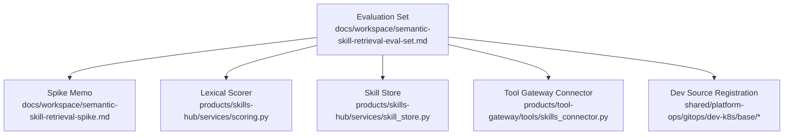
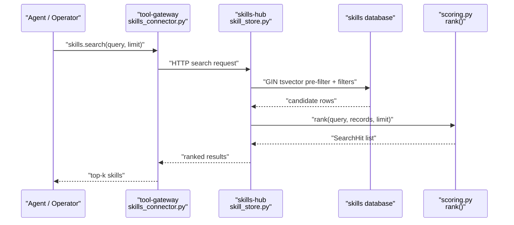
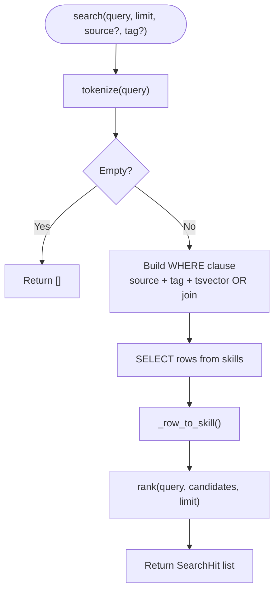
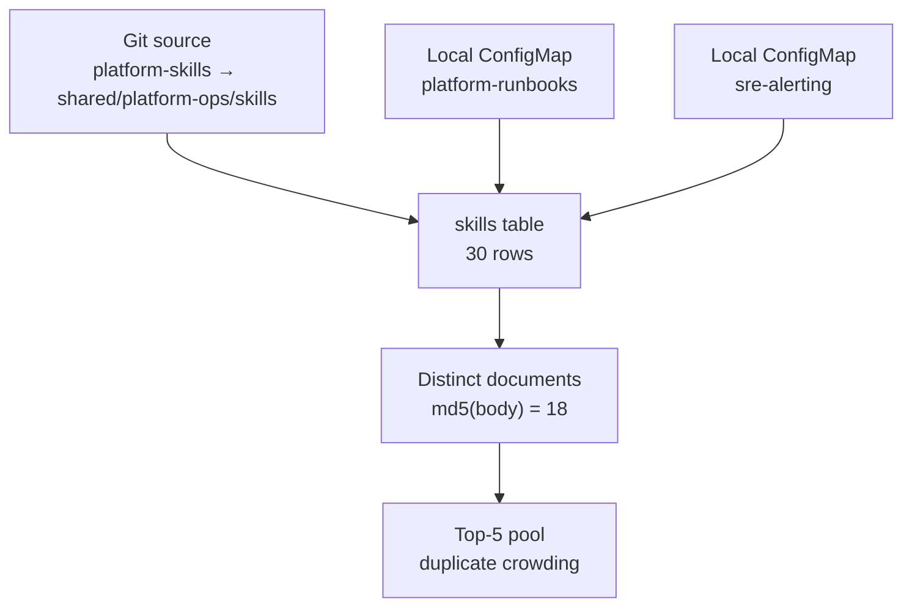
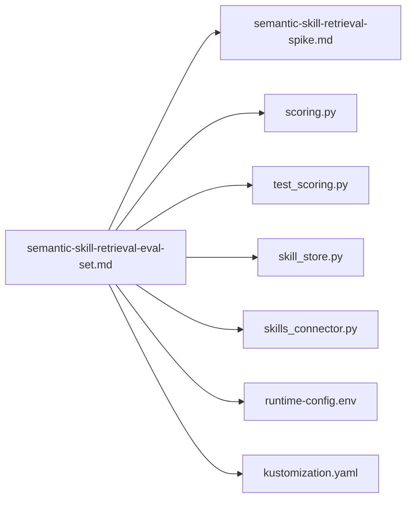

# Semantic Skill Retrieval Evaluation Set

<cite>
**Referenced Files in This Document**   
- [README.md](file://README.md)
- [semantic-skill-retrieval-spike.md](file://docs/workspace/semantic-skill-retrieval-spike.md)
- [semantic-skill-retrieval-eval-set.md](file://docs/workspace/semantic-skill-retrieval-eval-set.md)
- [scoring.py](file://products/skills-hub/src/skills_hub/services/scoring.py)
- [test_scoring.py](file://products/skills-hub/tests/test_scoring.py)
- [skill_store.py](file://products/skills-hub/src/skills_hub/services/skill_store.py)
- [skills_connector.py](file://products/tool-gateway/src/tool_gateway/tools/skills_connector.py)
- [runtime-config.env](file://shared/platform-ops/gitops/dev-k8s/base/skills-hub/runtime-config.env)
- [kustomization.yaml](file://shared/platform-ops/gitops/dev-k8s/base/kustomization.yaml)
</cite>

## Table of Contents
1. [Introduction](#introduction)
2. [Project Structure](#project-structure)
3. [Core Components](#core-components)
4. [Architecture Overview](#architecture-overview)
5. [Detailed Component Analysis](#detailed-component-analysis)
6. [Dependency Analysis](#dependency-analysis)
7. [Performance Considerations](#performance-considerations)
8. [Troubleshooting Guide](#troubleshooting-guide)
9. [Conclusion](#conclusion)

## Introduction
This document describes the **Semantic Skill Retrieval Evaluation Set**, a measurement artifact that pins the current lexical skill-retrieval baseline for the platform’s skills catalog and prepares it for operations-led relevance labeling. It is not an implementation, ADR, or spec; it is the input to a gate: measure before building semantic retrieval.

The workspace is organized as a modular platform with product-oriented projects (`products/`), shared contracts and operations assets (`shared/`), and design/specification documentation (`docs/`). The evaluation set lives under `docs/workspace/`, while the code it measures lives under `products/skills-hub/` and integrates with `products/tool-gateway/`.

**Section sources**
- [README.md:15-45](file://README.md#L15-L45)

## Project Structure
At a high level, the evaluation set connects three layers:

**Diagram sources**
- [semantic-skill-retrieval-eval-set.md:1-27](file://docs/workspace/semantic-skill-retrieval-eval-set.md#L1-L27)
- [semantic-skill-retrieval-spike.md:1-8](file://docs/workspace/semantic-skill-retrieval-spike.md#L1-L8)
- [scoring.py:1-10](file://products/skills-hub/src/skills_hub/services/scoring.py#L1-L10)
- [skill_store.py:437-463](file://products/skills-hub/src/skills_hub/services/skill_store.py#L437-L463)
- [skills_connector.py:31-38](file://products/tool-gateway/src/tool_gateway/tools/skills_connector.py#L31-L38)
- [runtime-config.env:19](file://shared/platform-ops/gitops/dev-k8s/base/skills-hub/runtime-config.env#L19)
- [kustomization.yaml:25-40](file://shared/platform-ops/gitops/dev-k8s/base/kustomization.yaml#L25-L40)

The evaluation set is pinned to repository state v0.45.0 and was built from read-only exports of the live `skills` and `audit` databases on the development cluster. Its purpose is to freeze the corpus, reproduce the real scorer’s candidate pools, define labeling rules, and pre-register the decision rule that will determine whether semantic retrieval is worth building.

**Section sources**
- [semantic-skill-retrieval-eval-set.md:1-7](file://docs/workspace/semantic-skill-retrieval-eval-set.md#L1-L7)
- [semantic-skill-retrieval-spike.md:1-8](file://docs/workspace/semantic-skill-retrieval-spike.md#L1-L8)

## Core Components
The evaluation set centers on four concrete components:

| Component | Role | Key Property |
|---|---|---|
| Corpus snapshot | Deduplicated 18-document catalogue used as the ground truth surface | 30 stored rows collapse to 18 distinct documents by body hash |
| Query pool | 63 distinct queries extracted from audit events | Pooled at depth 10 so nDCG@10 and deeper ranking can be measured |
| Lexical scorer | Deterministic keyword scoring shared by both store backends | Title 3.0, tag 2.0, body occurrence 1.0 capped at 5 |
| Labeling protocol | Operations-led relevance judgment over (query, document) pairs | Grades 0/1/2, two labelers, agreement reported |

The evaluation set explicitly states what it is **not**: it contains no labels, no embedding run, no vector index, and no change to the deployed scorer. Every number in its baseline section is a property of the scorer and the pinned corpus, not of answer quality.

**Section sources**
- [semantic-skill-retrieval-eval-set.md:9-27](file://docs/workspace/semantic-skill-retrieval-eval-set.md#L9-L27)
- [semantic-skill-retrieval-eval-set.md:207-239](file://docs/workspace/semantic-skill-retrieval-eval-set.md#L207-L239)
- [scoring.py:20-52](file://products/skills-hub/src/skills_hub/services/scoring.py#L20-L52)

## Architecture Overview
The retrieval path evaluated by this set flows through tool-gateway into skills-hub, where Postgres pre-filters candidates and Python re-ranks them deterministically.

**Diagram sources**
- [skills_connector.py:31-38](file://products/tool-gateway/src/tool_gateway/tools/skills_connector.py#L31-L38)
- [skill_store.py:437-463](file://products/skills-hub/src/skills_hub/services/skill_store.py#L437-L463)
- [scoring.py:85-96](file://products/skills-hub/src/skills_hub/services/scoring.py#L85-L96)

The spike memo emphasizes that the top-5 result window is saturated in the observed traffic: zero-hit searches are absent, so the real risk is ordering inside the returned set rather than empty answers. That observation is why the evaluation set focuses on precision, MRR, nDCG, rank stability, and zero-relevant rate instead of treating zero-hit rate as evidence of recall failure.

**Section sources**
- [semantic-skill-retrieval-spike.md:17-25](file://docs/workspace/semantic-skill-retrieval-spike.md#L17-L25)
- [semantic-skill-retrieval-spike.md:105-113](file://docs/workspace/semantic-skill-retrieval-spike.md#L105-L113)

## Detailed Component Analysis

### Lexical Scorer
The scorer is intentionally small and deterministic. Tokenization uses lowercase alphanumeric tokens only; there is no stemming, synonym expansion, fuzzy matching, or prefix matching. Scores are additive across fields: title matches contribute 3.0 per token, tag matches 2.0, and body occurrences 1.0 each up to a cap of five. Zero-score records are excluded, and ties break by ascending `skill_id`.

**Diagram sources**
- [scoring.py:20-52](file://products/skills-hub/src/skills_hub/services/scoring.py#L20-L52)

The test suite pins the same invariants: title match equals 3.0, tag match equals 2.0, body occurrences compose and saturate, empty or non-alphanumeric queries return zero, zero-score records are excluded from ranking, ties break by `skill_id` ascending, and ranking is deterministic regardless of input order.

**Section sources**
- [scoring.py:28-52](file://products/skills-hub/src/skills_hub/services/scoring.py#L28-L52)
- [test_scoring.py:33-64](file://products/skills-hub/tests/test_scoring.py#L33-L64)
- [test_scoring.py:84-118](file://products/skills-hub/tests/test_scoring.py#L84-L118)

### Postgres Pre-Filter and Re-Ranking
The Postgres backend does not compute the final score itself. It builds a GIN-indexed text-search expression over title and body, joins lexemes with OR, applies source/tag filters, fetches candidate rows, converts them to `Skill` objects, and then calls the shared `rank()` function. Tags cannot participate in the immutable index expression and are therefore matched separately.

**Diagram sources**
- [skill_store.py:437-463](file://products/skills-hub/src/skills_hub/services/skill_store.py#L437-L463)
- [scoring.py:85-96](file://products/skills-hub/src/skills_hub/services/scoring.py#L85-L96)

**Section sources**
- [skill_store.py:437-463](file://products/skills-hub/src/skills_hub/services/skill_store.py#L437-L463)
- [semantic-skill-retrieval-spike.md:66-68](file://docs/workspace/semantic-skill-retrieval-spike.md#L66-L68)

### Dev Source Overlap and Duplicate Crowding
The evaluation set identifies a configuration defect: the dev environment registers overlapping sources so that the same files reach the store through two routes. One git source points at the parent directory containing the local ConfigMap-mounted trees, and the ConfigMaps are generated from those same files. As a result, 12 of the 30 stored rows are byte-identical duplicates of another row, collapsing to 18 distinct documents.

Because `rank()` has no content-level de-duplication, duplicate copies occupy separate slots in the top-5 window and tie-break alphabetically by `skill_id`. The measured consequence is that 32 of 63 queries return fewer distinct documents than result slots, including 22 of 49 discriminating queries.

**Diagram sources**
- [semantic-skill-retrieval-eval-set.md:47-84](file://docs/workspace/semantic-skill-retrieval-eval-set.md#L47-L84)
- [runtime-config.env:19](file://shared/platform-ops/gitops/dev-k8s/base/skills-hub/runtime-config.env#L19)
- [kustomization.yaml:25-40](file://shared/platform-ops/gitops/dev-k8s/base/kustomization.yaml#L25-L40)

**Section sources**
- [semantic-skill-retrieval-eval-set.md:47-84](file://docs/workspace/semantic-skill-retrieval-eval-set.md#L47-L84)

### CamelCase Opacity and Tie-Break Variance
The tokenizer treats `KubePodCrashLooping` as one opaque lowercase token rather than splitting it into meaningful subwords. Because every `sre-alerting` alert title is CamelCase, no sub-word query term can match at the highest title weight. Combined with strict token equality and no stemming, this means queries like `crashloop` cannot reach the `CrashLoopBackOff` tag.

The evaluation set demonstrates the practical impact: for the query about pods restarting with `CrashLoopBackOff`, the exactly relevant document ranks third, tied with unrelated scheduling failures, and loses its slot to alphabetical `skill_id` ordering. Adding one word changes the top result, which is precisely the kind of variance the evaluation set’s rank-stability metric exists to detect.

**Section sources**
- [semantic-skill-retrieval-eval-set.md:86-116](file://docs/workspace/semantic-skill-retrieval-eval-set.md#L86-L116)
- [scoring.py:20-30](file://products/skills-hub/src/skills_hub/services/scoring.py#L20-L30)
- [scoring.py:85-96](file://products/skills-hub/src/skills_hub/services/scoring.py#L85-L96)

### Zero-Hit Rate vs Zero-Relevant Rate
The evaluation set corrects a common misinterpretation: zero-hit rate is not a proxy for correctness. All 96 recorded searches returned at least one hit, but some top hits are confidently scored yet irrelevant — for example, a health-check query scoring highly against an unrelated ACME Admin service health document.

The decisive metric is **zero-relevant rate**: the fraction of queries whose entire top-5 contains no document graded as partially or directly relevant. Negative controls in stratum C are mandatory because they are the only queries that can measure this failure mode.

**Section sources**
- [semantic-skill-retrieval-eval-set.md:118-133](file://docs/workspace/semantic-skill-retrieval-eval-set.md#L118-L133)
- [semantic-skill-retrieval-eval-set.md:361-364](file://docs/workspace/semantic-skill-retrieval-eval-set.md#L361-L364)

### Evaluation Set Structure
The evaluation set organizes work into three strata:

| Stratum | Purpose | Headline Use |
|---|---|---|
| A | Queries already containing the target identifier | Regression check only; excluded from headline metrics |
| B | Remaining real-traffic queries | Headline metrics; represents demo/e2e operator vocabulary |
| C | Paraphrases and negative controls | Decides whether lexical or semantic retrieval is needed |

The minimum viable labeling effort targets 38 queries spanning guide documents, alert documents, sample runbooks, and all paraphrase/negative-control queries. Full coverage would approach ~500 pooled judgments.

**Section sources**
- [semantic-skill-retrieval-eval-set.md:328-400](file://docs/workspace/semantic-skill-retrieval-eval-set.md#L328-L400)

### Metrics and Decision Rule
The pre-registered decision rule evaluates candidates in cost order:

1. De-duplicate identical content and/or fix overlapping source registration.
2. Improve the tokenizer and tie-breaking strategy.
3. Add hybrid or vector retrieval only if steps 1–2 do not close the gap.

Promotion to a spec requires measurable improvement on Precision@5 or MRR outside the noise band, no regression in rank stability, latency staying within the tool-gateway timeout, and fail-open behavior when the embedder is unavailable. If a cheaper step closes the gap, semantic work is canceled and the backlog row closes.

**Section sources**
- [semantic-skill-retrieval-eval-set.md:419-449](file://docs/workspace/semantic-skill-retrieval-eval-set.md#L419-L449)
- [semantic-skill-retrieval-spike.md:547-582](file://docs/workspace/semantic-skill-retrieval-spike.md#L547-L582)

## Dependency Analysis
The evaluation set depends on several concrete paths:

**Diagram sources**
- [semantic-skill-retrieval-eval-set.md:1-7](file://docs/workspace/semantic-skill-retrieval-eval-set.md#L1-L7)
- [semantic-skill-retrieval-spike.md:1-8](file://docs/workspace/semantic-skill-retrieval-spike.md#L1-L8)
- [scoring.py:1-10](file://products/skills-hub/src/skills_hub/services/scoring.py#L1-L10)
- [test_scoring.py:1-6](file://products/skills-hub/tests/test_scoring.py#L1-L6)
- [skill_store.py:437-463](file://products/skills-hub/src/skills_hub/services/skill_store.py#L437-L463)
- [skills_connector.py:31-38](file://products/tool-gateway/src/tool_gateway/tools/skills_connector.py#L31-L38)
- [runtime-config.env:19](file://shared/platform-ops/gitops/dev-k8s/base/skills-hub/runtime-config.env#L19)
- [kustomization.yaml:25-40](file://shared/platform-ops/gitops/dev-k8s/base/kustomization.yaml#L25-L40)

Coupling is strongest between the evaluation set and the scorer, because the set reproduces the exact `rank()` behavior against a pinned corpus. Coupling to the store and connector is structural: the set documents how the scorer fits into the broader retrieval boundary, but it does not authorize changing either.

**Section sources**
- [semantic-skill-retrieval-eval-set.md:156-194](file://docs/workspace/semantic-skill-retrieval-eval-set.md#L156-L194)

## Performance Considerations
The evaluation set treats performance as a gating constraint rather than an optimization goal:

- Search latency p50/p95 must stay inside the tool-gateway’s 10.0 second upstream timeout.
- At the current corpus size, exact cosine computation over 18 distinct documents is sub-millisecond and needs no ANN index.
- Any future semantic substrate must demonstrate that added latency remains bounded, especially when the embedder is cold.
- Sync-path embedding cost and billable spend are measured separately from query latency.

The spike memo recommends deferring ANN tuning until the catalog grows past a recorded scale trigger, proposing promotion to pgvector at more than 2,000 skills or search p95 above 300 ms.

**Section sources**
- [semantic-skill-retrieval-eval-set.md:431-433](file://docs/workspace/semantic-skill-retrieval-eval-set.md#L431-L433)
- [semantic-skill-retrieval-spike.md:262-284](file://docs/workspace/semantic-skill-retrieval-spike.md#L262-L284)
- [semantic-skill-retrieval-spike.md:683-686](file://docs/workspace/semantic-skill-retrieval-spike.md#L683-L686)

## Troubleshooting Guide
When working with the evaluation set, the most common issues fall into three categories:

| Issue | Symptom | Resolution |
|---|---|---|
| Catalog drift | Historical audit `skill_ids` differ from today’s pool | Regenerate the pool against the pinned snapshot; do not reuse old results |
| Duplicate crowding | Top-5 contains fewer distinct documents than slots | Collapse identical content in scoring or fix overlapping source registration |
| Irrelevant top hits | Non-zero hit count but no grade ≥1 document | Report zero-relevant rate, not zero-hit rate |
| Unlabeled set | Numbers reflect author guesses, not retrieval quality | Require operations ownership and two-labeler agreement |
| Missing paraphrase signal | Cannot distinguish lexical from semantic | Include stratum C negative controls |

The reproduction procedure is read-only: export the corpus, extract distinct queries and their audit statistics, import the real scorer, and call `rank()` offline. Validation compares reproduced `skill_ids` against historical audit records for cross-checked queries whose catalogs have not drifted.

**Section sources**
- [semantic-skill-retrieval-eval-set.md:156-205](file://docs/workspace/semantic-skill-retrieval-eval-set.md#L156-L205)
- [semantic-skill-retrieval-eval-set.md:377-400](file://docs/workspace/semantic-skill-retrieval-eval-set.md#L377-L400)

## Conclusion
The Semantic Skill Retrieval Evaluation Set is a deliberately conservative artifact. It freezes the current 18-document corpus, reproduces the real lexical scorer’s candidate pools, defines a labeled evaluation protocol, and pre-registers a cost-ordered decision rule. Its most important finding is that the immediate defects — duplicate-source crowding, CamelCase opacity, and confident-but-irrelevant top hits — are measurable and potentially fixable without introducing a vector store.

The next gate is human labeling. Until operations reviewers attach relevance grades to the labeled set, the question “does semantic retrieval beat lexical?” remains unanswerable. If lexical improvements close the gap, the exercise ends with a null result. If they do not, the spike memo’s substrate options provide a reversible path from sidecar vectors to pgvector, always gated by precision, rank stability, latency, and fail-open behavior.