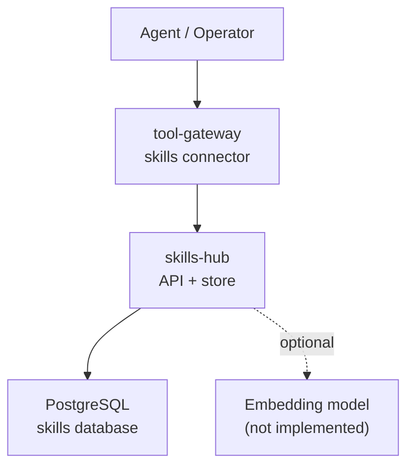
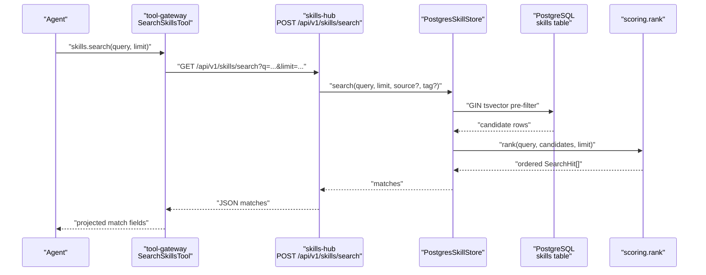
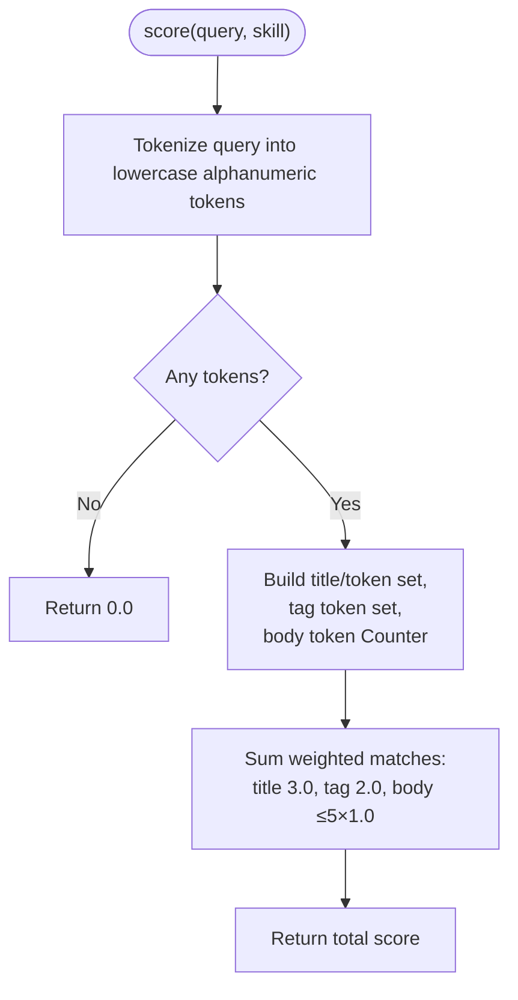
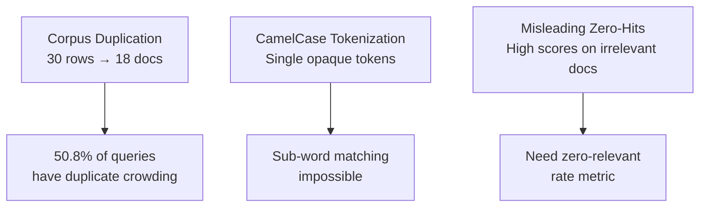
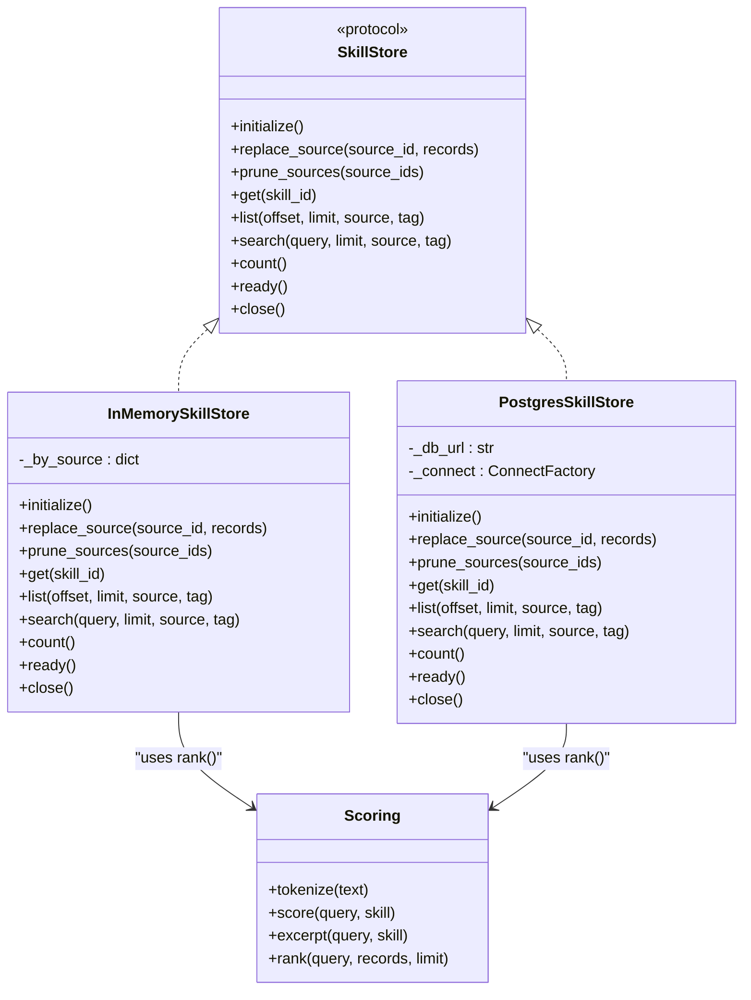
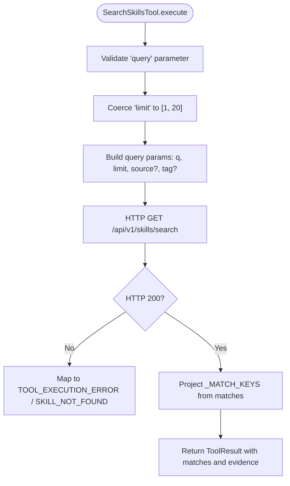
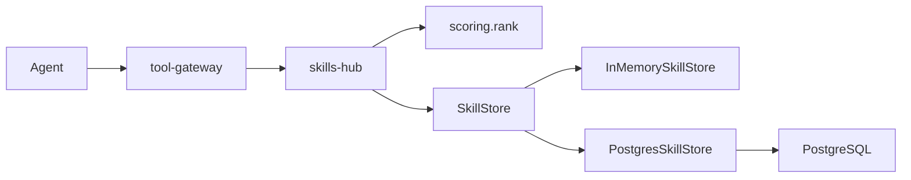

# Semantic Skill Retrieval Spike Assessment

<cite>
**Referenced Files in This Document**
- [semantic-skill-retrieval-spike.md](file://docs/workspace/semantic-skill-retrieval-spike.md)
- [semantic-skill-retrieval-eval-set.md](file://docs/workspace/semantic-skill-retrieval-eval-set.md)
- [scoring.py](file://products/skills-hub/src/skills_hub/services/scoring.py)
- [skill_store.py](file://products/skills-hub/src/skills_hub/services/skill_store.py)
- [skills_connector.py](file://products/tool-gateway/src/tool_gateway/tools/skills_connector.py)
- [skill.schema.json](file://shared/shared-contracts/schemas/skill.schema.json)
</cite>

## Update Summary
**Changes Made**
- Corrected query-shape masking hypothesis status from "not supported" to "untested"
- Added detailed documentation of three measured lexical baseline defects
- Revised recommendations to prioritize cost-first fixes before vector embeddings
- Updated evaluation metrics to include zero-relevant rate and distinct-document variants
- Enhanced section structure to reflect the new evidence-based approach

## Table of Contents
1. [Introduction](#introduction)
2. [Project Structure](#project-structure)
3. [Core Components](#core-components)
4. [Architecture Overview](#architecture-overview)
5. [Detailed Component Analysis](#detailed-component-analysis)
6. [Dependency Analysis](#dependency-analysis)
7. [Performance Considerations](#performance-considerations)
8. [Troubleshooting Guide](#troubleshooting-guide)
9. [Conclusion](#conclusion)
10. [Appendices](#appendices)

## Introduction
This document summarizes the repository's semantic skill retrieval spike assessment and maps it to the actual code that implements skills search today. The spike is an evaluation memo, not an implementation: it recommends measuring the existing lexical baseline before building any vector or embedding path, and it lays out substrate options, schema posture, provider choices, gating posture, and go/no-go gates.

The assessment's central finding has been significantly refined based on measured evidence: the live symptom is not "queries return nothing" — all 96 recorded searches returned at least one hit against a default limit of five — but rather ordering quality inside a saturated top-5 result set. More importantly, three concrete defects have been identified in the lexical baseline that may be fixable without any vector infrastructure.

**Updated** The hypothesis about query-shape masking has been corrected from "not supported" to "untested" — the audit trail cannot discriminate between natural phrasing and keyword stuffing, so this remains an open question requiring paraphrase testing.

**Section sources**
- [semantic-skill-retrieval-spike.md:1-41](file://docs/workspace/semantic-skill-retrieval-spike.md#L1-L41)
- [semantic-skill-retrieval-spike.md:105-131](file://docs/workspace/semantic-skill-retrieval-spike.md#L105-L131)

## Project Structure
The relevant code spans three products and one shared contract:

- `products/skills-hub` — skills catalog ingestion, storage, scoring, and retrieval API.
- `products/tool-gateway` — read-only tool surface (`skills.search`, `skills.get`, `skills.list`) that calls skills-hub over HTTP.
- `shared/shared-contracts` — canonical JSON Schema for the `Skill` envelope used by ingestion, persistence, and responses.
- `docs/workspace` — the spike memo itself and the evaluation set artifact.

**Diagram sources**
- [skills_connector.py:1-12](file://products/tool-gateway/src/tool_gateway/tools/skills_connector.py#L1-L12)
- [skill_store.py:1-7](file://products/skills-hub/src/skills_hub/services/skill_store.py#L1-L7)
- [skill_store.py:158-206](file://products/skills-hub/src/skills_hub/services/skill_store.py#L158-L206)

**Section sources**
- [semantic-skill-retrieval-spike.md:43-64](file://docs/workspace/semantic-skill-retrieval-spike.md#L43-L64)
- [skills_connector.py:1-12](file://products/tool-gateway/src/tool_gateway/tools/skills_connector.py#L1-L12)
- [skill_store.py:1-7](file://products/skills-hub/src/skills_hub/services/skill_store.py#L1-L7)

## Core Components
The current retrieval pipeline is fully lexical and deterministic:

| Component | Responsibility | Key behaviour |
|---|---|---|
| `SkillsConnector` (tool-gateway) | Exposes `skills.search`, `skills.get`, `skills.list` as tools | Validates parameters, authenticates to skills-hub, projects only allowed fields, enforces a 10.0 s request timeout and a maximum of 20 results. |
| `SkillStore` protocol | Backend abstraction for in-memory and PostgreSQL stores | Defines `initialize`, `replace_source`, `prune_sources`, `get`, `list`, `search`, `count`, `ready`, `close`. |
| `InMemorySkillStore` | Test/dev backend | Loads per-source snapshots and ranks candidates in process. |
| `PostgresSkillStore` | Deployed backend | Persists skills, pre-filters candidates with a GIN full-text index, then re-ranks with the shared scorer. |
| `scoring.rank` | Shared ranking function | Scores title, tags, and body tokens; excludes zero-score records; orders by descending score then ascending `skill_id`; caps at `limit`. |
| `Skill` JSON Schema | Canonical skill envelope | Defines required fields, optional frontmatter-derived fields, and constraints enforced by ingestion and validation. |

**Section sources**
- [skills_connector.py:33-68](file://products/tool-gateway/src/tool_gateway/tools/skills_connector.py#L33-L68)
- [skills_connector.py:154-196](file://products/tool-gateway/src/tool_gateway/tools/skills_connector.py#L154-L196)
- [skill_store.py:30-66](file://products/skills-hub/src/skills_hub/services/skill_store.py#L30-L66)
- [skill_store.py:72-153](file://products/skills-hub/src/skills_hub/services/skill_store.py#L72-L153)
- [skill_store.py:295-302](file://products/skills-hub/src/skills_hub/services/skill_store.py#L295-L302)
- [scoring.py:1-10](file://products/skills-hub/src/skills_hub/services/scoring.py#L1-L10)
- [scoring.py:85-96](file://products/skills-hub/src/skills_hub/services/scoring.py#L85-L96)
- [skill.schema.json:1-5](file://shared/shared-contracts/schemas/skill.schema.json#L1-L5)

## Architecture Overview
The end-to-end flow for a search call is:

**Diagram sources**
- [skills_connector.py:154-245](file://products/tool-gateway/src/tool_gateway/tools/skills_connector.py#L154-L245)
- [skill_store.py:437-463](file://products/skills-hub/src/skills_hub/services/skill_store.py#L437-L463)
- [scoring.py:85-96](file://products/skills-hub/src/skills_hub/services/scoring.py#L85-L96)

## Detailed Component Analysis

### Lexical Scoring and Ranking
The scoring module defines the matching unit and weights:

- Tokens are lowercase alphanumeric sequences matched by `[a-z0-9]+`.
- Title matches weight 3.0, tag matches 2.0, each body occurrence 1.0, capped at five occurrences.
- Zero-score records are excluded.
- Ties break by ascending `skill_id`.
- The excerpt is up to 400 characters around the first body match, falling back to the description head when no body token matches.
- `rank` scores every candidate, filters zeros, sorts by `(-score, skill_id)`, and returns the top `limit`.

**Diagram sources**
- [scoring.py:20-52](file://products/skills-hub/src/skills_hub/services/scoring.py#L20-L52)

**Section sources**
- [scoring.py:1-10](file://products/skills-hub/src/skills_hub/services/scoring.py#L1-L10)
- [scoring.py:20-52](file://products/skills-hub/src/skills_hub/services/scoring.py#L20-L52)
- [scoring.py:55-75](file://products/skills-hub/src/skills_hub/services/scoring.py#L55-L75)
- [scoring.py:78-96](file://products/skills-hub/src/skills_hub/services/scoring.py#L78-L96)

### Measured Lexical Baseline Defects

**Updated** Building the evaluation set revealed three concrete, measurable defects in the current lexical system that are fixable without vector embeddings:

#### Defect 1: Corpus Duplication
The corpus contains 30 rows but only 18 distinct documents due to overlapping source registration. A git source and two ConfigMap sources ingest the same files under different `source_id`s, causing duplicate content to occupy multiple result slots.

**Impact**: 32 of 63 queries (50.8%) return fewer distinct documents than result slots. The worst case is Q03 `KubePodNotReady` which returns 4 hits containing only 2 distinct documents.

#### Defect 2: CamelCase Tokenization  
The tokenizer treats `KubePodCrashLooping` as a single opaque token `['kubepodcrashlooping']`, making sub-word matching impossible. This prevents queries like `crashloop` from matching the `CrashLoopBackOff` tag.

**Impact**: For Q46 `pod keeps restarting CrashLoopBackOff`, the exactly-right document ranks 3rd, tied at 10.0 with a scheduling-failures guide that wins on alphabetical tie-break alone.

#### Defect 3: Zero-Hit Reliability Misleading
A non-zero `result_count` does not indicate useful results. Q31 `argocd health check` scores 20.0 on "Check ACME Admin Service Health" despite no ArgoCD document existing in the corpus.

**Impact**: The metric that actually matters is **zero-relevant rate** — the fraction of queries whose entire top-5 holds no grade ≥1 document — not zero-hit rate.

**Diagram sources**
- [semantic-skill-retrieval-spike.md:133-146](file://docs/workspace/semantic-skill-retrieval-spike.md#L133-L146)
- [semantic-skill-retrieval-eval-set.md:47-133](file://docs/workspace/semantic-skill-retrieval-eval-set.md#L47-L133)

**Section sources**
- [semantic-skill-retrieval-spike.md:133-146](file://docs/workspace/semantic-skill-retrieval-spike.md#L133-L146)
- [semantic-skill-retrieval-eval-set.md:47-133](file://docs/workspace/semantic-skill-retrieval-eval-set.md#L47-L133)

### Query Shape Hypothesis Correction

**Updated** The query-shape masking hypothesis has been corrected from "not supported" to "untested." The audit trail shows 14 of 63 queries already contain the identifier of the document they were seeking, and many others are visibly keyword-enumerated. A 5-word mode is consistent with both natural phrasing and keyword stuffing.

The correct statement is that the hypothesis is **untested, and this pool cannot test it** — which is why the paraphrase stratum in the evaluation set is mandatory rather than optional.

**Section sources**
- [semantic-skill-retrieval-spike.md:114-127](file://docs/workspace/semantic-skill-retrieval-spike.md#L114-L127)
- [semantic-skill-retrieval-eval-set.md:135-154](file://docs/workspace/semantic-skill-retrieval-eval-set.md#L135-L154)

### Skill Store Backends
Both backends delegate ranking to `scoring.rank`, which is the invariant that keeps their ordering byte-identical.

**Diagram sources**
- [skill_store.py:30-66](file://products/skills-hub/src/skills_hub/services/skill_store.py#L30-L66)
- [skill_store.py:72-153](file://products/skills-hub/src/skills_hub/services/skill_store.py#L72-L153)
- [skill_store.py:295-503](file://products/skills-hub/src/skills_hub/services/skill_store.py#L295-L503)
- [scoring.py:28-96](file://products/skills-hub/src/skills_hub/services/scoring.py#L28-L96)

Key implementation details:

- **Postgres pre-filter**: A GIN index on `to_tsvector('simple', title || ' ' || body)` narrows candidates; tags are matched separately because `array_to_string`/`array_out` are STABLE, not IMMUTABLE. Query lexemes are OR-joined so partial matches are preserved.
- **Per-operation connections**: Connections are opened and closed per operation, reflecting low-volume retrieval traffic.
- **Idempotent DDL**: Tables and columns use `CREATE TABLE IF NOT EXISTS` plus `ALTER ... ADD COLUMN IF NOT EXISTS`, run from `initialize()`.
- **Backend selection**: `build_skill_store` selects `postgres` when configured, otherwise defaults to `InMemorySkillStore`.

**Section sources**
- [skill_store.py:158-206](file://products/skills-hub/src/skills_hub/services/skill_store.py#L158-L206)
- [skill_store.py:243-256](file://products/skills-hub/src/skills_hub/services/skill_store.py#L243-L256)
- [skill_store.py:295-302](file://products/skills-hub/src/skills_hub/services/skill_store.py#L295-L302)
- [skill_store.py:437-463](file://products/skills-hub/src/skills_hub/services/skill_store.py#L437-L463)
- [skill_store.py:509-517](file://products/skills-hub/src/skills_hub/services/skill_store.py#L509-L517)

### Tool-Gateway Surface
The gateway exposes skills as read-only tools:

- `skills.search`: requires `query`; accepts optional `source`, `tag`, and `limit` (default 5, max 20).
- `skills.get`: fetches a full skill by validated namespaced id.
- `skills.list`: lists summaries without bodies.

The connector validates the skill id pattern before interpolating it into the URL, projects only `_MATCH_KEYS` for search results, and maps upstream errors to structured tool errors.

**Diagram sources**
- [skills_connector.py:154-245](file://products/tool-gateway/src/tool_gateway/tools/skills_connector.py#L154-L245)

**Section sources**
- [skills_connector.py:33-68](file://products/tool-gateway/src/tool_gateway/tools/skills_connector.py#L33-L68)
- [skills_connector.py:154-196](file://products/tool-gateway/src/tool_gateway/tools/skills_connector.py#L154-L196)
- [skills_connector.py:198-245](file://products/tool-gateway/src/tool_gateway/tools/skills_connector.py#L198-L245)

### Shared Skill Contract
The canonical `Skill` schema defines the persisted and served envelope. It does not include a vector field. Adding vectors to the stored row would touch many places in the store layer and could leak into public responses unless explicitly hidden through a contract version change.

Important contract properties relevant to retrieval:

- `skill_id` is namespaced `<source_id>/<slug>` and must match the same pattern used by the gateway.
- `tags` is a bounded keyword list used for filtering and retrieval.
- `body` is present in full-record responses and capped at 64 KiB.
- Optional fields such as `kind`, `steps`, and `sub_skills` describe skill classes but do not affect the lexical scorer directly.

**Section sources**
- [skill.schema.json:1-5](file://shared/shared-contracts/schemas/skill.schema.json#L1-L5)
- [skill.schema.json:7-15](file://shared/shared-contracts/schemas/skill.schema.json#L7-L15)
- [skill.schema.json:17-25](file://shared/shared-contracts/schemas/skill.schema.json#L17-L25)
- [skill.schema.json:47-52](file://shared/shared-contracts/schemas/skill.schema.json#L47-L52)
- [skill.schema.json:138-142](file://shared/shared-contracts/schemas/skill.schema.json#L138-L142)

## Dependency Analysis
The retrieval dependency graph is intentionally narrow today:

There is currently no dependency on an embedding model or vector store. The spike proposes adding one only after measurement, and even then recommends keeping it behind feature flags with fail-open semantics.

**Diagram sources**
- [skills_connector.py:1-12](file://products/tool-gateway/src/tool_gateway/tools/skills_connector.py#L1-L12)
- [skill_store.py:1-7](file://products/skills-hub/src/skills_hub/services/skill_store.py#L1-L7)
- [scoring.py:1-10](file://products/skills-hub/src/skills_hub/services/scoring.py#L1-L10)

**Section sources**
- [semantic-skill-retrieval-spike.md:509-546](file://docs/workspace/semantic-skill-retrieval-spike.md#L509-L546)
- [semantic-skill-retrieval-spike.md:548-582](file://docs/workspace/semantic-skill-retrieval-spike.md#L548-L582)

## Performance Considerations
The spike evaluates performance along several axes:

| Axis | Current state | Spike recommendation |
|---|---|---|
| Top-5 saturation | Mean result count is 4.72/5 across 96 queries. | Measure precision@5 and MRR, not zero-hit rate. |
| Latency budget | Tool-gateway uses a 10.0 s request timeout. | Any semantic path must stay comfortably under this budget, including cold embedder latency. |
| Corpus scale | 30 skills, ~92 KB of body text. | Exact in-process cosine is sub-millisecond and needs no extension. |
| Sync cost | No model dependency today. | If embeddings are added, compute them in the sync path, never lazily on the hot path. |
| Indexing | GIN full-text index over title/body; tags filtered at query time. | Defer ANN indexing until a recorded scale trigger; exact scan remains correct without it. |

The spike proposes concrete triggers for promoting to pgvector: more than 2,000 skills or search p95 above 300 ms, whichever comes first.

**Section sources**
- [semantic-skill-retrieval-spike.md:66-111](file://docs/workspace/semantic-skill-retrieval-spike.md#L66-L111)
- [semantic-skill-retrieval-spike.md:211-230](file://docs/workspace/semantic-skill-retrieval-spike.md#L211-L230)
- [semantic-skill-retrieval-spike.md:326-337](file://docs/workspace/semantic-skill-retrieval-spike.md#L326-L337)
- [semantic-skill-retrieval-spike.md:434-444](file://docs/workspace/semantic-skill-retrieval-spike.md#L434-L444)
- [semantic-skill-retrieval-spike.md:487-489](file://docs/workspace/semantic-skill-retrieval-spike.md#L487-L489)
- [semantic-skill-retrieval-spike.md:604-607](file://docs/workspace/semantic-skill-retrieval-spike.md#L604-L607)

## Troubleshooting Guide
When diagnosing retrieval issues, distinguish between three layers:

1. **Tool-gateway transport failures**: Unreachable skills-hub, non-200 responses, or malformed payloads map to structured tool errors. Check whether the error is `TOOL_EXECUTION_ERROR`, `SKILL_NOT_FOUND`, or an upstream-specific code/message.
2. **Lexical matching gaps**: Paraphrases such as "pod won't start" vs a runbook titled `KubePodNotReady` share no alphanumeric token and score zero. The spike identifies this as the hypothesised failure mode, but notes that it has not been observed in the audit trail.
3. **Ordering quality**: Even when hits exist, the wrong runbook may appear first. This is measured by precision@5, MRR, nDCG, and rank stability, not by result count.

Operational checks supported by the current code and the spike:

- Verify the tool definition for `skills.search` parameters and risk level.
- Inspect `skill_searched` audit events for query shape, limit, result count, and skill ids.
- Confirm the GIN index exists and that the Postgres connection is healthy via `PostgresSkillStore.ready()`.
- If semantic retrieval is later enabled, confirm that it fails open to lexical when the embedder is unavailable and that readiness does not depend on the embedding service.

**Section sources**
- [skills_connector.py:128-148](file://products/tool-gateway/src/tool_gateway/tools/skills_connector.py#L128-L148)
- [skills_connector.py:198-245](file://products/tool-gateway/src/tool_gateway/tools/skills_connector.py#L198-L245)
- [skill_store.py:492-500](file://products/skills-hub/src/skills_hub/services/skill_store.py#L492-L500)
- [semantic-skill-retrieval-spike.md:43-64](file://docs/workspace/semantic-skill-retrieval-spike.md#L43-L64)
- [semantic-skill-retrieval-spike.md:474-507](file://docs/workspace/semantic-skill-retrieval-spike.md#L474-L507)
- [semantic-skill-retrieval-spike.md:561-582](file://docs/workspace/semantic-skill-retrieval-spike.md#L561-L582)

## Conclusion
The spike concludes that the repository's skills retrieval is currently a well-scoped lexical system with deterministic scoring, shared ranking, and clear boundaries between the tool-gateway and skills-hub. Its main recommendation has been strengthened by measured evidence: measure before building, and prioritize cost-first fixes.

**Updated** Three concrete defects have been identified in the lexical baseline — corpus duplication, CamelCase tokenization opacity, and misleading zero-hit reliability — that are fixable without any vector infrastructure. The revised recommendation prioritizes these cheaper fixes before considering embeddings:

1. **De-duplicate and fix the tokenizer** — no model, no vector, no new dependency, no image change.
2. **Then the heavier lexical options** — cover-density ranking, trigram tolerance, curated alias mapping.
3. **Only then semantics** — if proven necessary, the cheapest substrate is sidecar embedding table over `real[]` with in-process exact cosine.

If any cheaper step closes the measured gap, everything below is cancelled and the backlog row closes — a null result is a publishable outcome, not a failure.

**Section sources**
- [semantic-skill-retrieval-spike.md:1-41](file://docs/workspace/semantic-skill-retrieval-spike.md#L1-L41)
- [semantic-skill-retrieval-spike.md:446-507](file://docs/workspace/semantic-skill-retrieval-spike.md#L446-L507)
- [semantic-skill-retrieval-spike.md:509-582](file://docs/workspace/semantic-skill-retrieval-spike.md#L509-L582)
- [semantic-skill-retrieval-spike.md:584-610](file://docs/workspace/semantic-skill-retrieval-spike.md#L584-L610)

## Appendices

### Appendix A: Substrate Options Summary
| Option | New server | Extension/image swap | Model dependency | Reversible without migration | Best use case |
|---|---:|---:|---:|---:|---|
| A — pgvector | No | Yes | Maybe | No | Large catalog needing SQL-side similarity and ANN indexes. |
| B — agentscope RAG store | Usually yes | No | Yes | No | Rejected as wholesale adoption; embedding client may be adopted separately. |
| C — sidecar `real[]` + exact cosine | No | No | Maybe | Yes | Small-to-medium catalog where exact cosine is fast and explainable. |
| D — better lexical | No | Only for trigram | No | Yes | Cheapest first step; may close the gap without any embedding work. |

**Section sources**
- [semantic-skill-retrieval-spike.md:178-269](file://docs/workspace/semantic-skill-retrieval-spike.md#L178-L269)

### Appendix B: Evaluation Metrics
| Metric | Definition | Why it matters here |
|---|---|---|
| Zero-hit rate | Fraction of queries returning zero hits | Already 0/96 live; not the primary problem. |
| **Zero-relevant rate** *(new)* | Fraction of queries whose entire top-5 holds no grade ≥1 document | **The metric that actually matters.** §2.3 defect 3 shows zero-hit cannot detect a useless answer. |
| Precision@5 | Relevant hits within top 5 | Top-5 is saturated; ordering is what operators experience. |
| Recall@5 / Recall@10 | Relevant hits found within k | Classic vector-store claim; must be measured, not asserted. |
| MRR | Mean reciprocal rank of first relevant hit | Single-number summary of "is the right runbook first". |
| nDCG@10 | Graded relevance, position-discounted | Only useful if labels are graded. |
| Rank stability | Fraction of queries whose top-1 changes vs baseline | Prevents reshuffling already-correct answers. |
| Search latency p50/p95 | End-to-end route time | Must stay under the 10.0 s tool timeout. |
| Sync-path embed cost | Time and tokens per document during sync | Adds a model dependency to an otherwise model-free sync. |
| Embed spend | Tokens/bytes sent to external embedder | Billable the same way a chat turn is. |

**Section sources**
- [semantic-skill-retrieval-spike.md:474-489](file://docs/workspace/semantic-skill-retrieval-spike.md#L474-L489)
- [semantic-skill-retrieval-eval-set.md:419-434](file://docs/workspace/semantic-skill-retrieval-eval-set.md#L419-L434)

### Appendix C: Cost-Ordered Fix Priority

**Updated** The evaluation decision rule now prioritizes fixes in cost order:

1. **De-duplicate only** — collapse identical content in `rank()`, fix overlapping `SKILLS_SOURCES` registration.
2. **Tokenizer fixes** — CamelCase-splitting tokenization, stemming/trigram tolerance, relevance-aware tie-break.
3. **Hybrid/vector retrieval** — only if steps 1-2 don't close the measured gap.

Promote to a spec **only if** step 3 beats the best of steps 1-2 on Precision@5 or MRR outside the noise band, does not regress rank stability, holds p95 inside the tool timeout, and fails open to lexical. If step 1 or 2 closes the gap, **no embedding work is authorized**.

**Section sources**
- [semantic-skill-retrieval-eval-set.md:435-449](file://docs/workspace/semantic-skill-retrieval-eval-set.md#L435-L449)