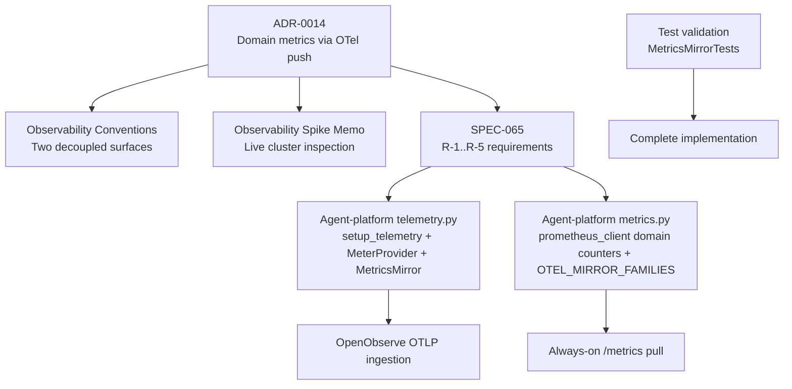
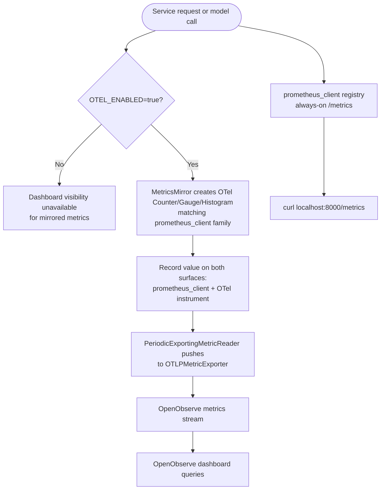
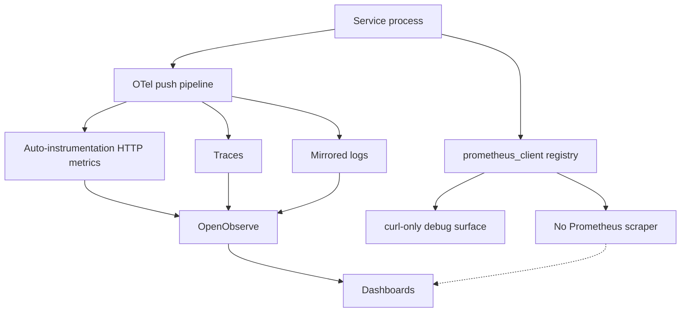
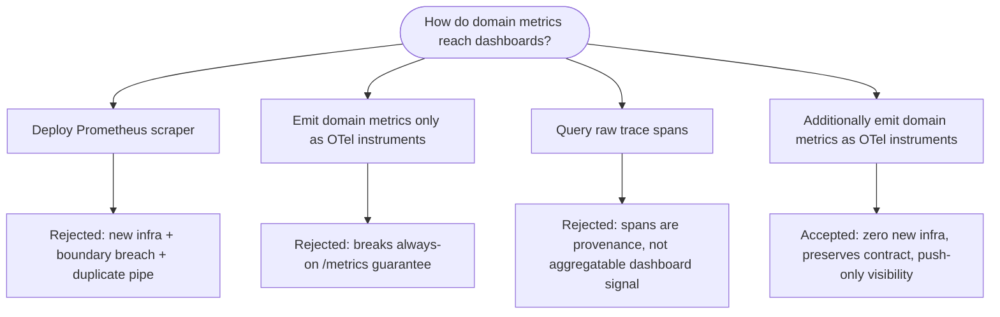
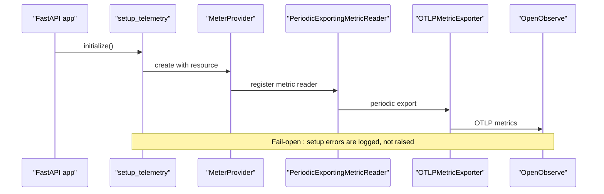
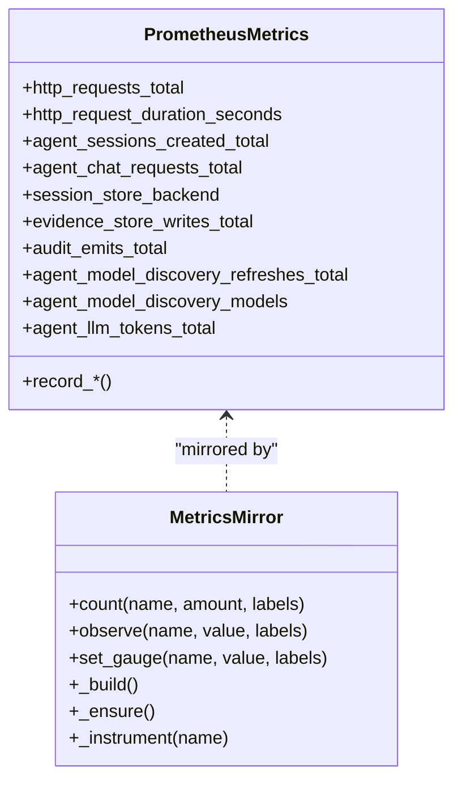
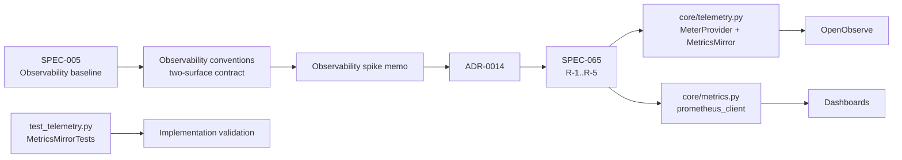
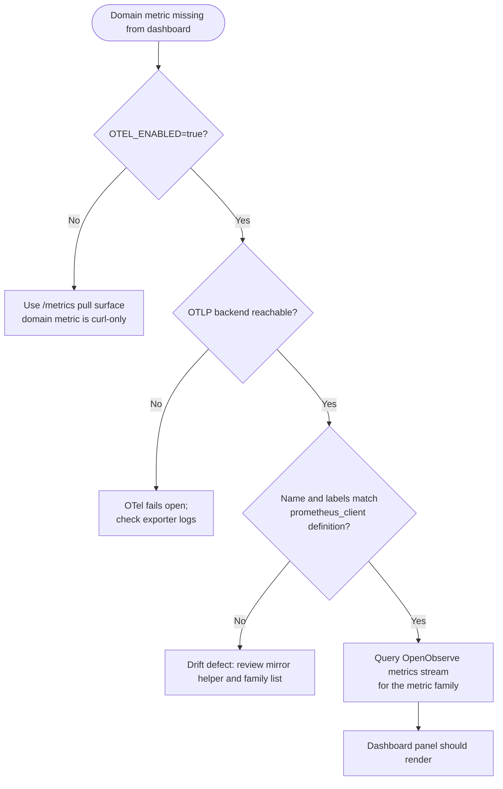

# ADR-0014: Domain Metrics Reach Dashboards Via OTel-Instrument Push, Not A Prometheus Scraper

<cite>
**Referenced Files in This Document**   
- [ADR-0014](file://docs/adr/0014-domain-metrics-via-otel-push.md)
- [SPEC-065 spec](file://docs/specs/SPEC-065-r5-observability-token-cost-dashboards/spec.md)
- [SPEC-065 plan](file://docs/specs/SPEC-065-r5-observability-token-cost-dashboards/plan.md)
- [Observability spike memo](file://docs/workspace/observability-metrics-dashboards-spike.md)
- [Observability conventions](file://shared/shared-contracts/observability-conventions.md)
- [Agent-platform telemetry](file://products/agent-platform/src/agent_service/core/telemetry.py)
- [Agent-platform metrics](file://products/agent-platform/src/agent_service/core/metrics.py)
- [Telemetry tests](file://products/agent-platform/tests/test_telemetry.py)
</cite>

## Update Summary
**Changes Made**   
- Updated to reflect the complete implementation of ADR-0014 with the MetricsMirror class providing automatic mirroring of Prometheus domain metrics to OpenTelemetry instruments
- Documented the strict parity maintenance between Prometheus and OpenTelemetry surfaces while preserving the always-on /metrics pull surface as source of truth per SPEC-005
- Added comprehensive details about the MetricsMirror class implementation, including lazy initialization, fail-open behavior, and byte-identical replication across all eight services
- Updated architecture diagrams to show the complete mirroring pipeline
- Enhanced troubleshooting section with specific guidance for the implemented mirror functionality

## Table of Contents
1. [Introduction](#introduction)
2. [Project Structure](#project-structure)
3. [Core Components](#core-components)
4. [Architecture Overview](#architecture-overview)
5. [Detailed Component Analysis](#detailed-component-analysis)
6. [Dependency Analysis](#dependency-analysis)
7. [Performance Considerations](#performance-considerations)
8. [Troubleshooting Guide](#troubleshooting-guide)
9. [Conclusion](#conclusion)

## Introduction
ADR-0014 records the approved architectural decision that domain metrics — including the new token counter introduced by SPEC-065 R-1 — reach dashboards by being additionally emitted as OpenTelemetry instruments pushed over the existing OTLP metric pipeline into OpenObserve. It explicitly rejects deploying a Prometheus scraper or Grafana remote-read path. The decision preserves the SPEC-005 two-surface contract: an always-on `prometheus_client` `/metrics` pull endpoint remains the collector-independent debug surface, while the opt-in OTel push (gated by `OTEL_ENABLED`) becomes the dashboard consumer for mirrored domain metrics.

The ADR was accepted on 2026-09-27 alongside SPEC-065 approval and is grounded in a live inspection of the running `dev-luban-aiops` cluster, which confirmed that OpenObserve is deployed and receiving OTLP traces, logs, and auto-instrumentation HTTP metrics, but no Prometheus, Grafana, or prometheus-operator resources exist.

**Updated** The implementation is now complete with the MetricsMirror class providing automatic mirroring of all domain metrics from Prometheus to OpenTelemetry, maintaining strict parity between both surfaces while preserving the always-on /metrics pull surface as the source of truth per SPEC-005.

**Section sources**
- [ADR-0014:1-20](file://docs/adr/0014-domain-metrics-via-otel-push.md#L1-L20)
- [SPEC-065 spec:108-159](file://docs/specs/SPEC-065-r5-observability-token-cost-dashboards/spec.md#L108-L159)
- [Agent-platform metrics:226-254](file://products/agent-platform/src/agent_service/core/metrics.py#L226-L254)

## Project Structure
This document concerns one decision record and its complete implementation anchors across three layers:

| Layer | Repository location | Role in this ADR |
|---|---|---|
| Decision record | `docs/adr/0014-domain-metrics-via-otel-push.md` | Records status, context, decision, alternatives, consequences, and follow-up scope. |
| Implementation specification | `docs/specs/SPEC-065-r5-observability-token-cost-dashboards/spec.md` and `plan.md` | Turns the decision into requirements R-1 through R-5, including the mirror helper, mirrored families, dashboards, and live-check. |
| Implemented runtime surfaces | `products/agent-platform/src/agent_service/core/telemetry.py` and `core/metrics.py` | Provide the already-live OTel `MeterProvider`, the `prometheus_client` domain counters, and the complete MetricsMirror implementation. |
| Contract baseline | `shared/shared-contracts/observability-conventions.md` | Defines the two-surface boundary that the ADR exercises on the metrics signal. |
| Evidence baseline | `docs/workspace/observability-metrics-dashboards-spike.md` | Live-inspection evidence used to justify the decision. |
| Test validation | `products/agent-platform/tests/test_telemetry.py` | Comprehensive tests validating the mirror implementation and parity guarantees. |

**Diagram sources**
- [ADR-0014:1-117](file://docs/adr/0014-domain-metrics-via-otel-push.md#L1-L117)
- [Observability conventions:9-16](file://shared/shared-contracts/observability-conventions.md#L9-L16)
- [Observability spike memo:19-61](file://docs/workspace/observability-metrics-dashboards-spike.md#L19-L61)
- [SPEC-065 spec:40-53](file://docs/specs/SPEC-065-r5-observability-token-cost-dashboards/spec.md#L40-L53)
- [Agent-platform telemetry:69-118](file://products/agent-platform/src/agent_service/core/telemetry.py#L69-L118)
- [Agent-platform metrics:1-8](file://products/agent-platform/src/agent_service/core/metrics.py#L1-L8)

**Section sources**
- [ADR-0014:1-20](file://docs/adr/0014-domain-metrics-via-otel-push.md#L1-L20)
- [Observability conventions:9-16](file://shared/shared-contracts/observability-conventions.md#L9-L16)
- [Observability spike memo:19-61](file://docs/workspace/observability-metrics-dashboards-spike.md#L19-L61)
- [SPEC-065 spec:40-53](file://docs/specs/SPEC-065-r5-observability-token-cost-dashboards/spec.md#L40-L53)

## Core Components
ADR-0014 centers on four concrete components rather than introducing a new service, all now fully implemented:

| Component | Responsibility | Current state | ADR-driven change |
|---|---|---|---|
| `prometheus_client` domain counters | Always-on, collector-independent `/metrics` pull surface per SPEC-005. | Fully implemented in each service's `core/metrics.py`; currently curl-only because no scraper runs. | Remain unchanged; they are the debug floor. Mirrored values are written beside them. |
| OTel `MeterProvider` | Builds a provider with a `PeriodicExportingMetricReader(OTLPMetricExporter())` when `OTEL_ENABLED=true`. | Already constructed by `setup_telemetry` in every service's `core/telemetry.py`. | Used as the destination for mirrored domain instruments; no new exporter or reader is added. |
| MetricsMirror class | Creates matching OTel instruments (`Counter`, `Gauge`, histogram) from the same bounded label set declared in `core/metrics.py`. | **Fully implemented** in canonical `core/telemetry.py` under SPEC-065 R-2, replicated byte-identically across all eight services, guarded by `TelemetryParityTest`. | Provides automatic mirroring with lazy initialization, fail-open behavior, and strict parity enforcement. |
| OpenObserve metrics stream | Consumer of OTLP-pushed metrics. | Receiving auto-instrumentation HTTP metrics, traces, and mirrored logs today. | Receives mirrored domain metrics such as `agent_llm_tokens_total` and other operator-facing families. |

**Updated** The MetricsMirror class is now fully implemented with comprehensive features including lazy initialization, fail-open error handling, and strict parity between Prometheus and OpenTelemetry surfaces. All domain metrics are automatically mirrored when `OTEL_ENABLED=true`.

**Section sources**
- [ADR-0014:45-65](file://docs/adr/0014-domain-metrics-via-otel-push.md#L45-L65)
- [SPEC-065 plan:54-78](file://docs/specs/SPEC-065-r5-observability-token-cost-dashboards/plan.md#L54-L78)
- [SPEC-065 spec:154-191](file://docs/specs/SPEC-065-r5-observability-token-cost-dashboards/spec.md#L154-L191)
- [Agent-platform telemetry:91-106](file://products/agent-platform/src/agent_service/core/telemetry.py#L91-L106)
- [Agent-platform metrics:23-43](file://products/agent-platform/src/agent_service/core/metrics.py#L23-L43)

## Architecture Overview
The ADR does not replace the existing architecture; it adds a second emission leg to the same observation path, now fully implemented with automatic mirroring.

**Diagram sources**
- [ADR-0014:47-65](file://docs/adr/0014-domain-metrics-via-otel-push.md#L47-L65)
- [SPEC-065 plan:54-78](file://docs/specs/SPEC-065-r5-observability-token-cost-dashboards/plan.md#L54-L78)
- [Agent-platform telemetry:99-106](file://products/agent-platform/src/agent_service/core/telemetry.py#L99-L106)
- [Agent-platform metrics:52-73](file://products/agent-platform/src/agent_service/core/metrics.py#L52-L73)

The key architectural invariant is that the two surfaces remain decoupled: disabling OTel push leaves `/metrics` fully functional, and enabling OTel push does not alter the pull surface. The only coupling is semantic — where a metric exists on both surfaces, its name and bounded labels must agree. The MetricsMirror class enforces this parity through lazy initialization and strict label validation.

**Section sources**
- [ADR-0014:47-65](file://docs/adr/0014-domain-metrics-via-otel-push.md#L47-L65)
- [Observability conventions:9-16](file://shared/shared-contracts/observability-conventions.md#L9-L16)
- [SPEC-065 spec:154-161](file://docs/specs/SPEC-065-r5-observability-token-cost-dashboards/spec.md#L154-L161)

## Detailed Component Analysis

### Decision Context and Problem Statement
The observability baseline (SPEC-005) deliberately separates two surfaces:

1. `/metrics` pull, always on, implemented directly with `prometheus_client`.
2. Opt-in OTLP push for traces, metrics, and mirrored logs, gated by `OTEL_ENABLED`.

The conventions doc closes the boundary by stating that scraping infrastructure, storage, dashboards, and alerting are platform-ops concerns outside the service contract. The spike's live inspection showed the consequence: OpenObserve is live, but the dev cluster has no Prometheus, Grafana, or prometheus-operator CRDs. Therefore, the rich `prometheus_client` domain counters — including the new token counter SPEC-065 R-1 introduces — have no scraper and no dashboard. They are curl-only debug data. Meanwhile, OpenObserve receives only what OTLP push sends: traces, mirrored logs, and auto-instrumentation HTTP metrics. The two metric worlds do not overlap.

**Diagram sources**
- [ADR-0014:24-43](file://docs/adr/0014-domain-metrics-via-otel-push.md#L24-L43)
- [Observability conventions:9-16](file://shared/shared-contracts/observability-conventions.md#L9-L16)
- [Observability spike memo:150-174](file://docs/workspace/observability-metrics-dashboards-spike.md#L150-L174)

**Section sources**
- [ADR-0014:22-43](file://docs/adr/0014-domain-metrics-via-otel-push.md#L22-L43)
- [Observability conventions:9-16](file://shared/shared-contracts/observability-conventions.md#L9-L16)
- [Observability spike memo:150-174](file://docs/workspace/observability-metrics-dashboards-spike.md#L150-L174)

### Decision Summary
The ADR decides that domain metrics reach dashboards by being **additionally emitted** as OpenTelemetry instruments on the `MeterProvider` already built by `setup_telemetry`. There is no Prometheus scraper.

The decision contains four binding points:

| Point | Meaning |
|---|---|
| Mirror target | Each service's `MeterProvider` carries OTel counters/gauges mirroring the `prometheus_client` domain metrics. |
| Infrastructure | Zero new cluster infrastructure; the existing OTLP metric pipeline into OpenObserve is reused. |
| Surface contract | The two SPEC-005 surfaces stay decoupled; `/metrics` remains always-on and unchanged; the OTel mirror is additive and gated by `OTEL_ENABLED`. |
| Consistency rule | The mirror is a push of the same bounded-label metric, not a second definition: identical name, identical bounded enum labels, no new high-cardinality dimension. |

**Updated** The MetricsMirror class provides automatic, lazy-initialized mirroring with fail-open error handling, ensuring strict parity between Prometheus and OpenTelemetry surfaces while maintaining the always-on /metrics guarantee.

**Section sources**
- [ADR-0014:45-65](file://docs/adr/0014-domain-metrics-via-otel-push.md#L45-L65)
- [SPEC-065 spec:154-161](file://docs/specs/SPEC-065-r5-observability-token-cost-dashboards/spec.md#L154-L161)

### Alternatives Considered and Why They Were Rejected
The ADR evaluates three alternatives before settling on OTel-instrument push.

| Alternative | Reason rejected |
|---|---|
| Deploy a Prometheus scraper plus prometheus-operator and remote-read `/metrics` | Adds cluster infrastructure the platform deliberately never carries; breaches or complicates the "scraping is platform-ops" boundary; duplicates the already-live OTLP pipe; forks the metric world back into pull-only domain counters plus push-only auto-instrumentation. |
| Abandon `prometheus_client` and emit domain metrics only as OTel instruments | Breaks the SPEC-005 always-on, works-with-no-backend guarantee. `/metrics` must remain functional with `OTEL_ENABLED=false`; the pull surface is the debug floor and contract tests bind to it. |
| Query token usage from raw trace spans instead of a metric | Raw spans are provenance, not aggregation. Per-span SQL hides the operator-facing "tokens by model this week" signal a dashboard needs. |

**Diagram sources**
- [ADR-0014:67-87](file://docs/adr/0014-domain-metrics-via-otel-push.md#L67-L87)

**Section sources**
- [ADR-0014:67-87](file://docs/adr/0014-domain-metrics-via-otel-push.md#L67-L87)

### Implementation Anchors

#### Telemetry Pipeline
The agent-platform `core/telemetry.py` module implements the opt-in OTel push pipeline. When `OTEL_ENABLED` is true, it constructs a `Resource`, a `TracerProvider`, a `MeterProvider` with a `PeriodicExportingMetricReader(OTLPMetricExporter())`, attaches the log bridge, and instruments FastAPI and HTTPX. Errors during setup are logged rather than raised, preserving the fail-open posture.

For ADR-0014, the important detail is that the `MeterProvider` already exists at lines 99–102. The MetricsMirror class planned under SPEC-065 R-2 obtains a meter from `opentelemetry.metrics.get_meter(...)` after that provider is set, so mirrored domain instruments ride the existing periodic push without adding another exporter, reader, or endpoint.

**Diagram sources**
- [Agent-platform telemetry:69-118](file://products/agent-platform/src/agent_service/core/telemetry.py#L69-L118)
- [SPEC-065 plan:62-78](file://docs/specs/SPEC-065-r5-observability-token-cost-dashboards/plan.md#L62-L78)

#### Prometheus Domain Counters
The agent-platform `core/metrics.py` module defines the RED metrics and domain counters using `prometheus_client`. These include session creation, chat requests, session-store and agent-state backend gauges and error/fallback counters, evidence store persistence metrics, audit emits, and model discovery refreshes and model counts. The module-level object pattern ensures repeated test application builds do not double-register metrics.

ADR-0014 does not modify these objects. Instead, mirrored OTel instruments are created beside them so the same bounded-label metric appears on both surfaces.

**Diagram sources**
- [Agent-platform metrics:23-254](file://products/agent-platform/src/agent_service/core/metrics.py#L23-L254)
- [SPEC-065 plan:146-165](file://docs/specs/SPEC-065-r5-observability-token-cost-dashboards/plan.md#L146-L165)

**Section sources**
- [Agent-platform telemetry:69-118](file://products/agent-platform/src/agent_service/core/telemetry.py#L69-L118)
- [Agent-platform metrics:1-254](file://products/agent-platform/src/agent_service/core/metrics.py#L1-L254)
- [SPEC-065 plan:54-78](file://docs/specs/SPEC-065-r5-observability-token-cost-dashboards/plan.md#L54-L78)

### MetricsMirror Class Implementation
The MetricsMirror class provides the core mirroring functionality with several key design principles:

| Feature | Implementation | Benefit |
|---|---|---|
| **Lazy Initialization** | Instruments are built on first record, never at import time | Avoids dependency on MeterProvider availability at startup |
| **Fail-Open Behavior** | Any OTel error is logged and swallowed, never propagates | Maintains service reliability even if OTel backend is down |
| **Byte-Identical Parity** | Replicated across all eight services, guarded by TelemetryParityTest | Ensures consistent behavior across the platform |
| **Generic Design** | Takes family list as parameter, no service-specific names | Promotes reusability and maintainability |
| **Label Validation** | Strict enforcement of bounded label sets | Prevents cardinality explosion and maintains query performance |

The class supports three instrument types:
- **Counters**: `count(name, amount, labels)` - mirrors counter increments
- **Histograms**: `observe(name, value, labels)` - mirrors histogram observations  
- **Gauges**: `set_gauge(name, value, labels)` - mirrors gauge values

**Updated** The MetricsMirror class is fully implemented with comprehensive error handling, lazy initialization, and strict parity enforcement between Prometheus and OpenTelemetry surfaces.

**Section sources**
- [Agent-platform telemetry:142-250](file://products/agent-platform/src/agent_service/core/telemetry.py#L142-L250)
- [Telemetry tests:66-216](file://products/agent-platform/tests/test_telemetry.py#L66-L216)

### Consequences and Trade-offs
The ADR documents four explicit consequences:

| Consequence | Meaning |
|---|---|
| No new infrastructure | Realizing R5 dashboards requires no scraper, prometheus-operator, or Grafana; it reuses the OTLP metric pipeline and in-cluster OpenObserve. |
| Contract consistency | The "services only push OTLP; scraping is platform-ops" boundary is preserved and exercised on the metrics signal. |
| Double emission | Every mirrored domain metric is written twice — once to the `prometheus_client` registry, once to an OTel instrument. This is accepted as a small, bounded CPU/alloc cost on an observation path. |
| Push-only visibility | With no scraper, a domain metric is dashboard-visible only when `OTEL_ENABLED=true` and the backend is reachable. `/metrics` remains the fallback when OTel is off. |

The ADR also triggers follow-up work scoped inside SPEC-065: R-2 implements the mirror helper in canonical `core/telemetry.py`, R-3 ships OpenObserve dashboards as config-as-code, and R-4 adds the gated live-check.

**Updated** The MetricsMirror implementation successfully achieves all ADR goals with robust error handling and strict parity enforcement, making domain metrics dashboard-visible through the OTLP push path while preserving the always-on /metrics surface.

**Section sources**
- [ADR-0014:89-117](file://docs/adr/0014-domain-metrics-via-otel-push.md#L89-L117)
- [SPEC-065 spec:154-241](file://docs/specs/SPEC-065-r5-observability-token-cost-dashboards/spec.md#L154-L241)

## Dependency Analysis
ADR-0014 sits between the observability baseline and the R5 implementation.

**Diagram sources**
- [ADR-0014:24-18](file://docs/adr/0014-domain-metrics-via-otel-push.md#L24-L18)
- [SPEC-065 spec:19-26](file://docs/specs/SPEC-065-r5-observability-token-cost-dashboards/spec.md#L19-L26)
- [Observability conventions:9-16](file://shared/shared-contracts/observability-conventions.md#L9-L16)
- [Observability spike memo:19-61](file://docs/workspace/observability-metrics-dashboards-spike.md#L19-L61)

Key dependency relationships:

| Dependency | Direction | Constraint |
|---|---|---|
| ADR-0014 → SPEC-005 | Consumes | Must preserve the two-surface contract. |
| ADR-0014 → SPEC-065 | Enables | Provides the architectural choice R-2 implements. |
| SPEC-065 → telemetry.py | Uses | Reuses the existing `MeterProvider`; does not add a new exporter. |
| SPEC-065 → metrics.py | Mirrors | Requires name/label parity between `prometheus_client` and OTel instruments. |
| ADR-0014 → OpenObserve | Depends on | Assumes the OTLP metric pipeline is already live. |
| ADR-0014 → conventions.md | Bound by | Scraping remains platform-ops; services push OTLP. |
| Tests → Implementation | Validates | MetricsMirrorTests ensure parity and fail-open behavior. |

**Section sources**
- [ADR-0014:24-49](file://docs/adr/0014-domain-metrics-via-otel-push.md#L24-L49)
- [SPEC-065 spec:19-53](file://docs/specs/SPEC-065-r5-observability-token-cost-dashboards/spec.md#L19-L53)
- [Observability conventions:9-16](file://shared/shared-contracts/observability-conventions.md#L9-L16)

## Performance Considerations
ADR-0014 accepts a deliberate trade-off: mirrored domain metrics are written twice. This means every recording site increments both a `prometheus_client` counter/gauge/histogram and an OTel instrument. The ADR characterizes this as a small, bounded CPU and allocation cost on an observation path, justified by keeping the always-on pull surface intact.

Important performance constraints inherited from the codebase:

- The mirror must use the same bounded enum labels as the `prometheus_client` definitions; no new high-cardinality dimension may be introduced.
- The mirror is gated by `OTEL_ENABLED`; when disabled, no OTel providers or instrumentation are initialized, so there is zero overhead.
- The mirror helper cannot reference service-specific metric names; it takes the family list from each service's own `core/metrics.py`, preserving the byte-identical parity guard across all eight services.
- Fail-open behavior applies: an unreachable or misconfigured backend must not break the request path.
- Lazy initialization ensures instruments are only created when first needed, reducing startup overhead.

**Updated** The MetricsMirror implementation optimizes performance through lazy initialization and fail-open error handling, ensuring minimal impact on service performance while providing reliable metric mirroring.

**Section sources**
- [ADR-0014:98-107](file://docs/adr/0014-domain-metrics-via-otel-push.md#L98-L107)
- [SPEC-065 plan:157-162](file://docs/specs/SPEC-065-r5-observability-token-cost-dashboards/plan.md#L157-L162)
- [Observability conventions:47-56](file://shared/shared-contracts/observability-conventions.md#L47-L56)

## Troubleshooting Guide
When diagnosing why domain metrics are not visible on dashboards under ADR-0014, use the following decision tree.

**Diagram sources**
- [ADR-0014:98-107](file://docs/adr/0014-domain-metrics-via-otel-push.md#L98-L107)
- [SPEC-065 spec:165-187](file://docs/specs/SPEC-065-r5-observability-token-cost-dashboards/spec.md#L165-L187)
- [Agent-platform telemetry:116-118](file://products/agent-platform/src/agent_service/core/telemetry.py#L116-L118)

Operational checks:

| Symptom | Likely cause | Action |
|---|---|---|
| Dashboard shows nothing, but `curl /metrics` returns the counter | `OTEL_ENABLED=false` or backend unreachable | Enable OTel push or inspect OTLP exporter configuration. |
| `/metrics` works but OTel push is absent | `OTEL_ENABLED=false` or `setup_telemetry` failed silently | Check logs for `otel telemetry enabled` or `otel telemetry setup failed`. |
| OTel push is enabled but mirrored metric is absent | MetricsMirror not invoked or family list incomplete | Verify the canonical `core/telemetry.py` MetricsMirror is present and the service's `core/metrics.py` registers its families. |
| Metric appears on one surface but not the other | Name or label drift | Enforce parity: identical name and bounded label set on both surfaces. |
| OpenObserve receives traces/logs but not domain metrics | Only auto-instrumentation HTTP metrics were pushed before ADR-0014 | Implement R-2 mirror so domain counters are additionally emitted as OTel instruments. |
| MetricsMirror build failure | OTel backend unavailable or misconfigured | Check exporter configuration and network connectivity; mirror fails open and continues without push. |

**Updated** Enhanced troubleshooting guidance includes specific scenarios for the MetricsMirror implementation, including build failures and lazy initialization issues.

**Section sources**
- [ADR-0014:98-117](file://docs/adr/0014-domain-metrics-via-otel-push.md#L98-L117)
- [SPEC-065 spec:165-187](file://docs/specs/SPEC-065-r5-observability-token-cost-dashboards/spec.md#L165-L187)
- [Agent-platform telemetry:109-118](file://products/agent-platform/src/agent_service/core/telemetry.py#L109-L118)

## Conclusion
ADR-0014 resolves the R5 observability consumer gap by choosing OTel-instrument push over a Prometheus scraper. The decision preserves the SPEC-005 two-surface contract, avoids new cluster infrastructure, and makes domain metrics dashboard-visible through the already-proven OTLP metric pipeline into OpenObserve. Its main trade-offs are double emission and push-only visibility, both accepted explicitly. 

**Updated** The implementation is now complete with the MetricsMirror class providing automatic, lazy-initialized mirroring of all domain metrics from Prometheus to OpenTelemetry. The class maintains strict parity between both surfaces while preserving the always-on /metrics pull surface as the source of truth per SPEC-005. The implementation includes comprehensive error handling, fail-open behavior, and byte-identical replication across all eight services, validated by extensive test coverage. The ADR delegates implementation to SPEC-065, where R-1 adds the token counter family (`agent_llm_tokens_total`), R-2 defines the mirror helper (now fully implemented), R-3 ships dashboards as config-as-code, and R-4 gates the end-to-end path with a repeatable live-check. Cost metrics are deferred to a follow-up slice per Stage-0 findings that agentscope 2.0.8 exposes no provider-derived cost data.

The complete implementation demonstrates that ADR-0014's architectural decisions can be realized with minimal complexity while providing robust, production-ready metric mirroring that enhances observability without compromising the system's reliability guarantees.