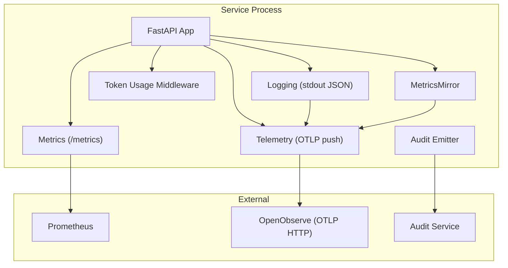
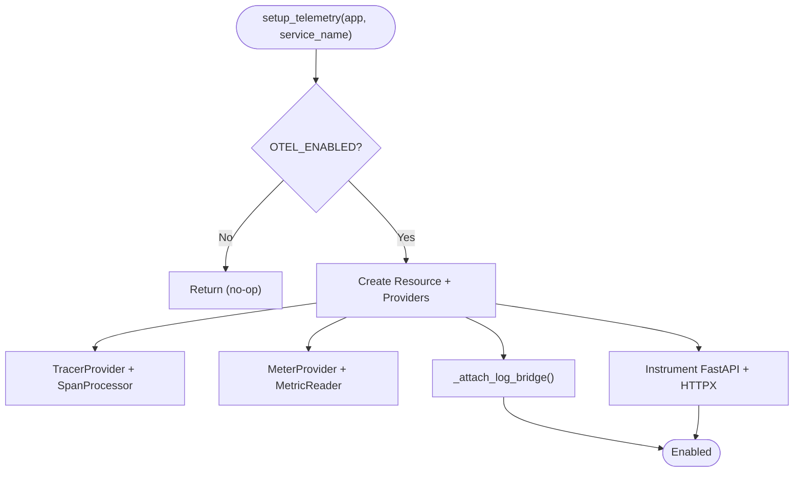
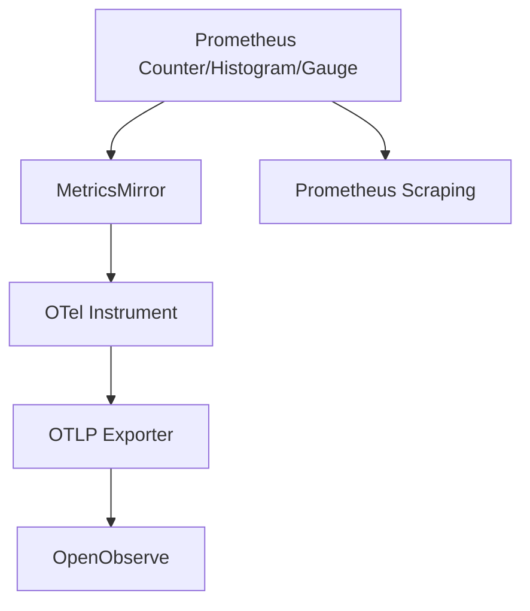
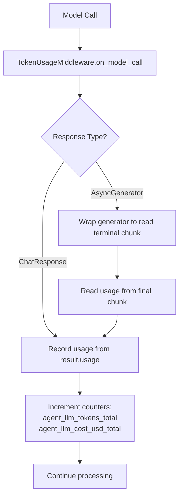
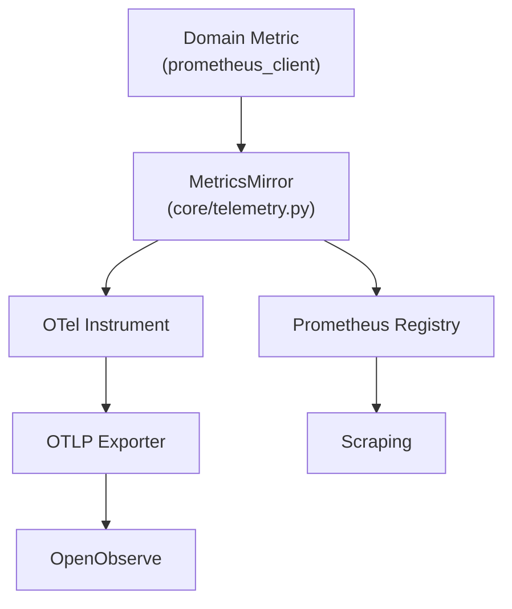
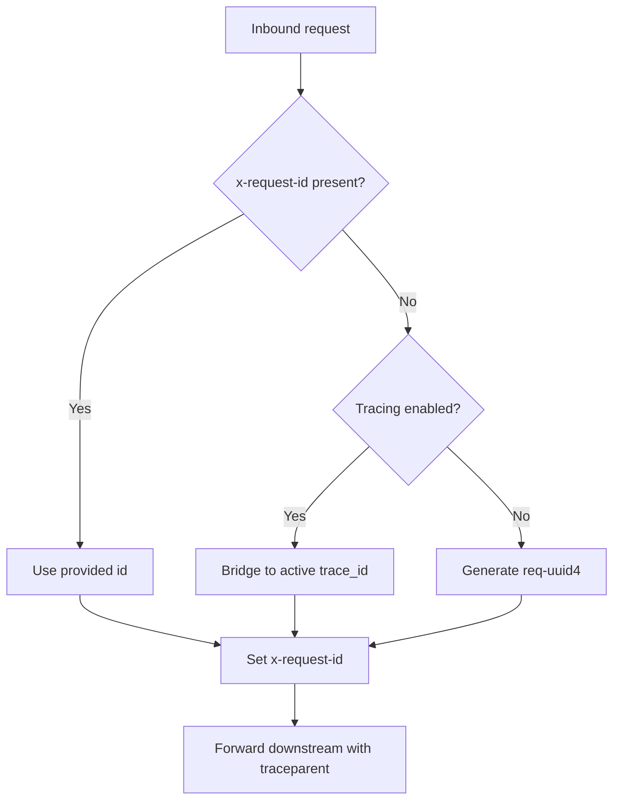
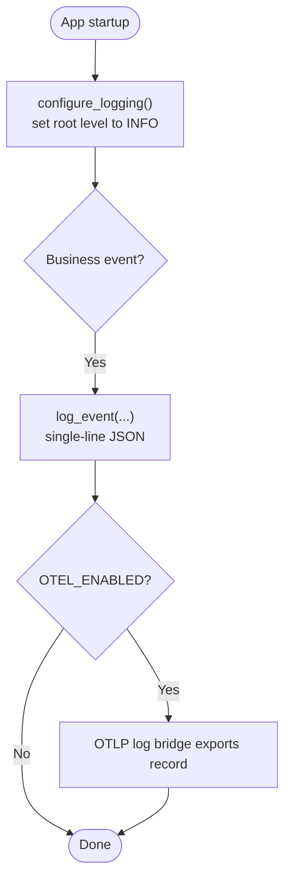
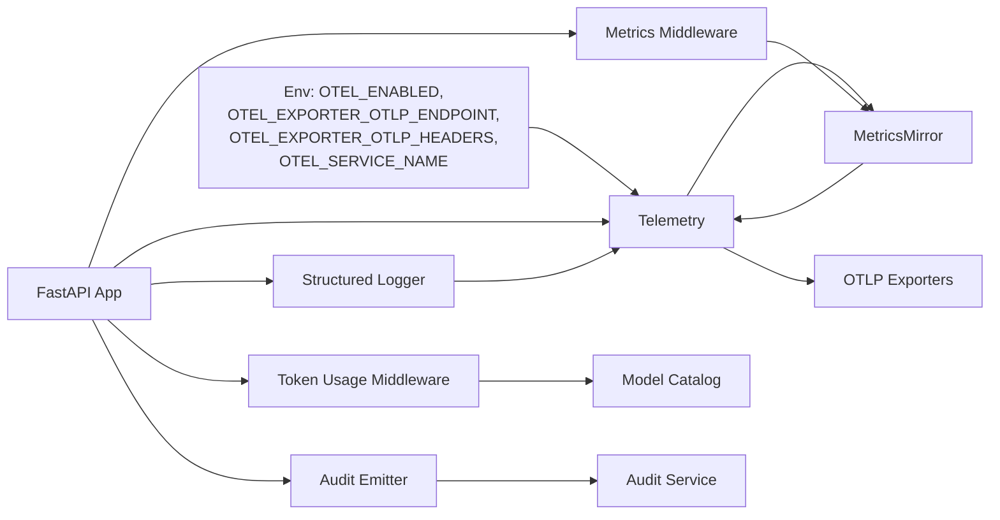

# Observability Conventions

<cite>
**Referenced Files in This Document**
- [observability-conventions.md](file://shared/shared-contracts/observability-conventions.md)
- [audit-event.schema.json](file://shared/shared-contracts/schemas/audit-event.schema.json)
- [telemetry.py (platform-gateway)](file://products/platform-gateway/src/platform_gateway/core/telemetry.py)
- [metrics.py (platform-gateway)](file://products/platform-gateway/src/platform_gateway/core/metrics.py)
- [request_context.py (platform-gateway)](file://products/platform-gateway/src/platform_gateway/core/request_context.py)
- [telemetry.py (agent-platform)](file://products/agent-platform/src/agent_service/core/telemetry.py)
- [metrics.py (agent-platform)](file://products/agent-platform/src/agent_service/core/metrics.py)
- [kernel_middleware.py (agent-platform)](file://products/agent-platform/src/agent_service/services/kernel_middleware.py)
- [runtime_kernel.py (agent-platform)](file://products/agent-platform/src/agent_service/runtime_kernel.py)
- [observability.py (tool-gateway)](file://products/tool-gateway/src/tool_gateway/core/observability.py)
- [observability.py (execution-runtime)](file://products/execution-runtime/src/execution_runtime/core/observability.py)
- [observability.py (identity-broker)](file://products/identity-broker/src/identity_service/core/observability.py)
- [audit_emitter.py (platform-gateway)](file://products/platform-gateway/src/platform_gateway/services/audit_emitter.py)
- [audit_emitter.py (agent-platform)](file://products/agent-platform/src/agent_service/services/audit_emitter.py)
- [audit_emitter.py (tool-gateway)](file://products/tool-gateway/src/tool_gateway/services/audit_emitter.py)
- [audit_emitter.py (identity-broker)](file://products/identity-broker/src/identity_service/services/audit_emitter.py)
- [audit_store.py (audit-service)](file://products/audit-service/src/audit_service/services/audit_store.py)
- [test_telemetry.py (platform-gateway)](file://products/platform-gateway/tests/test_telemetry.py)
- [test_telemetry.py (agent-platform)](file://products/agent-platform/tests/test_telemetry.py)
- [test_telemetry.py (incident-service)](file://products/incident-service/tests/test_telemetry.py)
- [test_observability.py (tool-gateway)](file://products/tool-gateway/tests/test_observability.py)
- [SPEC-065 spec.md](file://docs/specs/SPEC-065-r5-observability-token-cost-dashboards/spec.md)
- [luban-aiops-llm-tokens.dashboard.json](file://shared/platform-ops/dashboards/luban-aiops-llm-tokens.dashboard.json)
</cite>

## Update Summary
**Changes Made**
- Added comprehensive documentation for the MetricsMirror pattern that ensures consistent metric families across Prometheus and OpenTelemetry surfaces
- Documented OTEL_MIRROR_FAMILIES configuration pattern used consistently across all eight services
- Enhanced guidance for declaring metric families and maintaining label set consistency between observability surfaces
- Updated implementation examples to show the dual-surface approach with automatic mirroring
- Added detailed coverage of TokenUsageMiddleware and agent_llm_tokens_total metric with bounded label constraints
- Included verification tests that ensure Prometheus and OTel metrics remain synchronized
- Documented the complete SPEC-065 implementation including dashboard configuration and live-check procedures

## Table of Contents
1. Introduction
2. Project Structure
3. Core Components
4. Architecture Overview
5. Detailed Component Analysis
6. Dependency Analysis
7. Performance Considerations
8. Troubleshooting Guide
9. Conclusion
10. Appendices

## Introduction
This document defines the platform-wide observability conventions that ensure consistent metrics, tracing, and logging across all services. It explains how each service exposes a pull-based Prometheus endpoint, an opt-in OpenTelemetry push pipeline for traces, metrics, and mirrored logs, and how structured logs form the audit trail. It also documents metric naming, label cardinality rules, trace context propagation, log formatting, and the relationship between operational events and the durable audit trail.

**Updated** Enhanced with SPEC-065 token usage tracking and cost monitoring specifications, including LLM token consumption metrics, provider-derived cost tracking, and dashboard-ready domain metrics via OTel push. The platform now implements a consistent MetricsMirror pattern across all eight services to ensure Prometheus and OpenTelemetry surfaces remain synchronized, along with comprehensive token usage tracking through the TokenUsageMiddleware.

## Project Structure
Observability is implemented per service with a consistent layout:
- A telemetry module initializes OpenTelemetry providers when enabled and provides the MetricsMirror utility.
- A metrics module registers Prometheus counters/histograms and declares OTEL_MIRROR_FAMILIES for automatic mirroring.
- An observability/logging helper configures the root logger to INFO and emits single-line JSON events.
- Audit emitters ship canonical audit events to the audit service.
- Request context resolves correlation IDs bridging OTel trace context and x-request-id.
- **New**: Token usage middleware captures provider-reported LLM token consumption data.



**Diagram sources**
- [telemetry.py (platform-gateway):69-117](file://products/platform-gateway/src/platform_gateway/core/telemetry.py#L69-L117)
- [metrics.py (platform-gateway):74-95](file://products/platform-gateway/src/platform_gateway/core/metrics.py#L74-L95)
- [observability.py (tool-gateway):9-24](file://products/tool-gateway/src/tool_gateway/core/observability.py#L9-L24)
- [audit_emitter.py (platform-gateway):77-98](file://products/platform-gateway/src/platform_gateway/services/audit_emitter.py#L77-L98)

**Section sources**
- [observability-conventions.md:9-16](file://shared/shared-contracts/observability-conventions.md#L9-L16)
- [telemetry.py (platform-gateway):1-13](file://products/platform-gateway/src/platform_gateway/core/telemetry.py#L1-L13)
- [metrics.py (platform-gateway):1-11](file://products/platform-gateway/src/platform_gateway/core/metrics.py#L1-L11)
- [observability.py (tool-gateway):9-24](file://products/tool-gateway/src/tool_gateway/core/observability.py#L9-L24)

## Core Components
- Pull metrics surface: Always-on Prometheus endpoint via prometheus_client with RED middleware.
- Opt-in OTel push: Traces, metrics, and logs exported over OTLP HTTP/protobuf; gated by OTEL_ENABLED; fails open.
- **New**: MetricsMirror pattern: Automatic mirroring of Prometheus metrics to OpenTelemetry instruments with identical names and label sets.
- Structured logs: Single-line JSON at INFO level; OTLP mirror attached when OTel is enabled.
- Correlation: x-request-id bridges W3C trace_id when tracing is active; otherwise generated UUID.
- Audit trail: Canonical event envelope shipped to the audit service with bounded enums and stable fields.
- **New**: Token usage tracking via middleware that captures provider-reported LLM token consumption and costs.

Key implementation references:
- Telemetry initialization and log bridge attachment are identical across services.
- Metrics modules define service-specific counters/gauges and expose /metrics.
- **New**: Each service declares OTEL_MIRROR_FAMILIES tuple specifying which metrics to mirror.
- Logging helpers raise root logger to INFO and emit structured events.
- Audit emitters post canonical envelopes to the audit service.
- **New**: MetricsMirror automatically creates corresponding OTel instruments for declared families.
- **New**: Tests verify that Prometheus and OTel surfaces remain synchronized.

**Section sources**
- [observability-conventions.md:18-57](file://shared/shared-contracts/observability-conventions.md#L18-L57)
- [observability-conventions.md:58-77](file://shared/shared-contracts/observability-conventions.md#L58-L77)
- [telemetry.py (platform-gateway):69-117](file://products/platform-gateway/src/platform_gateway/core/telemetry.py#L69-L117)
- [metrics.py (platform-gateway):74-95](file://products/platform-gateway/src/platform_gateway/core/metrics.py#L74-L95)
- [observability.py (tool-gateway):9-24](file://products/tool-gateway/src/tool_gateway/core/observability.py#L9-L24)
- [audit-event.schema.json:1-94](file://shared/shared-contracts/schemas/audit-event.schema.json#L1-L94)

## Architecture Overview
The platform uses two decoupled surfaces with automatic synchronization:
- /metrics: collector-independent Prometheus scraping endpoint.
- OTLP push: opt-in traces, metrics, and logs sent to OpenObserve via OTLP HTTP/protobuf.
- **New**: MetricsMirror ensures both surfaces maintain identical metric families and label sets.

Request flow spans multiple services with automatic trace propagation via W3C Trace Context and explicit correlation via x-request-id.

```mermaid
sequenceDiagram
participant Client as "Client"
participant GW as "Platform Gateway"
participant AG as "Agent Platform"
participant TG as "Tool Gateway"
participant AUD as "Audit Service"
participant OBS as "OpenObserve"
participant PROM as "Prometheus"
Client->>GW : HTTP request
GW->>GW : Resolve x-request-id<br/>Attach OTel span
GW->>AG : Forward call (traceparent propagated)
AG->>AG : TokenUsageMiddleware captures usage
AG->>TG : Forward call (traceparent propagated)
TG-->>AUD : POST audit event (fire-and-forget)
AG-->>GW : Response
Note over GW,OBS : When OTEL_ENABLED=true,<br/>traces/metrics/logs pushed to OpenObserve
Note over GW,PROM : /metrics always available
Note over GW,AG,TG : MetricsMirror keeps Prometheus & OTel synchronized
```

**Diagram sources**
- [request_context.py (platform-gateway):8-19](file://products/platform-gateway/src/platform_gateway/core/request_context.py#L8-L19)
- [telemetry.py (platform-gateway):69-117](file://products/platform-gateway/src/platform_gateway/core/telemetry.py#L69-L117)
- [audit_emitter.py (platform-gateway):77-98](file://products/platform-gateway/src/platform_gateway/services/audit_emitter.py#L77-L98)
- [audit-event.schema.json:1-94](file://shared/shared-contracts/schemas/audit-event.schema.json#L1-L94)

**Section sources**
- [observability-conventions.md:9-16](file://shared/shared-contracts/observability-conventions.md#L9-L16)
- [observability-conventions.md:47-57](file://shared/shared-contracts/observability-conventions.md#L47-L57)
- [observability-conventions.md:71-77](file://shared/shared-contracts/observability-conventions.md#L71-L77)

## Detailed Component Analysis

### OpenTelemetry Integration
Each service provides a telemetry module that:
- Reads OTEL_ENABLED to decide whether to initialize providers.
- Creates Resource with service.name from OTEL_SERVICE_NAME or metadata.
- Configures TracerProvider with BatchSpanProcessor and OTLPSpanExporter.
- Configures MeterProvider with PeriodicExportingMetricReader and OTLPMetricExporter.
- Attaches a LoggingHandler to the root logger to mirror structured logs to OTLP.
- Instruments FastAPI and HTTPX clients automatically.
- Exposes current_trace_id() for correlation bridging.
- **New**: Provides MetricsMirror class for automatic metric family synchronization.



**Diagram sources**
- [telemetry.py (platform-gateway):69-117](file://products/platform-gateway/src/platform_gateway/core/telemetry.py#L69-L117)
- [telemetry.py (agent-platform):69-117](file://products/agent-platform/src/agent_service/core/telemetry.py#L69-L117)

**Section sources**
- [telemetry.py (platform-gateway):1-13](file://products/platform-gateway/src/platform_gateway/core/telemetry.py#L1-L13)
- [telemetry.py (platform-gateway):28-35](file://products/platform-gateway/src/platform_gateway/core/telemetry.py#L28-L35)
- [telemetry.py (platform-gateway):37-66](file://products/platform-gateway/src/platform_gateway/core/telemetry.py#L37-L66)
- [telemetry.py (platform-gateway):69-117](file://products/platform-gateway/src/platform_gateway/core/telemetry.py#L69-L117)
- [telemetry.py (platform-gateway):120-133](file://products/platform-gateway/src/platform_gateway/core/telemetry.py#L120-L133)

### Metric Naming and Labels
- Format: <service>_<noun>_<unit>, snake_case.
- Counters use _total suffix.
- Standard labels include method, handler, status for HTTP RED metrics.
- Domain counters use bounded enum labels only (e.g., decision ∈ {allow, deny}).
- High-cardinality labels (raw URL, user id, session id, request id) are forbidden.

**Updated** New token usage metrics follow the same conventions:
- `agent_llm_tokens_total{provider,model,direction}` - tracks input/output/cache tokens
- Direction values are strictly bounded: {input, output, cache_input, cache_creation}
- Model names are normalized through the model catalog (unknown models mapped to sentinel)
- No cost metric is emitted in this slice (deferred to follow-up)

Examples implemented in gateway and agent platform:
- HTTP requests and duration histograms.
- Policy decisions, token verification, delegation cache/exchange counters.
- Agent sessions created, chat requests, model discovery refreshes.
- **New**: LLM token usage tracking per model/provider with bounded labels.

**Section sources**
- [observability-conventions.md:18-45](file://shared/shared-contracts/observability-conventions.md#L18-L45)
- [metrics.py (platform-gateway):25-65](file://products/platform-gateway/src/platform_gateway/core/metrics.py#L25-L65)
- [metrics.py (agent-platform):23-43](file://products/agent-platform/src/agent_service/core/metrics.py#L23-L43)
- [metrics.py (agent-platform):294-316](file://products/agent-platform/src/agent_service/core/metrics.py#L294-L316)

### MetricsMirror Pattern and OTEL_MIRROR_FAMILIES
**New Section**

The platform implements a consistent MetricsMirror pattern across all eight services to ensure that Prometheus metrics are automatically mirrored to OpenTelemetry instruments with identical names and label sets. This eliminates manual synchronization and prevents drift between the two observability surfaces.

#### MetricsMirror Implementation
The MetricsMirror class provides automatic mirroring of Prometheus metrics to OpenTelemetry instruments:

```python
class MetricsMirror:
    """Re-emit prometheus domain families as OTel instruments (SPEC-065 R-2)."""
    
    def __init__(self, meter_name, families, meter_provider=None):
        self._meter_name = meter_name
        self._families = tuple(
            (str(name), str(kind), tuple(labels))
            for (name, kind, labels) in families
        )
        # Lazy initialization - instruments built on first record
        self._instruments = None
    
    def count(self, name, amount, labels=None):
        """Mirror a counter increment beside the prometheus .inc()."""
        
    def observe(self, name, value, labels=None):
        """Mirror a histogram observation beside the prometheus .observe()."""
        
    def set_gauge(self, name, value, labels=None):
        """Mirror a gauge set beside the prometheus .set()."""
```

Key characteristics:
- **Lazy initialization**: Instruments are built on first use, not import time
- **Fail-open**: Any OTel errors are logged and swallowed, never breaking requests
- **No-op when disabled**: No instruments created when OTEL_ENABLED is false
- **Generic**: Byte-identical across all services, no service-specific dependencies

#### OTEL_MIRROR_FAMILIES Declaration
Each service declares its metric families in a centralized tuple:

```python
# In each service's core/metrics.py
OTEL_MIRROR_FAMILIES = (
    ("http_requests_total", "counter", ("method", "handler", "status")),
    ("http_request_duration_seconds", "histogram", ("method", "handler")),
    # Service-specific metrics...
)

_MIRROR = MetricsMirror("service_name", OTEL_MIRROR_FAMILIES)
```

The tuple format specifies:
- `name`: The exposed Prometheus sample name (counters keep `_total` suffix)
- `kind`: One of `counter`, `histogram`, or `gauge`
- `labels`: Tuple of bounded label names (possibly empty)

#### Consistency Verification
Tests ensure Prometheus and OTel surfaces remain synchronized:

```python
def test_declared_families_match_prometheus_objects():
    """Verify OTEL_MIRROR_FAMILIES matches actual Prometheus objects."""
    prom = {...}  # Extract from prometheus_client metrics
    declared = {...}  # From OTEL_MIRROR_FAMILIES
    assert declared == prom  # Must match exactly
```



**Diagram sources**
- [telemetry.py (agent-platform):142-250](file://products/agent-platform/src/agent_service/core/telemetry.py#L142-L250)
- [metrics.py (agent-platform):31-51](file://products/agent-platform/src/agent_service/core/metrics.py#L31-L51)
- [metrics.py (platform-gateway):32-42](file://products/platform-gateway/src/platform_gateway/core/metrics.py#L32-L42)

**Section sources**
- [telemetry.py (agent-platform):142-250](file://products/agent-platform/src/agent_service/core/telemetry.py#L142-L250)
- [metrics.py (agent-platform):31-51](file://products/agent-platform/src/agent_service/core/metrics.py#L31-L51)
- [metrics.py (platform-gateway):32-42](file://products/platform-gateway/src/platform_gateway/core/metrics.py#L32-L42)
- [metrics.py (audit-service):30-43](file://products/audit-service/src/audit_service/core/metrics.py#L30-L43)
- [metrics.py (tool-gateway):32-41](file://products/tool-gateway/src/tool_gateway/core/metrics.py#L32-L41)
- [metrics.py (incident-service):30-39](file://products/incident-service/src/incident_service/core/metrics.py#L30-L39)

### Token Usage Tracking and Cost Monitoring
**Updated Section**

The platform implements token usage tracking through a dedicated middleware that captures provider-reported LLM consumption data. This addresses the gap identified in SPEC-065 where token usage was visible only as raw span attributes but not aggregated into actionable metrics.

#### TokenUsageMiddleware Implementation
The middleware intercepts model calls via the supported `on_model_call` hook, providing:
- Streaming-aware token counting that works with both blocking and streaming responses
- Provider-derived cost tracking from agentscope's usage data
- Bounded label cardinality enforcement for model names and directions
- Zero-synthesis policy: records nothing when providers return no usage data



**Diagram sources**
- [SPEC-065 spec.md:100-144](file://docs/specs/SPEC-065-r5-observability-token-cost-dashboards/spec.md#L100-L144)
- [kernel_middleware.py:636-740](file://products/agent-platform/src/agent_service/services/kernel_middleware.py#L636-L740)

#### Metric Specifications
- **Token Counter**: `agent_llm_tokens_total{provider,model,direction}`
  - Tracks input tokens, output tokens, cache input tokens, and cache creation tokens
  - Direction values are strictly bounded: {input, output, cache_input, cache_creation}
  - Model names are normalized through the model catalog (unknown → "unknown" sentinel)
  
- **Cost Counter**: Deferred to follow-up (not implemented in this slice)
  - No dollar-cost metric is emitted in SPEC-065
  - Cost tracking deferred due to lack of provider-derived cost data in agentscope 2.0.8

#### Streaming Support
The middleware handles streaming responses by wrapping AsyncGenerators to capture usage data from the terminal chunk, ensuring accurate token counts even for long-running streaming conversations.

#### Label Constraints
- **Provider**: Bounded via credential-gated model catalog
- **Model**: Bounded via model catalog (uncatalogued models → "unknown" sentinel)
- **Direction**: Strictly bounded to {input, output, cache_input, cache_creation}
- **Forbidden labels**: session_id, user_id, request_id (high-cardinality)

**Section sources**
- [SPEC-065 spec.md:100-144](file://docs/specs/SPEC-065-r5-observability-token-cost-dashboards/spec.md#L100-L144)
- [kernel_middleware.py:636-740](file://products/agent-platform/src/agent_service/services/kernel_middleware.py#L636-L740)
- [runtime_kernel.py:531-570](file://products/agent-platform/src/agent_service/runtime_kernel.py#L531-L570)
- [metrics.py (agent-platform):294-316](file://products/agent-platform/src/agent_service/core/metrics.py#L294-L316)

### Domain Metrics Push to OpenObserve
**Updated Section**

To make domain metrics dashboard-visible without deploying additional infrastructure, the platform additionally emits domain metrics as OpenTelemetry instruments that push over the existing OTLP pipeline into OpenObserve.

#### Mirror Mechanism
- Each service's domain metrics are mirrored to both Prometheus and OTel instruments via MetricsMirror
- The mirror is additive and gated by the same OTEL_ENABLED switch
- Fail-open semantics ensure unreachable backends don't break requests
- No new infrastructure required - uses existing OTLP pipeline
- **New**: Automatic synchronization ensures both surfaces remain consistent

#### Mirrored Metric Families
The following metric families are pushed to OpenObserve for dashboard visualization:
- R-1 token/cost family: `agent_llm_tokens_total`
- Chat/session counters: `agent_chat_requests_total`, `agent_sessions_created_total`
- Evidence store metrics: `evidence_store_writes_total`, `evidence_frames_persisted_total`, `evidence_frames_truncated_total`
- Audit emission metrics: `audit_emits_total`
- Model discovery metrics: `agent_model_discovery_models`, `agent_model_discovery_refreshes_total`
- RED metrics: `http_requests_total`, `http_request_duration_seconds`



**Diagram sources**
- [SPEC-065 spec.md:146-184](file://docs/specs/SPEC-065-r5-observability-token-cost-dashboards/spec.md#L146-L184)
- [plan.md:54-76](file://docs/specs/SPEC-065-r5-observability-token-cost-dashboards/plan.md#L54-L76)

**Section sources**
- [SPEC-065 spec.md:146-184](file://docs/specs/SPEC-065-r5-observability-token-cost-dashboards/spec.md#L146-L184)
- [plan.md:54-76](file://docs/specs/SPEC-065-r5-observability-token-cost-dashboards/plan.md#L54-L76)

### Trace Context Propagation and Correlation
- x-request-id is the portal-facing correlation key; preserved if present, else bridged to active OTel trace_id when tracing is on, else generated UUID.
- traceparent (W3C Trace Context) is managed by OTel instrumentation across hops.
- current_trace_id() returns the active span's W3C trace_id when tracing is enabled.



**Diagram sources**
- [request_context.py (platform-gateway):8-19](file://products/platform-gateway/src/platform_gateway/core/request_context.py#L8-L19)
- [telemetry.py (platform-gateway):120-133](file://products/platform-gateway/src/platform_gateway/core/telemetry.py#L120-L133)

**Section sources**
- [observability-conventions.md:71-77](file://shared/shared-contracts/observability-conventions.md#L71-L77)
- [request_context.py (platform-gateway):8-19](file://products/platform-gateway/src/platform_gateway/core/request_context.py#L8-L19)
- [telemetry.py (platform-gateway):120-133](file://products/platform-gateway/src/platform_gateway/core/telemetry.py#L120-L133)

### Structured Logging Standards
- All business and request events are emitted as single-line JSON via log_event(...) at INFO level.
- configure_logging() raises the root logger from WARNING to INFO so audit records survive.
- LOG_LEVEL can override per deployment; default must remain INFO.
- When OTel is enabled, a LoggingHandler mirrors stdout JSON into OTLP logs; stdout remains source of truth.



**Diagram sources**
- [observability.py (tool-gateway):9-24](file://products/tool-gateway/src/tool_gateway/core/observability.py#L9-L24)
- [observability.py (execution-runtime):9-24](file://products/execution-runtime/src/execution_runtime/core/observability.py#L9-L24)
- [observability.py (identity-broker):9-24](file://products/identity-broker/src/identity_service/core/observability.py#L9-L24)
- [telemetry.py (platform-gateway):37-66](file://products/platform-gateway/src/platform_gateway/core/telemetry.py#L37-L66)

**Section sources**
- [observability-conventions.md:58-69](file://shared/shared-contracts/observability-conventions.md#L58-L69)
- [observability.py (tool-gateway):9-24](file://products/tool-gateway/src/tool_gateway/core/observability.py#L9-L24)
- [observability.py (execution-runtime):9-24](file://products/execution-runtime/src/execution_runtime/core/observability.py#L9-L24)
- [observability.py (identity-broker):9-24](file://products/identity-broker/src/identity_service/core/observability.py#L9-L24)

### Audit Trail Relationship
- Emitters mint event_id and occurred_at, then post canonical envelopes to the audit service.
- The audit service stores and returns envelopes verbatim; queries aggregate by event_type, outcome, service, and decision chains.
- Operational events (http_request) are observability data and excluded from the audit contract.

```mermaid
sequenceDiagram
participant Svc as "Service"
participant Aud as "Audit Service"
Svc->>Svc : Build audit envelope<br/>event_id, occurred_at, event_type, service, request_id, outcome
Svc->>Aud : POST /api/v1/audit/events
Aud-->>Svc : 202 Accepted
Note over Svc,Aud : Envelope stored verbatim; queries aggregate counts and chains
```

**Diagram sources**
- [audit-event.schema.json:1-94](file://shared/shared-contracts/schemas/audit-event.schema.json#L1-L94)
- [audit_store.py (audit-service):467-496](file://products/audit-service/src/audit_service/services/audit_store.py#L467-L496)
- [audit_emitter.py (platform-gateway):77-98](file://products/platform-gateway/src/platform_gateway/services/audit_emitter.py#L77-L98)

**Section sources**
- [audit-event.schema.json:1-94](file://shared/shared-contracts/schemas/audit-event.schema.json#L1-L94)
- [audit_store.py (audit-service):467-496](file://products/audit-service/src/audit_service/services/audit_store.py#L467-L496)
- [audit_emitter.py (platform-gateway):77-98](file://products/platform-gateway/src/platform_gateway/services/audit_emitter.py#L77-L98)
- [audit_emitter.py (agent-platform):77-98](file://products/agent-platform/src/agent_service/services/audit_emitter.py#L77-L98)
- [audit_emitter.py (tool-gateway):76-97](file://products/tool-gateway/src/tool_gateway/services/audit_emitter.py#L76-97)
- [audit_emitter.py (identity-broker):78-99](file://products/identity-broker/src/identity_service/services/audit_emitter.py#L78-L99)

## Dependency Analysis
Services depend on shared conventions and internal modules:
- Telemetry depends on environment variables and optional OTLP backend.
- Metrics depend on prometheus_client and FastAPI middleware.
- Logging depends on Python logging and optional OTel LoggingHandler.
- Audit emission depends on configured audit service URL and credentials.
- **New**: MetricsMirror depends on OTEL_MIRROR_FAMILIES declaration and provides automatic synchronization.
- **New**: Token usage tracking depends on agentscope's ChatResponse.usage data and model catalog for bounded labels.



**Diagram sources**
- [telemetry.py (platform-gateway):1-13](file://products/platform-gateway/src/platform_gateway/core/telemetry.py#L1-L13)
- [metrics.py (platform-gateway):74-95](file://products/platform-gateway/src/platform_gateway/core/metrics.py#L74-L95)
- [observability.py (tool-gateway):9-24](file://products/tool-gateway/src/tool_gateway/core/observability.py#L9-L24)
- [audit_emitter.py (platform-gateway):77-98](file://products/platform-gateway/src/platform_gateway/services/audit_emitter.py#L77-L98)

**Section sources**
- [observability-conventions.md:47-57](file://shared/shared-contracts/observability-conventions.md#L47-L57)
- [telemetry.py (platform-gateway):69-117](file://products/platform-gateway/src/platform_gateway/core/telemetry.py#L69-L117)
- [metrics.py (platform-gateway):74-95](file://products/platform-gateway/src/platform_gateway/core/metrics.py#L74-L95)

## Performance Considerations
- OTel push is off by default; when enabled, batch processors minimize overhead.
- Unbounded label cardinality is prohibited to avoid storage and query cost spikes.
- Fail-open semantics ensure unreachable backends do not break requests.
- /metrics is lightweight and independent of OTel.
- **New**: MetricsMirror is lazy-initialized and fail-open, adding minimal overhead.
- **New**: Token usage middleware is always-on but lightweight, only recording counters when usage data is available.
- **New**: Streaming-aware token counting avoids performance penalties by reading usage only from terminal chunks.

## Troubleshooting Guide
Common issues and diagnostics:
- OTel disabled: setup_telemetry returns early; no providers initialized.
- OTel enabled but unreachable: exporters drop telemetry; health and /metrics remain functional.
- Logging level too high: ensure configure_logging() sets root to INFO; audit records will be lost otherwise.
- Missing correlation: verify x-request-id resolution and presence of traceparent across hops.
- **New**: MetricsMirror issues: check OTEL_MIRROR_FAMILIES declaration matches Prometheus objects; verify tests pass.
- **New**: Token metrics missing: check if TokenUsageMiddleware is registered and if providers report usage data.
- **New**: Cost metrics absent: verify provider supports cost reporting; tokens-only mode degrades gracefully.

Relevant tests validate behavior:
- Disabled initialization leaves no providers or bridge attached.
- Enabled initialization attaches LoggingHandler and instruments app.
- Unreachable collector still serves /health/live and /metrics.
- **New**: MetricsMirror tests verify Prometheus and OTel surfaces remain synchronized.
- **New**: Token usage middleware tests cover streaming/non-streaming responses and bounded label validation.

**Section sources**
- [test_telemetry.py (platform-gateway):45-66](file://products/platform-gateway/tests/test_telemetry.py#L45-L66)
- [test_telemetry.py (agent-platform):45-66](file://products/agent-platform/tests/test_telemetry.py#L45-L66)
- [test_telemetry.py (incident-service):45-66](file://products/incident-service/tests/test_telemetry.py#L45-L66)
- [test_observability.py (tool-gateway):128-157](file://products/tool-gateway/tests/test_observability.py#L128-L157)

## Conclusion
The platform enforces a uniform observability model: always-on Prometheus metrics, opt-in OTel push for traces/metrics/logs, structured JSON logs as the audit trail, and robust correlation across service boundaries. Services implement these conventions consistently, enabling reliable dashboards, distributed tracing, and auditable operations.

**Updated** With SPEC-065 enhancements, the platform now provides comprehensive LLM token usage tracking and cost monitoring, making AI resource consumption observable through standardized metrics and dashboard-ready domain signals. The MetricsMirror pattern ensures both Prometheus and OpenTelemetry surfaces remain synchronized, eliminating manual maintenance and preventing drift between observability backends. The TokenUsageMiddleware provides streaming-aware token counting with bounded label constraints, while the complete dashboard suite offers real-time visibility into token consumption patterns.

## Appendices

### Implementing Observability in a New Service
- Add a telemetry module following the existing pattern: read OTEL_ENABLED, initialize providers, attach log bridge, instrument FastAPI and HTTPX, expose current_trace_id().
- Add a metrics module: register counters/histograms with bounded labels, add RED middleware, expose GET /metrics.
- **New**: Declare OTEL_MIRROR_FAMILIES tuple listing all metric families to mirror, with exact name, kind, and label tuples.
- **New**: Create MetricsMirror instance with service name and families tuple.
- Add logging configuration: call configure_logging() at startup; emit structured events via log_event(...).
- Add audit emission: build canonical envelopes per schema and post to the audit service using the standard emitter pattern.
- Wire correlation: resolve x-request-id using the request context helper.
- **New**: For LLM token tracking, implement TokenUsageMiddleware that intercepts model calls and records provider-reported usage data.

**Section sources**
- [telemetry.py (platform-gateway):69-117](file://products/platform-gateway/src/platform_gateway/core/telemetry.py#L69-L117)
- [metrics.py (platform-gateway):74-95](file://products/platform-gateway/src/platform_gateway/core/metrics.py#L74-L95)
- [observability.py (tool-gateway):9-24](file://products/tool-gateway/src/tool_gateway/core/observability.py#L9-L24)
- [audit-event.schema.json:1-94](file://shared/shared-contracts/schemas/audit-event.schema.json#L1-L94)
- [request_context.py (platform-gateway):8-19](file://products/platform-gateway/src/platform_gateway/core/request_context.py#L8-L19)

### Configuring Monitoring Dashboards
- Scrape /metrics from each service for RED metrics and domain counters.
- Use OTLP ingestion to correlate logs with traces via shared trace_id/x-request-id.
- Filter logs by service name and event types defined in the audit schema.
- **New**: Dashboard-ready domain metrics are pushed to OpenObserve via OTel instruments when OTEL_ENABLED=true.
- **New**: Token usage dashboards visualize `agent_llm_tokens_total` by provider/model/direction.
- **New**: Both Prometheus and OpenObserve show identical metrics due to MetricsMirror synchronization.
- **New**: Complete dashboard suite includes token consumption, RED metrics, and governance views.

**Section sources**
- [observability-conventions.md:9-16](file://shared/shared-contracts/observability-conventions.md#L9-L16)
- [audit-event.schema.json:25-50](file://shared/shared-contracts/schemas/audit-event.schema.json#L25-L50)
- [luban-aiops-llm-tokens.dashboard.json:1-748](file://shared/platform-ops/dashboards/luban-aiops-llm-tokens.dashboard.json#L1-L748)

### Debugging Issues Using the Unified Stack
- Start with /metrics to identify hotspots and error rates.
- Follow x-request-id across services; when tracing is enabled, it equals the active trace_id.
- Inspect OTLP logs correlated to the same trace/span to understand failures.
- Review audit events for policy decisions, tool invocations, and execution outcomes.
- **New**: Check token usage metrics to identify expensive model calls and cost anomalies.
- **New**: Use domain metrics pushed to OpenObserve for real-time dashboard visibility without additional infrastructure.
- **New**: Verify MetricsMirror synchronization by comparing Prometheus and OTel outputs.

**Section sources**
- [observability-conventions.md:71-77](file://shared/shared-contracts/observability-conventions.md#L71-L77)
- [audit_store.py (audit-service):467-496](file://products/audit-service/src/audit_service/services/audit_store.py#L467-L496)
- [audit_emitter.py (platform-gateway):77-98](file://products/platform-gateway/src/platform_gateway/services/audit_emitter.py#L77-L98)

### Token Usage Monitoring Best Practices
- Monitor token consumption patterns per model/provider combination.
- Track direction ratios to understand input vs output token usage.
- Use bounded model labels to prevent cardinality explosion.
- Leverage streaming-aware token counting for accurate measurements.
- Combine token metrics with audit trails for comprehensive attribution when needed.
- **New**: Dashboard panels provide real-time visibility into token consumption trends.

**Section sources**
- [SPEC-065 spec.md:100-144](file://docs/specs/SPEC-065-r5-observability-token-cost-dashboards/spec.md#L100-L144)
- [kernel_middleware.py:636-740](file://products/agent-platform/src/agent_service/services/kernel_middleware.py#L636-L740)
- [luban-aiops-llm-tokens.dashboard.json:1-748](file://shared/platform-ops/dashboards/luban-aiops-llm-tokens.dashboard.json#L1-L748)

### MetricsMirror Implementation Guide
**New Section**

When implementing observability in new services, follow this pattern for consistent metric synchronization:

#### Step 1: Declare Metric Families
```python
OTEL_MIRROR_FAMILIES = (
    ("http_requests_total", "counter", ("method", "handler", "status")),
    ("http_request_duration_seconds", "histogram", ("method", "handler")),
    # Add service-specific metrics here
)
```

#### Step 2: Create MetricsMirror Instance
```python
from core.telemetry import MetricsMirror

_MIRROR = MetricsMirror("service_name", OTEL_MIRROR_FAMILIES)
```

#### Step 3: Mirror Prometheus Calls
```python
# Instead of just:
HTTP_REQUESTS.inc()

# Do both:
HTTP_REQUESTS.inc()
_MIRROR.count("http_requests_total", 1, {"method": method, "handler": handler, "status": status})
```

#### Step 4: Verify Synchronization
Run the test suite to ensure Prometheus and OTel surfaces remain synchronized:
```bash
pytest tests/test_telemetry.py::MetricsMirrorTests
```

**Section sources**
- [metrics.py (agent-platform):31-51](file://products/agent-platform/src/agent_service/core/metrics.py#L31-L51)
- [metrics.py (platform-gateway):32-42](file://products/platform-gateway/src/platform_gateway/core/metrics.py#L32-L42)
- [test_telemetry.py (agent-platform):69-86](file://products/agent-platform/tests/test_telemetry.py#L69-L86)