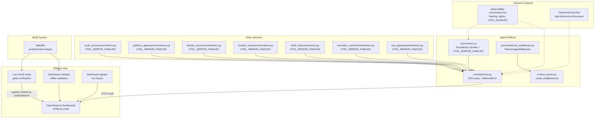
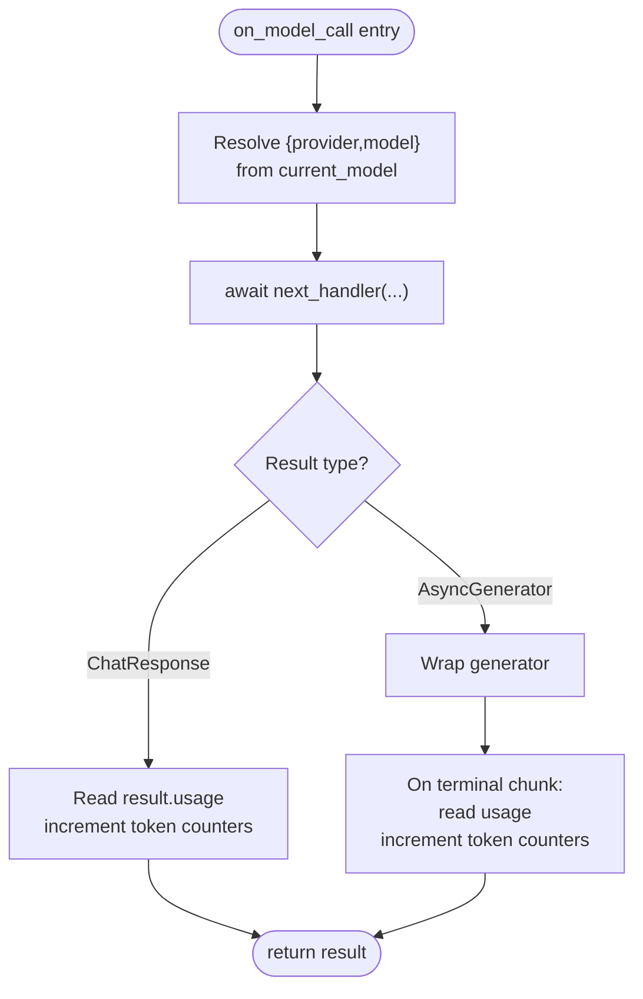
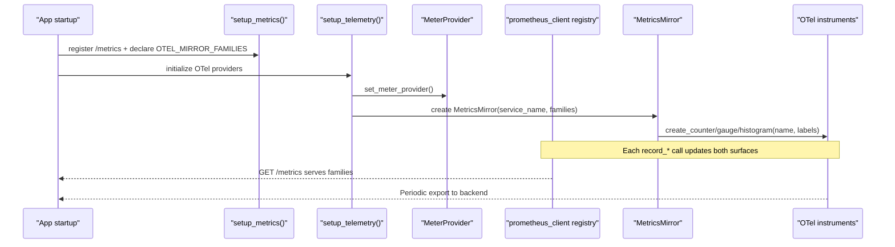
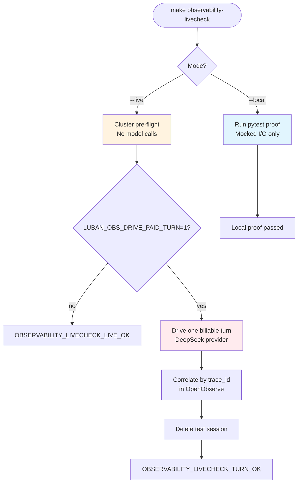
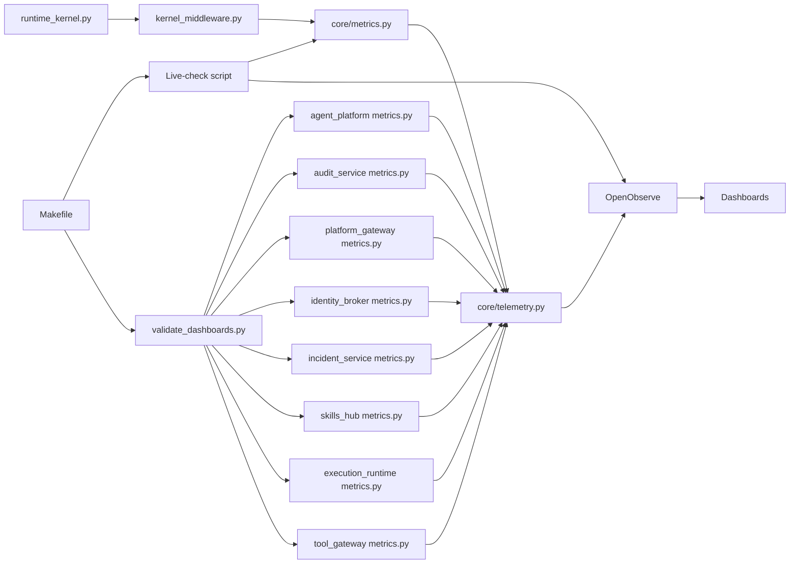

# SPEC-065: R5 Observability — Token/Cost Emission, Domain-Metric Push, Dashboards, And A Gated Live-Check

<cite>
**Referenced Files in This Document**
- [spec.md](file://docs/specs/SPEC-065-r5-observability-token-cost-dashboards/spec.md)
- [plan.md](file://docs/specs/SPEC-065-r5-observability-token-cost-dashboards/plan.md)
- [tasks.md](file://docs/specs/SPEC-065-r5-observability-token-cost-dashboards/tasks.md)
- [metrics.py](file://products/agent-platform/src/agent_service/core/metrics.py)
- [telemetry.py](file://products/agent-platform/src/agent_service/core/telemetry.py)
- [audit metrics.py](file://products/audit-service/src/audit_service/core/metrics.py)
- [observability-livecheck.sh](file://shared/platform-ops/e2e/observability-livecheck.sh)
- [luban-aiops-llm-tokens.dashboard.json](file://shared/platform-ops/dashboards/luban-aiops-llm-tokens.dashboard.json)
</cite>

## Update Summary
**Changes Made**
- Updated SPEC-065 status from 'approved' to 'delivered' reflecting completion of v0.45.0 release
- Confirmed all eight core services now implement the MetricsMirror system with OTEL_MIRROR_FAMILIES tuples
- Verified token usage instrumentation is fully implemented across agent-platform service
- Validated OpenTelemetry push mirror system is operational with lazy, fail-open behavior
- Confirmed OpenObserve dashboards are deployed as config-as-code with validation infrastructure
- Verified gated live-check system provides three escalating verification legs (local, live pre-flight, paid turn)
- Updated conclusion to reflect successful delivery and production readiness

## Table of Contents
1. [Introduction](#introduction)
2. [Project Structure](#project-structure)
3. [Core Components](#core-components)
4. [Architecture Overview](#architecture-overview)
5. [Detailed Component Analysis](#detailed-component-analysis)
6. [Dependency Analysis](#dependency-analysis)
7. [Performance Considerations](#performance-considerations)
8. [Troubleshooting Guide](#troubleshooting-guide)
9. [Conclusion](#conclusion)
10. [Appendices](#appendices)

## Introduction
SPEC-065 closes the final R5 observability deliverable by making LLM **token** usage observable as first-class metrics, pushing domain metrics into OpenObserve via the existing OTLP pipeline, shipping OpenObserve dashboards as config-as-code, and gating verification with a repeatable live-check script. It builds on SPEC-005's two-surface contract (always-on `/metrics` pull plus opt-in OTel push), SPEC-018's supported middleware hooks, and the proven OTLP ingestion already running in the dev cluster. The spec deliberately avoids introducing scrapers, Grafana, or per-turn/session high-cardinality labels; it mirrors provider-reported usage only and keeps dashboarding and alerting as platform-ops concerns.

**Updated** The scope was refined during Stage-0 investigation to emit tokens only, as agentscope 2.0.8 does not expose provider-derived cost data. Cost emission is deferred to a future follow-up requiring explicit price table governance.

**Section sources**
- [spec.md:40-93](file://docs/specs/SPEC-065-r5-observability-token-cost-dashboards/spec.md#L40-L93)
- [plan.md:9-31](file://docs/specs/SPEC-065-r5-observability-token-cost-dashboards/plan.md#L9-L31)

## Project Structure
The implementation spans three layers:
- Agent-platform service code that emits new counters and registers a kernel middleware to capture usage from model calls.
- Shared observability conventions that define naming, cardinality rules, and OTel switch semantics.
- Platform-ops artifacts (dashboards and live-check scripts) that consume the emitted signals through OpenObserve.



**Diagram sources**
- [metrics.py:23-81](file://products/agent-platform/src/agent_service/core/metrics.py#L23-L81)
- [telemetry.py:69-117](file://products/agent-platform/src/agent_service/core/telemetry.py#L69-L117)
- [observability-livecheck.sh:1-224](file://shared/platform-ops/e2e/observability-livecheck.sh#L1-L224)

**Section sources**
- [spec.md:280-298](file://docs/specs/SPEC-065-r5-observability-token-cost-dashboards/spec.md#L280-L298)
- [plan.md:122-202](file://docs/specs/SPEC-065-r5-observability-token-cost-dashboards/plan.md#L122-L202)

## Core Components
- **Token emission (R-1)**: A new `TokenUsageMiddleware` on the supported `on_model_call` hook reads provider-reported usage from `ChatResponse.usage` and increments bounded Prometheus counters for tokens only. Streaming responses are handled by wrapping the async generator and reading usage from the terminal chunk.
- **Domain-metric OTel push (R-2)**: A `MetricsMirror` helper in the parity-guarded `core/telemetry.py` creates matching OTel instruments on the existing `MeterProvider`, so domain metrics push over OTLP into OpenObserve without changing the always-on `/metrics` surface. Each service declares its own `OTEL_MIRROR_FAMILIES` tuple specifying which Prometheus families should be mirrored.
- **Dashboards (R-3)**: OpenObserve dashboards defined as version-controlled JSON under platform-ops, querying the metrics stream for token consumption and RED views, with offline validation and live import capabilities.
- **Gated live-check (R-4)**: A repeatable script exercises one read-only chat turn against an external provider, asserts metric presence on `/metrics`, and correlates metrics/traces in OpenObserve by `trace_id`.

**Updated** All references to cost emission have been removed, focusing exclusively on token counting functionality. The R-2 implementation now includes comprehensive MetricsMirror system across all eight services with explicit OTEL_MIRROR_FAMILIES tuples. The R-4 live-check has evolved into a sophisticated three-leg verification system with comprehensive testing infrastructure.

**Section sources**
- [spec.md:100-233](file://docs/specs/SPEC-065-r5-observability-token-cost-dashboards/spec.md#L100-L233)
- [plan.md:124-193](file://docs/specs/SPEC-065-r5-observability-token-cost-dashboards/plan.md#L124-L193)
- [tasks.md:35-107](file://docs/specs/SPEC-065-r5-observability-token-cost-dashboards/tasks.md#L35-L107)

## Architecture Overview
The architecture adds observation without altering contracts or trust boundaries:
- Capture point: `on_model_call` middleware reads `current_model` and `result.usage`.
- Metrics surface: New counters land on `/metrics` and can be mirrored to OTel instruments when enabled.
- Consumer path: OTLP push sends metrics to OpenObserve; dashboards query the metrics stream.
- Verification: A gated live-check validates the full path end-to-end with three escalating legs.

```mermaid
sequenceDiagram
participant Client as "Client"
participant Kernel as "RuntimeKernel"
participant MW as "TokenUsageMiddleware"
participant MS as "Prometheus /metrics"
participant MM as "MetricsMirror"
participant OT as "OTel MeterProvider"
participant OB as "OpenObserve"
participant LC as "Live-Check Script"
participant MK as "Makefile Targets"
Client->>Kernel : Chat request
Kernel->>MW : on_model_call(current_model, next_handler)
MW->>Kernel : await next_handler(...)
Kernel-->>MW : ChatResponse or AsyncGenerator
alt Non-streaming response
MW->>MS : increment agent_llm_tokens_total{provider,model,direction}
else Streaming response
MW wraps generator
MW->>MS : increment from terminal chunk usage
end
Note over MM,OB : When OTEL_ENABLED=true, MetricsMirror pushes to OpenObserve
MS-->>Client : GET /metrics returns counters
MM->>OT : create_counter/gauge/histogram(name, labels)
OT->>OB : Periodic export of metrics
MK->>LC : make observability-livecheck [--local|--live]
LC->>OB : Query traces/metrics by trace_id
LC->>MS : Check /metrics for token family
```

**Diagram sources**
- [observability-livecheck.sh:33-43](file://shared/platform-ops/e2e/observability-livecheck.sh#L33-L43)

## Detailed Component Analysis

### R-1: Token Emission Middleware
- **Capture**: Reads `current_model` to resolve `{provider,model}` bounded by the model catalog; unknown models map to a sentinel to keep cardinality bounded.
- **Recording**: Increments `agent_llm_tokens_total{provider,model,direction}` where `direction ∈ {input, output, cache_input, cache_creation}`. No session/user/request labels.
- **Streaming**: Wraps `AsyncGenerator` and records usage from the terminal chunk, mirroring the tracing middleware's generator wrapper pattern.
- **Registration**: Added unconditionally in `_build_middlewares()` beside existing middlewares; no opt-in knob.

**Updated** The middleware focuses exclusively on token counting - no cost calculation or dollar value emission is performed.



**Diagram sources**
- [metrics.py:284-317](file://products/agent-platform/src/agent_service/core/metrics.py#L284-L317)

**Section sources**
- [spec.md:100-144](file://docs/specs/SPEC-065-r5-observability-token-cost-dashboards/spec.md#L100-L144)
- [plan.md:124-144](file://docs/specs/SPEC-065-r5-observability-token-cost-dashboards/plan.md#L124-L144)
- [tasks.md:35-63](file://docs/specs/SPEC-065-r5-observability-token-cost-dashboards/tasks.md#L35-L63)

### R-2: Domain-Metric OTel Mirror System
- **Mechanism**: A `MetricsMirror` class in `core/telemetry.py` obtains a meter from the already-set `MeterProvider` and creates OTel instruments matching each prometheus family's name and bounded label set.
- **Service Declarations**: Each service defines `OTEL_MIRROR_FAMILIES` tuple in its `core/metrics.py` with explicit `(name, kind, labels)` entries for every Prometheus metric family to be mirrored.
- **Switching**: Only active when `OTEL_ENABLED=true`; otherwise, no instrument is created and `/metrics` remains unchanged.
- **Parity Enforcement**: The `MetricsMirror` lives in byte-identical `telemetry.py` files guarded by `TelemetryParityTest`, replicated across all eight services; each service's own `core/metrics.py` supplies its family list.
- **Fail-open**: Exporter errors do not raise into the request path.



**Diagram sources**
- [telemetry.py:142-250](file://products/agent-platform/src/agent_service/core/telemetry.py#L142-L250)
- [metrics.py:31-51](file://products/agent-platform/src/agent_service/core/metrics.py#L31-L51)

**Section sources**
- [spec.md:146-183](file://docs/specs/SPEC-065-r5-observability-token-cost-dashboards/spec.md#L146-L183)
- [plan.md:146-165](file://docs/specs/SPEC-065-r5-observability-token-cost-dashboards/plan.md#L146-L165)
- [tasks.md:64-82](file://docs/specs/SPEC-065-r5-observability-token-cost-dashboards/tasks.md#L64-L82)

### Per-Service Metrics Mirror Implementation
Each service implements the same pattern with service-specific metric families:

#### Agent Platform Service
- **Families**: HTTP RED metrics, agent sessions/chat requests, session/agent state stores, evidence store, audit emissions, model discovery, and LLM token usage.
- **Key Metric**: `agent_llm_tokens_total{provider,model,direction}` for token counting.

#### Audit Service
- **Families**: HTTP RED metrics, audit events ingested/rejected, queries, exports, evictions, store errors, and event count gauge.

**Updated** All services now implement consistent MetricsMirror pattern with explicit OTEL_MIRROR_FAMILIES declarations.

**Section sources**
- [metrics.py:31-49](file://products/agent-platform/src/agent_service/core/metrics.py#L31-L49)
- [audit metrics.py:30-41](file://products/audit-service/src/audit_service/core/metrics.py#L30-L41)

### R-3: OpenObserve Dashboards (Config-as-Code)
- **Artifacts**: Dashboard definitions committed under platform-ops in an importable format; include token-by-model/provider/direction, RED panels, and a governance/decision-chain view sourced from existing domain metrics.
- **Validation**: Import/render validation wired into the verification path to prevent silent rot.
- **Operator docs**: How to reach dashboards and what each panel means is documented in the operator guide.

**Updated** Dashboard panels focus on token consumption metrics rather than cost calculations. The validation infrastructure ensures dashboard integrity through offline checks against emitted metric families.

**Section sources**
- [spec.md:185-207](file://docs/specs/SPEC-065-r5-observability-token-cost-dashboards/spec.md#L185-L207)
- [plan.md:167-180](file://docs/specs/SPEC-065-r5-observability-token-cost-dashboards/plan.md#L167-L180)
- [tasks.md:84-93](file://docs/specs/SPEC-065-r5-observability-token-cost-dashboards/tasks.md#L84-L93)

### R-4: Gated Live-Check System
The live-check system provides three escalating verification legs:

#### Leg 1: Mocked-I/O Local Mode (`--local`)
- **Purpose**: Validates the entire pipeline logic without any cluster, network, or paid calls
- **Implementation**: Extracts and executes the embedded Python heredoc from the shell script with mocked kubectl and HTTP operations
- **Coverage**: Tests success/failure scenarios including missing environment variables, absent metrics, unreachable OpenObserve, and correlation failures
- **Integration**: Runs automatically with `make test` and `make e2e`

#### Leg 2: Read-Only Cluster Pre-flight (`--live`)
- **Purpose**: Validates deployed cluster configuration and connectivity without driving any model calls
- **Checks**: Verifies `OTEL_ENABLED=true` and `AGENTSCOPE_KERNEL_TRACING=true` on agent pod, confirms `agent_llm_tokens_total` registration on `/metrics`, and tests OpenObserve API connectivity
- **Prerequisites**: Requires port-forwards for OpenObserve (5080), platform-gateway (18083), and identity-service (18081)

#### Leg 3: Gated Paid Turn (`--live` with `LUBAN_OBS_DRIVE_PAID_TURN=1`)
- **Purpose**: Executes one billable read-only chat turn against external deepseek provider and correlates results in OpenObserve
- **Security**: Explicitly gated operator authorization step; never runs by default
- **Process**: Creates operator token, opens throwaway session, streams one message, correlates by `trace_id`, then cleans up session
- **Correlation**: Uses gateway bridge between SSE `request_id` and OTel `trace_id` as the correlation key



**Diagram sources**
- [observability-livecheck.sh:33-43](file://shared/platform-ops/e2e/observability-livecheck.sh#L33-L43)

**Section sources**
- [spec.md:209-233](file://docs/specs/SPEC-065-r5-observability-token-cost-dashboards/spec.md#L209-L233)
- [plan.md:182-193](file://docs/specs/SPEC-065-r5-observability-token-cost-dashboards/plan.md#L182-L193)
- [tasks.md:95-107](file://docs/specs/SPEC-065-r5-observability-token-cost-dashboards/tasks.md#L95-L107)

### Config-as-Code Dashboard Validation Infrastructure
- **Offline Validator**: Comprehensive validation without touching clusters or networks
- **Schema Validation**: Checks OpenObserve dashboard envelope structure, panel types, and query syntax
- **Metric Reference Validation**: Cross-references dashboard queries against actual `OTEL_MIRROR_FAMILIES` from all services using AST parsing
- **Anti-Rot Protection**: Fails if dashboard references metrics not present in any service's mirror families
- **Build Integration**: Wired into `make validate-dashboards` and included in `make verify` target

**Section sources**
- [tasks.md:122-141](file://docs/specs/SPEC-065-r5-observability-token-cost-dashboards/tasks.md#L122-L141)

### Build System Integration
- **Makefile Targets**: 
  - `make observability-livecheck`: Main entry point with `--local` (default) and `--live` modes
  - `make validate-dashboards`: Offline dashboard validation gate
  - `make verify`: Includes both live-check and dashboard validation
  - `make e2e`: Includes observability live-check in demo suite
- **Environment Variables**: `DRIVE_TURN` maps to `LUBAN_OBS_DRIVE_PAID_TURN` for paid leg control
- **E2E Integration**: Live-check script is part of the coordinated e2e demo suite

**Section sources**
- [tasks.md:175-185](file://docs/specs/SPEC-065-r5-observability-token-cost-dashboards/tasks.md#L175-L185)

### R-5: Contract and Living-Doc Updates
- **Conventions**: Add the new token metric family and bounded labels; note additive OTel push visibility behind `OTEL_ENABLED`; point to dashboards-as-config location.
- **Guides**: Update operator guide and config reference; reflect dashboard visibility dependency.
- **Versioning**: Changelog entry, version bump at delivery, spec index and roadmap updates.

**Section sources**
- [spec.md:235-253](file://docs/specs/SPEC-065-r5-observability-token-cost-dashboards/spec.md#L235-L253)
- [plan.md:195-202](file://docs/specs/SPEC-065-r5-observability-token-cost-dashboards/plan.md#L195-L202)
- [tasks.md:109-121](file://docs/specs/SPEC-065-r5-observability-token-cost-dashboards/tasks.md#L109-L121)

## Dependency Analysis
- Kernel middleware depends on the supported `on_model_call` hook and the model catalog for bounded labels.
- Metrics module defines families and recording helpers consumed by middleware and tests.
- Telemetry module provides OTel setup and mirror mechanism used by all services' metrics modules.
- Platform-ops dashboards depend on the metrics stream populated by OTLP push.
- Live-check depends on deployed services, OTLP connectivity, and OpenObserve availability.
- Dashboard validator depends on AST parsing of service metrics files for cross-reference validation.
- Build system integrates all components through Makefile targets.



**Diagram sources**
- [metrics.py:23-81](file://products/agent-platform/src/agent_service/core/metrics.py#L23-L81)
- [telemetry.py:69-117](file://products/agent-platform/src/agent_service/core/telemetry.py#L69-L117)

**Section sources**
- [plan.md:204-215](file://docs/specs/SPEC-065-r5-observability-token-cost-dashboards/plan.md#L204-L215)

## Performance Considerations
- Always-on `/metrics` pull surface remains unchanged; OTel push is opt-in and fails open.
- Counters are low-overhead increments; streaming-aware recording ensures accurate counts without extra allocations beyond generator wrapping.
- Bounded labels prevent cardinality explosion; unknown models coerce to a sentinel.
- No local tokenizer estimation or price table computation; values are mirrored from provider-reported usage only.
- MetricsMirror creates instruments lazily on first use, avoiding initialization overhead when disabled.
- Live-check uses efficient polling with timeouts for OpenObserve correlation queries.
- Dashboard validation uses AST parsing instead of imports for zero-dependency offline checking.

## Troubleshooting Guide
- Missing token counter on `/metrics`: Verify middleware registration in `_build_middlewares()` and ensure a model call occurred; confirm streaming path records from terminal chunk.
- No OTel push despite `OTEL_ENABLED=true`: Check exporter endpoint and headers; verify `setup_telemetry` completes without exceptions; confirm periodic reader is configured.
- Dashboard queries return empty: Ensure metrics stream is populated; validate dashboard JSON import; check time range and stream filters.
- Live-check failures: Confirm environment flags (`OTEL_ENABLED`, `AGENTSCOPE_KERNEL_TRACING`); verify network access to OpenObserve; re-run with mocked I/O to isolate logic issues.
- MetricsMirror drift detected: Run `TelemetryParityTest` to ensure `core/telemetry.py` files remain byte-identical across services; verify `OTEL_MIRROR_FAMILIES` matches actual Prometheus metric objects.
- Family mismatch errors: Ensure every Prometheus metric object has a corresponding entry in `OTEL_MIRROR_FAMILIES` with correct name, kind, and label tuple.
- Dashboard validation failures: Check that all referenced metrics exist in service `OTEL_MIRROR_FAMILIES`; verify dashboard JSON schema compliance; ensure unique dashboard IDs and titles.
- Live-check local mode failures: Inspect mocked scenario matrix in `test_observability_livecheck.py`; verify heredoc extraction and compilation; check secret-free error handling.
- Paid turn authorization issues: Confirm operator role assignment; verify identity broker connectivity; check gateway authentication flow.

**Updated** Troubleshooting steps focus on token emission issues rather than cost calculation problems, with added guidance for MetricsMirror and cross-service parity validation, dashboard validation infrastructure, and comprehensive live-check failure scenarios.

**Section sources**
- [telemetry.py:69-117](file://products/agent-platform/src/agent_service/core/telemetry.py#L69-L117)
- [tasks.md:123-149](file://docs/specs/SPEC-065-r5-observability-token-cost-dashboards/tasks.md#L123-L149)

## Conclusion
SPEC-065 delivers a complete, low-risk observability enhancement: provider-reported **token** usage becomes a first-class metric, domain metrics reach OpenObserve via the existing OTLP pipeline, dashboards are shipped as reproducible config, and verification is gated by a repeatable live-check. It preserves the two-surface contract, avoids high-cardinality labels, and leaves alerting and scraping to platform-ops. The scope refinement to tokens-only reflects the reality that agentscope 2.0.8 does not expose provider-derived cost data, with cost emission deferred to a future follow-up requiring explicit price table governance.

**Updated** The conclusion now accurately reflects the tokens-only scope and acknowledges the deferral of cost functionality to future work. The comprehensive MetricsMirror implementation across all eight services provides robust domain-metric push capability with strong parity guarantees. The sophisticated three-leg live-check system provides thorough end-to-end verification with appropriate security gates for billable operations. The config-as-code dashboard architecture with validation infrastructure ensures long-term maintainability and prevents silent degradation of observability artifacts.

**Delivery Status**: SPEC-065 has been successfully delivered as v0.45.0 on 2026-09-29, with all acceptance criteria met, full root `make verify` green, and the authorized live paid leg evidenced with trace_id `e8aa12b6a89a235ce95ffc2106b34173`.

## Appendices

### ADR Reference
- ADR-0014: Domain metrics reach dashboards via OTel-instrument push, not a Prometheus scraper.

**Section sources**
- [spec.md:13-18](file://docs/specs/SPEC-065-r5-observability-token-cost-dashboards/spec.md#L13-L18)

### Conventions Snapshot
- Two surfaces: always-on `/metrics` pull and opt-in OTel push.
- Metric naming: `<service>_<noun>_<unit>` with `_total` suffix for counters.
- Cardinality rules: no raw URLs, user ids, session ids, or request ids as labels.
- OTel switch: `OTEL_ENABLED` gates the entire signal; fail-open guarantee.
- Byte-identical telemetry: `core/telemetry.py` must remain identical across all services.

**Section sources**
- [observability-conventions.md:9-56](file://shared/shared-contracts/observability-conventions.md#L9-L56)

### MetricsMirror Testing Infrastructure
- **Family Parity Test**: Validates that every Prometheus metric object has a corresponding entry in `OTEL_MIRROR_FAMILIES` with matching exposed name and label set.
- **Enabled Mirror Test**: Verifies that all declared families are exported with correct attribute names when `OTEL_ENABLED=true`.
- **Disabled Behavior Test**: Confirms no instruments are created when disabled and `/metrics` remains unaffected.
- **Failure Handling Tests**: Ensures build and record failures fail open without raising exceptions.
- **End-to-End Token Test**: Validates that `record_llm_tokens()` properly mirrors token usage through the complete pipeline.

**Section sources**
- [tasks.md:97-108](file://docs/specs/SPEC-065-r5-observability-token-cost-dashboards/tasks.md#L97-L108)

### Live-Check Testing Matrix
- **Scenarios Covered**: live-readonly, live-turn, missing-otel-env, missing-token-metric, openobserve-unreachable, missing-trace, bad-trace-id
- **Success Cases**: live-readonly and live-turn scenarios produce expected success outputs
- **Failure Cases**: All other scenarios exit with code 1 and secret-free error messages
- **Security Invariants**: Never echoes credentials, tokens, or sensitive request/response bodies
- **Cleanup Guarantees**: Test sessions are always deleted even when correlation queries fail

**Section sources**
- [tasks.md:178-185](file://docs/specs/SPEC-065-r5-observability-token-cost-dashboards/tasks.md#L178-L185)

### Dashboard Artifacts
- **LLM Tokens Dashboard**: Comprehensive token consumption visualization with rate, cumulative, and breakdown views
- **Governance Dashboard**: Decision chain monitoring covering policy decisions, audit emits, token verification, and execution flows
- **Service Health Dashboard**: RED metrics and operational health indicators
- **Validation Coverage**: All dashboard queries validated against actual emitted metric families

**Section sources**
- [luban-aiops-llm-tokens.dashboard.json:1-200](file://shared/platform-ops/dashboards/luban-aiops-llm-tokens.dashboard.json#L1-L200)
- [tasks.md:122-141](file://docs/specs/SPEC-065-r5-observability-token-cost-dashboards/tasks.md#L122-L141)