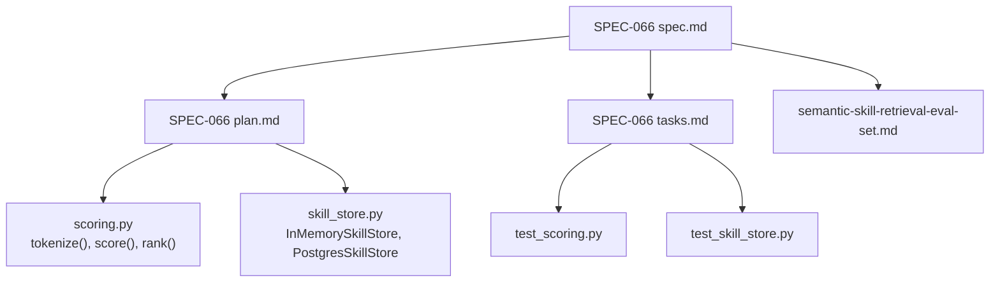
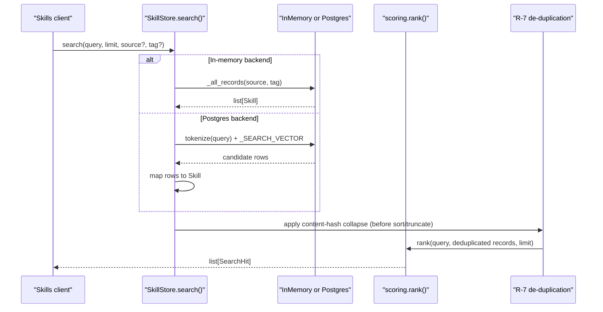
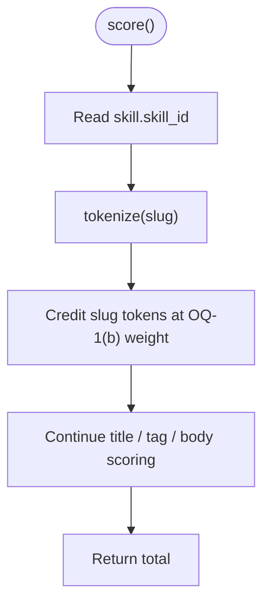
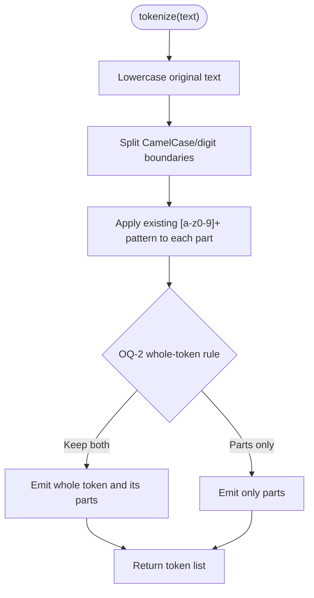
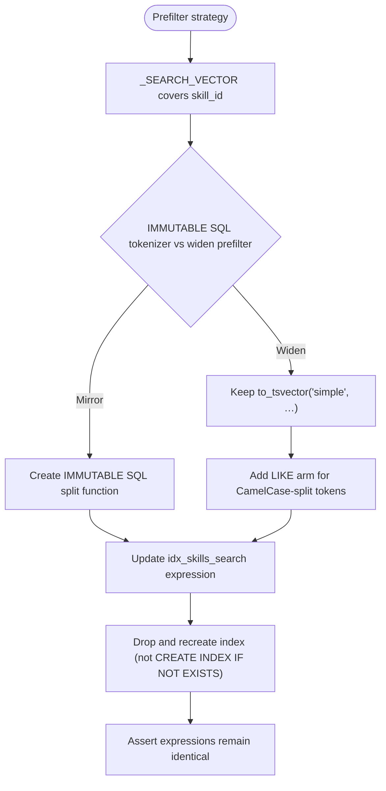
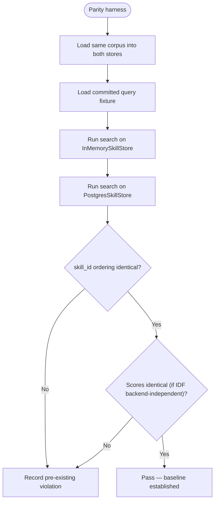
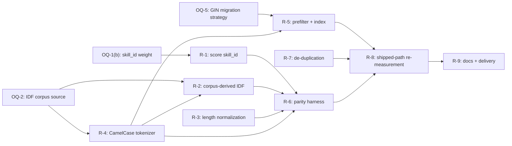
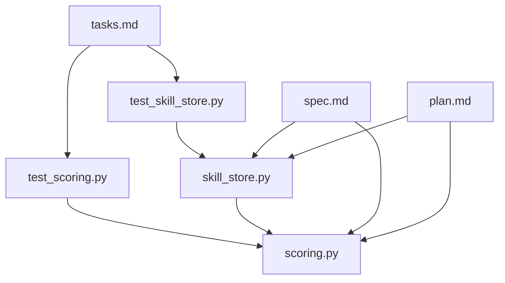

# SPEC-066: Skill Retrieval Ranking Fidelity

<cite>
**Referenced Files in This Document**   
- [spec.md](file://docs/specs/SPEC-066-skill-retrieval-ranking-fidelity/spec.md)
- [plan.md](file://docs/specs/SPEC-066-skill-retrieval-ranking-fidelity/plan.md)
- [tasks.md](file://docs/specs/SPEC-066-skill-retrieval-ranking-fidelity/tasks.md)
- [scoring.py](file://products/skills-hub/src/skills_hub/services/scoring.py)
- [skill_store.py](file://products/skills-hub/src/skills_hub/services/skill_store.py)
- [test_scoring.py](file://products/skills-hub/tests/test_scoring.py)
- [test_skill_store.py](file://products/skills-hub/tests/test_skill_store.py)
- [semantic-skill-retrieval-eval-set.md](file://docs/workspace/semantic-skill-retrieval-eval-set.md)
</cite>

## Table of Contents
1. [Introduction](#introduction)
2. [Project Structure](#project-structure)
3. [Core Components](#core-components)
4. [Architecture Overview](#architecture-overview)
5. [Detailed Component Analysis](#detailed-component-analysis)
6. [Dependency Analysis](#dependency-analysis)
7. [Performance Considerations](#performance-considerations)
8. [Troubleshooting Guide](#troubleshooting-guide)
9. [Conclusion](#conclusion)

## Introduction
SPEC-066 proposes four measured lexical improvements to the skills-hub keyword retriever, plus cross-backend parity enforcement and a product-side de-duplication guardrail. The spec is authored as `draft` with six open questions that must be resolved before approval. Its evidence base is the semantic skill retrieval spike's evaluation set, which established that combining inverse document frequency weighting, sublinear body-length normalization, CamelCase-splitting tokenization, and scoring the `skill_id` slug moves top-1 correctness from 0.500 to 0.711 on the labeled corpus — but only when all four are applied together.

The central risk is that the measurement was taken over an in-memory corpus export, not through the deployed Postgres backend. Three of the four fixes are therefore not backend-neutral as measured, and two would silently under-deliver or regress recall without a co-change to the Postgres prefilter and its GIN index. The spec's primary requirement is thus **parity**: both backends must produce the same ordering (and, where IDF is backend-independent, the same scores), and the change must be re-measured on the shipped path before promotion.

## Project Structure
SPEC-066 lives under `docs/specs/SPEC-066-skill-retrieval-ranking-fidelity/` alongside its specification, plan, and task scaffold. The implementation scope is concentrated in the `skills-hub` product:

**Diagram sources**
- [spec.md:1-586](file://docs/specs/SPEC-066-skill-retrieval-ranking-fidelity/spec.md#L1-L586)
- [plan.md:1-373](file://docs/specs/SPEC-066-skill-retrieval-ranking-fidelity/plan.md#L1-L373)
- [tasks.md:1-305](file://docs/specs/SPEC-066-skill-retrieval-ranking-fidelity/tasks.md#L1-L305)
- [scoring.py:1-97](file://products/skills-hub/src/skills_hub/services/scoring.py#L1-L97)
- [skill_store.py:1-518](file://products/skills-hub/src/skills_hub/services/skill_store.py#L1-L518)
- [test_scoring.py:1-141](file://products/skills-hub/tests/test_scoring.py#L1-L141)
- [test_skill_store.py:1-652](file://products/skills-hub/tests/test_skill_store.py#L1-L652)
- [semantic-skill-retrieval-eval-set.md:1-200](file://docs/workspace/semantic-skill-retrieval-eval-set.md#L1-L200)

**Section sources**
- [spec.md:1-586](file://docs/specs/SPEC-066-skill-retrieval-ranking-fidelity/spec.md#L1-L586)
- [plan.md:1-373](file://docs/specs/SPEC-066-skill-retrieval-ranking-fidelity/plan.md#L1-L373)
- [tasks.md:1-305](file://docs/specs/SPEC-066-skill-retrieval-ranking-fidelity/tasks.md#L1-L305)

## Core Components
The current retriever has three layers:

| Layer | File | Responsibility |
|---|---|---|
| Tokenizer and scorer | `scoring.py` | Splits text into lowercase alphanumeric tokens, computes title/tag/body contributions, ranks hits by score then `skill_id`, and produces excerpts. |
| In-memory store | `skill_store.py::InMemorySkillStore` | Holds per-source snapshots; `search()` passes all filtered records directly to `rank()`. |
| Postgres store | `skill_store.py::PostgresSkillStore` | Prefilters candidates with a `to_tsvector` full-text expression, maps rows to `Skill`, then delegates ranking to the shared `rank()`. |

The existing scorer weights title matches at 3.0, tag matches at 2.0, and capped body occurrences at 1.0, with ties broken by ascending `skill_id`. The Postgres `_SEARCH_VECTOR` covers `title || ' ' || body` and the tags array, but not `skill_id`; the GIN index `idx_skills_search` mirrors that expression.

**Section sources**
- [scoring.py:1-97](file://products/skills-hub/src/skills_hub/services/scoring.py#L1-L97)
- [skill_store.py:69-144](file://products/skills-hub/src/skills_hub/services/skill_store.py#L69-L144)
- [skill_store.py:158-256](file://products/skills-hub/src/skills_hub/services/skill_store.py#L158-L256)
- [skill_store.py:437-463](file://products/skills-hub/src/skills_hub/services/skill_store.py#L437-L463)

## Architecture Overview
SPEC-066 does not introduce a new service. It modifies the shared scorer, the Postgres prefilter/index, and the ranking pipeline, while adding a parity harness and a content-hash de-duplication step.

**Diagram sources**
- [skill_store.py:137-144](file://products/skills-hub/src/skills_hub/services/skill_store.py#L137-L144)
- [skill_store.py:437-463](file://products/skills-hub/src/skills_hub/services/skill_store.py#L437-L463)
- [scoring.py:85-96](file://products/skills-hub/src/skills_hub/services/scoring.py#L85-L96)

The spec requires R-7's de-duplication to happen **before** sorting and truncation so that byte-identical bodies do not consume distinct result slots. The spec also requires R-6's parity harness to drive both backends over the same corpus and query set and assert identical `skill_id` ordering (and, for backend-independent IDF, identical scores).

**Section sources**
- [spec.md:258-357](file://docs/specs/SPEC-066-skill-retrieval-ranking-fidelity/spec.md#L258-L357)
- [plan.md:227-252](file://docs/specs/SPEC-066-skill-retrieval-ranking-fidelity/plan.md#L227-L252)

## Detailed Component Analysis

### Requirement R-1: Score the `skill_id` slug
R-1 adds `skill_id` as a fourth scored field in `score()`. The measurement used `TAG_WEIGHT` (2.0); any other weight is explicitly unmeasured and rejected by the spec. The slug must tokenize consistently with the title, so separators such as `/` and `-` become separate tokens, and with R-4 active, CamelCase-derived tokens are included.

Acceptance criteria include stratum-A identifier-owner recovery against the committed label fixture, recording behaviour for queries naming identifiers absent from the corpus, and ensuring a slug-only match returns non-empty results on both backends once R-5 is delivered.

**Diagram sources**
- [scoring.py:33-52](file://products/skills-hub/src/skills_hub/services/scoring.py#L33-L52)
- [plan.md:62-75](file://docs/specs/SPEC-066-skill-retrieval-ranking-fidelity/plan.md#L62-L75)

**Section sources**
- [spec.md:153-177](file://docs/specs/SPEC-066-skill-retrieval-ranking-fidelity/spec.md#L153-L177)
- [plan.md:62-75](file://docs/specs/SPEC-066-skill-retrieval-ranking-fidelity/plan.md#L62-L75)
- [tasks.md:88-98](file://docs/specs/SPEC-066-skill-retrieval-ranking-fidelity/tasks.md#L88-L98)

### Requirement R-2: Corpus-derived IDF weighting
R-2 replaces fixed per-field weights with inverse document frequency weighting using the formula `ln((1+N)/(1+df))+1`, where `N` is the document count and `df` is the number of documents containing the token. No hand-maintained stopword list is introduced. Field-weight ordering remains title > tags > body, preserving SPEC-014 R-3's guarantee.

The recommended design computes `N` and `df` once per request over the whole catalog, ignoring `source`/`tag` filters, so both backends derive the same statistics. Computing over the pool passed to `rank()` is rejected because the in-memory and Postgres callers pass different pools, which would break the byte-identical invariant.

**Diagram sources**
- [spec.md:178-205](file://docs/specs/SPEC-066-skill-retrieval-ranking-fidelity/spec.md#L178-L205)
- [plan.md:77-108](file://docs/specs/SPEC-066-skill-retrieval-ranking-fidelity/plan.md#L77-L108)

**Section sources**
- [spec.md:178-205](file://docs/specs/SPEC-066-skill-retrieval-ranking-fidelity/spec.md#L178-L205)
- [plan.md:77-108](file://docs/specs/SPEC-066-skill-retrieval-ranking-fidelity/plan.md#L77-L108)
- [tasks.md:113-128](file://docs/specs/SPEC-066-skill-retrieval-ranking-fidelity/tasks.md#L113-L128)

### Requirement R-3: Sublinear body-length normalization
R-3 dampens the body contribution by multiplying it by `1/log2(2 + len(body)/1000)` after the existing `BODY_OCCURRENCE_CAP = 5` cap. The factor is always in `(0, 1.0]`, including for empty bodies, so no division-by-zero or logarithm-of-zero branch is reachable. This fix is per-document and therefore backend-neutral by construction.

**Diagram sources**
- [spec.md:206-228](file://docs/specs/SPEC-066-skill-retrieval-ranking-fidelity/spec.md#L206-L228)
- [plan.md:109-123](file://docs/specs/SPEC-066-skill-retrieval-ranking-fidelity/plan.md#L109-L123)

**Section sources**
- [spec.md:206-228](file://docs/specs/SPEC-066-skill-retrieval-ranking-fidelity/spec.md#L206-L228)
- [plan.md:109-123](file://docs/specs/SPEC-066-skill-retrieval-ranking-fidelity/plan.md#L109-L123)
- [tasks.md:83-87](file://docs/specs/SPEC-066-skill-retrieval-ranking-fidelity/tasks.md#L83-L87)

### Requirement R-4: CamelCase-splitting tokenization
R-4 changes `tokenize()` so CamelCase runs split into component words. The spec uses `KubePodCrashLooping` → `kube`, `pod`, `crash`, `looping` as the canonical example. The exact rule for digits, acronyms, and mixed runs is fixed in `plan.md` and covered by a committed case table.

The critical coupling is that the same whole-token decision must be applied in `tokenize()`, in R-2's `df` computation, and in R-5's prefilter. A partial application — keeping the whole token in one place and parts in another — is the failure mode this criterion exists to prevent.

**Diagram sources**
- [scoring.py:28-30](file://products/skills-hub/src/skills_hub/services/scoring.py#L28-L30)
- [spec.md:229-257](file://docs/specs/SPEC-066-skill-retrieval-ranking-fidelity/spec.md#L229-L257)
- [plan.md:124-151](file://docs/specs/SPEC-066-skill-retrieval-ranking-fidelity/plan.md#L124-L151)

**Section sources**
- [spec.md:229-257](file://docs/specs/SPEC-066-skill-retrieval-ranking-fidelity/spec.md#L229-L257)
- [plan.md:124-151](file://docs/specs/SPEC-066-skill-retrieval-ranking-fidelity/plan.md#L124-L151)
- [tasks.md:99-112](file://docs/specs/SPEC-066-skill-retrieval-ranking-fidelity/tasks.md#L99-L112)

### Requirement R-5: Cross-backend parity for the new scorer
R-5 makes the Postgres prefilter admit every record the new scorer can rank above zero. Without it, R-1 does not ship (slug-only matches return zero rows on Postgres) and R-4 regresses recall (query-side splitting breaks the mirror between Python `tokenize()` and PostgreSQL `to_tsvector('simple', …)`).

Two strategies are considered:

| Strategy | Approach | Trade-off |
|---|---|---|
| Mirror tokenizer in SQL | Add `skill_id` to the `to_tsvector` expression and express R-4's split as an IMMUTABLE SQL function | Cleanest and keeps the index selective, but requires proving the function IMMUTABLE and pinning it against the Python case table. |
| Widen the prefilter (recommended) | Keep `to_tsvector('simple', …)` as-is, add `skill_id`, and additionally admit rows via a case-insensitive substring/LIKE path for CamelCase-split tokens | Cannot drift from Python; failure mode is a slow sequential scan rather than a silent missing row. |

The migration must rebuild `idx_skills_search` because `_DDL` uses `CREATE INDEX IF NOT EXISTS`, which will not rebuild an existing index when its expression changes. `CREATE INDEX CONCURRENTLY` cannot run inside a transaction block, so the concurrency window must be explicit.

**Diagram sources**
- [spec.md:258-294](file://docs/specs/SPEC-066-skill-retrieval-ranking-fidelity/spec.md#L258-L294)
- [plan.md:153-196](file://docs/specs/SPEC-066-skill-retrieval-ranking-fidelity/plan.md#L153-L196)
- [skill_store.py:243-256](file://products/skills-hub/src/skills_hub/services/skill_store.py#L243-L256)

**Section sources**
- [spec.md:258-294](file://docs/specs/SPEC-066-skill-retrieval-ranking-fidelity/spec.md#L258-L294)
- [plan.md:153-196](file://docs/specs/SPEC-066-skill-retrieval-ranking-fidelity/plan.md#L153-L196)
- [tasks.md:130-164](file://docs/specs/SPEC-066-skill-retrieval-ranking-fidelity/tasks.md#L130-L164)

### Requirement R-6: Enforced cross-backend parity harness
R-6 replaces the documented-but-untested byte-identical invariant with a test that actually enforces it. It drives both `InMemorySkillStore` and `PostgresSkillStore` over the same corpus and the same committed query set — the union of the 63-query audit pool and the 18 authored stratum-C paraphrases — and asserts identical `skill_id` ordering. With backend-independent IDF, it asserts identical scores, not merely equal ordering.

The harness must fail on the current code if the invariant is already violated, or pass and thereby establish the baseline. It must not be written so that it can only pass.

**Diagram sources**
- [spec.md:295-320](file://docs/specs/SPEC-066-skill-retrieval-ranking-fidelity/spec.md#L295-L320)
- [plan.md:198-226](file://docs/specs/SPEC-066-skill-retrieval-ranking-fidelity/plan.md#L198-L226)
- [tasks.md:47-74](file://docs/specs/SPEC-066-skill-retrieval-ranking-fidelity/tasks.md#L47-L74)

**Section sources**
- [spec.md:295-320](file://docs/specs/SPEC-066-skill-retrieval-ranking-fidelity/spec.md#L295-L320)
- [plan.md:198-226](file://docs/specs/SPEC-066-skill-retrieval-ranking-fidelity/plan.md#L198-L226)
- [tasks.md:47-74](file://docs/specs/SPEC-066-skill-retrieval-ranking-fidelity/tasks.md#L47-L74)

### Requirement R-7: Product-side de-duplication guardrail
R-7 collapses byte-identical bodies in `rank()` before sorting and truncation, retaining the lowest `skill_id` as the deterministic survivor. The identity key is `md5(body)`, consistent with the label fixture's `body_md5` pin. The spec explicitly states that MD5 here is a content-identity key, not a security digest.

Overlap rejection is deliberately kept out of `parse_sources`, because that function validates JSON shape and duplicate `source_id` values but never sees file content. If ingestion-time rejection is desired, it belongs at sync time and is scoped to OQ-6.

**Diagram sources**
- [spec.md:321-357](file://docs/specs/SPEC-066-skill-retrieval-ranking-fidelity/spec.md#L321-L357)
- [plan.md:227-252](file://docs/specs/SPEC-066-skill-retrieval-ranking-fidelity/plan.md#L227-L252)
- [tasks.md:165-192](file://docs/specs/SPEC-066-skill-retrieval-ranking-fidelity/tasks.md#L165-L192)

**Section sources**
- [spec.md:321-357](file://docs/specs/SPEC-066-skill-retrieval-ranking-fidelity/spec.md#L321-L357)
- [plan.md:227-252](file://docs/specs/SPEC-066-skill-retrieval-ranking-fidelity/plan.md#L227-L252)
- [tasks.md:165-192](file://docs/specs/SPEC-066-skill-retrieval-ranking-fidelity/tasks.md#L165-L192)

### Requirement R-8: Re-measurement on the shipped path
R-8 extends the offline evaluation harness to drive `PostgresSkillStore.search()` rather than calling `rank()` directly, so the prefilter is inside the measured path. It asserts the fixture's `body_md5` per document before computing metrics, reports results per backend, and discloses the known Q63 re-ordering regression and unchanged abstention rate.

If the Postgres-path gain is not outside the noise band, the spec defines a null-result path: publish the result, do not merge R-1..R-5, and record the outcome on the backlog row.

**Section sources**
- [spec.md:358-389](file://docs/specs/SPEC-066-skill-retrieval-ranking-fidelity/spec.md#L358-L389)
- [plan.md:254-273](file://docs/specs/SPEC-066-skill-retrieval-ranking-fidelity/plan.md#L254-L273)
- [tasks.md:193-222](file://docs/specs/SPEC-066-skill-retrieval-ranking-fidelity/tasks.md#L193-L222)

### Requirement R-9: Contract and living-doc updates
R-9 updates the skills-hub README endpoint summary, the `scoring.py` module docstring, SPEC-014 R-3's wording, relevant guides, the CHANGELOG, version files, and the spec index. It explicitly notes that no JSON schema changes are made: `score` is published on the HTTP response but appears in no `shared/shared-contracts` schema, and changing its value distribution is not a contract-schema change.

**Section sources**
- [spec.md:390-422](file://docs/specs/SPEC-066-skill-retrieval-ranking-fidelity/spec.md#L390-L422)
- [plan.md:275-287](file://docs/specs/SPEC-066-skill-retrieval-ranking-fidelity/plan.md#L275-L287)
- [tasks.md:223-251](file://docs/specs/SPEC-066-skill-retrieval-ranking-fidelity/tasks.md#L223-L251)

## Dependency Analysis
The spec's requirements form a staged dependency graph. Only R-6 has no Open Question dependency; the others depend on OQ-1(b), OQ-2, OQ-4, OQ-5, or OQ-6.

**Diagram sources**
- [plan.md:289-309](file://docs/specs/SPEC-066-skill-retrieval-ranking-fidelity/plan.md#L289-L309)
- [tasks.md:14-45](file://docs/specs/SPEC-066-skill-retrieval-ranking-fidelity/tasks.md#L14-L45)
- [tasks.md:289-305](file://docs/specs/SPEC-066-skill-retrieval-ranking-fidelity/tasks.md#L289-L305)

The current codebase dependencies are narrower:

**Diagram sources**
- [test_scoring.py:1-141](file://products/skills-hub/tests/test_scoring.py#L1-L141)
- [test_skill_store.py:1-652](file://products/skills-hub/tests/test_skill_store.py#L1-L652)
- [scoring.py:1-97](file://products/skills-hub/src/skills_hub/services/scoring.py#L1-L97)
- [skill_store.py:1-518](file://products/skills-hub/src/skills_hub/services/skill_store.py#L1-L518)

**Section sources**
- [plan.md:289-309](file://docs/specs/SPEC-066-skill-retrieval-ranking-fidelity/plan.md#L289-L309)
- [tasks.md:14-45](file://docs/specs/SPEC-066-skill-retrieval-ranking-fidelity/tasks.md#L14-L45)

## Performance Considerations
SPEC-066 distinguishes several latency measurements:

| Measurement | Current state | Spec requirement |
|---|---|---|
| Offline pure-Python `rank()` p50 | 2.726 ms (eval-set) | Not end-to-end; excludes prefilter, HTTP, auth, and audit write. |
| Postgres search p95 | Not yet measured for the combined change | Must stay inside tool-gateway's 10.0 s `REQUEST_TIMEOUT_SECONDS`, measured end to end. |
| Catalog growth trigger | pgvector scale trigger is >2,000 skills or search p95 >300 ms | Retained as the reopening condition for vector retrieval; not reached today. |
| De-duplication cost | Not measured as a retrieval improvement | Intended as regression protection; dev corpus already clean (0 of 63 pools contain duplicates). |

The widened-prefilter strategy in R-5 is preferred because its failure mode is a slow query (loud and measurable) rather than a missing row (silent). At the current 18-row catalog this is acceptable; the plan notes that the >2,000-skill trigger is the point to revisit.

**Section sources**
- [spec.md:288-294](file://docs/specs/SPEC-066-skill-retrieval-ranking-fidelity/spec.md#L288-L294)
- [spec.md:423-430](file://docs/specs/SPEC-066-skill-retrieval-ranking-fidelity/spec.md#L423-L430)
- [plan.md:191-196](file://docs/specs/SPEC-066-skill-retrieval-ranking-fidelity/plan.md#L191-L196)
- [plan.md:342-360](file://docs/specs/SPEC-066-skill-retrieval-ranking-fidelity/plan.md#L342-L360)

## Troubleshooting Guide

### Symptom: Slug-only search returns results in memory but zero on Postgres
**Cause:** `_SEARCH_VECTOR` does not cover `skill_id`. A slug-only match scores positive in memory but is excluded by the Postgres prefilter.

**Resolution:** Deliver R-5 so `_SEARCH_VECTOR` includes `skill_id`, and verify that a slug-only query returns rows on Postgres as well as in memory.

**Section sources**
- [spec.md:97-103](file://docs/specs/SPEC-066-skill-retrieval-ranking-fidelity/spec.md#L97-L103)
- [spec.md:267-268](file://docs/specs/SPEC-066-skill-retrieval-ranking-fidelity/spec.md#L267-L268)
- [tasks.md:135-136](file://docs/specs/SPEC-066-skill-retrieval-ranking-fidelity/tasks.md#L135-L136)

### Symptom: CamelCase-aware queries lose recall on Postgres
**Cause:** Query-side `tokenize()` splits CamelCase, but PostgreSQL `to_tsvector('simple', …)` lowercases and splits on non-alphanumerics without splitting CamelCase. The mirror is broken.

**Resolution:** Either mirror the tokenizer in an IMMUTABLE SQL function or widen the prefilter with a LIKE arm for CamelCase-split tokens. The spec recommends widening because the failure mode is loud (slow query) rather than silent (missing row).

**Section sources**
- [spec.md:104-112](file://docs/specs/SPEC-066-skill-retrieval-ranking-fidelity/spec.md#L104-L112)
- [plan.md:162-181](file://docs/specs/SPEC-066-skill-retrieval-ranking-fidelity/plan.md#L162-L181)
- [tasks.md:137-142](file://docs/specs/SPEC-066-skill-retrieval-ranking-fidelity/tasks.md#L137-L142)

### Symptom: Index is not rebuilt after deployment
**Cause:** `_DDL` uses `CREATE INDEX IF NOT EXISTS`, which preserves the old index when its expression changes.

**Resolution:** Write a migration that drops and recreates the index. Test that the migration actually rebuilds the index on an existing database and that the rollback path runs.

**Section sources**
- [plan.md:182-190](file://docs/specs/SPEC-066-skill-retrieval-ranking-fidelity/plan.md#L182-L190)
- [tasks.md:151-156](file://docs/specs/SPEC-066-skill-retrieval-ranking-fidelity/tasks.md#L151-L156)

### Symptom: Duplicate bodies consume multiple result slots
**Cause:** `rank()` has no content-level de-duplication. Two sources covering the same files produce distinct `skill_id` values with identical bodies, and both occupy slots up to `limit`.

**Resolution:** Implement R-7's content-hash collapse before sorting and truncation. Use `md5(body)` as the identity key and retain the lowest `skill_id`.

**Section sources**
- [semantic-skill-retrieval-eval-set.md:55-127](file://docs/workspace/semantic-skill-retrieval-eval-set.md#L55-L127)
- [spec.md:321-357](file://docs/specs/SPEC-066-skill-retrieval-ranking-fidelity/spec.md#L321-L357)
- [tasks.md:165-182](file://docs/specs/SPEC-066-skill-retrieval-ranking-fidelity/tasks.md#L165-L182)

### Symptom: Existing exact-score assertions fail after R-4
**Cause:** The eight exact-score assertions in `test_scoring.py` encode the old tokenization, including `score("KubePodNotReady", skill) == 7.0`, which encodes the defect R-4 removes.

**Resolution:** Update the assertions deliberately with old and new expected values visible in review. Do not weaken them to vague comparisons.

**Section sources**
- [spec.md:245-249](file://docs/specs/SPEC-066-skill-retrieval-ranking-fidelity/spec.md#L245-L249)
- [plan.md:149-151](file://docs/specs/SPEC-066-skill-retrieval-ranking-fidelity/plan.md#L149-L151)
- [tasks.md:108-112](file://docs/specs/SPEC-066-skill-retrieval-ranking-fidelity/tasks.md#L108-L112)

## Conclusion
SPEC-066 is a narrowly scoped, measurement-driven improvement to the skills-hub lexical retriever. Its four fixes — indexing `skill_id`, corpus-derived IDF weighting, sublinear body-length normalization, and CamelCase-splitting tokenization — were shown sufficient to close the measured gap, but only as an indivisible package. The spec's most consequential addition is the cross-backend parity requirement: without R-5, R-1 does not ship and R-4 regresses recall; without R-6, the byte-identical invariant remains documented but unenforced.

At draft status, the work is blocked by six open questions covering the `skill_id` weight, the source of IDF statistics, the byte-identical invariant's scope, acceptance of a known mild regression, the GIN migration strategy, and whether sync-time overlap rejection is wanted. The spec's delivery gate is clear: every requirement must map to at least one asserting test, R-8 must re-measure on the shipped Postgres path, and the null-result path is a real possible ending rather than a failure.