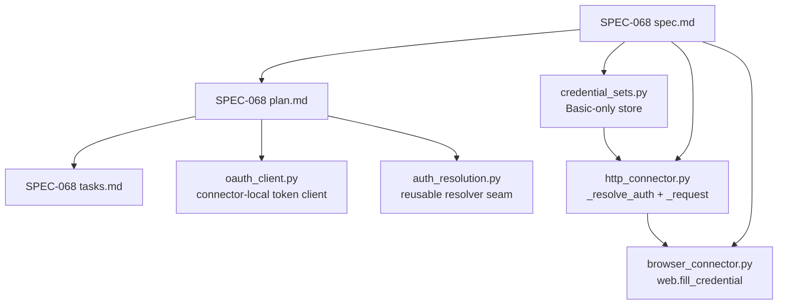
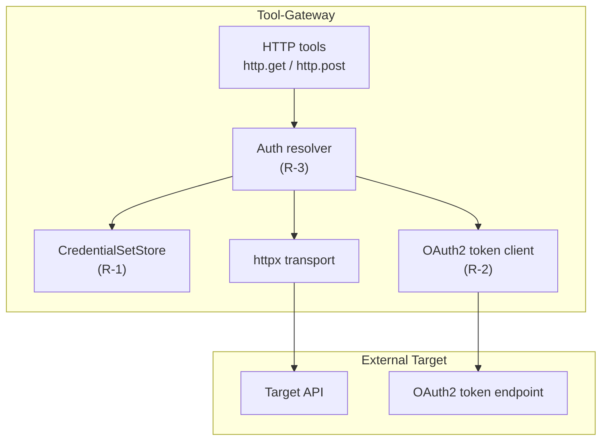
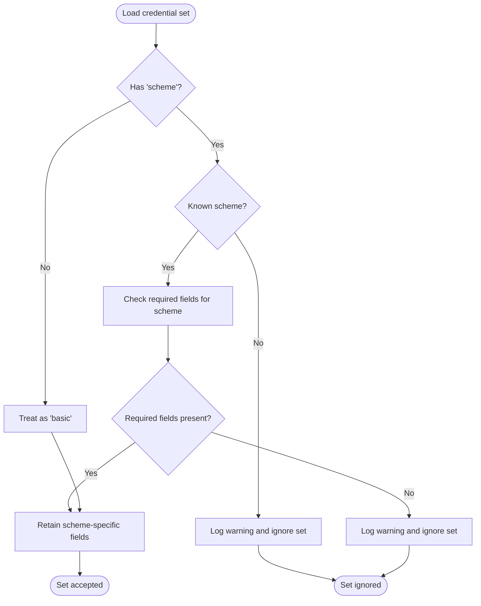
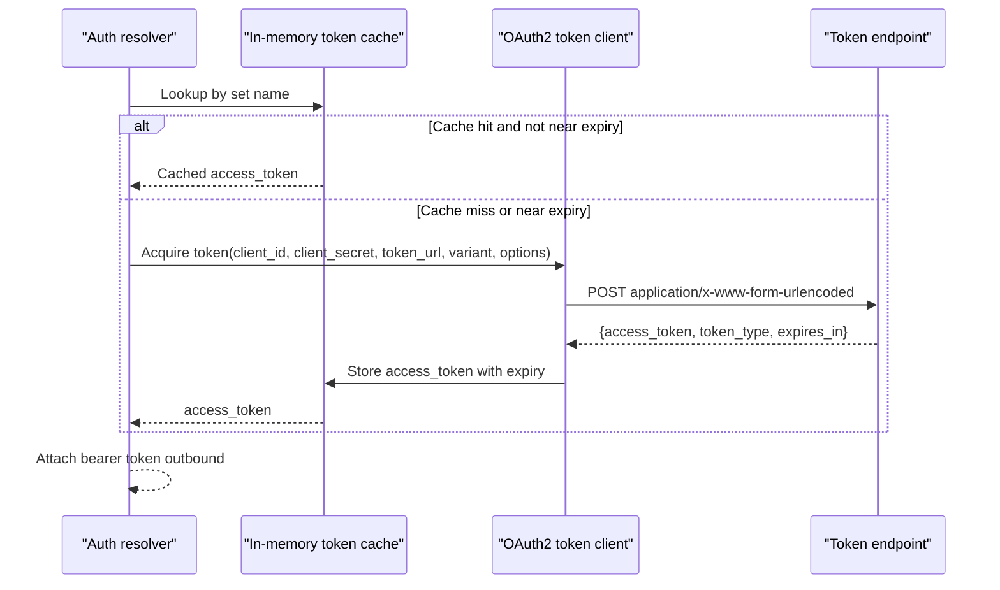
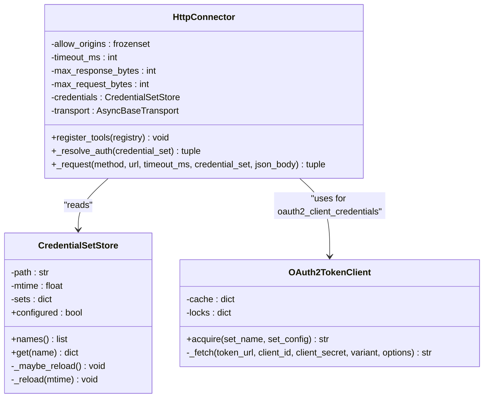
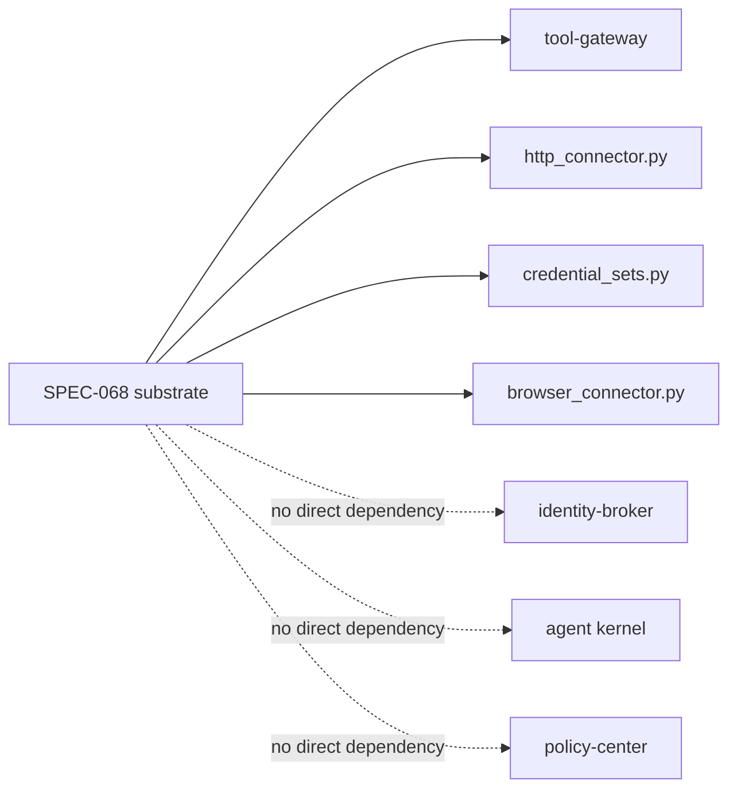

# SPEC-068: Outbound Execution-Credential Schemes Substrate

<cite>
**Referenced Files in This Document **
- [spec.md](file://docs/specs/SPEC-068-outbound-execution-credential-schemes/spec.md)
- [plan.md](file://docs/specs/SPEC-068-outbound-execution-credential-schemes/plan.md)
- [tasks.md](file://docs/specs/SPEC-068-outbound-execution-credential-schemes/tasks.md)
- [delivery-roadmap.md](file://docs/agentic-aiops-platform/delivery-roadmap.md)
- [README.md](file://docs/specs/README.md)
- [credential_sets.py](file://products/tool-gateway/src/tool_gateway/tools/credential_sets.py)
- [http_connector.py](file://products/tool-gateway/src/tool_gateway/tools/http_connector.py)
- [browser_connector.py](file://products/tool-gateway/src/tool_gateway/tools/browser_connector.py)
- [test_http_connector.py](file://products/tool-gateway/tests/test_http_connector.py)
</cite>

## Table of Contents
1. [Introduction](#introduction)
2. [Project Structure](#project-structure)
3. [Core Components](#core-components)
4. [Architecture Overview](#architecture-overview)
5. [Detailed Component Analysis](#detailed-component-analysis)
6. [Dependency Analysis](#dependency-analysis)
7. [Performance Considerations](#performance-considerations)
8. [Troubleshooting Guide](#troubleshooting-guide)
9. [Conclusion](#conclusion)

## Introduction
SPEC-068 defines the target-agnostic substrate that extends the tool-gateway's outbound credential model beyond HTTP Basic. It adds an optional per-set `scheme` (`basic`, `bearer`, or `oauth2_client_credentials`) and a connector-local OAuth2 `client_credentials` token client, exposed through one reusable async auth-resolution seam. The change is additive: existing `basic` sets remain byte-for-byte unchanged, and the extension is inert until a non-`basic` set is provisioned.

The substrate is the first concrete form of the platform's External Execution Identity on the outbound plane. It does not mint a platform delegation token, introduce a new signing authority, or add a dependency; the OAuth2 grant is implemented as a single form-encoded POST over the already-present `httpx`. Its first consumer is SPEC-058's `http_connector` (`http.get` / `http.post`), and its second consumer is the ServiceNow MCP-ingestion pilot (SPEC-067).

**Section sources**
- [spec.md:1-58](file://docs/specs/SPEC-068-outbound-execution-credential-schemes/spec.md#L1-L58)
- [delivery-roadmap.md:331-413](file://docs/agentic-aiops-platform/delivery-roadmap.md#L331-L413)

## Project Structure
SPEC-068 is scoped to one product and three existing modules plus two planned additions:

| Area | File | Role |
|---|---|---|
| Specification | `docs/specs/SPEC-068-outbound-execution-credential-schemes/spec.md` | Requirements, acceptance criteria, impact, open questions, changelog |
| Plan | `docs/specs/SPEC-068-outbound-execution-credential-schemes/plan.md` | Build order, design decisions per requirement, sequencing, test strategy, rollout |
| Tasks | `docs/specs/SPEC-068-outbound-execution-credential-schemes/tasks.md` | Requirement-tied implementation checklist |
| Credential store | `products/tool-gateway/src/tool_gateway/tools/credential_sets.py` | Current Basic-only named credential set loader |
| HTTP connector | `products/tool-gateway/src/tool_gateway/tools/http_connector.py` | Existing `_resolve_auth` returning only `httpx.BasicAuth`; single `_request` call site |
| Browser connector | `products/tool-gateway/src/tool_gateway/tools/browser_connector.py` | `web.fill_credential` consumer of `CredentialSetStore` |
| Tests | `products/tool-gateway/tests/test_http_connector.py` | Existing Basic-auth, redaction, rotation, and configuration tests |
| New modules (planned) | `tools/oauth_client.py`, optional `tools/auth_resolution.py` | Connector-local OAuth2 token client and reusable resolver seam |

**Diagram sources**
- [spec.md:243-267](file://docs/specs/SPEC-068-outbound-execution-credential-schemes/spec.md#L243-L267)
- [plan.md:12-35](file://docs/specs/SPEC-068-outbound-execution-credential-schemes/plan.md#L12-L35)
- [credential_sets.py:1-17](file://products/tool-gateway/src/tool_gateway/tools/credential_sets.py#L1-L17)
- [http_connector.py:361-387](file://products/tool-gateway/src/tool_gateway/tools/http_connector.py#L361-L387)
- [browser_connector.py:1258-1321](file://products/tool-gateway/src/tool_gateway/tools/browser_connector.py#L1258-L1321)

**Section sources**
- [spec.md:243-267](file://docs/specs/SPEC-068-outbound-execution-credential-schemes/spec.md#L243-L267)
- [plan.md:12-35](file://docs/specs/SPEC-068-outbound-execution-credential-schemes/plan.md#L12-L35)
- [tasks.md:12-94](file://docs/specs/SPEC-068-outbound-execution-credential-schemes/tasks.md#L12-L94)

## Core Components
SPEC-068 is organized around five requirements, each with explicit acceptance criteria and task-level implementation steps.

| Requirement | Purpose | Key Acceptance Criteria |
|---|---|---|
| R-1 | Per-set `scheme` field and generalized parsing | `basic` is default and byte-identical; unknown schemes are ignored with a warning; scheme-specific required fields are validated; browser flows referencing non-`basic` sets fail closed |
| R-2 | Connector-local OAuth2 `client_credentials` token client | In-memory cache keyed by set name; near-expiry refresh; `client_secret_basic` and `client_secret_post`; no secret in logs/results/evidence; structured gateway error on failure |
| R-3 | Reusable outbound auth-resolution seam | One async resolver for `basic`, `bearer`, and `oauth2_client_credentials`; returns both `httpx.Auth` and raw bearer token/header; credential/config failures map to structured gateway errors |
| R-4 | Secret-handling invariants | Existing redaction vocabularies cover new names; `_PROJECTED_HEADERS` excludes `authorization`/`set-cookie`; every failure mode fails closed |
| R-5 | Provisioning and config wiring reuse | Extended sets ride the existing `credential-sets.json` + `sync-browser-credentials.sh` model; no new mandatory environment variable; dev overlay remains green |

**Section sources**
- [spec.md:83-218](file://docs/specs/SPEC-068-outbound-execution-credential-schemes/spec.md#L83-L218)
- [plan.md:37-140](file://docs/specs/SPEC-068-outbound-execution-credential-schemes/plan.md#L37-L140)
- [tasks.md:12-94](file://docs/specs/SPEC-068-outbound-execution-credential-schemes/tasks.md#L12-L94)

## Architecture Overview
At a high level, SPEC-068 introduces a layered extension beneath the existing tool-gateway connectors:

**Diagram sources**
- [spec.md:48-58](file://docs/specs/SPEC-068-outbound-execution-credential-schemes/spec.md#L48-L58)
- [spec.md:143-172](file://docs/specs/SPEC-068-outbound-execution-credential-schemes/spec.md#L143-L172)
- [plan.md:60-109](file://docs/specs/SPEC-068-outbound-execution-credential-schemes/plan.md#L60-L109)

The current codebase implements the pre-SPEC-068 baseline: `CredentialSetStore` loads Basic-only sets from a JSON file, and `HttpConnector._resolve_auth` resolves a named set into `httpx.BasicAuth`. SPEC-068 generalizes this path without changing the `basic` branch.

**Section sources**
- [credential_sets.py:27-103](file://products/tool-gateway/src/tool_gateway/tools/credential_sets.py#L27-L103)
- [http_connector.py:361-387](file://products/tool-gateway/src/tool_gateway/tools/http_connector.py#L361-L387)

## Detailed Component Analysis

### R-1: Per-set `scheme` Field and Generalized Parsing
The current `CredentialSetStore` enforces a fixed `REQUIRED_FIELDS = ("username", "password")` and projects each set down to those two keys. Under SPEC-068, `_reload` is replaced with a per-scheme required-field map:

| Scheme | Required Fields | Optional Fields |
|---|---|---|
| `basic` | `username`, `password` | none |
| `bearer` | `token` | none |
| `oauth2_client_credentials` | `token_url`, `client_id`, `client_secret` | `scope`, `audience`, `resource`, `client_auth` |

A set whose declared scheme is unknown, or whose required fields are missing or empty, is ignored with a warning rather than crashing. A set with no `scheme` key defaults to `basic`, preserving backward compatibility.

**Diagram sources**
- [spec.md:89-114](file://docs/specs/SPEC-068-outbound-execution-credential-schemes/spec.md#L89-L114)
- [plan.md:39-58](file://docs/specs/SPEC-068-outbound-execution-credential-schemes/plan.md#L39-L58)
- [tasks.md:12-28](file://docs/specs/SPEC-068-outbound-execution-credential-schemes/tasks.md#L12-L28)

Browser login behavior is also constrained: `web.fill_credential` consumes `username`/`password` from a `basic` set; if a non-`basic` set is referenced, the flow fails closed with a structured error instead of attempting to fill absent fields.

**Section sources**
- [credential_sets.py:27-103](file://products/tool-gateway/src/tool_gateway/tools/credential_sets.py#L27-L103)
- [spec.md:89-114](file://docs/specs/SPEC-068-outbound-execution-credential-schemes/spec.md#L89-L114)
- [plan.md:39-58](file://docs/specs/SPEC-068-outbound-execution-credential-schemes/plan.md#L39-L58)
- [tasks.md:12-28](file://docs/specs/SPEC-068-outbound-execution-credential-schemes/tasks.md#L12-L28)

### R-2: Connector-Local OAuth2 `client_credentials` Token Client
The new token client performs the OAuth2 `client_credentials` grant as a single `application/x-www-form-urlencoded` POST to the set's `token_url`. It reads `access_token`, `token_type`, and `expires_in`, caches the result in memory keyed by credential-set name, and refreshes when within a safety margin of expiry.

Key behaviors:

| Behavior | Detail |
|---|---|
| Acquisition locus | Option A — connector-local; no identity-broker or Kubernetes workload identity |
| Cache scope | Process-local in-memory dictionary keyed by set name |
| Concurrency | Concurrent callers for one set share a single in-flight fetch via a per-set lock or in-flight-future map |
| Client authentication variants | `client_secret_basic` (Authorization header) and `client_secret_post` (form body), explicit per set |
| Optional parameters | `scope`, `audience`, `resource` sent when configured |
| Failure handling | Unreachable, timeout, non-2xx, or response without `access_token` → structured gateway error |
| Secret exposure | `client_secret` and `access_token` never logged, persisted, serialized into results, or emitted as evidence |

**Diagram sources**
- [spec.md:116-141](file://docs/specs/SPEC-068-outbound-execution-credential-schemes/spec.md#L116-L141)
- [plan.md:60-87](file://docs/specs/SPEC-068-outbound-execution-credential-schemes/plan.md#L60-L87)
- [tasks.md:30-47](file://docs/specs/SPEC-068-outbound-execution-credential-schemes/tasks.md#L30-L47)

**Section sources**
- [spec.md:116-141](file://docs/specs/SPEC-068-outbound-execution-credential-schemes/spec.md#L116-L141)
- [plan.md:60-87](file://docs/specs/SPEC-068-outbound-execution-credential-schemes/plan.md#L60-L87)
- [tasks.md:30-47](file://docs/specs/SPEC-068-outbound-execution-credential-schemes/tasks.md#L30-L47)

### R-3: Reusable Outbound Auth-Resolution Seam
The current `HttpConnector._resolve_auth` is synchronous and returns only `httpx.BasicAuth | None`. SPEC-068 generalizes it into one reusable async resolver covering all three schemes. The resolver exposes:

1. An `httpx.Auth` object for httpx-based connectors.
2. The resolved bearer token or header for non-httpx transports such as the MCP SDK's streamable-HTTP client.

The single `_request` call site gains one `await`. Error mapping is deliberate: a missing credential or failed acquisition is a gateway error (`CREDENTIAL_SET_NOT_FOUND` or `CREDENTIAL_ACQUISITION_FAILED`), not an upstream fact.

**Diagram sources**
- [http_connector.py:322-491](file://products/tool-gateway/src/tool_gateway/tools/http_connector.py#L322-L491)
- [credential_sets.py:30-103](file://products/tool-gateway/src/tool_gateway/tools/credential_sets.py#L30-L103)
- [spec.md:143-172](file://docs/specs/SPEC-068-outbound-execution-credential-schemes/spec.md#L143-L172)
- [plan.md:89-109](file://docs/specs/SPEC-068-outbound-execution-credential-schemes/plan.md#L89-L109)

**Section sources**
- [http_connector.py:361-491](file://products/tool-gateway/src/tool_gateway/tools/http_connector.py#L361-L491)
- [spec.md:143-172](file://docs/specs/SPEC-068-outbound-execution-credential-schemes/spec.md#L143-L172)
- [plan.md:89-109](file://docs/specs/SPEC-068-outbound-execution-credential-schemes/plan.md#L89-L109)
- [tasks.md:49-65](file://docs/specs/SPEC-068-outbound-execution-credential-schemes/tasks.md#L49-L65)

### R-4: Secret-Handling Invariants
Every secret-bearing value introduced by SPEC-068 — `client_secret`, `access_token`, and a static bearer `token` — must be covered by the platform's existing redaction. The spec relies on:

- `url_redaction.SECRET_QUERY_PARAMS`, substring-matching parameter names such as `secret`, `token`, `credential`, `access_key`, `private_key`, `session_id`, and `signature`.
- `redaction._VALUE_PATTERNS`, which already covers password/secret/token shapes plus `client_secret` and `authorization`.
- `_PROJECTED_HEADERS`, which continues to exclude `authorization` and `set-cookie`.

Tests assert that a token value never survives into a URL projection, tool result, evidence field, audit record, or log line. Missing, malformed, expired, or unresolvable credential state fails closed on every scheme.

**Section sources**
- [spec.md:174-196](file://docs/specs/SPEC-068-outbound-execution-credential-schemes/spec.md#L174-L196)
- [plan.md:111-126](file://docs/specs/SPEC-068-outbound-execution-credential-schemes/plan.md#L111-L126)
- [tasks.md:67-81](file://docs/specs/SPEC-068-outbound-execution-credential-schemes/tasks.md#L67-L81)
- [http_connector.py:61-75](file://products/tool-gateway/src/tool_gateway/tools/http_connector.py#L61-L75)

### R-5: Provisioning and Config Wiring
SPEC-068 does not introduce a new secret mechanism. An operator supplies an extended set through the existing `credential-sets.json` file mounted from the `tool-gateway-browser-credentials` secret and delivered by `sync-browser-credentials.sh`. The HTTP connector keeps reading `GATEWAY_HTTP_CREDENTIAL_SETS`, falling back to `GATEWAY_BROWSER_CREDENTIAL_SETS` exactly as today. No new mandatory environment variable is introduced for the substrate itself.

The dev default remains the `acme-admin` Basic set, so existing `make deploy` behavior is byte-identical. A dedicated sync/secret for a real non-sample target is documented as optional and owned by the consuming pilot, not this substrate.

**Section sources**
- [spec.md:198-218](file://docs/specs/SPEC-068-outbound-execution-credential-schemes/spec.md#L198-L218)
- [plan.md:128-140](file://docs/specs/SPEC-068-outbound-execution-credential-schemes/plan.md#L128-L140)
- [tasks.md:83-94](file://docs/specs/SPEC-068-outbound-execution-credential-schemes/tasks.md#L83-L94)

## Dependency Analysis
SPEC-068 is intentionally narrow:

| Dependency | Status | Reason |
|---|---|---|
| `httpx` | Already present | Used for HTTP requests and the form-encoded OAuth2 grant |
| Third-party OAuth library | Not added | The `client_credentials` grant is one POST; adding `authlib`/`oauthlib` would increase supply-chain surface unnecessarily |
| Identity broker | Not involved | The outbound target credential is the External Execution Identity, not the platform's `sub`/`act` delegation |
| Policy bundle | Not changed | No new tools are introduced by the substrate alone |
| Audit events | Not extended at tool level | Auth resolution sits beneath the tool tier |
| Kernel | Not changed | The substrate lives in tool-gateway connectors |

**Diagram sources**
- [spec.md:220-267](file://docs/specs/SPEC-068-outbound-execution-credential-schemes/spec.md#L220-L267)
- [plan.md:142-153](file://docs/specs/SPEC-068-outbound-execution-credential-schemes/plan.md#L142-L153)

**Section sources**
- [spec.md:220-267](file://docs/specs/SPEC-068-outbound-execution-credential-schemes/spec.md#L220-L267)
- [plan.md:142-153](file://docs/specs/SPEC-068-outbound-execution-credential-schemes/plan.md#L142-L153)

## Performance Considerations
The substrate is designed to avoid unnecessary overhead:

- **Additive and inert:** Existing `basic` sets follow the same path; new code paths execute only when a non-`basic` set exists.
- **No new dependency:** The OAuth2 grant uses `httpx`, already present in the tool-gateway.
- **In-memory token cache:** Tokens are cached per set name; there is no disk I/O for secrets.
- **Near-expiry refresh:** Refresh triggers before expiry so calls do not ride expired tokens.
- **Single-flight concurrency:** Concurrent callers for one set share one in-flight fetch, avoiding thundering herds against the token endpoint.
- **Minimal logging:** Secrets are never logged; failures log only exception classes.

These characteristics make the substrate suitable for repeated use by multiple consumers (HTTP tools, then MCP ingestion adapters) without introducing a centralized bottleneck.

[No sources needed since this section provides general guidance]

## Troubleshooting Guide

### Symptom: A non-`basic` credential set is ignored
**Likely cause:** The set declares an unknown `scheme`, or is missing required fields for the declared scheme.  
**Expected behavior:** The set is ignored with a warning; the store keeps the last good load.  
**Action:** Verify the `scheme` value is one of `basic`, `bearer`, or `oauth2_client_credentials`, and that all required fields are present and non-empty.

**Section sources**
- [spec.md:96-111](file://docs/specs/SPEC-068-outbound-execution-credential-schemes/spec.md#L96-L111)
- [plan.md:46-52](file://docs/specs/SPEC-068-outbound-execution-credential-schemes/plan.md#L46-L52)

### Symptom: `web.fill_credential` fails when referencing a non-`basic` set
**Likely cause:** Non-`basic` sets do not provide `username`/`password`.  
**Expected behavior:** The browser flow fails closed with a structured error rather than filling blanks.  
**Action:** Use a `basic` set for browser login flows; reserve `bearer` and `oauth2_client_credentials` for outbound API authentication.

**Section sources**
- [spec.md:112-114](file://docs/specs/SPEC-068-outbound-execution-credential-schemes/spec.md#L112-L114)
- [plan.md:53-58](file://docs/specs/SPEC-068-outbound-execution-credential-schemes/plan.md#L53-L58)

### Symptom: Token acquisition fails with a gateway error
**Likely cause:** The token endpoint is unreachable, times out, returns non-2xx, or omits `access_token`.  
**Expected behavior:** A structured gateway error is returned; no fabricated token is used and no unauthenticated fallback occurs.  
**Action:** Validate `token_url`, client credentials, and the selected `client_auth` variant; inspect the token endpoint independently using the same client-auth method.

**Section sources**
- [spec.md:136-141](file://docs/specs/SPEC-068-outbound-execution-credential-schemes/spec.md#L136-L141)
- [plan.md:74-77](file://docs/specs/SPEC-068-outbound-execution-credential-schemes/plan.md#L74-L77)
- [tasks.md:40-44](file://docs/specs/SPEC-068-outbound-execution-credential-schemes/tasks.md#L40-L44)

### Symptom: A credential value appears in logs, results, or evidence
**Likely cause:** A new secret-bearing name was introduced but not covered by the existing redaction vocabulary, or a response header was projected.  
**Expected behavior:** `client_secret`, `access_token`, bearer `token`, and authorization headers are masked or excluded.  
**Action:** Confirm coverage under `SECRET_QUERY_PARAMS` and `_VALUE_PATTERNS`; verify `_PROJECTED_HEADERS` still excludes `authorization` and `set-cookie`.

**Section sources**
- [spec.md:174-196](file://docs/specs/SPEC-068-outbound-execution-credential-schemes/spec.md#L174-L196)
- [plan.md:111-126](file://docs/specs/SPEC-068-outbound-execution-credential-schemes/plan.md#L111-L126)
- [http_connector.py:61-75](file://products/tool-gateway/src/tool_gateway/tools/http_connector.py#L61-L75)

### Symptom: Existing Basic authentication breaks after deployment
**Likely cause:** A regression in the generalized parser or resolver.  
**Expected behavior:** A `basic` set, or a set with no `scheme` key, parses and resolves exactly as pre-SPEC-068.  
**Action:** Run the Basic-set regression against the `acme-admin` sample set through `web.fill_credential`, `http.get`, and `http.post`.

**Section sources**
- [spec.md:96-100](file://docs/specs/SPEC-068-outbound-execution-credential-schemes/spec.md#L96-L100)
- [plan.md:53-55](file://docs/specs/SPEC-068-outbound-execution-credential-schemes/plan.md#L53-L55)
- [test_http_connector.py:600-701](file://products/tool-gateway/tests/test_http_connector.py#L600-L701)

## Conclusion
SPEC-068 delivers a small, self-contained substrate that makes the tool-gateway capable of authenticating outbound calls with more than HTTP Basic. It does so without centralizing authority, adding dependencies, or changing the policy, audit, or execution-safety contracts. The substrate is additive, fail-closed, and secret-safe, and it prepares the platform for every MCP-ingestion pilot that needs an external target's outbound execution identity.

Its next step is implementation and delivery under separate authorization boundaries: approval, build, commit/push, deployment, version bump, and living-state documentation updates. Once delivered, SPEC-067 can select among the already-shipped schemes rather than waiting to define one.

[No sources needed since this section summarizes without analyzing specific files]