# Shared Contracts

<cite>
**Referenced Files in This Document**
- [README.md](file://shared/shared-contracts/README.md)
- [agent-chat-request.schema.json](file://shared/shared-contracts/schemas/agent-chat-request.schema.json)
- [chat-request.schema.json](file://shared/shared-contracts/schemas/chat-request.schema.json)
- [chat-response.schema.json](file://shared/shared-contracts/schemas/chat-response.schema.json)
- [stream-event.schema.json](file://shared/shared-contracts/schemas/stream-event.schema.json)
- [session.schema.json](file://shared/shared-contracts/schemas/session.schema.json)
- [incident.schema.json](file://shared/shared-contracts/schemas/incident.schema.json)
- [skill.schema.json](file://shared/shared-contracts/schemas/skill.schema.json)
- [policy-decision.schema.json](file://shared/shared-contracts/schemas/policy-decision.schema.json)
- [audit-event.schema.json](file://shared/shared-contracts/schemas/audit-event.schema.json)
- [tool-invocation.schema.json](file://shared/shared-contracts/schemas/tool-invocation.schema.json)
- [tool-result.schema.json](file://shared/shared-contracts/schemas/tool-result.schema.json)
- [identity-context.schema.json](file://shared/shared-contracts/schemas/identity-context.schema.json)
- [policy-default.yaml](file://shared/shared-contracts/policies/policy-default.yaml)
- [validate_policy.py](file://shared/shared-contracts/scripts/validate_policy.py)
- [skill-format.md](file://shared/shared-contracts/skill-format.md)
- [observability-conventions.md](file://shared/shared-contracts/observability-conventions.md)
- [execution-request.schema.json](file://shared/shared-contracts/schemas/execution-request.schema.json)
- [model-catalog.schema.json](file://shared/shared-contracts/schemas/model-catalog.schema.json)
- [operation-document.schema.json](file://shared/shared-contracts/schemas/operation-document.schema.json)
- [session-evidence.schema.json](file://shared/shared-contracts/schemas/session-evidence.schema.json)
- [triage-report.schema.json](file://shared/shared-contracts/schemas/triage-report.schema.json)
- [audit-summary.schema.json](file://shared/shared-contracts/schemas/audit-summary.schema.json)
</cite>

## Update Summary
**Changes Made**
- Restructured to document all 33 versioned JSON Schemas organized by domain
- Added new schema categories for execution-runtime, model catalog, operations documents, session evidence, and triage reports
- Updated architecture diagrams to reflect the expanded contract surface
- Enhanced domain-specific sections with detailed schema references
- Expanded policy bundle documentation with current implementation details

## Table of Contents
1. Introduction
2. Project Structure
3. Core Components
4. Architecture Overview
5. Detailed Component Analysis
6. Dependency Analysis
7. Performance Considerations
8. Troubleshooting Guide
9. Conclusion
10. Appendices

## Introduction
This document defines the shared contracts that establish communication boundaries between platform services. It covers 33 versioned JSON Schema definitions organized by domain including portal/gateway chat, agent-service, identity, policy, tool execution, execution-runtime, audit, incidents, skills, model catalog, operations documents, and session evidence; the policy bundle format used for authorization rules, risk tiers, and approval workflows; the skill format specification for Markdown-based operational guidance authoring; and observability conventions for metrics, tracing, and logging. It also explains schema validation processes, versioning strategies, migration guidelines, and provides examples of how services consume and produce these standardized formats.

## Project Structure
The shared contracts live under shared/shared-contracts and are organized into:
- schemas: 33 JSON Schema files defining request/response/event/domain contracts organized by domain
- policies: YAML bundles encoding authorization rules and approval workflows
- scripts: CLI tools to validate policy bundles against their schema
- skill-format.md: Authoring contract for skills consumed by skills-hub
- observability-conventions.md: Cross-service standards for metrics, tracing, and logging

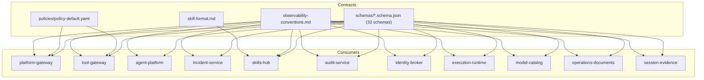

**Diagram sources**
- [README.md:21-50](file://shared/shared-contracts/README.md#L21-L50)

**Section sources**
- [README.md:1-50](file://shared/shared-contracts/README.md#L1-L50)

## Core Components
The shared contracts encompass 33 versioned JSON Schemas organized across multiple domains:

### Portal/Gateway Chat (v1)
- `chat-request`, `chat-response`, `chat-confirm`: Legacy portal boundary contracts
- `session`, `stream-event`, `health-response`, `identity-context`: Supporting contracts

### Agent-Service (v2, Platform-Owned)
- `agent-chat-request`, `agent-chat-response`, `agent-stream-event`: Modern agent interface
- `agent-session`, `agent-session-list`, `agent-runtime-metadata`, `agent-health`: Session and runtime contracts

### Identity
- `identity-token`: JWT claim set issued by identity-broker

### Policy (v1)
- `policy-rule`, `policy-decision`, `policy-matrix`: Authorization rule framework

### Tool Execution (v1)
- `tool-invocation`, `tool-result`: Tool gateway communication envelope

### Execution-Runtime (SPEC-038/063)
- `execution-request`, `execution-receipt`, `execution-observation`, `execution-recovery`, `execution-handoff-response`: Durable execution workflow

### Audit
- `audit-event`, `audit-summary`: Auditing and reporting contracts

### Incidents (SPEC-015)
- `incident`, `triage-report`: Incident management and triage workflow

### Skills (SPEC-014)
- `skill`: Knowledge and executable flow artifacts

### Model Catalog (SPEC-026/027)
- `model-catalog`: Multi-model runtime discovery

### Operations Documents (SPEC-039)
- `operation-document`: Immutable typed operational records

### Session Evidence
- `session-evidence`: Persistent tool evidence for replay and auditing

Key responsibilities:
- Enforce consistent wire formats across services
- Provide a single source of truth for authorization rules
- Standardize audit and observability signals
- Define safe, validated skill artifacts for knowledge and executable flows
- Support durable execution workflows with cryptographic signing
- Enable comprehensive incident triage and collaboration

**Section sources**
- [README.md:21-122](file://shared/shared-contracts/README.md#L21-L122)
- [observability-conventions.md:1-85](file://shared/shared-contracts/observability-conventions.md#L1-L85)

## Architecture Overview
The shared contracts define clear boundaries across 33 versioned schemas:
- Identity travels in headers on v2 agent endpoints; tokens are issued by identity-broker and verified at gateways
- Platform-gateway and tool-gateway enforce policy using the canonical bundle
- Agent-platform invokes tools through tool-gateway using the tool invocation/result envelope
- Execution-runtime manages durable, signed execution workflows with approval gates
- Incident-service persists incidents and triage reports conforming to their respective schemas
- Skills-hub ingests skills from Markdown documents validated against the skill schema
- Operations documents repository serves immutable typed operational records
- Session evidence store persists tool call/result frames for replay and auditing
- All services emit audit events and telemetry following shared conventions

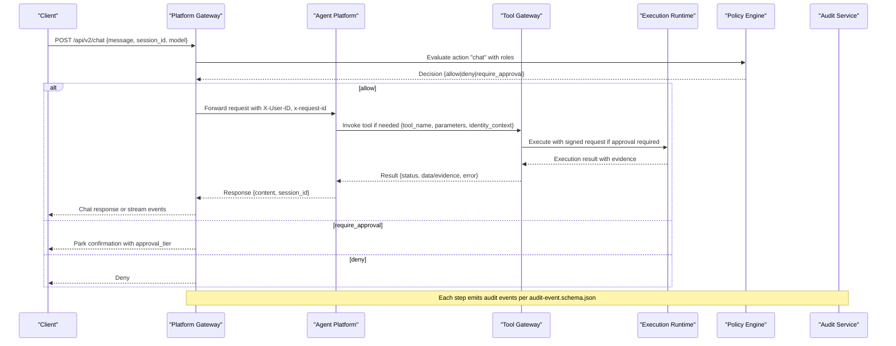

**Diagram sources**
- [agent-chat-request.schema.json:1-35](file://shared/shared-contracts/schemas/agent-chat-request.schema.json#L1-L35)
- [policy-decision.schema.json:1-60](file://shared/shared-contracts/schemas/policy-decision.schema.json#L1-L60)
- [tool-invocation.schema.json:1-35](file://shared/shared-contracts/schemas/tool-invocation.schema.json#L1-L35)
- [tool-result.schema.json:1-69](file://shared/shared-contracts/schemas/tool-result.schema.json#L1-L69)
- [audit-event.schema.json:1-94](file://shared/shared-contracts/schemas/audit-event.schema.json#L1-L94)
- [execution-request.schema.json:1-94](file://shared/shared-contracts/schemas/execution-request.schema.json#L1-L94)

## Detailed Component Analysis

### API Contracts: Chat v1 and v2, Streaming Events
- Chat v1 request/response and stream events define the legacy portal/gateway boundary
- Chat v2 (agent-* schemas) moves identity to headers, renames content/delta fields, and standardizes stream event type field
- Both versions include correlation identifiers and session scoping
- Agent v2 supports input modality (text/voice), structured output schemas, and model selection

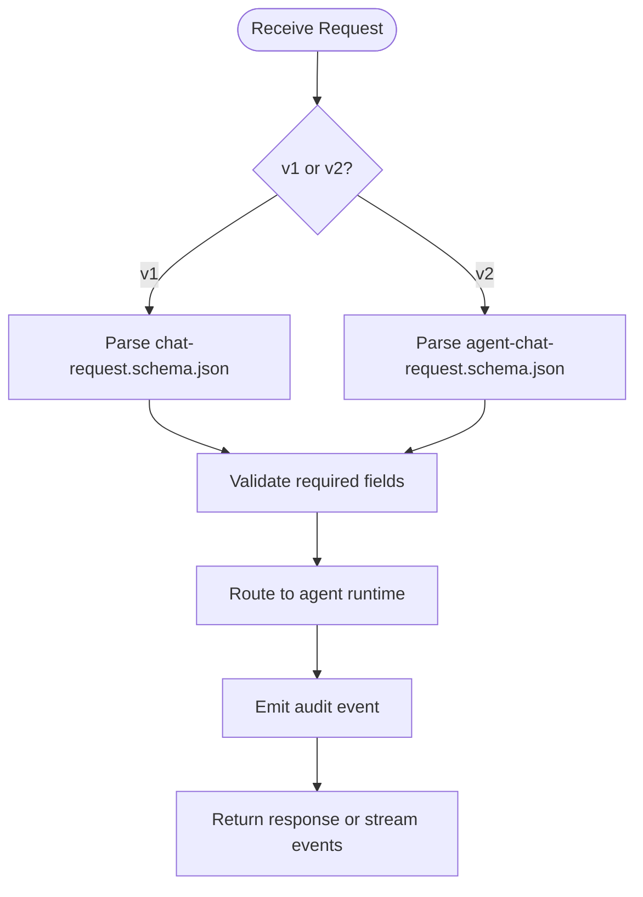

**Diagram sources**
- [chat-request.schema.json:1-38](file://shared/shared-contracts/schemas/chat-request.schema.json#L1-L38)
- [chat-response.schema.json:1-26](file://shared/shared-contracts/schemas/chat-response.schema.json#L1-L26)
- [stream-event.schema.json:1-27](file://shared/shared-contracts/schemas/stream-event.schema.json#L1-L27)
- [agent-chat-request.schema.json:1-35](file://shared/shared-contracts/schemas/agent-chat-request.schema.json#L1-L35)

**Section sources**
- [chat-request.schema.json:1-38](file://shared/shared-contracts/schemas/chat-request.schema.json#L1-L38)
- [chat-response.schema.json:1-26](file://shared/shared-contracts/schemas/chat-response.schema.json#L1-L26)
- [stream-event.schema.json:1-27](file://shared/shared-contracts/schemas/stream-event.schema.json#L1-L27)
- [agent-chat-request.schema.json:1-35](file://shared/shared-contracts/schemas/agent-chat-request.schema.json#L1-L35)
- [README.md:52-67](file://shared/shared-contracts/README.md#L52-L67)

### Domain Models: Session, Incident, Skill
- Session: minimal lifecycle state with timestamps and ownership
- Incident: canonical envelope for alertmanager/manual intake with lifecycle states and triage metadata
- Skill: Markdown-backed knowledge or executable flow with frontmatter constraints, optional steps, and risk class

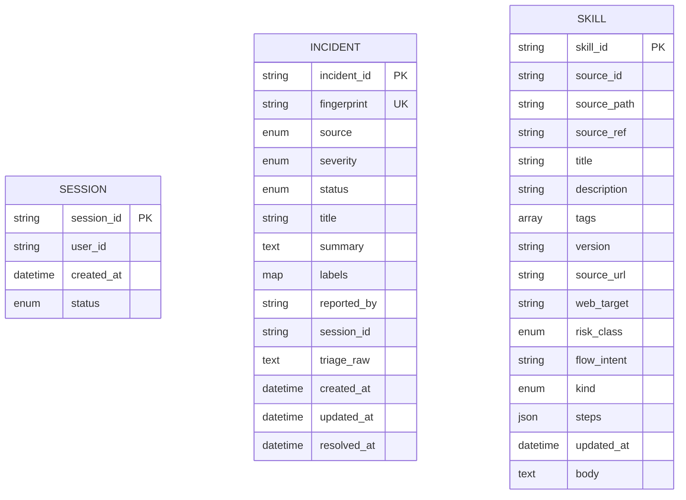

**Diagram sources**
- [session.schema.json:1-26](file://shared/shared-contracts/schemas/session.schema.json#L1-L26)
- [incident.schema.json:1-95](file://shared/shared-contracts/schemas/incident.schema.json#L1-L95)
- [skill.schema.json:1-125](file://shared/shared-contracts/schemas/skill.schema.json#L1-L125)

**Section sources**
- [session.schema.json:1-26](file://shared/shared-contracts/schemas/session.schema.json#L1-L26)
- [incident.schema.json:1-95](file://shared/shared-contracts/schemas/incident.schema.json#L1-L95)
- [skill.schema.json:1-125](file://shared/shared-contracts/schemas/skill.schema.json#L1-L125)

### Policy Bundle and Decision Model
- The policy bundle is a YAML file with a versioned list of rules, each with match criteria and decisions (allow, deny, require_approval)
- Approval tiers: tier_1 (self-approval allowed by default), tier_2 (requires designated approver distinct from requester)
- Precedence: deny > require_approval > allow; higher priority wins within an outcome
- Decision object mirrors winning rule's approval block when applicable
- Current implementation includes role-based access control for chat, sessions, tools, secrets delivery, audit access, and incident management

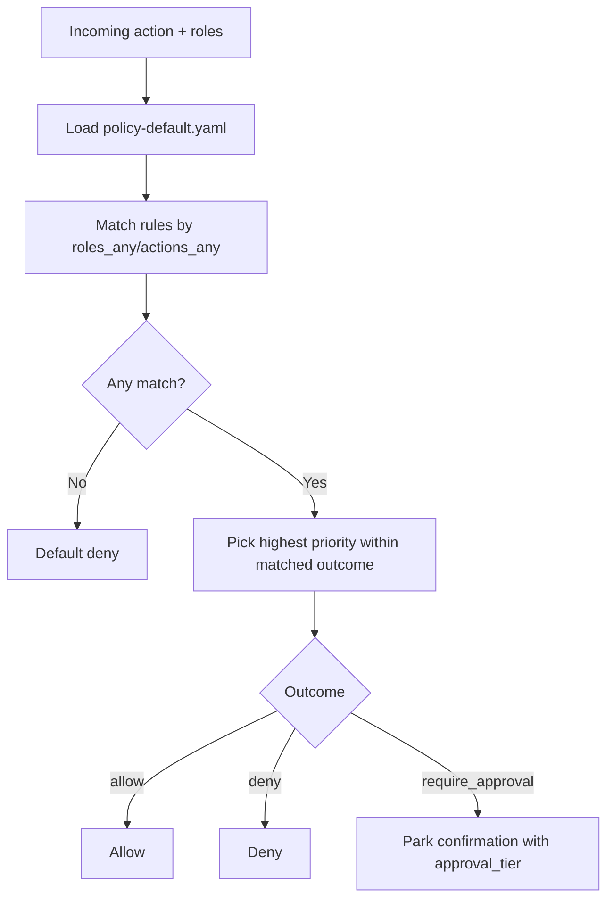

**Diagram sources**
- [policy-default.yaml:1-200](file://shared/shared-contracts/policies/policy-default.yaml#L1-L200)
- [policy-decision.schema.json:1-60](file://shared/shared-contracts/schemas/policy-decision.schema.json#L1-L60)

**Section sources**
- [policy-default.yaml:1-200](file://shared/shared-contracts/policies/policy-default.yaml#L1-L200)
- [policy-decision.schema.json:1-60](file://shared/shared-contracts/schemas/policy-decision.schema.json#L1-L60)
- [README.md:79-96](file://shared/shared-contracts/README.md#L79-L96)

### Tool Execution Contract
- Invocation envelope carries tool name, parameters, identity context, and request correlation
- Result envelope includes status, data or error, and evidence with provenance fields
- Status values: success, error, denied; denied indicates policy rejection

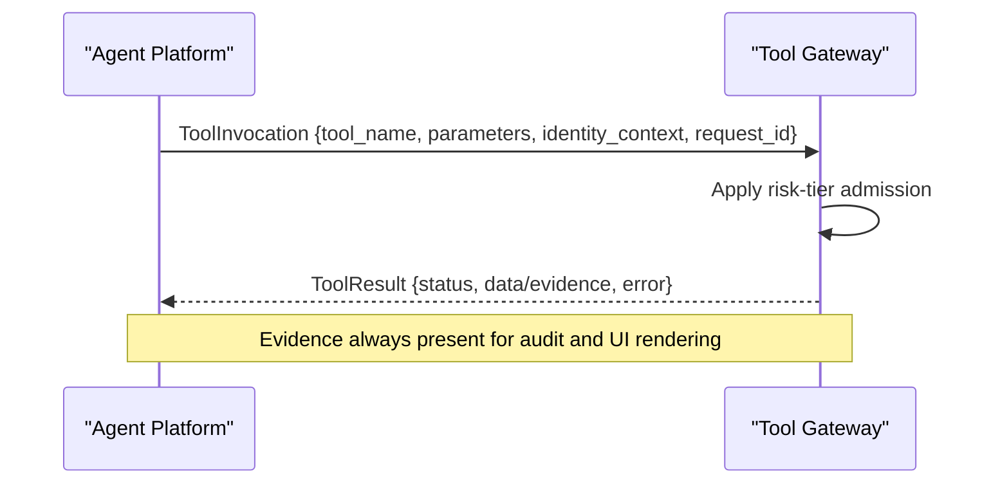

**Diagram sources**
- [tool-invocation.schema.json:1-35](file://shared/shared-contracts/schemas/tool-invocation.schema.json#L1-L35)
- [tool-result.schema.json:1-69](file://shared/shared-contracts/schemas/tool-result.schema.json#L1-L69)

**Section sources**
- [tool-invocation.schema.json:1-35](file://shared/shared-contracts/schemas/tool-invocation.schema.json#L1-L35)
- [tool-result.schema.json:1-69](file://shared/shared-contracts/schemas/tool-result.schema.json#L1-L69)
- [README.md:98-113](file://shared/shared-contracts/README.md#L98-L113)

### Execution Runtime Contract
- Signed execution requests constructed when parked confirmations resume with approval
- Cryptographic HMAC-SHA256 signatures ensure integrity of approved tool calls
- Supports both action-level and flow-level approval provenance
- Includes protocol versioning, expiration, and admission epoch tracking

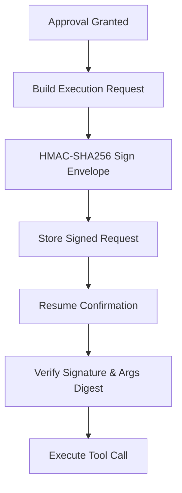

**Diagram sources**
- [execution-request.schema.json:1-94](file://shared/shared-contracts/schemas/execution-request.schema.json#L1-L94)

**Section sources**
- [execution-request.schema.json:1-94](file://shared/shared-contracts/schemas/execution-request.schema.json#L1-L94)

### Audit Event Contract
- Canonical envelope emitted by all services for audited actions
- Closed vocabulary of event types and outcomes
- Details carry per-event-type payloads including tool invocations, policy decisions, sessions, confirmations, incidents, skills, executions, documents, and graduation
- Audit summary provides deterministic aggregates over envelope columns only

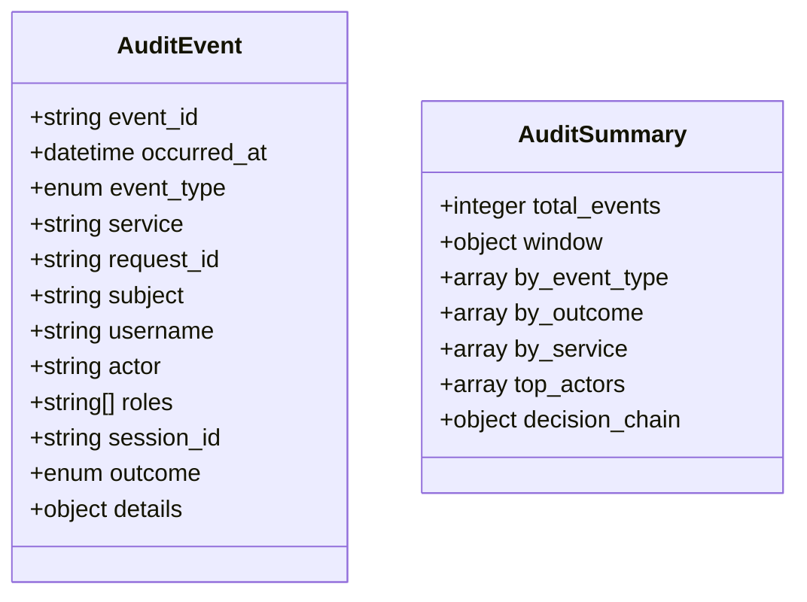

**Diagram sources**
- [audit-event.schema.json:1-94](file://shared/shared-contracts/schemas/audit-event.schema.json#L1-L94)
- [audit-summary.schema.json:1-109](file://shared/shared-contracts/schemas/audit-summary.schema.json#L1-L109)

**Section sources**
- [audit-event.schema.json:1-94](file://shared/shared-contracts/schemas/audit-event.schema.json#L1-L94)
- [audit-summary.schema.json:1-109](file://shared/shared-contracts/schemas/audit-summary.schema.json#L1-L109)

### Skill Format Specification
- Skills are Markdown files with YAML frontmatter validated against the skill schema
- Knowledge skills: prose-only; executable_flow skills: include ordered steps with tool names and arguments
- Constraints: size caps, tag limits, credential references only (no literals), web_target requirements for browser steps
- Graduation produces executable-flow drafts with deterministic re-validation

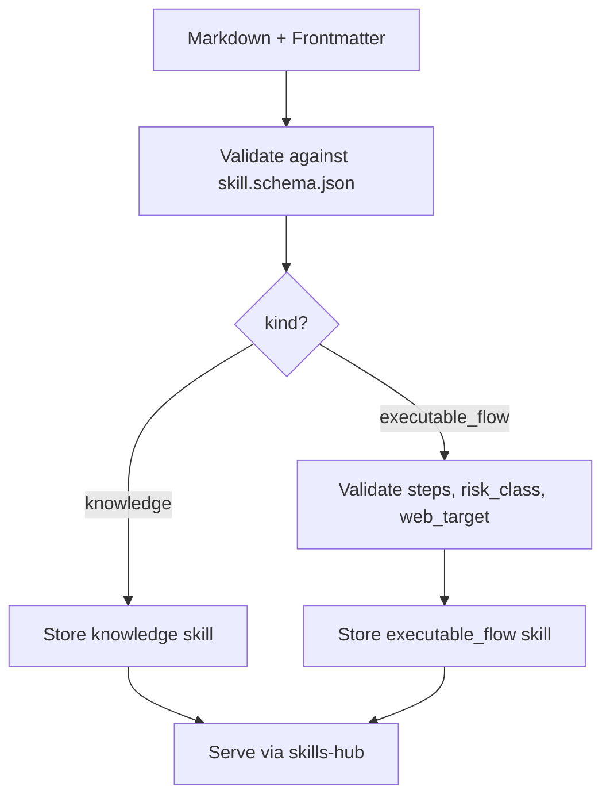

**Diagram sources**
- [skill.schema.json:1-125](file://shared/shared-contracts/schemas/skill.schema.json#L1-L125)
- [skill-format.md:1-203](file://shared/shared-contracts/skill-format.md#L1-L203)

**Section sources**
- [skill.schema.json:1-125](file://shared/shared-contracts/schemas/skill.schema.json#L1-L125)
- [skill-format.md:1-203](file://shared/shared-contracts/skill-format.md#L1-L203)

### Model Catalog Contract
- Envelope returned by GET /api/v2/models (agent) and GET /api/v1/models (gateway pass-through)
- Credential-gated catalog of selectable models, one entry per model of each configured provider's series
- Discovery-safe by construction — no credentials, no base URLs
- Supports providers: dashscope, deepseek, openai, luban

**Section sources**
- [model-catalog.schema.json:1-43](file://shared/shared-contracts/schemas/model-catalog.schema.json#L1-L43)

### Operations Documents Contract
- Immutable typed operations document persisted by the agent service document repository
- Documents are snapshots: digest values are copied verbatim from durable stores at assembly time
- Supports shift_summary and incident_report document types
- Provenance anchors record ids without exposing live references
- One-way draft->published lifecycle with owner-scoped permissions

**Section sources**
- [operation-document.schema.json:1-115](file://shared/shared-contracts/schemas/operation-document.schema.json#L1-L115)

### Session Evidence Contract
- Persisted tool-evidence group for one assistant turn
- Frames follow the tool_call/tool_result shapes of agent-stream-event.schema.json
- Evidence store may add truncation markers where size caps replaced payloads
- Never silently drops frames - preserves metadata even when data is truncated

**Section sources**
- [session-evidence.schema.json:1-58](file://shared/shared-contracts/schemas/session-evidence.schema.json#L1-L58)

### Triage Report Contract
- Canonical triage report for incident management workflow
- Every hypothesis and next step must be grounded in tool evidence or cited skills
- Next steps are advisory only (does not execute anything)
- Includes evidence references, ranked hypotheses, and prioritized next steps

**Section sources**
- [triage-report.schema.json:1-120](file://shared/shared-contracts/schemas/triage-report.schema.json#L1-L120)

### Observability Conventions
- Two surfaces: always-on Prometheus /metrics and opt-in OpenTelemetry push
- Metric naming: <service>_<noun>_<unit>, counters with _total suffix
- Cardinality rules: no high-cardinality labels (e.g., raw URLs, user ids, session ids)
- OTel switch semantics: OTEL_ENABLED gates all OTel signal initialization
- Structured logging: INFO-level JSON records; OTLP log bridge joins logs to traces
- Correlation: x-request-id bridges logs and traces via W3C traceparent

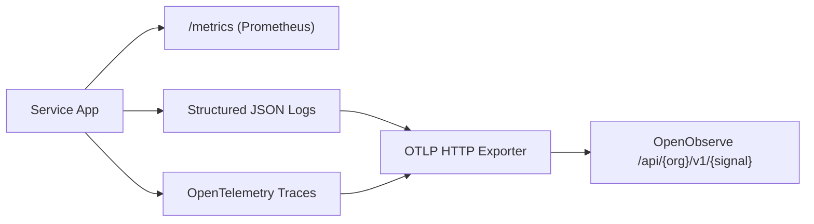

**Diagram sources**
- [observability-conventions.md:1-85](file://shared/shared-contracts/observability-conventions.md#L1-L85)

**Section sources**
- [observability-conventions.md:1-85](file://shared/shared-contracts/observability-conventions.md#L1-L85)

## Dependency Analysis
- Services depend on shared schemas for request/response/event validation
- Gateways depend on the canonical policy bundle for authorization
- Skills-hub depends on skill-format.md and skill.schema.json for ingestion
- All services depend on observability-conventions.md for consistent telemetry
- Execution-runtime depends on cryptographic signing and approval workflows
- Operations documents repository depends on immutable snapshot semantics
- Session evidence store depends on frame preservation and truncation handling

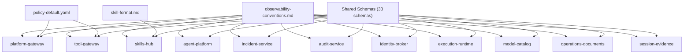

**Diagram sources**
- [README.md:21-50](file://shared/shared-contracts/README.md#L21-L50)
- [observability-conventions.md:1-85](file://shared/shared-contracts/observability-conventions.md#L1-L85)

**Section sources**
- [README.md:21-50](file://shared/shared-contracts/README.md#L21-L50)

## Performance Considerations
- Keep metric labels bounded to avoid cardinality explosion
- Use templated handler labels instead of raw URLs
- Disable OTel push when not needed to eliminate overhead
- Prefer streaming responses for long-running agent interactions
- Cache JWKS and policy bundle fingerprints to reduce network calls
- Use evidence truncation to manage session memory usage
- Leverage operation document digests for efficient change detection
- Batch audit event emissions to reduce database write pressure

## Troubleshooting Guide
Common issues and resolutions:
- Policy bundle validation failures: run the validator script to check bundle structure and rule schema compliance
- Unexpected denials: verify role/action matches and precedence rules; inspect decision reason and matched_rule_ids
- Missing correlation: ensure x-request-id is propagated across services and OTLP export is configured correctly
- Skill ingestion errors: validate Markdown frontmatter against skill-format.md and schema constraints; ensure steps use credential references, not literals
- Execution signature verification failures: check HMAC-SHA256 computation and args_digest matching
- Model catalog connectivity issues: verify provider configuration and credential provisioning
- Operation document generation failures: check digest computation and provenance anchoring
- Session evidence truncation: review size caps and budget allocation settings

Validation entry points:
- Policy bundle: validate_policy.py checks bundle version, rules list, and per-rule schema conformance
- Skills: local lint command walks directories and reports rejections with reasons

**Section sources**
- [validate_policy.py:1-91](file://shared/shared-contracts/scripts/validate_policy.py#L1-L91)
- [skill-format.md:176-186](file://shared/shared-contracts/skill-format.md#L176-L186)

## Conclusion
The shared contracts provide a stable, versioned foundation for cross-service communication, authorization, auditing, and observability across 33 JSON Schemas organized by domain. By adhering to these schemas, policy bundles, skill authoring rules, and observability conventions, services can evolve independently while maintaining interoperability and safety. The expanded contract surface now supports complex workflows including durable execution, multi-model runtime discovery, immutable operations documentation, and comprehensive session evidence persistence.

## Appendices

### Versioning and Migration Guidelines
- Policy bundles: bump version on every rule change; maintain backward-compatible changes where possible; use policy-diff to review outcome transitions before rollout
- Schemas: prefer additive changes (new optional fields) to maintain compatibility; introduce new versions only when breaking changes are unavoidable
- Skills: keep knowledge skills compatible with v1; add executable_flow features additively; enforce strict validation during ingestion and graduation
- Execution requests: support protocol versioning for backward compatibility with historical v2 envelopes
- Model catalogs: extend provider enum values without breaking existing consumers
- Operations documents: extend document_type enum for new document types while maintaining substrate compatibility

**Section sources**
- [README.md:79-96](file://shared/shared-contracts/README.md#L79-L96)
- [skill-format.md:9-12](file://shared/shared-contracts/skill-format.md#L9-L12)
- [execution-request.schema.json:1-94](file://shared/shared-contracts/schemas/execution-request.schema.json#L1-L94)
- [model-catalog.schema.json:1-43](file://shared/shared-contracts/schemas/model-catalog.schema.json#L1-L43)
- [operation-document.schema.json:1-115](file://shared/shared-contracts/schemas/operation-document.schema.json#L1-L115)

### Examples of Consumption and Production
- Platform gateway consumes agent-chat-request.schema.json and returns chat-response.schema.json or stream events
- Tool gateway validates tool-invocation.schema.json and produces tool-result.schema.json
- Execution runtime constructs signed execution requests for approved tool calls
- Incident service persists incident.schema.json envelopes and triage-report.schema.json reports
- Skills hub ingests Markdown documents validated against skill.schema.json and skill-format.md
- Model catalog service exposes multi-model runtime discovery via model-catalog.schema.json
- Operations documents repository serves immutable typed operational records
- Session evidence store persists tool call/result frames for replay and auditing
- All services emit audit-event.schema.json records and follow observability-conventions.md

**Section sources**
- [agent-chat-request.schema.json:1-35](file://shared/shared-contracts/schemas/agent-chat-request.schema.json#L1-L35)
- [chat-response.schema.json:1-26](file://shared/shared-contracts/schemas/chat-response.schema.json#L1-L26)
- [stream-event.schema.json:1-27](file://shared/shared-contracts/schemas/stream-event.schema.json#L1-L27)
- [tool-invocation.schema.json:1-35](file://shared/shared-contracts/schemas/tool-invocation.schema.json#L1-L35)
- [tool-result.schema.json:1-69](file://shared/shared-contracts/schemas/tool-result.schema.json#L1-L69)
- [execution-request.schema.json:1-94](file://shared/shared-contracts/schemas/execution-request.schema.json#L1-L94)
- [incident.schema.json:1-95](file://shared/shared-contracts/schemas/incident.schema.json#L1-L95)
- [triage-report.schema.json:1-120](file://shared/shared-contracts/schemas/triage-report.schema.json#L1-L120)
- [skill.schema.json:1-125](file://shared/shared-contracts/schemas/skill.schema.json#L1-L125)
- [model-catalog.schema.json:1-43](file://shared/shared-contracts/schemas/model-catalog.schema.json#L1-L43)
- [operation-document.schema.json:1-115](file://shared/shared-contracts/schemas/operation-document.schema.json#L1-L115)
- [session-evidence.schema.json:1-58](file://shared/shared-contracts/schemas/session-evidence.schema.json#L1-L58)
- [audit-event.schema.json:1-94](file://shared/shared-contracts/schemas/audit-event.schema.json#L1-L94)
- [observability-conventions.md:1-85](file://shared/shared-contracts/observability-conventions.md#L1-L85)